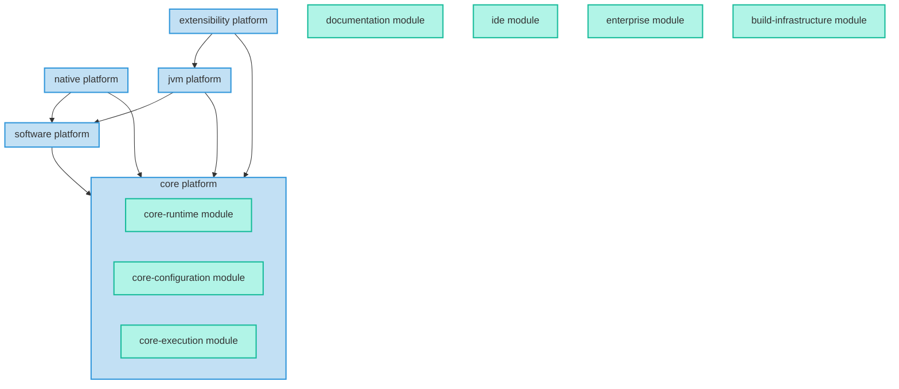

<!-- 
  -- Note: this file contains a generated diagram. Use `./gradlew :architectureDoc` to generate 
  -->

# Gradle platform architecture

The diagram below shows the main components of the Gradle architecture. See [ADR4](standards/0004-use-a-platform-architecture.md) for more details.

<!-- This diagram is generated. Use `./gradlew :architectureDoc` to update it -->

