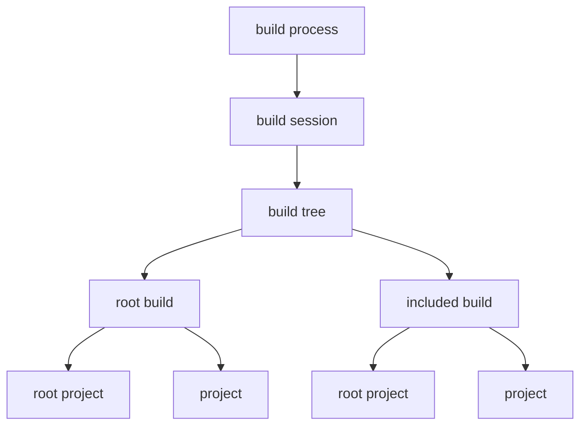

# Build state model

The Gradle daemon tracks state for various elements. These are arranged in a hierarchy:

### Build process state

The "build process state" holds the global state of the build process and manages all the other state.

The build process state also includes state that is tied to a particular Gradle user home directory.
When that directory changes between Gradle invocations, the state is discarded and recreated.
Typically, the Gradle user home directory does not change for a given process, so this is effectively process state.

The build process state is managed by the `BuildProcessState` class. An instance is created once for a given process.

### Build session state

A "build session" represents a single invocation of Gradle, for example when you run `gradlew build`.
A session runs the build one or more times.
For example, when continuous build is enabled, the session may run the build many times, but when it is disabled, the session will run the build once only.

The build session state is managed by the `BuildSessionState` class.
An instance is created at the start of a Gradle invocation and discarded at the end of that invocation.

The build session state also includes "cross session" state that is shared with any "nested" sessions that need to be created.
This only happens when the `GradleBuild` task is used. You can mostly ignore the distinction between "cross session" and "build session" state.

### Build tree state

"Build tree" is another name for the build definition.
The "build tree state" holds the state for the entire build definition for a single build execution within a session.

The build tree state is managed by the `BuildTreeState` class.
An instance is created at the start of a build execution and discarded at the end of the execution.

### Build state

The "build state" holds the state for a build within the build definition for a single build execution, and is contained by the build tree state.

The build state is managed by the `BuildState` class.
An instance is created for each build in the build definition, once per build execution and is discarded at the end of the execution. 

The build state also includes what is currently called the "Gradle state". The Gradle state is being merged into the build state and is mostly empty.

### Project state

The "project state" holds the state for a project for a single build execution, and is contained by the build state (and not the state of the parent project).

The project state is managed by the `ProjectState` class.
It is created for each project in the build definition, once per build execution and is discarded at the end of the execution.

## Composition by architecture modules

Each [architecture module and platform](platforms.md) can contribute code to any of the elements.
Not every module contributes to every element.

A module does this by providing an implementation of `GradleModuleServices` that registers the services that the module contributes to each element. 
