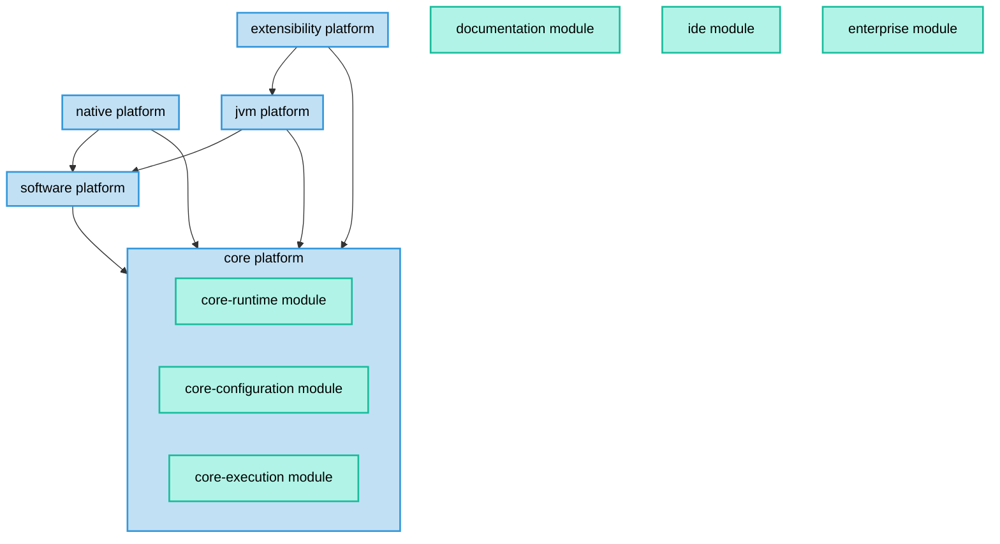

<!-- 
  -- Note: this file contains a generated diagram. Use `./gradlew :architectureDoc` to generate 
  -->

# Gradle platform architecture

Gradle is arranged into coarse-grained components called "architecture modules" and "platforms".
See [ADR4](standards/0004-use-a-platform-architecture.md) for a definition of these terms.

The diagram below shows the current set of architecture modules and platforms:

<!-- This diagram is generated. Use `./gradlew :architectureDoc` to update it -->

## Platforms

### Core automation platform

This is a general-purpose automation platform which takes care of the efficient definition and execution of work, such as tasks.
This platform is agnostic to what exactly the purpose of the work is.
It might be creating an application, setting up development environments, orchestrating deployments, running simulations, etc.

This platform does not provide special support for a particular kind of automation. This is the responsibility of other platforms.

It is made up of 3 architecture modules:

- **core-runtime**: Provides the runtimes or "containers" in which code runs. These runtimes include the Gradle client, the daemon and the worker processes. This is the base module on which all other architecture modules depend.
- **core-configuration**: Allows the build structure and work, such as tasks, to be specified. This includes the project model, the DSL and so on.
- **core-execution**: Runs the work efficiently. This includes scheduling, execution, caching and so on.

### Software development platform

This is a general purpose platform that builds on the core automation platform to add support for the automation of software development.
This includes work such as compiling, testing and documenting software, plus sharing that software via publishing and dependency management.
This platform is agnostic to what kind of software is being developed.
It might be Java or Kotlin libraries running on the JVM, Gradle plugins, Android or iOS applications, C++ libraries, and so on.

This platform does not provide special support for a particular language or ecosystem.

### JVM platform

This is a platform that builds on the core and software platforms to add support for developing software that runs on the JVM.
This includes software that is implemented using Java, Kotlin or some other JVM language.

This platform provides specific support for Java, Groovy and Scala, and includes the foojay toolchain plugin.

### Extensibility platform

This is a platform that builds on the core, software and JVM platforms to add support for extending Gradle by implementing and applying plugins.

This platform includes the plugin publishing plugin and the plugin portal.

### Native platform

This is a platform that builds on the core and software platforms to add support for developing native software.

This platform provides specific support for Swift, C++ and C.

## Cross-cutting architecture modules

There are some additional cross-cutting architecture modules that aren't platforms:

### Enterprise integration

Provides cross-cutting integration with Gradle's commercial product.

### IDE integration

Provides cross-cutting integration with IDEs and other tooling.

### Build infrastructure

Provides build logic, libraries, test suites and infrastructure to support developing and releasing Gradle.

### Documentation

Provides cross-cutting Gradle documentation and samples, along with the infrastructure to write, test, publish and host the documentation.

## Structure

Each platform and module has its own source directory under [platforms/](../platforms).
In these source directories, you will find the Gradle projects that make up the platform or module.

The platforms and modules are defined using a DSL in [settings.gradle.kts](../settings.gradle.kts)

Each platform and module can contribute code to the [Gradle runtimes](runtimes.md) and [Build state model](build-state-model.md).
