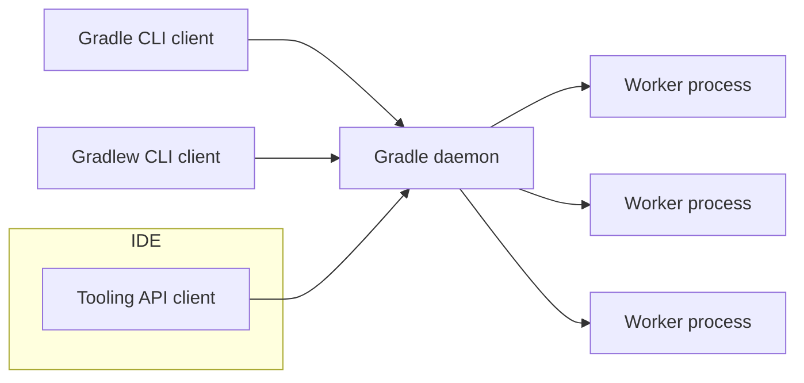

# Gradle runtimes

Gradle is made up of the following processes that work together to "run the build":

- Gradle daemon. This is the process that actually runs the build. It hosts build logic and coordinates the lifecycle of the build. It is a long-running daemon process.
- CLI client. This is the `gradle` or `gradlew` command, and is responsible for locating, starting and interacting with the Gradle daemon, potentially downloading the Gradle distribution. 
- Tooling API client. This a library that is embedded into applications, such as IDEs or CI agents, that allows them to act as a Gradle client.
- Worker processes. Long-running daemon processes that the Gradle daemon starts to run specific kinds of work, such as compilation or test execution.

The diagram below shows the relationships between the different processes:

These are all Java processes. Each process has a corresponding "runtime".
All source code in Gradle is written to target one or more of these runtimes.
Most source code targets the daemon and the remaining code either targets a single runtime, for example the Gradle client, or is shared across multiple runtimes.

## Composition by architecture modules

Each [architecture module and platform](platforms.md) can contribute code to any of the runtimes.
Not every module contributes to every runtime.

The core-runtime module defines each runtime:

- The target JVM for the runtime. Each runtime has its own JVM compatibility constraints.
- Some base services that are available to code hosted by the runtime. This varies by runtime.
- Additional constraints. For example, the CLI client runtimes limit the libraries that are available to the code in that runtime, for performance reasons. 

Other modules and platforms define the services that they contribute to the runtime.

The build script for each project declares which runtime the project targets.
