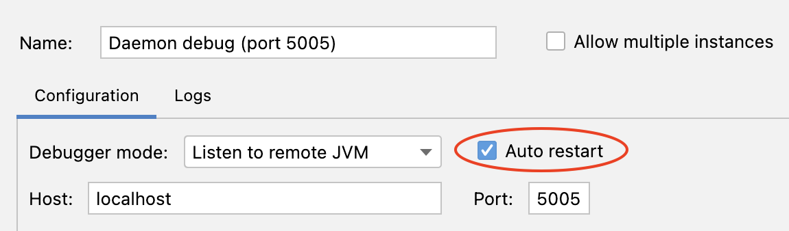
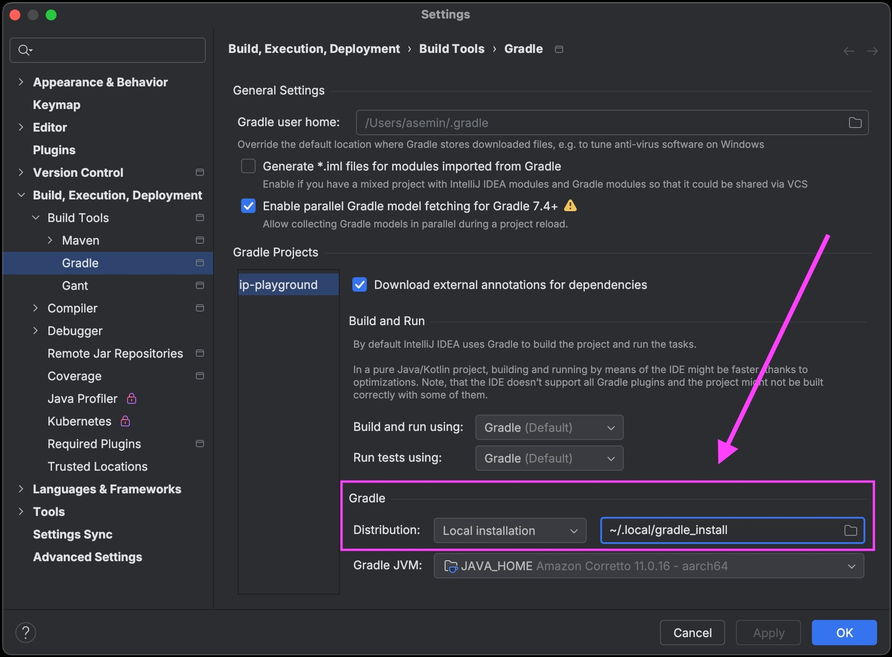
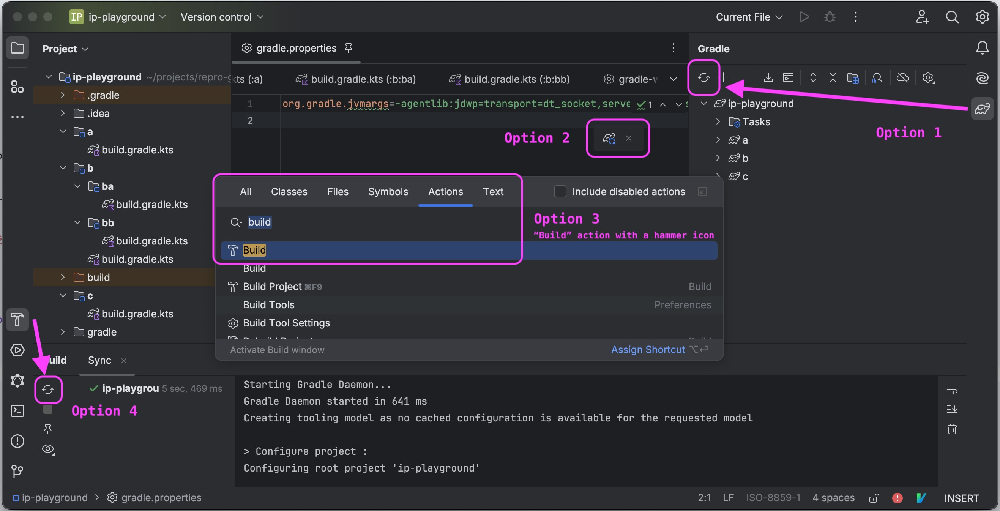

# Debugging Gradle

This guide is intended to get you started on how to debug the integration tests and different parts of the Gradle runtime in the Gradle code base.

## TL:DR

To debug a unit test, simply run it in debug mode.

To debug an integration test, start the listening debugger using the "Daemon debug" run configuration in IntelliJ IDEA, then run the test in debug mode with the `forkingIntegTest` task.
The debugger will automatically connect to the Gradle Daemon, and you can start debugging it.

If you need to debug something other than the Daemon, follow the steps below.

## Overview

### IntelliJ IDEA setup

For most cases, use [listening debugger](https://www.jetbrains.com/help/idea/attaching-to-local-process.html#attach-to-remote]).

The build should create debugging run configurations for you [automatically](../build-logic/idea/src/main/kotlin/gradlebuild.ide.gradle.kts#L82). 
However, make sure to enable the automatic restart of the debugging session once the debuggee is gone.
Unfortunately, this setup is [not fully automated yet](https://github.com/JetBrains/gradle-idea-ext-plugin/issues/84).



Before you start debugging, start the "Daemon debug" or "Debug Launcher" configuration. 
It will be automatically reused for subsequent test runs.

Be careful when stopping the test — ensure you stop the test itself, not the debugger.

### Gradle test executors

There are [several executors](../testing/internal-integ-testing/src/main/groovy/org/gradle/integtests/fixtures/executer/GradleContextualExecuter.java) available for running integration tests configured in Gradle.

Most of them are forking, and you should be able to debug a test with any of them by running the test in debug mode.
The test detects that it is running in debug mode and provides all necessary information to the forked daemon to connect to the debugger.

There is also an embedded executor that runs the test within the same JVM as the test runner.
While this can be convenient for debugging and may offer faster execution, it's generally not recommended due to potential classloader issues, which may lead to different behavior in certain edge cases.

In test code, you can access the current executer via `executer` and modify its options.

### Gradle debug options

You may find these resources helpful for debugging Gradle builds in general:
* [Gradle Troubleshooting](https://docs.gradle.org/current/userguide/troubleshooting.html)
* [Debugging Options](https://docs.gradle.org/current/userguide/command_line_interface.html#sec:command_line_debugging) 

Our [blog series](https://blog.gradle.org/how-gradle-works-1) about how Gradle works can help understand why multiple JVMs are involved in the build process.

## Debugging daemon

Simply starting the test in debug mode in the IDE with the "Debug Daemon" configuration running should suffice.

Alternatively, you can explicitly enable debugging for the daemon by setting the `debugDaemon` Gradle property to any value or by modifying the test code with the `executer.startBuildProcessInDebugger` method.

## Debugging launcher

You can enable debugging for the launcher by setting the `debugLauncher` Gradle property to any value or by changing the test code with the `executer.startLauncherInDebugger` method.

Note that by default, port 5006 is used for debugging the launcher, so you'll also need to start the "Debug Launcher" configuration.

## Debugging wrapper

The main obstacle to wrapper debugging is the minification of the wrapper jar. 
To mitigate this, minifying is disabled when the `debugLauncher` property is present.
Keep in mind that this may not be exactly the same as the production environment and could behave differently in some corner cases.

Otherwise, the debugging process is the same as for the launcher.

## Debugging compiler daemon

In order to debug compiler daemons, you'll need to edit the test code to pass the debug JVM args to the forked daemon process:

```groovy
tasks.withType(JavaCompile) {
    options.forkOptions.jvmArgs.add("-agentlib:jdwp=transport=dt_socket,server=n,suspend=y,address=localhost:5006")
}
```

This should also work with `GroovyCompile` and `ScalaCompile` tasks.

Make sure not to commit the test code changes you've made just for debugging.

## Debugging worker actions with process isolation

To debug a worker, you'll need to edit the test code to enable debugging for the worker process.

You have two options.

1. Enable debugging via the fork options in the spec:

    ```java
    getWorkerExecutor()
        .processIsolation(spec -> {
            spec.getForkOptions().getDebugOptions().getEnabled().set(true);
            spec.getForkOptions().getDebugOptions().getPort().set(5005);
        })
    ```

   You can then run your integration test normally, and attach a remote debugger to the port.

2. If what you're trying to debug does not require process-level isolation, you can modify the code to use classloader isolation instead:

    ```java
    getWorkerExecutor()
        .classloaderIsolation(spec -> {
            // ...
        })
        // ...
    ```

In either case, make sure not to commit the test code changes you've made just for debugging purposes.

## Debugging cross-version tests

Cross-version tests use the Tooling API to launch Gradle builds.

To debug a build for those tests, use [the same parameters](#gradle-debug-options) as for a regular Gradle build.

Add `-Dorg.gradle.debug=true` to the `LongRunningOperation` you want to debug with `LongRunningOperation.withArguments(...)`.

## Debugging sync (project import) in IntelliJ IDEA

This is useful if a problem with Gradle surfaces when IntelliJ is trying to (re-)import a Gradle build.

Project import (often referred to as sync) uses an embedded Tooling API client in IntelliJ,
which communicates with a Gradle daemon to fetch the models needed to update the IDE's UI.
Since the IDE operates in a separate process, remote debugging is required.

TIP: Use different *versions* of IntelliJ for viewing Gradle-sources-to-be-debugged and the target build.
Since a locally built Gradle distribution is typically used for debugging,

you may need to completely restart the IDE used for syncing the target build.  
In this case, it is handy to keep the IDE with Gradle sources independent.
For instance, use **IntelliJ Ultimate** to view Gradle sources
and **IntelliJ Community** to sync the target build.

Terminology:

- **Target build IDE** -- the IDE which we'll be using to initiate the sync process
- **Gradle sources IDE** -- the IDE in which we'll have the debugger

### Setting up the target build IDE

To debug sync with a patched version of Gradle,  
[install Gradle locally](../CONTRIBUTING.md#install-gradle-locally):

```bash
./gradlew install -Pgradle_installPath=~/.local/gradle_install
```

Open the desired project in the target build IDE and make sure it uses the local installation for sync:



Then, configure the JVM arguments for the Gradle daemon in the `gradle.properties` file of the target build:

```properties
org.gradle.jvmargs=-agentlib:jdwp=transport=dt_socket,server=n,address=localhost:5005,suspend=y
```

### Debugging the sync process

We can trigger a sync by doing any of the following:



1. Stop the Gradle daemon before doing a repeated sync if you disconnected the debugger. 
2. Keep the current debugging session connected by letting the program run past finishing the current sync iteration you were debugging.
