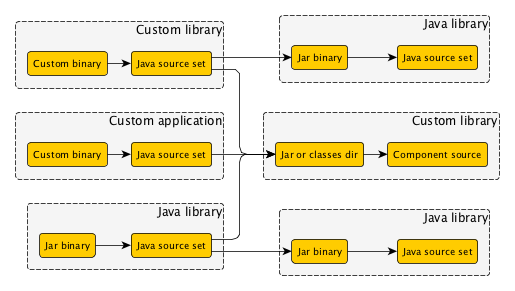

This spec outlines work required to introduce dependency management for JVM based components.

# Approach

The goal is to support dependency graphs made up of components built from Java source, that depend on other components
which present some Java API.

Specifically the following components that consume some other library:

- Java library
- Custom library or application built from Java

And the following producers:

- Java library
- Custom library that provides a Java API

An example:



External components are out of scope for this work.

The work can be broken down into:

1. An initial DSL to declare the dependencies of a Java source set owned by a Java library.
2. A basic implementation to honour these dependencies at compile time. Only for local Java libraries that consume other Java libraries.
3. Allow a custom component to be built from Java source with dependencies. Only consume local Java libraries.
4. Allow a custom component to provide a Java API. Can consume from Java libraries and custom components.
5. Support multiple variants of a Java library or custom component.

Later work:

1. Declare the API dependencies of a Java library.
2. Support for runtime dependencies.
3. TBD - reporting, etc.

# Feature 1: Build author declares dependencies of Java library

[Done](done/dependency-management-for-jvm-components.md)

# Feature 2: Custom component built from Java source

This feature allows a plugin author to define a component type that is built from Java source and Java libraries.

## Story: Jar binary is built from input source sets

Allow multiple Jar binaries to be built from multiple Java source and resource sets, to somewhat approximate the Jars built for Android components.

- Component-level source sets are implicit inputs to each binary of a component
- A binary can have additional source sets, which are also part of its inputs
- A source set may be input to multiple binaries
    - These are not owned by the binary, they are inputs to the binary
    - A binary may also own some source sets, these are also implicit inputs to the binary
- The definition order of source sets among a binary's inputs is maintained, source sets owned by the binary following all other inputs
- A Jar binary can be built from one or more input Java and resource source sets
- Error cases:
    - Fail at configuration time when creating a binary-owned source set with the same name as the component source set
    - Fail at configuration time when creating two binary-owned source sets with the same name

### User visible changes

```groovy
model {
    components {
        main(JvmLibrarySpec) {
            sources {
                componentSource(JavaSourceSet) {
                    source.srcDir "src/main/component"
                }
            }
            binaries {
                all {
                    sources {
                        binarySource(JavaSourceSet) {
                            source.srcDir "src/main/binary"
                        }
                    }
                }
            }
        }
    }
}
```

* `BinarySpec.getSource()` is deprecated and replaced with `getInputs()`
* `ComponentSpec.getSource()` is deprecated and replaced with `getSources()`
* `BinarySpec.getInputs()` returns all source sets, e.g. source sets owned by the binary and source sets inherited from the component.

### Test cases

- Given a Java library component:
    - Platforms `java6` and `java7`
    - Java Source sets `main` and `java7`
    - Resources sets `resources` and `java7-resources`
    - Can build `java6` platform binary with only `main` and `resources`, with only the expected compiled classes and resources end up in each jar
    - Can build `java7` platform binary with `main`, `resources`, `java7` and `java7-resources`
- Given a component and its binary
    - Component source set `ca`, `cb` and `cc`
    - Binary source set `ba`, `bb` and `bc`
    - The component's `getSources()` should be ordered `ca`, `cb` and `cc`
    - The binary's `getSources()` should be ordered `ba`, `bb` and `bc`
    - The binary's `getInputs()` should be in the order `ca`, `cb`, `cc`, `ba`, `bb`, `bc`
- Error cases above

### Implementation

- Changes to `BinarySpec`
    - Add `ModelMap <LanguageSourceSet> getSources()` and deprecate `getSource()`.
    - Change implementation of `sources(Action)` to execute the action against the return value of `getSources()`.
    - Add `Set<LanguagesSourceSet> getInputs()`.
    - Every source set created in `BinarySpec.sources` should also appear in `BinarySpec.inputs`.
    - Any source set instance can be added to `BinarySpec.inputs`.
    - Remove internal `Set<LanguageSourceSet> getAllSources()`, this is replaced by `getInputs()`.
- Changes to `ComponentSpec`
    - Rename `getSources()` to `getFunctionalSourceSet()`
    - Rename `getSource()` to `getSources()`
- Change component report to report on all inputs for a binary.
- Change base plugins to add component source sets as inputs to its binaries, rather than owned by the binary.
- Remove special case for inputs from `DefaultNativeTestSuiteBinarySpec` and reuse general mechanism.
- Remove `FunctionalSourceSet.copy()` mention in release notes.

### Notes

- Need to method breaking changes in the release notes


## Story: Plugin author defines a custom component built from Java source

Define a custom component that produces a Jar binary from Java source and resources, using the `jvm-component` plugin.
When the Jar is built, the compile time dependencies of the source are also built and the source compiled.

- The Jar binary should be buildable in the same way an JVM Library Jar binary is built.

### Test cases

- Given a custom component that creates a `JarBinarySpec`, using the `jvm-component` plugin:
    - Source set `a` depends on Java library `lib1`
    - Source set `b` depends on Java library `lib2`
    - Resources set `res-a` and `res-b`
    - Then when the binary is built:
        - Source from `a` is compiled against the API of `lib1` only and the compiled classes end up in the Jar.
        - Source from `b` is compiled against the API of `lib2` only and the compiled classes end up in the Jar.
        - Resources from `res-a` and `res-b` end up in the Jar.
        - Jar contains only the above items.

### Implementation

- Will need to rework `JvmComponentPlugin` so that `ConfigureJarBinary` is applied in some form to all `JarBinarySpec` instances, not just those that belong to a Jvm library.

### Out of scope

- Defining platforms and tool-chains is out of scope for this story. Using the default Java platform in the test cases is okay.
- Building a `JarBinarySpec` without the `jvm-component` plugin applied
    - While this should be possible, no effort is made to reduce the duplication required, to expose additional public APIs,
      or to add test coverage for this use case.

## Story: Plugin author defines a custom library that provides a Java API

Define a custom library that produces a Jar binary from Java source. When another Java or custom component requires
this library, the Jar binary is built and made available to the consuming component.

- Change dependency resolution to select a `LibrarySpec` instance that provides a `JarBinarySpec`.
    - For a requirement that specifies a `project` and no `library`, select the library that provides a Jar binary.
        - Fail when there is not exactly one such library.
    - Given a selected library, fail when that library does not provide exactly one compatible `JarBinarySpec`.
- Dependency resolution honors the target platform of the consuming Jar binary, so that all API dependencies must be compatible with the target platform.
- Allows an arbitrary graph of custom libraries and Java libraries to be assembled and built.

### Test cases

#### Simple dependencies

- Given a project that defines a custom `CustomLibrarySpec` _A_ that creates a `JarBinarySpec`and a `JvmLibrarySpec` _B_:
    - source set `main` of `B` declares a dependency on library `A`
    - then:
        - the Jar binary of `A` is built first
        - source set `main` of `B` is compiled using the binary from `A` as the API dependency

- Given a project `dep` that defines a custom `CustomLibrarySpec` _A_ that creates a `JarBinarySpec`and another project `consumer` that defines a `JvmLibrarySpec` _B_:
    - source set `main` of _B_ declares a dependency on project `dep` library `A`
    - then:
        - the Jar binary of _A_ is built first
        - source set `main` of _B_ is compiled using the binary from _A_ as the API dependency
- Given a project `dep` that defines a custom `CustomLibrarySpec` _A_ that creates a `JarBinarySpec`and another project `consumer` that defines a `JvmLibrarySpec` _B_:
    - source set `main` of _B_ declares a dependency on project `dep` without an explicit library name
    - then:
        - the Jar binary of _A_ is built first
        - source set `main` of _B_ is compiled using the binary from _A_ as the API dependency
- Given a project that defines a custom `CustomLibrarySpec` _A_ that creates multiple `JarBinarySpec`and a `JvmLibrarySpec` _B_:
      - `A` declares a `java6` and a `java7` variant
      - source set `main` of `B` requires `java7`
      - source set `main` of `B` declares a dependency on library `A`
      - then:
          - source set `main` of `B` is compiled using the `java7` binary from `A` as the API dependency
- Reverse the roles of _A_ and _B_ in the cases above (_A_ becomes the consumer, _B_ the producer)

#### Complex graph of dependencies

To simplify the definition of the tests above, a component whose name starts with `J` is a JVM library, while a component whose name starts with `C` is a custom component
providing at least one `JarBinarySpec`. When we say _x depends on y_ we mean that a source set of _x_ depends on the API of the library of _y_. It is expected that for
dependency resolution, the test verify that the classpath contains the appropriate jars.

- Given a component `J1` that depends on `C`, itself depending on `J2`, all of them targeting Java 6
    - building `J1`, `C` or `J2` should succeed

- Given a component `J1` that depends on `C`, itself depending on `J2`
    - `J1` targets Java 6 and Java 7
    - `C` targets Java 7
    - `J2` targets Java 7
    - building the Java 7 variant of `J1` should succeed
    - building `C` should succeed
    - building the Java 6 variant of `J1` should fail with an error message highlighting that no compatible variant of `C` has been found

- Given a component `J1` that depends on `C`, itself depending on `J2`
    - `J1` targets Java 6 and Java 7
    - `C` targets Java 6 and Java 7
    - `J2` targets Java 7
    - resolving the dependencies of the Java 6 and Java 7 variants of `J1` should succeed
    - resolving the dependencies of `C` should fail with an error message highlighting that no compatible variant of `J2` has been found
    - building the Java 7 version of `J1` should succeed
    - building the Java 6 version of `J1` should fail
    - building the Java 7 variant of `C` should succeed

- Given a component `J1` that depends on `C`, itself depending on `J2` all targetting Java 6 and Java 7
    - resolving the dependencies of `J1` and `C` should succeed
    - the Java 7 variant of `J1` should depend on the Java 7 variant of `C`
    - the Java 6 variant of `J1` should depend on the Java 6 variant of `C`
    - the Java 6 variant of `C` should depend on the Java 6 variant of `J2`
    - the Java 7 variant of `C` should depend on the Java 7 variant of `J2`

- Given a component `J1` that depends on `C`, itself depending on `J2`, itself depending on `J1`
    - resolving the dependencies of `J1`, `C` or `J2` should succeed
    - building any of the components should fail with a cyclic dependency error

- Given a component `J1` that depends on `C`, itself depending on `J2`
    - `J1`, `C` and `J2` target Java 6 and Java 7
    - `C` provides 2 binaries for `Java 6`
    - resolving the dependencies and building the Java 7 version of all components should succeed
    - resolving the dependencies and building the Java 6 version of `C` should succeed
    - resolving the dependencies of the Java 6 variant of `J1` should fail with an error message indicating that multiple binaries for `C` are available for the `Java 6` variant

- Given a component `J1` that depends on `C1`, a component `J2` that depends on `C1`, a component `C2` that depends on `J2`, a component `J3` that depends on `J1`, `J2` and `C2`
    - resolving the dependencies and building any of the component should succeed

### Implementation

- In `LocalLibraryDependencyResolver` fix `acceptLibrary` so that it checks if any of the binaries is a `JvmBinarySpec`
- Change the error message in case no suitable library is found (currently, it expects the library to be a `JvmLibrarySpec` but it can now be any type of `LibrarySpec`)

### Out of scope

It is expected that a component that provides a `JarBinarySpec` is at least a `LibrarySpec`. It is not possible to resolve a dependency on something with is not a library.


## Story: Unmanaged property information is stored in model schema

Allow model schema to store information about properties defined in any unmanaged type, and in the unmanaged ancestry of managed types.

- property information is extracted about any unmanaged type as a `ModelStructSchema`
- property information is extracted from unmanaged super-types of managed types and included in the `ModelStructSchema`
- annotations on properties (both managed and unmanaged, defined on getters) are available in the `ModelStructSchema`
    - if both a subtype and a super-type declares the same annotation on a getter, the subtype annotation is retained
- unmanaged methods that cannot be handled by the schema are silently ignored

Examples:

```
@Managed
abstract class SomeManagedType implements JarBinarySpec {

  // managed property
  @Variant
  abstract String getFlavor();
  abstract void setFlavor(String flavor);

  // unmanaged property
  String getBuildType() {
    return getFlavor() == “paid” ? “production” : “debug”;
  }

  // delegated property — inherited from JarBinarySpec
  // @Variant
  // JavaPlatform getTargetPlatform();
  // void setTargetPlatform(JavaPlatform platform);
}
```

### Test cases

- properties are extracted from purely managed type, getter annotations are available in schema
    - managed type has property `managedProp`
        - `@Custom("managed")` annotation on getter
        - `@Custom("setter")` annotation on setter
    - managed type has read-only property `managedCalculatedProp` with `@Custom("managedCalculated")` annotation
    - extracted schema contains the following properties:
        - property `managedProp` with `managed = true`, `writable = true`, `@Custom("managed")` annotation available (setter annotation ignored)
        - property `managedCalculatedProp` with `managed = true`, `writable = false`, `@Custom("managedCalculated")` annotation
- properties are extracted from purely unmanaged type, getter annotations are available in schema
    - unmanaged type has property `unmanagedProp`
        - `@Custom("unmanaged")` annotation on getter
        - `@Custom("setter")` annotation on setter
    - unmanaged type has read-only property `unmanagedCalculatedProp` with `@Custom("unmanagedCalculated")` annotation
    - unmanaged type has method `boolean isBuildable()`
    - unmanaged type also has method `int getTime()`
    - extracted schema contains the following properties:
        - property `unmanagedProp` with `managed = false`, `writable = true`, `@Custom("unmanaged")` annotation available (setter annotation ignored)
        - property `unmanagedCalculatedProp` with `managed = false`, ``writable = false`, `@Custom("unmanagedCalculated")` annotation
        - method `isBuildable()` is ignored because it's not a property (we don't handle `is` prefixes yet)
        - method `getTime()` is ignored because we cannot handle return type
- properties are extracted from managed subtype of unmanaged type,
    - unmanaged type has property `unmanagedProp`
        - `@Custom("unmanaged")` annotation on getter
        - `@Custom("setter")` annotation on setter
    - unmanaged type has read-only property `unmanagedCalculatedProp` with `@Custom("unmanagedCalculated")` annotation
    - unmanaged type has method `boolean isBuildable()`
    - unmanaged type also has method `int getTime()`
    - managed subtype has property `managedProp`
        - `@Custom("managed")` annotation on getter
        - `@Custom("setter")` annotation on setter
    - managed subtype has read-only property `managedCalculatedProp` with `@Custom("managedCalculated")` annotation
    - extracted schema contains the following properties:
        - property `unmanagedProp` with `managed = false`, `writable = true`, `@Custom("unmanaged")` annotation available (setter annotation ignored)
        - property `unmanagedCalculatedProp` with `managed = false`, ``writable = false`, `@Custom("unmanagedCalculated")` annotation
        - property `managedProp` with `managed = true`, `writable = true`, `@Custom("managed")` annotation available (setter annotation ignored)
        - property `managedCalculatedProp` with `managed = true`, `writable = false`, `@Custom("managedCalculated")` annotation
        - method `isBuildable()` is ignored because it's not a property (we don't handle `is` prefixes yet)
        - method `getTime()` is ignored because we cannot handle return type
- subtype annotation is retained in schema over matching super-type annotation
    - managed super-type has a property annotated with `@Custom("managed")`
    - managed subtype has the same property annotated with `@Custom("overridden-managed`)`
    - extracted schema contains the annotation specified for the subtype property

### Implementation

- Remove `UnmanagedStrategy` in favor of general struct strategy.
- Implement unmanaged property schema extraction as alternative strategy to managed property extraction. Unmanaged properties should not be checked for validity.
- Store annotation information for each extracted property in the struct schema.
- Process all methods in hierarchy for annotations. Currently used `Class.getMethods()` folds declarations, losing annotation info on overridden methods with same return type.
- Remove `ModelProperty.unmanaged`, `ModelProperty.isUnmanaged()` can be emulated via `ModelProperty.isAnnotationPresent(Unmanaged.class)`.
- Introduce new `ModelProperty.isManaged()` to tell if property state is managed or not.

#### Current process for extracting schema from type:

- Pure managed types and specific managed types with unmanaged super-type:
    - get methods via Class.getMethods() — loses overridden method annotations
    - ignore Object and GroovyObject methods and their overrides
    - ignore all methods from unmanaged super-type (e.g. `JarBinarySpec`)
    - verify no overloads
    - process all getters
        - validate getter (no type parameter, no parameters etc.)
        - determine if getter is abstract
        - find setter, and if found:
            - validate setter (no type parameters, single parameter matches getter, void return type)
            - ensure that both getter and setter are abstract
        - only record if property is abstract (i.e. when we need to manage it)
        - mark property methods as covered
    - fail if any methods were left uncovered
    - validate all properties

- Pure unmanaged types: opaque schema, do not record any properties

#### Intended process:

- All struct-types (i.e. pure managed types, managed types with specific unmanaged super-type and pure unmanaged types):
    - get all methods by crawling ancestry and using `Class.getDeclaredMethods()`; also record whether the method is declared in a managed or unmanaged type
    - *ignore Object and GroovyObject methods and their overrides*
    - ~~ignore all methods from unmanaged super-type (e.g. `JarBinarySpec`)~~
    - *verify no overloads*
    - *process all getters*
        - throw error if getter is defined both in managed type and unmanaged super-type
        - *validate getter (no type parameter, no parameters etc.)*
            - for unmanaged: ignore property if there's a validation problem
        - getter is considered managed only if it is defined in a managed type and has no implementation
        - *find setter, and if found:*
            - throw error if setter is defined both in managed type and unmanaged super-type
            - *validate setter (no type parameters, single parameter matches getter, void return type)*
                - for unmanaged: ignore setter if there's a validation problem
                - setter is considered managed only if it is defined in a managed type and has no implementation
                - ensure that either both getter and setter are managed or unmanaged
        - get all annotations from getter
        - record property with its annotations
        - mark **managed** property methods as covered
    - fail if any **managed** methods were left uncovered
    - validate all **managed** properties

### Open issues

- We should have some validation around unmanaged types overriding managed types.
- Test that a managed property of type `ModelMap<ModelMap<UnmanagedType>>` throws an error.

## Story: Java sources of custom component are compiled against matching binary variant

Change dependency resolution to honor variant dimensions for a custom component with Jar binaries.

When compiling a Java source to build a Jar binary, resolve a classpath dependency by:

- Locate the library matching the dependency. For a project-only dependency, find the library that contains at least one `JarBinarySpec`.
    - Fail if there is not exactly one matching library.
- Locate the JarBinarySpec for the library is compatible with the `JavaPlatform` and other variant dimensions of the binary that is being built.
    - Variant dimensions are identified solely by name of annotated property
    - Ignore any variant dimensions that do not exist in both the resolving `JarBinarySpec` type and the resolved `JarBinarySpec` type
    - For each variant dimensions that exists in both binaries, check if the values for that dimension are compatible:
        - Exact match on string values
        - Exact match on `name` property for `Named` values
        - Highest compatible version for `JavaPlatform` values
        - Null comparison and type conversion to be decided (see open issues)
- If there are multiple compatible binaries:
    - If they differ _only_ on `JavaPlatform` value (and all other variant dimensions are identical), choose the variant with the lowest major version
    - If _any_ of the binaries differ on a variant dimension _other_ than `JavaPlatform`, fail.
        - Error message should detail the variant values for the multiple compatible binaries
- If there are no compatible binaries:
    - Failure message should detail the variant values for all available (incompatible) `JarBinarySpec` instances
- `null` values should be considered as wildcards: when matching binaries, only variants dimensions which are in common in both binaries and have non null
values are considered.
- When comparing variants, only variants dimensions with a compatible type are considered. That is to say, if a binary A has a variant `buildType` of type `String`, and
a binary `B` has a variant `buildType` of type `BuildType`, the variant dimension cannot be used for comparison.
    - in case no matching binaries are found, but those binaries had incompatible dimension types, then a reasonable error message should be displayed.

### Test cases

- Scenario: building a custom binary type and resolving against a library with the same custom binary type
    - Binary `A {platform, buildType, flavor}` depends on Library `B {platform, buildType, flavor}`, choose the binary of `B` with the same `buildType` and the highest compatible `platform`.
        - Given `A1[java6,debug,'free']` and `B1[java6,debug,'free']`, `B2[java6,release,'free']`: select `B1` due to matching `buildType`
        - Given `A1[java6,debug,'free']` and `B1[java6,debug,'free']`, `B2[java6,debug,'paid']`: select `B1` due to matching `flavor`
        - Given `A1[java6,debug,'free']` and `B1[java5,debug,'free']`, `B2[java6,debug,'free']`, `B3[java7,debug,'free']`: select `B2` for highest compatible `platform`
        - Given `A1[java6,debug,'free']` and `B1[java6,debug,'paid']`, `B2[java6,release,'free']`, `B3[java7,debug,'free']`: FAIL (no compatible) and list available variants
        - Given `A1[java6,debug,'free']` and `B1[java7,debug,'free']`: FAIL (no compatible) and list available variants
- Scenario: building a custom binary type and resolving against a library with standard `JarBinarySpec` instances.
    - Binary `A {platform, buildType}` depends on Library `B {platform}`, inspect the binaries of `B` for the one with the lowest compatible `platform`.
        - Given `A1[java6,debug]` and `B1[java6]`, `B2[java7]`: select `B1` due to highest compatible `platform`
        - Given `A1[java6,debug]` and `B1[java7]`, `B2[java8]`: FAIL (no compatible) and list available variants
- Scenario: building a standard `JarBinarySpec` instance and resolving against a library with custom binary types.
    - Binary `A {platform}` depends on Library `B {platform, buildType}`, inspect the binaries of `B` for the one with the lowest compatible `platform`.
        - Given `A1[java6]` and `B1[java6,debug]`, `B2[java7,release]`: select `B1` due to highest compatible `platform`
        - Given `A1[java6]` and `B1[java7,debug]`, `B2[java8,release]`: FAIL (no compatible) and list all available variants
        - Given `A1[java6]` and `B1[java6,debug]`, `B2[java6,release]`, `B3[java7,release]`: FAIL (multiple compatible) and list compatible variants (`B1`, `B2`)
- Scenario: building a custom `JarBinarySpec` type and resolving against a library with a different custom `JarBinarySpec` type.
    - Binary `A {platform, flavor}` depends on Library `B {platform, buildType}`, inspect the binaries of `B` for the one with the lowest compatible `platform`.
        - Given `A1[java6, 'free']` and `B1[java6,debug]`, `B2[java7,release]`: select `B1` due to highest compatible `platform`
        - Given `A1[java6, 'free']` and `B1[java7,debug]`, `B2[java8,release]`: FAIL (no compatible) and list all available variants
        - Given `A1[java6, 'free']` and `B1[java6,debug]`, `B2[java6,release]`, `B3[java7,release]`: FAIL (multiple compatible) and list compatible variants (`B1`, `B2`)
- Scenario: resolve 2 binary types that share a variant dimension name, but with a different return type.
    - Binary `A {platform, buildType}` depends on Library `B {platform, buildType}` but type of `A#buildType` is `String` and `B#buildType` is `BuildType extends Named`: fail (no compatible) and display
    an error message indicating that the binary didn't have a compatible type for `buildType`.
    - Binary `A {platform, buildType}` depends on Library `B {platform, buildType}` but type of `A#buildType` is `BuildType extends Named` and `B#buildType` is `DifferentBuildType extends Named`: fail (no compatible) and display
        an error message indicating that the binary didn't have a compatible type for `buildType`.


## Story: Plugin author defines variants for custom Jar binary

Plugin author extends `JarBinarySpec` to declare custom variant dimensions:

    @Managed
    interface CustomBinarySpec extends JarBinarySpec {
        @Variant
        String getFlavor()

        @Variant
        BuildType getBuildType() // Must extend `Named`
    }

Each property marked with `@Variant` defines a variant dimension for this kind of binary.
This works for both managed and unmanaged types.

- Property type must either be a String or a type that extends `Named`.
- A `@Variant` annotation on the setter of the property raises an error during schema validation.
- A `@Variant` annotation on non-property methods is ignored.

### Implementation

- `ModelPropertySchema` provides the getter for the property, but does not hold a strong reference to it.
- All annotations on setters are stored in the schema for the purpose of raising errors about them later on.
- The schema is extensible via `ModelSchemaAspect`s that are extracted via `ModelSchemaAspectExtractionStrategy`s.
- Custom variants are not shown in the component report for this story.

### Test cases

- Custom Jar binary can be built with custom variants (covered by `SingleBinaryTypeWithVariantsTest`)
    - declare a `buildType` (type: `BuildType`) variant with `debug` and `default`
    - declare a `flavor` (type: `String`) variant with `free` and `paid`
    - custom Jar binaries can be built
- Useful error message presented to user for:
    - `@Variant` annotation on property with return type other than String/Named
    - `@Variant` annotation on property setter

## Story: Component report displays `@Variant` properties for custom binary

This story adds general purpose infrastructure for rendering the name and value for each variant property
for any `BinarySpec`. This will be used both for built-in `BinarySpec` subtypes as well as custom subtypes (managed and unmanaged).

```text
JVM library 'myLib'
-------------------

Source sets
    Java source 'myLib:java'
        srcDir: src/myLib/java
    JVM resources 'myLib:resources'
        srcDir: src/myLib/resources

Binaries
    Custom Jar 'java5MyLibJar'
        build using task: :java5MyLibJar
        buildType: debug
        targetPlatform: Java SE 5
        tool chain: Java SE 8
        Jar file: build/jars/java5MyLibJar/myLib.jar
    Custom Jar 'java6MyLibJar'
        build using task: :java6MyLibJar
        buildType: production
        targetPlatform: Java SE 6
        tool chain: Java SE 8
        Jar file: build/jars/java6MyLibJar/myLib.jar
```

- All variant properties (custom and built-in) tagged with `@Variant` are shown in alphabetical order for binaries in the component report.
- Variants in the report are named after their property.
- Variant values are displayed as a `String` returned by their `toString()` methods (`null` values are displayed as "null").
  If a `Named` variant value does not override `Object.toString()`, then `Named.getName()` is used instead.

### Implementation

- Annotate `JvmBinarySpec.targetPlatform`, and the variant properties of `NativeBinarySpec` and `PlayApplicationBinarySpec`.
- Replace special case rendering of binary variant dimensions from the component report with general purpose reporting.
- Variant values are formatted through a common utility class so that the formatting rules can be changed later easily.
- Implement managed view equality based on backing node identity.

### Test cases

- All variants are displayed for custom Jar binary in alphabetic order using the property names.
    - managed Jar binary subtype has variant property `buildType`
    - managed Jar binary subtype has variant property `flavor`
    - report displays variants with names in alphabetical order:
        - `buildType`
        - `flavor`
        - `targetPlatform`
- Built-in variants are displayed for native binary in alphabetic order using the property names (i.e. `buildType`, `flavor` and `targetPlatform`).
- Target platform variant is displayed for Play binary.


## Feature backlog

- Allow library to expose Jar, classes dir or any combination as its Java API.
- Allow plugin to use compiled classes from a Java source set to build a custom binary.
- Plugin declares Jar or classes as intermediate output rather than final output.
- Add dependency set to JarBinarySpec to allow dependencies to be tweaked.
- Expose a way to query the resolved compile classpath for a Java source set.
- Plugin author defines target Java platform for Jar binary
- Change language transforms implementation to fail at configuration time when no rule is available to transform a given input source set for a binary.
    - This will require using `LanguageTransform`s in Scala
    - Windows resource sets on non-windows builds fail with the current `LanguageTransform.applyToBinary()` implementation
- Fail when no rule is available to define the tasks for a `BinarySpec`.
    - Will need to change `@BinaryTasks` implementation to fail at configuration time when no rule is available to build a given binary.

# Feature: Java library consumes local Java library

- Declare and consume API & runtime dependencies
    - Need to declare transitive API dependencies
    - Consumes API dependencies at compile time
    - Consumes runtime dependencies at runtime
    - Handle compile time cycles.
- Improvements to dependency management
    - Declare dependencies at component, source set and binary level
    - Allow a `LibrarySpec` instance to be added as a dependency.
    - Make dependency declarations managed and immutable post resolve
- Fully featured dependency resolution
    - API to query the various resolved classpaths
    - Configure the resolution strategy for each usage
    - Configure resolution rules for each usage
    - Wire in dependency resolution events
    - Include in dependency reports

# Feature: Java library consumes external Java library

- Resolve libraries from binary repositories, for libraries with a single variant
    - Maven repo: assume API dependencies are defined by `compile` scope.
    - Ivy repo: look for a particular configuration, if not present assume no API dependencies (or perhaps use `default` configuration)
    - Assume no target platform, and assume compatible with all target platforms.

# Feature: Custom Java based component local library

- Java source only
- Custom component consumes Java library
- Custom component consumes custom library
- Java library consumes custom library
- Select correct variant of custom library
- Reporting

# Feature: Legacy JVM language plugins declare and consume JVM library

- JVM component can consume legacy JVM project
- Legacy JVM project can consume JVM library
- Change dependency reporting to present project as a JVM component

# Feature: Domain specific usages

- Custom component declares additional usages and associated dependencies.
- Custom binary provides additional usages
- Reporting
- use component model terminology in error messages and exception class names.
