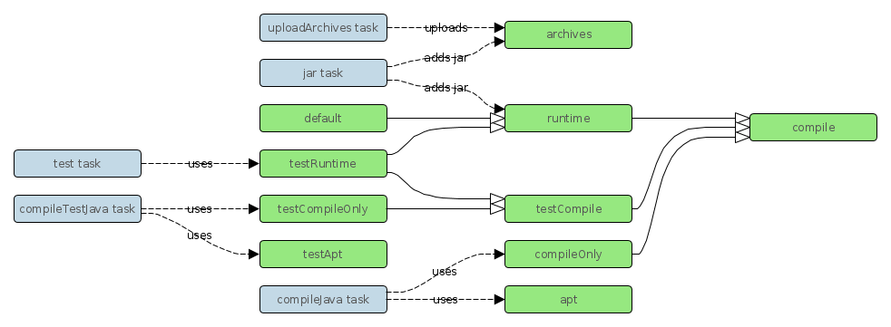

# Java Annotation Processing

This spec aims to improve Java annotation processing in Gradle. Some stories might not live in Gradle core but describe functionality that can live better in 3rd party plugins.

## Use cases

 * Simplify configuration for annotation processor dependencies used as `-processorpath` of the Java compiler
   Compile-time-only dependencies (e.g. containing annotations that are only needed at compile-time to be processed by annotation processors (e.g. Immutables.org or Google's "auto" projects), or possibly for documentation purpose only (e.g. `@Nullable`, `@NotNull` et al.)) can already be configured through the `compileOnly` and `testCompileOnly` configurations in the Java Plugin
 * Configure annotation processing in IDEs through the IDE-specific Gradle plugins (`./gradlew eclipse` or `./gradlew idea`)
 * Expose the configuration through the Tooling API for IDEs to configure themselves (Buildship, etc.)

#### The API

```
public class AbstractCompile extends SourceTask {
    ...

    @OutputDirectory
    @Optional
    public File getGeneratedSourcesDestinationDir() { ... }

    public void setGeneratedSourcesDestinationDir(File generatedSourcesDestinationDir) { ... }
}

public class CompileOptions extends AbstractOptions {
    ...

    @Input
    public boolean isAnnotationProcessing() { ... }

    public void setAnnotationProcessing(boolean annotationProcessing) { ... }

    @InputFiles
    @Optional
    public FileCollection getProcessorPath() { ... }

    public void setProcessorPath(FileCollection processorPath) { ... }

    @Input
    @Optional
    public List<String> getProcessors() { ... }

    public void setProcessors(List<String> processors) { ... }

    @Input
    @Optional
    public Map<String, ?> getProcessorArgs() { ... }

    public void setProcessorArgs(Map<String, ?> processorArgs) { ... }
}

public interface SourceSet {
    ...

    FileCollection getProcessorPath();

    void setProcessorPath(FileCollection processorPath);

    String getAptConfigurationName();
}

public interface SourceSetOutput extends FileCollection {
    ...

    File getGeneratedSourcesDir();

    void setGeneratedSourcesDir(File generatedSourcesDir);
}
```

## Implementation plan

### Story - Allow specification of specific `-processorpath` and `-processor` for compile tasks

Add `annotationProcessing`, `processorPath` (similar to the existing `sourcepath`), `processors`, and `processorArgs` to `CompileOptions`:

 * `annotationProcessing` as a `boolean`: when set to `false`, `-proc:none` is passed to the Java compiler; defaults to `true`.
 * `processorPath` as a `FileCollection`: when non-empty, it is passed as a `-processorpath` argument to the Java compiler.
 * `processors` as a `List<String>` (or `Set<String>` or `Collection<String>`?); when non-empty, it is passed as a `-processor` argument to the Java compiler (values joined with a `,`).
 * `processorArgs` as a `Map<String, ?>` (or `Map<String, String>`?); each entry is passed as a `-Akey=value` argument to the Java compiler.

Note: `ApiGroovyCompiler` must be updated to take into account the `annotationProcessing` property in addition to a `-proc:none` explicit item in `compilerArgs`.

#### Backwards compatibility

 * The new arguments must be added before the `compilerArgs` so that user-specified arguments in `compilerArgs` override the ones added by those new properties (similar to how `compilerArgs` can override `sourcepath` added in Gradle 2.4, or any other compiler argument
 * An empty `processorPath` must not result in a `-processorpath` argument so that the default behavior still is to lookup annotation processors in the classpath.
 * `annotationProcessing` must default to `true`.

#### Test cases

 * The default behavior doesn't change (no change in existing tests, e.g. in `JavaCompilerArgumentsBuilderTest` and `CommandLineJavaCompilerArgumentsGeneratorTest`)
 * a non-empty `processorPath` adds a `-processorpath` argument with `processorPath.asPath` as value
 * a non-empty `processors` list adds a `-processor` argument with the `processors` joined with a `,` as value
 * each entry in `processorArgs` is added as `-Akey=value` arguments
 * `annotationProcessing` set to `false` is added as a `-proc:none` argument
 * Add integration test with an annotation processor in the `compileOnly` configuration and an empty `compileJava.processorPath`, and verify that it ran (checks non-regression)
 * Add integration test with an annotation processor in the `compileJava.options.processorPath` and another in the `compileOnly` configuration, and verify that the former ran but the latter didn't

### Story - Allow specification of generated sources destination directory for compile tasks

This is important for IDEs and for other tools that process source files (e.g. transpiling Java to JavaScript or ObjectiveC)

Add `generatedSourcesDestinationDir` (similar to `destinationDir`) to `AbstractCompile`, as a `File`: when non-null, it is passed as a `-s` argument to the Java compiler (including for Groovy or Scala compilations).

The `clean` task (dynamic `cleanCompileJava` task et al.) deletes the `generatedSourcesDestinationDir`.

Non-incremental compilation should clean the `generatedSourcesDestinationDir` just like it cleans `destinationDir`.

Note: incremental compilation should track generated sources and try to delete stale ones, but that's an incremental compilation issue, as it also has to track generated classes, independently of how annotation processors are configured.

#### Backwards compatibility

 * The new arguments must be added before the `compilerArgs` so that user-specified arguments in `compilerArgs` override the ones added by those new properties (similar to how `compilerArgs` can override `sourcepath` added in Gradle 2.4, or any other compiler argument

#### Test cases

 * The default behavior doesn't change (no change in existing tests, e.g. in `JavaCompilerArgumentsBuilderTest` and `CommandLineJavaCompilerArgumentsGeneratorTest`)
 * a non-null `generatedSourcesDestinationDir` adds a `-s` argument and ensures the target dir is created before compilation
 * The `clean` task (dynamic `cleanCompileJava` task et al.) deletes the `generatedSourcesDestinationDir`
 * Add integration test with an annotation processor and verify that it generates source files in the `generatedSourcesDestinationDir`
 * Add integration test with an annotation processor, compile, delete a source file, and verify that the associated generated source file has been removed in `generatedSourcesDestinationDir`

### Story - Add properties to `SourceSet` and `SourceSetOutput` (TBD if this should live in gradle core)

- Add a `processorPath` property to `SourceSet`, like the existing `compileClasspath`.
- Add a `aptConfigurationName` property to `SourceSet`, like the existing `compileConfigurationName` and `compileOnlyConfigurationName`, with default value `${sourceSetName}Apt` (i.e. `apt` for `main, `testApt` for `test`).
- Add a `generatedSourcesDir` to `SourceSetOutput`, like the existing `classesDir` and `resourcesDir`, with default value `generated/source/apt/$sourceSetName`.
- Update java base plugin to wire `SourceSets`' `processorPath` with the according compile task's `options.processorPath`,
  and `SourceSets`' `output.generatedSourcesDir` to the according compile task's `generatedSourcesDestinationDir`.

#### Test cases

- In a java project configure `sourceSets.main.processorPath` and `sourceSets.main.output.generatedSourcesDir` and check that it's reflected in the compiled main classes.
- Use a custom `SourceSet` with custom `processorPath` and `output.generatedSourcesDir`.

### Story - Create default/conventional dependency configurations (TBD if this should live in gradle core)

For each `SourceSet` (`main` and `test`), create an `apt` (resp. `testApt`) configuration and wire it as the `SourceSet`'s `processorpath`.



#### Test cases

- in a java project configure dependencies in the `apt` configuration and check that it's reflected in the compiled main classes.
- use a custom `SourceSet` with `customApt` configuration.

### Story - Automatically configure IDEs through their Gradle plugins (TBD if this should live in gradle core)

For Eclipse, if any of `compileJava.options.annotationProcessing` or `compileTestJava.options.annotationProcessing` is `true`, create a `.factorypath` file:

 * if `compileJava.options.annotationProcessing` is `true`:
   * if `compileJava.options.processorPath` (`sourceSets.main.processorPath`?) is not empty, include its entries,
   * otherwise include the entries of the `compileOnly` configuration.
 * if `compileTestJava.options.annotationProcessing` is `true`:
   * if `compileTestJava.options.processorPath` (`sourceSets.test.processorPath`?) is not empty, include its entries,
   * otherwise include the entries of the `testCompileOnly` configuration.

This means that, for Eclipse, annotation processors are applied to all sources, whether they've been configured for main or test sources only.
This is a limitation of Eclipse's project model.

TODO: IntelliJ IDEA (things need to be configure both at the project and module level, can be pretty hairy to get "right")

### Story - Expose the configuration through the Tooling API (TBD if this should live in gradle core)

Expose the `apt` and `testApt` configurations through the Tooling API such that Buildship and IntelliJ IDEA (and others) integrations can make use of them to automatically configure the projects.

## Open for discussion

 * Should there be a new task to call annotation processors on already-compiled classes (passing the class names to the Java compiler in lieu of source file names), possibly coming from dependencies.
 * Should there be a new task to process sources (or already-compiled classes) without compiling (using `-proc:only`)
 * Should there be new properties to the `eclipse` and `idea` plugins to enable/disable annotation processing in the IDE irrespective of the `JavaCompile` tasks? Sometimes you want it in Gradle but not in IDEs (Eclipse is known to be buggy, and not flexible enough)
