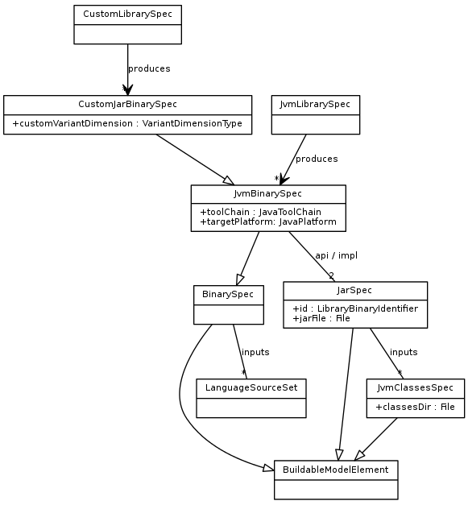

This spec describes changes to Gradle to support and take advantage of the major features introduced by Java 9.

# Milestone 1: Assist teams migrating to a modular architecture

The Java module system is a deep, disruptive change to the Java ecosystem. The following Gradle features will help teams migrate to a modular architecture running on the modular JVM, so that the migration can be made in a controlled and incremental way.

Useful links:

- [State of the module system](http://openjdk.java.net/projects/jigsaw/spec/sotms/)
- [Module system quick-start guide](http://openjdk.java.net/projects/jigsaw/quick-start) (not [this one](http://openjdk.java.net/projects/jigsaw/doc/quickstart.html))
- [Initial module system design, API, and early-access builds](http://mail.openjdk.java.net/pipermail/jigsaw-dev/2015-September/004480.html)
- [Java platform module system spec observers list](http://mail.openjdk.java.net/pipermail/jpms-spec-observers/)
- [Explanation of source layout for Jigsaw](http://openjdk.java.net/projects/jigsaw/doc/ModulesAndJavac.pdf)
- [The module descriptor syntax](http://cr.openjdk.java.net/~mr/jigsaw/spec/lang-vm.html)

# Terminology

The stories found here use the terminology defined in the `buildingJavaLibraries.xml` chapter. Please make sure you have those terms in mind before going further.


# ASM 6

This section lists the mandatory items to be fixes as soon as ASM 6 is available. ASM is the library we use to parse classes,
and it is used in a lot of different places in Gradle. The ASM 5 library cannot read the Java 9 class format
(version 53). We have worked around this in several places of Gradle:

- remove usages of `org.gradle.util.internal.Java9ClassReader` and replace them with a standard `org.objectweb.asm.ClassReader`
- remove hack in `org.gradle.test.fixtures.file.ClassFile`

# Feature: Java library author specifies library API

Given a description of the API of a library, Gradle will prevent at compile time the consumers of a library from using classes that are not part of the API of the library. This is intended to help teams materialize and describe the APIs of and dependencies between the various components of their software stack, and enforce the boundaries between them, helping prepare them for transition to the Java module system.

No runtime enforcement will be done--this is the job of the module system. Gradle will simply approximate the behaviour of the module system at compile time, but in a way that should be sufficient for many teams to make significant progress towards a modular architecture.

## Story: Java library author specifies packages included in library API

- Add a DSL to specify the packages included in the library's API
    ```
    model {
        main(JvmLibrarySpec) {
            api {
                exports 'com.example.p1'
                exports 'com.example.p2'
            }
        }
    }
    ```

- This story is about implementing the DSL, not using it.
- It is not expected to see the API specification as part of the model report.

### Test cases

- ~~`api` specification should be optional~~
- ~~`api` specification may contain zero or more `exports` clauses~~
- ~~Multiple `exports` clauses should be preserved, i.e. not overwrite themselves~~
- ~~Duplicate `exports` clauses should raise an error~~
- ~~Package name argument to `exports` clause should be validated per the JLS~~

## Story: Create API jar according to API specification

- All JVM libraries should produce an API jar and a runtime jar.
- Build a jar containing those packages from compiled classes for each variant of the library.
- Not used yet by consumers, this story is simply to produce the API artifact.

### Implementation details

This story should **not** use the `ApiStubGenerator` yet. Instead, it should:

- configure a new copy task that a class directory as input, and produces an `apiClasses` directory based on the packages exported in the api specification.
- filter the API classes directory according to the api spec. Included classes should **not** be stripped of their non-public members yet.
- a separate `jar` task should produce a jar out of the `apiClasses` directory
- package private classes, inner classes and local classes should remain included in the API jar for now (a later story will allow us to remove them)

For this story, it is expected that the API jar is built after the runtime jar. It is not in the scope of this story to make the API jar buildable without building the runtime jar. Therefore, it is acceptable that the API jar task depends on the runtime jar if it helps.

### Test cases

- ~~Default to all packages: if no `api` section is found, assume that all packages of the library are exported~~
- ~~API jar can be built for each variant of the library and contains only API classes~~
- ~~`assemble` task builds the API jar and implementation jar for each buildable variant~~
- ~~API jar contains exported packages~~
- ~~API jar does not contain non exported packages~~
- ~~If no API specification is present, API jar and implementation jars are identical (same contents)~~
- ~~Building the API jar should trigger compilation of classes~~
- Changes to the API specification should not trigger recompilation of the classes
- Changes to the API specification should not trigger repackaging of the implementation jar
- Changes to the API specification should trigger regeneration of the API jar
- If the API specification does not change, the API jar should not be rebuilt

### Open issues

- Do we need to verify that each exported package actually maps to some classes?
- What happens if none of the exported packages map to any classes: empty API jar?

## Story: Non-API classes of library are not visible when compiling consuming Java source

- When compiling Java source against a library use the API jar of the selected variant.
- Applies to local libraries only. A later story adds support for libraries from a binary repository.

### Test cases

- Compilation fails when consuming source references a non-API class.
- Consuming source is recompiled when API class is changed.
- Consuming source is not recompiled when non-API class changes.

## Story: Java source is not recompiled when signature of the declared API of a dependent library has not changed

AKA: API classes can reference non-API classes of the same library and adding a private method to the an API class should not trigger recompilation of consuming sources.

Produce a stubbed API jar instead of an API jar by generating stub classes using an ASM based API class stub generator. This should only be done if an API is declared: despite that's what we want to do ultimately, if a component doesn't declare an API, it is not expected to create a stubbed API jar: we will instead use a copy of the runtime jar. A later story adds support for stubbed API jars in any case.

### Implementation

Given a source representing the bytecode of a class, generate a new `byte[]` that corresponds to the same class viewed as an API class:

- strips out private members
- removes method bodies
- removes static initializers
- removes debug information
- provides a way to determine if a class file should belong to the API jar based on its package and access modifiers
- Should take `.class` files as input, **not** source files
- Process classes using the ASM library
- Method bodies should throw an `UnsupportedOperationException`.

### Test cases

- Output contains:
    - public or protected elements, including nested classes
    - annotations (we don't need to deal with source-retention annotations because they are not present in the original binary)
    - package private members if the list of packages is empty (no declared API)
- Output must not contain:
    - debug attributes
    - source location annotations
    - package private members if the list of packages is **not** empty (an API has been declared)
- Trying to call a method of the API jar at runtime throws `UnsupportedOperationException`
- Public constant types should be initialized to `null` or their default JVM value if of a primitive type (do not use `UnsupportedOperationException` here because it would imply the
creation of a static initializer that we want to avoid).
- Java bytecode compatibility level of the classes must be the same as the original class compatibility level
- A method body in an API class can reference non-API classes of the same library.
- A private method signature can reference non-API classes of the same library.
- Consuming source is not recompiled when API class method body of is changed.
- Consuming source is not recompiled when comment is changed in API source file.
- Consuming source is recompiled when signature of public API method is changed.
- Adding a private field to an API class should not trigger recompilation of the consuming library
- Adding a private method to an API class should not trigger recompilation of the consuming library
- Changing an API field of an API class should trigger recompilation of the consuming library
- Changing the superclass or interfaces of an API class should trigger recompilation of the consuming library

## Story: Java source is not recompiled when signature of the undeclared API of a dependent library has not changed

If a component doesn't declare an API, produce a stubbed API jar like in the case an API is declared. Consider all packages as belonging to the API.

### Test cases

- An API jar is created when no API is declared
- API jar contains all classes, but no resources
- API jar is a stubbed jar
- Building the API jar should not trigger generation of the runtime jar

As part of this story, we should ensure that the performance tests that prove that incremental builds are faster, get even faster. In particular, the tests found in `JavaSoftwareModelCompileAvoidancePerformanceTest` should perform significantly faster for the `WithoutApi` cases.

- because downstream dependencies are not recompiled when the API signature doesn't change
- because it is done independently of the fact a component declares an API or not

## Story: Java library API references the APIs of other libraries

- For a given library, Dependency DSL allows the library to declare an API dependency on any other library.
- When library A declares an API dependency on library B, then the API of A includes the API of B, and so the APIs of both A and B are visible to consumers of A at compile time.
- APIs of referenced libraries are resolved transitively.

Given the example:

```groovy
model {
    components {
        main(JvmLibrarySpec) {
            sources.java.dependencies {
                library "A"
            }
        }
        A(JvmLibrarySpec) {
            api {
                dependencies {
                    library "B"
                }
            }
            sources.java.dependencies {
                library "D"
            }
        }
        B(JvmLibrarySpec) {
            api {
                dependencies {
                    library "C"
                }
            }
        }
        C(JvmLibrarySpec) {}
        D(JvmLibrarySpec) {}
    }
}
```

- The compile classpath for 'main' includes the APIs of `A`, `B` and `C`, but not `D`.
- `D` is not exported in the API of `A`, and so is added to the compile classpath of `A` only.
- The compile classpath for `B` includes the API of `C`.

### Test cases

- ~~When compiling sources for `main` that has a dependency on `A` above:~~
    - ~~Compile classpath includes API jars from `A`, `B` and `C`~~
    - ~~Compile classpath does _not_ include API jar from `D`~~
- ~~When compiling sources for `B` above:~~
    - ~~Compile classpath includes API from `C`~~
### Open issues

- Declare a dependency set at the component level, to be used as the default for all its source sets.

## Story: Performance tests assess the incremental build performance for a large multiproject java build

Declaring an API on a component should have a significant impact on performance of incremental builds of large projects:
whenever component `A` depends on component `B` and that `B` declares an API, then if `B` is changed but its ABI remains
the same, `A` is not recompiled. Eventually, when generation of ABI signature is going to be expanded to all local libraries,
we want to make sure that performance of incremental builds will also improve when no API is declared.

The goal of this story is to capture these performance improvements into benchmarks and non regression tests.

### Benchmarks

* Change a source file that has no impact on the ABI of a library that is used transitively
* Change a source file that has an impact on the ABI of a library that is used transitively

This should be done for the 2 cases: API is declared and no API is declared (in the latter, no API declared is equivalent to
having all packages exported, so changing a source file without having an impact on ABI means updating a method body or
adding a private method).

### Implementation

Should reuse the [performance test generator](https://github.com/gradle/gradle/tree/master/buildSrc/src/main/groovy/org/gradle/performance/generator).
Add, if not available already, ability to update a file for each iteration.
There should be transitive dependencies: `A` depends on `B` depends on `C`..., and `A`
is updated.

### Out of scope

Do not activate incremental compilation. Later stories may enable finer grained incremental builds with incremental compilation.

## Story: Consuming an API jar should throw an error

Make sure that if a user puts a stubbed API jar on classpath, during execution of the program, an error is thrown. This should already be implemented
at this point, this story is about adding intergration tests that make sure that we really provide sensible error messages to the user. If necessary,
update the error messages so that they are clearly understandable.

### Test cases

- class `B` of library `LB` instantiates class `A` of library `LA`
   * Should not throw an error if runtime jar of `LA` is used
   * Should throw `UnsupportedOperationException` if the stubbed API jar is used

- class `B` of library `LB` calls static method of class `A` of library `LA`
   * Should not throw an error if runtime jar of `LA` is used
   * Should throw `UnsupportedOperationException` if the stubbed API jar is used

## Story: Validates stubbed API classes according to the API specification

When stripping out non public members of a class, the stub generator should check if the methods or classes which are exported do not expose classes which do not belong
to the list of exported packages. Special treatment should be done to allow the JDK base classes to be part of the API.
Validation at this point should be optional and disabled by default.

### Implementation

- Should consider `java.*`, `javax.*` as allowed packages, considering they will map later to the `java-base` module.

### Test cases

- Allows classes from the base JDK to be referenced in exposed members: superclasses, interfaces, annotations, method parameters, fields.
- Throws an error if an exposed member references a class which is not part of the API. For example, given:
    ```
    package p1;
    public class A {
       public B foo()
    }

    package p2;
    public class B {
    }
    ```

    if only package `p1` has been specified as part of the library's API, then `foo` has a return type in violation of this contract. An error should be raised accordingly.

## Story: Java Library API includes exported dependencies but no exported classes

- A library may have no API classes of its own: the API of such a library consists of the exported APIs of dependent libraries.
    - In this case, the library will have an empty api jar
    - An example would be a library that provides an implementation of an API defined in a dependency.
- Any library must have a non-empty API: at a minimum it must export either API classes or the API of other libraries
    - A 'library' with an empty API is not a library - it is some other kind of component
- Simply declaring exported packages is not enough: the exported packages must include some API classes
- Should permit explicitly declaring an empty set of exported packages. Will need to differentiate between:
    a) where a library doesn't declare any exported packages (so we assume all classes are in the API)
    b) where a library explicitly declares that the set of exported packages is empty

- The concept of API needs to be described in the User Guide, including the concept of 'exported' dependencies.

### Questions:

- Does such a library have an empty API jar, or is the API jar missing?

### Test cases

- When compiling sources for `main` that has dependency on `libraryA` that has no API classes
    - Useful error message if `libraryA` also has no exported dependencies : it is invalid for `libraryA` to have an empty API
    - Same applies for a transitively referenced library: must either have classes or library dependencies exported in the API
    - Where `libraryA` declares exported dependencies, then the api jars of these exported dependencies are available for compilation.

## Story: Extract a buildable element to represent the compiled classes of the library variant

The next 3 stories form a larger effort to decouple the generation of the API jar from the generation of the runtime jar. A new binary spec type should likely be introduced, supporting only classes found in a directory. Replace the configuration of compile tasks from `JarBinarySpec` to the new binary type. Compose `JarBinarySpec` with that new specification.

The idea is to move from this model:


to something closer to:




The first step involves the creation of a buildable element to represent the compiled classes of a variant.

### Implementation

- Add a `JvmClassesSpec` buildable element type.
- Add `classes` property to `JvmBinarySpec` that points to an instance of `JvmClassesSpec`.
- Remove `resourcesDir` from `JvmBinarySpec`. Generate resources into the classes dir.
- With `JvmClassesSpec`:
    - Move `classesDir` from `JvmBinarySpec`.
    - Add `inputs` property, a set of `LanguageSourceSet`. Defaults to library variant's input source sets.
    - Build task for this element should compile input sources to classes and process input resources.
    - Replace the Play plugin's `JvmClasses` with this.

### Test cases

- Can compile the classes of a component without having to build the jar
- Building the jar should depend on the classes
- Components report should show details of the `classes` element for a library variant

## Story: Extract a buildable element to represent the runtime jar of the library variant

The second step in order to separate API jars from runtime jars involves the creation of a separate
buildable element to represent the runtime jar of a variant.

### Implementation

- Add a `JarSpec` buildable element type.
- Add `jar` property to `JarBinarySpec` that points to an instance of `JarSpec`.
- With `JarSpec`:
    - Move `jarFile` from `JarBinarySpec`.
    - Add `inputs` property, a set of `JvmClassesSpec`. Defaults to the `classes` of the library variant.
    - Build task for this element should build the runtime Jar from input classes/resources.

### Test cases

- Components report should show details of the `jar` element for a library variant.

## Story: Add a buildable element to represent the API jar of the library variant

The last step of separating API from implementation involves the creation of a buildable element to represent the API jar of a library. Once this story is implemented it must be possible to reuse the same directory of classes for building both the API and the implementation jars of a variant.

### Implementation

- Add `api` property that points to an instance of `JarSpec`.
- Inputs should be the `classes` of the library variant.
- Build task for this element should build the API Jar.
- Components report should show details of the `api` element for a library variant.
- Rename `JarBinarySpec` to `JvmLibraryVariantSpec`.

### Test cases

- Building the API jar should not depend on the runtime jar
- Building the runtime jar should not depend on the API jar
- Building the runtime jar and the API jar should depend on the same compilation tasks

## Backlog

- Validate dependencies of API classes at build time to verify all API dependencies are exported.
- Complain about exported dependencies that are not referenced by the API specification.
- Show details of API binary in component report.
- Generate stub API jar for Groovy and Scala libraries, use for compilation.
- Discovery of annotation processor implementations.
- Add an option to optionally exclude package private members from the API.

# Feature: Development team migrates Java library to Java 9

Allow a Java library to build for Java 9, and produce both modular and non-modular variants that can be used by different consumers.

## Story: Build author declares installed Java toolchain

- Add mechanism to declare Java toolchain resolvers.
- Add resolver that uses an specified install dir to locate toolchain.
- Resolver probes the version of the installed toolchain (reusing existing logic to do this).
- Implementation forks `javac`
- To compile Java source, select the closest compatible toolchain to compile the variant.

TBD - alternatively, select the toolchain with the highest version and use bootstrap classpath or `-release` to cross compile.

TBD - fail or warn when source code is not compiled against exactly the target Java API. Currently, toolchain selection is lenient.

## Story: Modular Java library is compiled using modular Java 9

- Install modular Java 9 on CI build VMs.
- Sample and test coverage for building modular library.

## Story: Modular consumer is compiled against Java library modular Jar

- When building for Java 9, produce a single modular Jar artifact instead of separate API and implementation jars.
- Use this when compiling consuming modular source.

## Story: Build non-modular variant of Java library

- Include `module-info.jar` when building for modular Java 9, exclude when not.
- Add conventional source sets or naming scheme for version specific source files.

### Test cases

- Java 9 specific source files in conventional location are not compiled when building for Java 8.
- Modular consumer compiles against modular Jar.
- Non-modular consumer should use non-modular API Jar.

## Backlog

- Generate the module descriptor from the Gradle model.
- Use Java 9 `-release` flag for compiling against older versions.
- Use bootstrap classpath for cross compilation against older versions.
- Add a toolchain resolve that reuses JVM discovery code from test fixtures to locate installed JVMs.

# Milestone 2: Gradle is self hosted on Java 9

# Feature: Run all Gradle tests against non modular Java 9

Goal: Successfully run all Gradle tests in a CI build on Java 8, running tests against Java 9. At completion, Gradle will be fully working on Java 9. At this stage, however, there will be no special support for Java 9 specific features.

It is a non-goal of this feature to be able to build Gradle on Java 9. This is a later feature.

## Cannot fork test worker processes

See:

- https://discuss.gradle.org/t/classcastexception-from-org-gradle-process-internal-child-bootstrapsecuritymanager/2443
- https://issues.gradle.org/browse/GRADLE-3287
- http://download.java.net/jdk9/docs/api/index.html

As of b80, an `@argsfile` command-line option is available for the `java` command, change the worker process launcher to use this on Java 9. Reuse handling for `javac` from java compiler infrastructure.

## Fix test fixtures and test assumptions

- `tools.jar` no longer exists as part of the JDK so `org.gradle.internal.jvm.JdkTools`(and others) need an alternative way to get a SystemJavaCompiler which does rely on the JavaCompiler coming from an isolated, non-system `ClassLoader`. One approach would be:
    - Isolate the Gradle classes from the application `ClassLoader`
    - Load things, targeted for compilation, into an isolated `ClassLoader` as opposed to the JVM's application application `ClassLoader`.
    - `org.gradle.internal.jvm.JdkTools` could use `ToolProvider.getSystemJavaCompiler()` to get a java compiler

- JDK 9 is not java 1.5 compatible. `sourceCompatibility = 1.5` and `targetCompatibility = 1.5` will no longer work.
- Some tests use `tools.jar` as a "big jar", they need to be refactored to use something else.
- JDK 9 has completely changed the JVM and `org.gradle.internal.jvm.Jvm` is no longer an accurate model:
    - No longer a distinction between JRE and SDK, it's all rolled into one.
    - Files or jars under `lib/` should not be referenced: [http://openjdk.java.net/jeps/220](http://openjdk.java.net/jeps/220). _All other files and directories in the lib directory must be treated as private implementation details of the run-time system_

- Some tests which garbage collect(`System.gc()`) are failing. See: `ModelRuleExtractorTest`. There would need to be some exploration to figure out how (or if) garbage collection is different on JDK9.

## Scala compilation is broken

## Update linux jdk9 installation

### open issues

- convenient update of jdk9 early access releases

## Add windows jdk9 coverage to Gradle CI pipeline

A 64 bit windows installer is now available (as of b80).

### implementation

- add jdk9 installation to the windows vm boxes
    - update salt-master win-repo setup to download jdk9 from java.net
    - update windows build vms to install jdk9
- setup  `Windows - Java 1.9 - Quick test` build configuration on teamcity
    - running `clean quickTest`
    - for `master` pipeline
    - for `release` pipeline

# Feature: Self hosted on Java 9

Goal: Run a coverage CI build on Java 9. At completion, it will be possible to build and test Gradle using Java 9.

## Initial JDK9 support in Gradle's own build

[gradle/java9.gradle](gradle/java9.gradle) adds both unit and integration test tasks executing on JDK 9. Once JDK 9 has been fully supported, jdk9 specific test tasks should be removed along with `[gradle/java9.gradle]`

# Milestone: Support Java 9 language and runtime features

Goal: full support of the Java 9 module system, and its build and runtime features

- [Jigsaw JSR-376](http://openjdk.java.net/projects/jigsaw/spec/)

In no particular order:

- Make further use of `@argfile` when supported
    - `JavaExec` task
    - daemon launcher
    - generated application start scripts
- Use `-release` javac flag for JVM binary that target older Java platform versions
- Extract or validate module dependencies declared in `module-info.java`
    - Infer API and runtime requirements based on required and exported modules
- Extract or validate platform dependencies declared in `module-info.java`
- Map module namespace to GAV namespace to resolve classpaths
- Resolve modules for compilation module path
    - Locate modules that provide required services.
    - Resolve conflicts when multiple components provide the same module
- Resolve libraries that are packaged as:
    - modular jar
    - jar
    - multi-version jar
    - any combination of the above
- Invoke compiler with module path and other args
- Deal with single and multi-module source tree layouts
- Resolve modules for runtime, packaged in various forms.
    - Locate modules that provide required services.
- Invoke java for module at runtime (eg for test execution)
- Build modular jar file
    - May need to build multiple jars for a given project, one module per jar
- Build runtime image for application
    - Operating specific formats
- Build multiple variants of a Java component
    - Any combination of (modular) jar, multi-version jar, runtime image
- Publish multiple variants of a Java component
- Capture module identifier and dependencies in publication meta-data
- Improve JVM platform definition and toolchains to understand and invoke modular JVMs
- Use module layers rather than filtering when running under Java 9 to enforce isolation.

Some migration/bridging options:

- Generate modules for non-modular libraries, based on dependency information.
    - Will require dependencies to also be converted to modules.
    - Might not be reliable, as semantics of module and jar are somewhat different.
- Support other JVM languages, generating modules based on dependency information.
- Allow non-module consumers to consume modules, applying some validation at compile and runtime.
    - This is possible already. Consumers loaded via classpath are part of an unnamed module and can read every other module.
- Support Gradle plugins packaged as modules

Abstractly:

- jar is a packaging with a single target JVM platform
- multi-version jar is a packaging with multiple target JVM platforms
- modular jar is a packaging with a single target JVM platform and single module
- runtime image is an executable with a single target native platform
- runtime image is a bundle of modules
- modular JVM is a JVM platform with a single target native platform that can host jars, multi-version jars, modular jars

# Gradle and JDK9 Status Today (2016/03/30)

This section is for recording issues with Gradle and the JDK 9 libraries and runtime. There is currently just one
distributions of Jdk 9 available for 64-bit OS X (this is down from two in the past.)

- **Jdk 9 (with Jigsaw)** Java HotSpot(TM) 64-Bit Server VM (build 9-ea+111, mixed mode)

In the following scenarios, we describe how Gradle version 2.12 behaves running with this jdk.

## Scenario 1: Simple Gradle Build

In this scenario, we have the following `build.gradle` file:

```
task printProps {
  doLast {
    println "Favorite Color: " + System.properties['favoriteColor']
  }
}
```

### Gradle 2.12 and Jdk 9 (with Jigsaw) -- Success

```
$> gradle printProps -s
Parallel execution is an incubating feature.
:printProps
Favorite Color: green

BUILD SUCCESSFUL

Total time: 0.666 sec
```

## Scenario 2: Simple Java Library

In this scenario, we run `gradle init --type java-library` and then `gradle build`

### Gradle 2.12 with Jdk 9 (with Jigsaw) -- Failure

```
$> gradle init --type java-library
Parallel execution is an incubating feature.
:wrapper
:init

BUILD SUCCESSFUL

Total time: 0.709 secs

$> gradle build -s
Parallel execution is an incubating feature.
:compileJava FAILED

FAILURE: Build failed with an exception.

* What went wrong:
Execution failed for task ':compileJava'.
> Could not create an instance of type com.sun.tools.javac.api.JavacTool.

* Try:
Run with --info or --debug option to get more log output.

* Exception is:
org.gradle.api.tasks.TaskExecutionException: Execution failed for task ':compileJava'.
	at org.gradle.api.internal.tasks.execution.ExecuteActionsTaskExecuter.executeActions(ExecuteActionsTaskExecuter.java:69)
	at org.gradle.api.internal.tasks.execution.ExecuteActionsTaskExecuter.execute(ExecuteActionsTaskExecuter.java:46)
	at org.gradle.api.internal.tasks.execution.PostExecutionAnalysisTaskExecuter.execute(PostExecutionAnalysisTaskExecuter.java:35)
	at org.gradle.api.internal.tasks.execution.SkipUpToDateTaskExecuter.execute(SkipUpToDateTaskExecuter.java:64)
	at org.gradle.api.internal.tasks.execution.ValidatingTaskExecuter.execute(ValidatingTaskExecuter.java:58)
	at org.gradle.api.internal.tasks.execution.SkipEmptySourceFilesTaskExecuter.execute(SkipEmptySourceFilesTaskExecuter.java:52)
	at org.gradle.api.internal.tasks.execution.SkipTaskWithNoActionsExecuter.execute(SkipTaskWithNoActionsExecuter.java:52)
	at org.gradle.api.internal.tasks.execution.SkipOnlyIfTaskExecuter.execute(SkipOnlyIfTaskExecuter.java:53)
	at org.gradle.api.internal.tasks.execution.ExecuteAtMostOnceTaskExecuter.execute(ExecuteAtMostOnceTaskExecuter.java:43)
	at org.gradle.execution.taskgraph.DefaultTaskGraphExecuter$EventFiringTaskWorker.execute(DefaultTaskGraphExecuter.java:203)
	at org.gradle.execution.taskgraph.DefaultTaskGraphExecuter$EventFiringTaskWorker.execute(DefaultTaskGraphExecuter.java:185)
	at org.gradle.execution.taskgraph.AbstractTaskPlanExecutor$TaskExecutorWorker.processTask(AbstractTaskPlanExecutor.java:66)
	at org.gradle.execution.taskgraph.AbstractTaskPlanExecutor$TaskExecutorWorker.run(AbstractTaskPlanExecutor.java:50)
	at org.gradle.internal.concurrent.ExecutorPolicy$CatchAndRecordFailures.onExecute(ExecutorPolicy.java:54)
	at org.gradle.internal.concurrent.StoppableExecutorImpl$1.run(StoppableExecutorImpl.java:40)
Caused by: org.gradle.internal.reflect.ObjectInstantiationException: Could not create an instance of type com.sun.tools.javac.api.JavacTool.
	at org.gradle.internal.reflect.DirectInstantiator.newInstance(DirectInstantiator.java:53)
	at org.gradle.internal.reflect.DirectInstantiator.instantiate(DirectInstantiator.java:29)
	at org.gradle.internal.jvm.JdkTools.getSystemJavaCompiler(JdkTools.java:74)
	at org.gradle.api.internal.tasks.compile.JavaHomeBasedJavaCompilerFactory$SystemJavaCompilerFactory.create(JavaHomeBasedJavaCompilerFactory.java:81)
	at org.gradle.api.internal.tasks.compile.JavaHomeBasedJavaCompilerFactory$SystemJavaCompilerFactory.create(JavaHomeBasedJavaCompilerFactory.java:78)
	at org.gradle.api.internal.tasks.compile.JavaHomeBasedJavaCompilerFactory.findCompiler(JavaHomeBasedJavaCompilerFactory.java:58)
	at org.gradle.api.internal.tasks.compile.JavaHomeBasedJavaCompilerFactory.create(JavaHomeBasedJavaCompilerFactory.java:45)
	at org.gradle.api.internal.tasks.compile.JavaHomeBasedJavaCompilerFactory.create(JavaHomeBasedJavaCompilerFactory.java:28)
	at org.gradle.api.internal.tasks.compile.JdkJavaCompiler.createCompileTask(JdkJavaCompiler.java:56)
	at org.gradle.api.internal.tasks.compile.JdkJavaCompiler.execute(JdkJavaCompiler.java:45)
	at org.gradle.api.internal.tasks.compile.JdkJavaCompiler.execute(JdkJavaCompiler.java:33)
	at org.gradle.api.internal.tasks.compile.NormalizingJavaCompiler.delegateAndHandleErrors(NormalizingJavaCompiler.java:104)
	at org.gradle.api.internal.tasks.compile.NormalizingJavaCompiler.execute(NormalizingJavaCompiler.java:53)
	at org.gradle.api.internal.tasks.compile.NormalizingJavaCompiler.execute(NormalizingJavaCompiler.java:38)
	at org.gradle.api.internal.tasks.compile.CleaningJavaCompilerSupport.execute(CleaningJavaCompilerSupport.java:35)
	at org.gradle.api.internal.tasks.compile.CleaningJavaCompilerSupport.execute(CleaningJavaCompilerSupport.java:25)
	at org.gradle.api.tasks.compile.JavaCompile.performCompilation(JavaCompile.java:163)
	at org.gradle.api.tasks.compile.JavaCompile.compile(JavaCompile.java:145)
	at org.gradle.api.tasks.compile.JavaCompile.compile(JavaCompile.java:93)
	at org.gradle.internal.reflect.JavaMethod.invoke(JavaMethod.java:75)
	at org.gradle.api.internal.project.taskfactory.AnnotationProcessingTaskFactory$IncrementalTaskAction.doExecute(AnnotationProcessingTaskFactory.java:244)
	at org.gradle.api.internal.project.taskfactory.AnnotationProcessingTaskFactory$StandardTaskAction.execute(AnnotationProcessingTaskFactory.java:220)
	at org.gradle.api.internal.project.taskfactory.AnnotationProcessingTaskFactory$IncrementalTaskAction.execute(AnnotationProcessingTaskFactory.java:231)
	at org.gradle.api.internal.project.taskfactory.AnnotationProcessingTaskFactory$StandardTaskAction.execute(AnnotationProcessingTaskFactory.java:209)
	at org.gradle.api.internal.tasks.execution.ExecuteActionsTaskExecuter.executeAction(ExecuteActionsTaskExecuter.java:80)
	at org.gradle.api.internal.tasks.execution.ExecuteActionsTaskExecuter.executeActions(ExecuteActionsTaskExecuter.java:61)
	... 14 more
Caused by: java.lang.IllegalAccessException: class org.gradle.internal.reflect.DirectInstantiator cannot access class com.sun.tools.javac.api.JavacTool (in module jdk.compiler) because module jdk.compiler does not export com.sun.tools.javac.api to unnamed module @6c9f5c0d
	at org.gradle.internal.reflect.DirectInstantiator.newInstance(DirectInstantiator.java:49)
	... 39 more


BUILD FAILED

Total time: 1.527 secs
```

According to this [slide
deck](http://openjdk.java.net/projects/jigsaw/talks/prepare-for-jdk9-j1-2015.pdf),
it looks like we should just be able to work around this by passing
"-XaddExports" as JVM options when invoking the build, but that has not worked for
me yet.

Also, the problem seems to come from our use of a private
implementation detail behind the `JavaCompiler` interface. We are
creating an isolated classLoader with only the tools.jar on it, and
then attempting to create an instance of the
`com.sun.tools.javac.api.JavacTool` class rather than getting a
`JavaCompiler` from `ToolsProvider.getSystemJavaCompiler()` method as
suggested by [the
documentation](http://download.java.net/jdk9/docs/api/javax/tools/JavaCompiler.html).

I don't currently understand why we need to isolate ourselves from the
application `ClassLoader` or exactly how this is accomplished, but I
wonder if there might be another way to achieve the same results.
