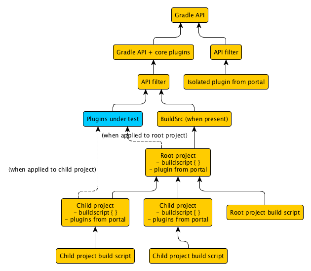

# Testing custom build logic

## High-level goals

* Writing and executing functional tests against build scripts via Tooling API.
* Providing utility methods for common operations in tests e.g. creating directories/files.
* Generating Ivy and Maven repositories for testing purposes. Creating modules and artifacts in a repository to emulate dependency management behavior.

The test-kit will be agnostic of the test framework preferred by the user (e.g. JUnit, TestNG, Spock). Adapters will be provided to make it easy to integrate the test-kit with a specific test framework.

## Technical details

* Except for the Groovy-based test adapter all code will be developed in Java.
* The test-kit and all test adapters are implemented in the same repository as Gradle core. The test-kit classes are shipped with Gradle core distribution and can be imported as needed.

# Milestone 1

The first milestone lays the foundation for defining and executing functional tests. The goal should be a solid implementation based on the tooling API and integration
with the plugin development plugin.

## Story: User creates and executes a functional test using the test-kit (DONE)

A set of interfaces/builders will be developed to provide programmatic execution of Gradle builds. Tests are executed with the Tooling API.

### User visible changes

To use the test-kit, the build author must declare a dependency on the test-kit:

    dependencies {
        testCompile gradleTestKit()
    }

Initially, this will be available only as a local dependency.

The test-kit does not have an opinion about the used test framework. It's up to the build logic to choose a test framework and declare its dependency.

    dependencies {
        // Declare the preferred test framework
        testCompile '...'
    }

As a user, you write your functional test by using the following interfaces:

    package org.gradle.testkit.functional;

    public abstract class GradleRunner {
        File getWorkingDir();
        void setWorkingDir(File workingDirectory);
        List<String> getArguments();
        void setArguments(List<String> string);
        void useTasks(List<String> taskNames);
        BuildResult succeeds() throws UnexpectedBuildFailure;
        BuildResult fails() throws UnexpectedBuildSuccess;

        public static GradleRunner create() { ... }
    }

    public interface BuildResult {
    }

A functional test using Spock could look as such:

    class UserFunctionalTest extends Specification {
        def "run build"() {
            given:
            File testProjectDir = new File("${System.getProperty('user.home')}/tmp/gradle-build")
            File buildFile = new File(testProjectDir, 'build.gradle')

            buildFile << """
                task helloWorld {
                    doLast {
                        println 'Hello world!'
                    }
                }
            """

            expect:
            def runner = GradleRunner.create().with {
                workingDir = testProjectDir
                arguments << "helloWorld"
            }
            runner.succeeds()
        }
    }

### Implementation

* A new module named `test-kit-functional` will be created in Gradle core.
* The implementation will be backed by the Tooling API. The implementation may use internal parts of the tooling API and is not restricted to the public APIs.
    * This will mean that daemons are left behind by the tests. This will be addressed in later stories.
* A test build should use the Gradle installation that is running the test.
    * When running from a `Test` task, use the Gradle installation that is running the build.
    * When importing into the IDE, use the Gradle installation that performed the import.
    * Can infer the location of the Gradle installation based on the code-source of the test kit classes (reuse `GradleDistributionLocator` in some form for this).
    * Possibly provide some override for our functional tests to use, to run from the classpath.
* No environmental control will be allowed (e.g. setting env vars or sys props).
* Add (or expand) a sample for building and testing a plugin and task implementation.
* Add some brief user guide material.

### Test coverage

* Execute a build that is expected to succeed.
    * No exception is thrown from `GradleRunner`.
* Execute a build that is expected to succeed but fails.
    * A `UnexpectedBuildFailure` is thrown, with some reasonable diagnostics.
    * Something useful is done with the build standard output and error.
* Execute a build that is expected to fail.
    * No exception is thrown from `GradleRunner`.
* Execute a build that is expected to fail but succeeds.
    * A `UnexpectedBuildSuccess` is thrown, with some reasonable diagnostics.
    * Something useful is done with the build standard output and error.
* A build can be provided with command line arguments. Upon execution the provided options come into effect.
* Reasonable diagnostics when badly formed Gradle arguments or working directory.
* Tooling API mechanical failures produce good diagnostic messages.
    * For example, bad java home or jvm args in `gradle.properties`.
    * When daemon dies, say by build script calling `Runtime.halt()`.
* IDEA and Eclipse projects are configured appropriately to use test-kit. Manually verify that this works as well (in IDEA say).

### Open issues

* Reuse contract? Can `TestRunner` be reused to run multiple builds? Is it reset between builds?
* Need to do something useful with the build standard output and error when `succeeds()` or `fails()` throw an exception.
* Thread-safety contract?
* Should we be doing any implicit normalization of failure diagnostic messages?

## Story: Functional test queries the build result (DONE)

Add methods to `BuildResult` to query the result.

    public interface BuildResult {
        String getStandardOutput();
        String getStandardError();
        List<String> getExecutedTasks();
        List<String> getSkippedTasks();
    }

### Implementation

- Executed tasks and skipped tasks should be calculated using progress events generated by the tooling API, rather than scraping the output.

### Test cases

* Change test cases above to verify:
    * Standard output retrieved from `GradleRunner` contains `println` or log message.
    * Standard error retrieved from `GradleRunner` contains error message.
* A build can be executed with more than one task.
    * Tasks that are marked SKIPPED, UP-TO-DATE or FAILED can be retrieved as skipped tasks from `GradleRunner`.
    * All successful, failed or skipped tasks can be retrieved as executed tasks from `GradleRunner`.
* A build that has  `buildSrc` project does not list executed tasks from that project when retrieved from `GradleRunner`.

## Story: Test daemons are isolated from the environment they are running in

The previous stories set up the basic mechanics for the test-kit. Daemons started by test-kit should be isolated from the machine environment:

- Test-kit uses only daemons started by test-kit.
- Test kit daemons are not affected by build using custom gradle user home dir (i.e. isolate daemon base dir)
- Configuration in ~/.gradle is ignored, such as `init.gradle` and `gradle.properties`
- Daemons use default JVM arguments that are more appropriate to test daemons. Best option might be to use the JVM defaults.
- Daemons are reused by tests.
- Daemons are stopped at the end of the tests.
- Daemons use a short idle timeout, say several minutes.

### Implementation

- Allow “working space” for runner to be specified, defaulting to `«java.io.tmpdir»/gradle-test-kit-«user name»`
    - Use for default gradle user home dir
    - Use for daemon base dir
- Reuse the temporary directory within the test JVM process, so that daemons are reused for multiple tests.
- Kill off the daemons when the JVM exits (See `DefaultGradleConnector#close()`). If required, split out another internal method to stop the daemons.

### Test cases

* Test are executed in dedicated, isolate daemon instance.
    * If no daemon process exists, create a new one and use it. Regular Gradle build executions will not use the daemon process dedicated for test execution.
    * If a daemon process already exists, determine if it is a daemon process dedicated for test execution. Reuse it if possible. Otherwise, create a new one.
    * A daemon process dedicated for test execution only use its dedicated JVM parameters. Any configuration found under `~/.gradle` is not taken into account.
    * Daemons are stopped at the end of the test.
* Two gradle runners sharing the same working space can be run at the same time
    * No daemons are left behind.
* Runner fails early if working space dir cannot be created or written to
* Executing a build with a `-g` option does not affect daemon mechanics (i.e. daemon base dir is not under `-g`)

### Open issues

* The "working space" is defined as temporary directory that is deleted eventually by the JVM. At the moment the user cannot set a custom "working directory" e.g.
for debugging purposes. Should we potentially allow the user to set a Gradle user home directory via the `GradleRunner` API?
* Looking at `DefaultGradleConnector#close()` it seems like it was introduced with Gradle 2.2. Later stories will allow executing a build with an older version.

We'll support that scenario when we get to the corresponding story.

## Story: Functional test defines classes under test to make visible to test builds

Provide an API for functional tests to define a classpath containing classes under test:

    public interface GradleRunner {
        List<URI> getClassesUnderTest();
        void setClassUnderTest(Collection<URI> classpath);
    }

This classpath is then available to use to locate plugins in a test build, as if they were published to the plugin portal:

    plugins {
        id 'com.my-org.my-plugin'
    }

    task someTask(type: MyTaskType) { ... }

    model {
        tasks {
            otherTask(MyTaskType) { ... }
        }
    }

### Implementation

- Add an internal Tooling API mechanism to attach this to a build request:
    - Provide the plugin classpath when configuring the `BuildLauncher`. Perhaps add an internal subtype with the appropriate methods.
    - Pass the plugin classpath from Tooling API consumer to provider. Add to `ConsumerOperationParameters` and `ProviderOperationParameters`.
    - Send the classpath between provider and daemon. Add to `BuildActionParameters` (or perhaps `BuildModelAction`).
- Based on this, add another internal plugin resolver that uses the supplied classpath to locate plugins:
    - Perhaps have `InProcessBuildActionExecuter` talk to some service to pass this classpath through to the plugin resolution mechanics, or pass this
      through when creating the `GradleLauncher`.
    - Define a new `PluginResolver` implementation that loads the plugins in a ClassLoader scope whose parent is the Gradle API scope.

This diagram shows the intended ClassLoader hierarchy. The piece to be added is shaded blue:

### Test coverage

- Test build can apply a plugin by id.
- Plugin code can use Gradle API classes.
- Build script can use plugin classes, when applied. Cannot use plugin classes when not applied.
- Diagnostic message for 'plugin not found' failure includes some details of the classpath it searched.

### Open issues

- How can a plugin under test apply another plugin under test programmatically, say in its `apply()` method?

# Milestone 2

## Story: IDE user debugs test build

By default functional tests are executed in a forked daemon process. Debugging test execution in a different JVM other than the "main" Gradle process would require additional setup from the end user.
This story improves the end user experience by allowing for conveniently step through code for debugging purposes from the IDE without the need for any complicated configuration.

### User visible changes

The `GradleRunner` abstract class will be extended to provide additional methods.

    public abstract class GradleRunner {
        public abstract boolean isDebug();
        public abstract GradleRunner withDebug(boolean debug);
    }

### Implementation

* When debug is enabled, run the build in embedded mode by setting `DefaultGradleConnector.embedded(true)`.
* Can enable debug via `GradleRunner.withDebug(boolean)`.
* Debug is automatically enabled when `Test.debug` is true.
* Debug is automatically enabled when test is being run or debugged from an IDE. In the IDE test execution run configuration, the system property `org.gradle.testkit.debug` has to be set to `true`. A
later story dealing with the plugin development plugin can deal with the automatic setup of the system property by pre-configuring the `idea` and `eclipse` plugin.

### Test coverage

* The debug flag is properly passed to the tooling API.
* All previous features work in debug mode. Potentially add a test runner to run each test in debug and non-debug mode.
* Manually verify that when using an IDE, a breakpoint can be added in Gradle code (say in the Java plugin), the test run, and the breakpoint hit.
* If the debug flag is not set explicitly through the API or run from the IDE, functional tests run in a forked daemon process.

### Open issues

- Port number? (Is this even an issue? Probably not because the tests are executed in the same JVM.)
- Do we expect classloading issues between user-defined dependencies and Gradle core dependencies when running in embedded mode?
- How do we reliably determine that the build is executed from an IDE?
- Should the integration with `Test.debug` be moved to the story that addresses the plugin development plugin?

## Story: Developer inspects build result of unexpected build failure

This story adds the ability to understand what happened with the test when it fails unexpectedly.

- UnexpectedBuildFailure and Success should have-a BuildResult
- Tooling API exceptions and infrastructure failures should be wrapped and provide build information (e.g. stdout)

## Story: Classes under test are visible to build scripts

When using the plugin development plugin, plugins under test are visible to build scripts.

### Implementation

- Infer the classpath for classes under test classpath
    - When running from the plugin dev plugin, use the main source set's runtime classpath.
    - When running from the IDE, could use a generated resource or perhaps infer from the runtime classpath in the test JVM.
- Add or expand sample to demonstrate this feature.
- Add some brief user guide material.

### Test coverage

* The classpath of the tooling API execution is set up properly.
    * Class files of project sources under test (e.g. plugin classes) are added to classpath of the tooling API execution.
        * A plugin class under test can be referenced and tested in build script by type and id.
        * A custom task class under test can be referenced and tested in build script by type.
        * Arbitrary classes under test can be referenced and tested in build script.
    * Classes originating from external libraries used by classes under tests are added to classpath of the tooling API execution.
* IDEA and Eclipse projects are configured to run these tests. Manually verify that this works (in IDEA say).
* Manually verify that when using an IDE, a breakpoint can be added in production classes, the test run, and the breakpoint hit.

## Story: Test build code against different Gradle versions

Extend the capabilities of `GradleRunner` to allow for testing a build against more than one Gradle version. The typical use case is to check the runtime compatibility of build logic against a
specific Gradle version. Example: Plugin X is built with 2.3, but check if it is also compatible with 2.2, 2.4 and 2.5.

### User visible changes

A user interacts with the following interfaces/classes:

    package org.gradle.testkit.functional.dist;

    public interface GradleDistribution<T> {
        T getHandle();
    }

    public final class VersionBasedGradleDistribution implements GradleDistribution<String> { /* ... */ }
    public final class URILocatedGradleDistribution implements GradleDistribution<URI> { /* ... */ }
    public final class InstalledGradleDistribution implements GradleDistribution<File> { /* ... */ }

    package org.gradle.testkit.functional;

    public class GradleRunnerFactory {
        public static GradleRunner create(GradleDistribution gradleDistribution) { /* ... */ }
    }

A functional test using Spock could look as such:

    class UserFunctionalTest extends Specification {
        @Unroll
        def "run build with #gradleDistribution"() {
            given:
            File testProjectDir = new File("${System.getProperty('user.home')}/tmp/gradle-build")
            File buildFile = new File(testProjectDir, 'build.gradle')

            buildFile << """
                task helloWorld {
                    doLast {
                        println 'Hello world!'
                    }
                }
            """

            when:
            def result = GradleRunnerFactory.create(gradleDistribution).with {
                workingDir = testProjectDir
                arguments << "helloWorld"
                succeed()
            }

            then:
            result.standardOutput.contains "Hello World!"

            where:
            gradleDistribution << [new VersionBasedGradleDistribution("2.4"), new VersionBasedGradleDistribution("2.5")]
        }
    }

### Implementation

* The tooling API uses the provided Gradle distribution. Any of the following locations is valid:
    * Gradle version String e.g. `"2.4"`
    * Gradle URI e.g. `new URI("http://services.gradle.org/distributions/gradle-2.4-bin.zip")`
    * Gradle installation e.g. `new File("/Users/foo/bar/gradle-installation/gradle-2.4-bin")`
* Each test executed with a specific Gradle version creates a unique temporary test directory.
* Tests executed with the different Gradle versions run with an isolated daemon.

### Test coverage

* `GradleRunnerFactory` throws and exception if `GradleDistribution` is provided that doesn't match the supported types.
* A test can be executed with Gradle distribution provided by the user. The version of the distribution can be a different from the Gradle version used to build the project.

### Open issues

* Execution of tests in parallel for multiple Gradle versions
* JUnit Runner implementation to simplify definition of Gradle distributions

# Milestone 3

## Story: Integration with plugin-development-plugin

Users can easily test their Gradle plugins developed using the [plugin-development-plugin](https://docs.gradle.org/current/userguide/javaGradle_plugin.html).

### User visible changes

### Implementation

* The plugin depends on the relevant modules of the test-kit.
* Applying the `java-gradle-plugin` plugin adds a functional test SourceSet and Test task.
    * The SourceSet name will be `functionalTest`. The srcDir will be set to `src/functTest/java`, the resourcesDir will be set to `src/functTest/resources`. Both directories
    will be created by the plugin if they don't exist yet.
    * The task name will be `functionalTest`. The `check` task depends on `functionalTest`. The task `functionalTest` must run after `test`.
* Derive the test adapter that should be applied by the declared dependencies of the project.
* Add (or expand) sample that shows how to implement and test a plugin or task implementation.
* Code coverage metrics can be generated by configuring the Jacoco plugin.
    * Java agent is hooked up to daemon JVM executing the tests.
    * Configure plugin to add a `JacocoReport` task for functional tests.

### Test coverage

* Applying the plugin creates the functional SourceSet and Test task with the appropriate configuration.
* Executing the `functionalTest` task exercises all functional tests in the appropriate directory.
* The generated XML and HTML test reports are stored in a different target directory than the ones produces by the `test` task.
* Code coverage metrics are generated when executing functional tests. Binary and HTML-based reports can be generated.

### Open issues

* Should use the software model.
* Should the test suite generation be the responsibility of another plugin?
* Will there be a `groovy-gradle-plugin` and `scala-gradle-plugin` in the future or will automatic configuration kick in if other plugins are applied e.g. the `groovy` plugin?
* Do we want to auto-generate a sample functional test case class and method based on JUnit that demonstrates the use of test-kit?
* Should there be any support for IDE integration?

# Milestone 4

## Story: User can create repositories and populate dependencies

A set of interfaces will be developed to provide programmatic creation of a repositories and published dependencies. A benefit of this approach is that a test setup doesn't need to reach out to the
internet for interacting with the dependency management mechanics. Furthermore, the user can create artifacts and metadata for test scenarios modeling the specific use case.

### User visible changes

As a user, you interact with the following interfaces to create repositories and dependencies:

    package org.gradle.testkit.fixtures;

    public interface Repository {
        URI getUri();
        Module module(String group, String module);
        Module module(String group, String module, Object version);
    }

    public interface Module<T extends Module> {
        T publish();
    }

    package org.gradle.testkit.fixtures.maven;

    public interface MavenRepository extends Repository {
        MavenModule module(String groupId, String artifactId);
        MavenModule module(String groupId, String artifactId, String version);
    }

    public interface MavenModule extends Module {
        MavenModule publish();
        MavenModule dependsOn(MavenModule module);

        // getter methods for artifacts and coordinates
    }

    package org.gradle.testkit.fixtures.ivy;

    public interface IvyRepository extends Repository {
        IvyModule module(String organisation, String module);
        IvyModule module(String organisation, String module, String revision);
    }

    public interface IvyModule extends Module {
        IvyModule publish();
        IvyModule dependsOn(String organisation, String module, String revision);

        // getter methods for artifacts and coordinates
    }

The use of the test fixture in an integration test could look as such:

    class UserFunctionalTest extends FunctionalTest {
        MavenRepository mavenRepository
        MavenModule mavenModule

        def setup() {
            MavenRepository mavenRepository = new MavenFileRepository(new File('/tmp/gradle-build'))
            MavenModule mavenModule = mavenRepository.module('org.gradle', 'test', '1.0')
            mavenModule.publish()
        }

         def "can resolve dependency"() {
            given:
            buildFile << ""
            configurations {
                myConf
            }

            dependencies {
                myConf "${mavenModule.groupId}:${mavenModule.artifactId}:${mavenModule.version}"
            }

            repositories {
                maven {
                    url mavenRepository.uri.toURL()
                }
            }
            """

            when:
            def result = succeeds('dependencies')

            then:
            result.standardOutput.contains("""
            myConf
            \--- ${mavenModule.groupId}:${mavenModule.artifactId}:${mavenModule.version}
            """)
        }
    }

### Implementation

* A new module named `test-kit-fixtures` will be created in Gradle core.
* Default implementations for `IvyRepository`, `MavenRepository`, `IvyModule` and `MavenModule` will be file-based.
* Modules can depend on each other to model transitive dependency relations.

### Test coverage

* User can create an Ivy repository representation in a directory of choice.
* User can create a Maven repository representation in a directory of choice.
* The Maven repository instance allows for creating modules in the repository with the standard Maven structure.
* The Ivy repository instance allows for creating modules in the repository with the default Ivy structure.
* Module dependencies can be modeled. On resolving the top-level dependency transitive dependencies are resolved as well.

### Open issues

none

# Backlog

- Setting up a multi-project build should be easy. At the moment a user would have to do all the leg work. The work required could be simplified by introducing helper methods.
- Potentially when running under the plugin dev plugin, defer clean up of test daemons to some finalizer task
- Have test daemons reuse the artifact cache and other caches in ~/.gradle, and just ignore the configuration files there.
- More convenient construction of test project directories (i.e. something like Gradle core's test directory provider)
