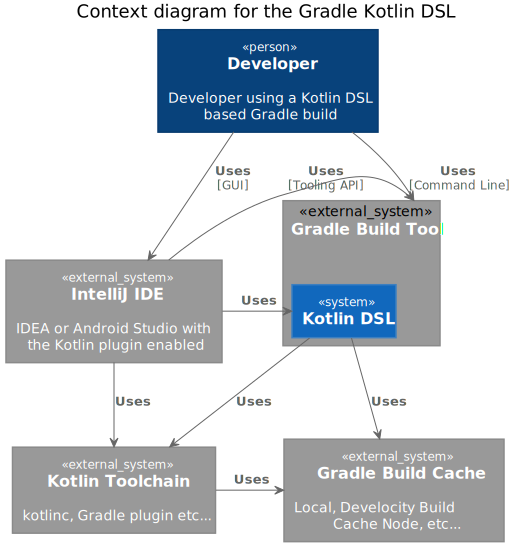
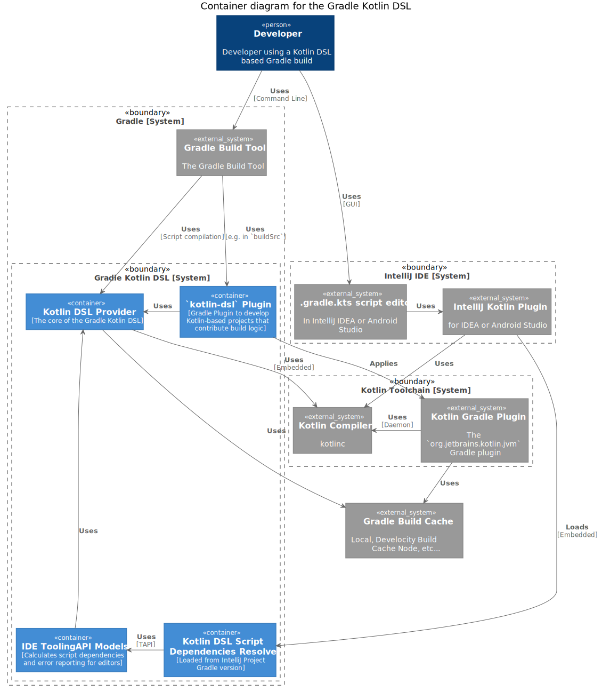
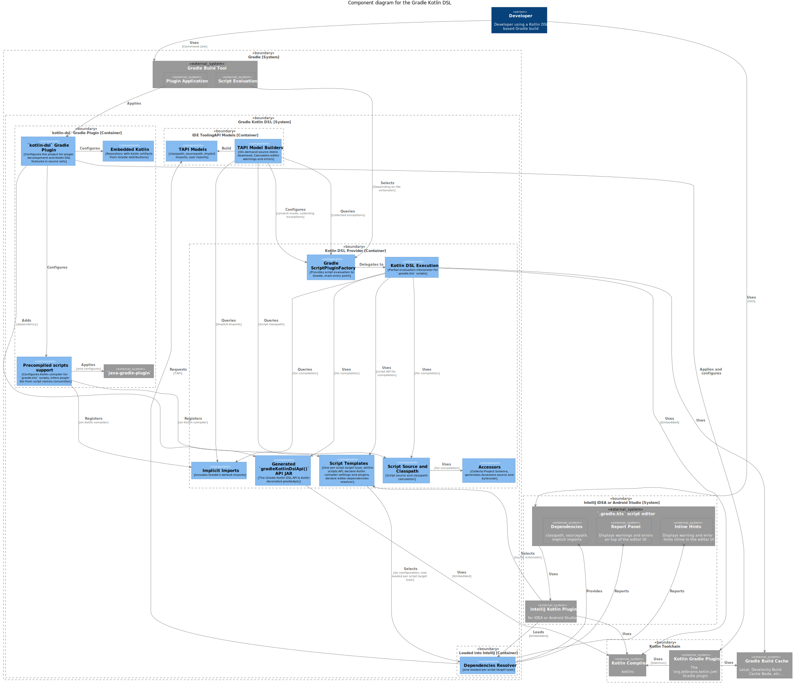

# Gradle Kotlin DSL C4 Model

Core link:https://c4model.com/#coreDiagrams[C4 Model] diagrams for the Gradle Kotlin DSL.

[NOTE]
====
The optional 4th level, UML diagrams, isn't provided, favoring the source code and inspection tools.
====

## Level 1: System Context diagram

A developer uses the Gradle Kotlin DSL either via Gradle directly or in an IDE that uses the Kotlin DSL support via Gradle.
The Kotlin DSL is embedded into the Gradle Build Tool and, just like the IDE, makes use of the Kotlin toolchain.
Both the Kotlin DSL and the Kotlin toolchain leverage the Gradle Build Cache.

## Level 2: Container diagram

When used for the compilation of scripts of a Gradle build, the Kotlin DSL Provider compiles scripts using an embedded Kotlin compiler.

When used for the compilation of Kotlin source sets, e.g. in `buildSrc`, the `kotlin-dsl` plugin provide Kotlin DSL features to source sets and compiles Kotlin code using the Kotlin Gradle Plugin.

When used for build script editing, a Kotlin DSL enabled IDE editor loads the Kotlin DSL support from its configured Gradle version and uses it to resolve script dependencies. The Kotlin DSL Script Dependencies Resolver uses the Gradle Tooling API to build the script dependencies model that enables the IDE editor features.

## Level 3: Component diagram

The following diagram detail each container components and gets closer to how the Kotlin DSL is organized.
It should be useful enough to know where to find what in the Kotlin DSL source code.

[NOTE]
This diagram diverges from the C4 Model because the scope is the whole Kotlin DSL system instead of having one diagram per container".
This makes this diagram quite large but it shows how everything fits together and is simpler to maintain.
