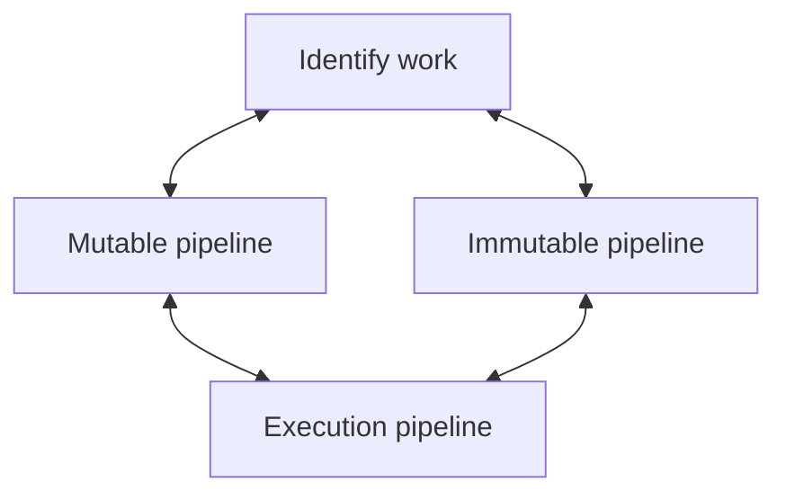
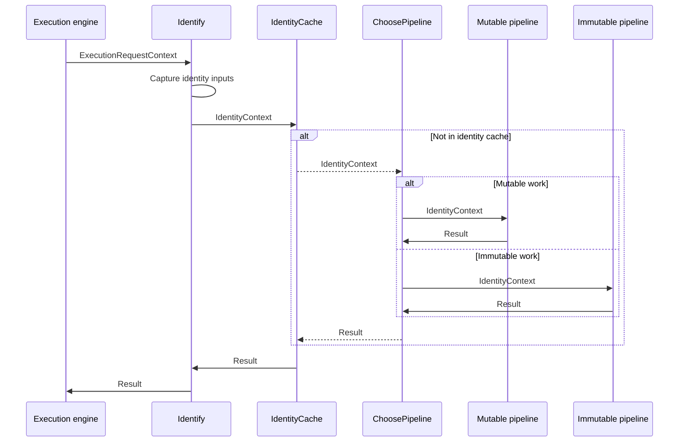
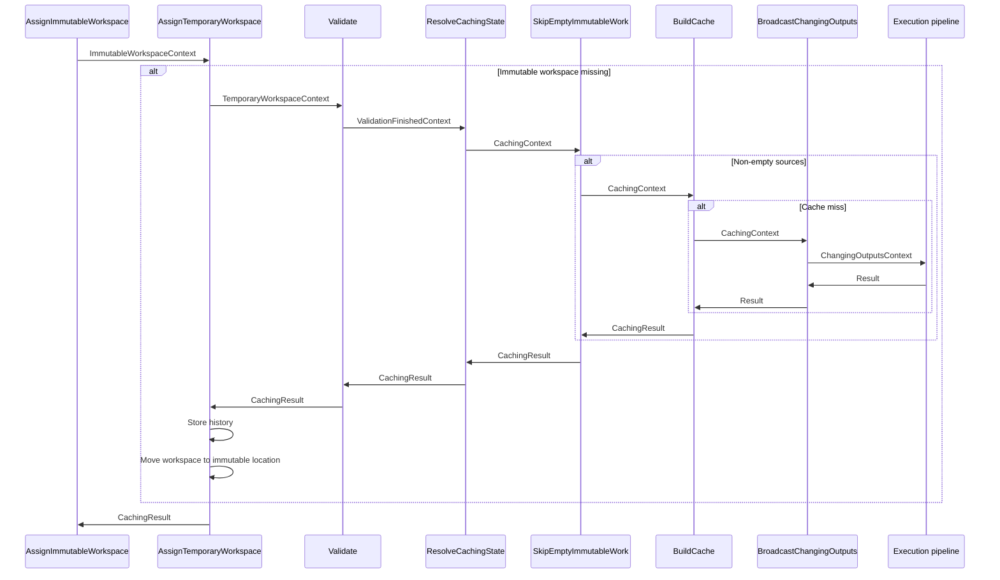
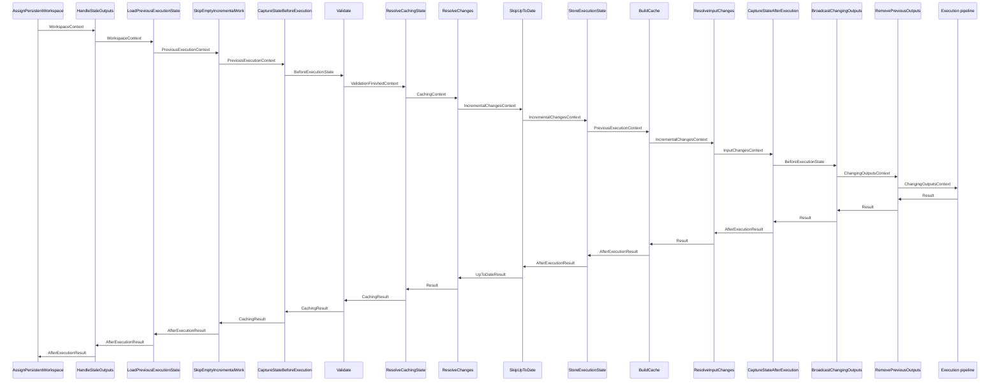

```mermaid
flowchart TD
  Identify[Identify work] <--> MutablePipeline[Mutable pipeline]
  Identify <--> ImmutablePipeline[Immutable pipeline]
  MutablePipeline <--> Execution[Execution pipeline]
  ImmutablePipeline <--> Execution
```

## Identification of the work

```mermaid
sequenceDiagram
  Execution engine ->> Identify: ExecutionRequestContext
    Identify -> Identify: Capture identity inputs
    Identify ->> IdentityCache: IdentityContext
    alt Not in identity cache
      IdentityCache -->> ChoosePipeline: IdentityContext
      alt Mutable work
        ChoosePipeline ->> Mutable pipeline: IdentityContext
        Mutable pipeline ->> ChoosePipeline: Result
      else Immutable work
        ChoosePipeline ->> Immutable pipeline: IdentityContext
        Immutable pipeline ->> ChoosePipeline: Result
      end
      ChoosePipeline -->> IdentityCache: Result
    end
    IdentityCache ->> Identify: Result
  Identify ->> Execution engine: Result
```

## Immutable pipeline

```mermaid
sequenceDiagram
  AssignImmutableWorkspace ->> AssignTemporaryWorkspace: ImmutableWorkspaceContext
  alt Immutable workspace missing
    AssignTemporaryWorkspace ->> Validate: TemporaryWorkspaceContext
      Validate ->> ResolveCachingState: ValidationFinishedContext
        ResolveCachingState ->> SkipEmptyImmutableWork: CachingContext
        alt Non-empty sources
          SkipEmptyImmutableWork ->> BuildCache: CachingContext
          alt Cache miss
            BuildCache ->> BroadcastChangingOutputs: CachingContext
              BroadcastChangingOutputs ->> Execution pipeline: ChangingOutputsContext
              Execution pipeline ->> BroadcastChangingOutputs: Result
            BroadcastChangingOutputs ->> BuildCache: Result
          end
          BuildCache ->> SkipEmptyImmutableWork: CachingResult
        end
        SkipEmptyImmutableWork ->> ResolveCachingState: CachingResult
      ResolveCachingState ->> Validate: CachingResult
    Validate ->> AssignTemporaryWorkspace: CachingResult
    AssignTemporaryWorkspace ->> AssignTemporaryWorkspace: Store history
    AssignTemporaryWorkspace ->> AssignTemporaryWorkspace: Move workspace to immutable location
  end
  AssignTemporaryWorkspace ->> AssignImmutableWorkspace: CachingResult
```

## Mutable pipeline

```mermaid
sequenceDiagram

  AssignPersistentWorkspace ->> HandleStaleOutputs: WorkspaceContext
    HandleStaleOutputs ->> LoadPreviousExecutionState: WorkspaceContext
      LoadPreviousExecutionState ->> SkipEmptyIncrementalWork: PreviousExecutionContext
        SkipEmptyIncrementalWork ->> CaptureStateBeforeExecution: PreviousExecutionContext
          CaptureStateBeforeExecution ->> Validate: BeforeExecutionState
            Validate ->> ResolveCachingState: ValidationFinishedContext
              ResolveCachingState ->> ResolveChanges: CachingContext
                ResolveChanges ->> SkipUpToDate: IncrementalChangesContext
                  SkipUpToDate ->> StoreExecutionState: IncrementalChangesContext
                    StoreExecutionState ->> BuildCache: PreviousExecutionContext
                      BuildCache ->> ResolveInputChanges: IncrementalChangesContext
                        ResolveInputChanges ->> CaptureStateAfterExecution: InputChangesContext
                          CaptureStateAfterExecution ->> BroadcastChangingOutputs: BeforeExecutionState
                            BroadcastChangingOutputs ->> RemovePreviousOutputs: ChangingOutputsContext
                              RemovePreviousOutputs ->> Execution pipeline: ChangingOutputsContext
                              Execution pipeline ->> RemovePreviousOutputs: Result
                            RemovePreviousOutputs ->> BroadcastChangingOutputs: Result
                          BroadcastChangingOutputs ->> CaptureStateAfterExecution: Result
                        CaptureStateAfterExecution ->> ResolveInputChanges: AfterExecutionResult
                      ResolveInputChanges ->> BuildCache: Result
                    BuildCache ->> StoreExecutionState: AfterExecutionResult
                  StoreExecutionState ->> SkipUpToDate: AfterExecutionResult
                SkipUpToDate ->> ResolveChanges: UpToDateResult
              ResolveChanges ->> ResolveCachingState: Result
            ResolveCachingState ->> Validate: CachingResult
          Validate ->> CaptureStateBeforeExecution: CachingResult
        CaptureStateBeforeExecution ->> SkipEmptyIncrementalWork: CachingResult
      SkipEmptyIncrementalWork ->> LoadPreviousExecutionState: AfterExecutionResult
    LoadPreviousExecutionState ->> HandleStaleOutputs: AfterExecutionResult
  HandleStaleOutputs ->> AssignPersistentWorkspace: AfterExecutionResult
```
