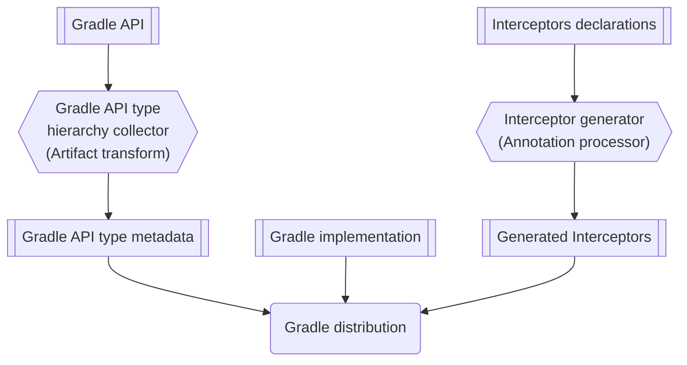
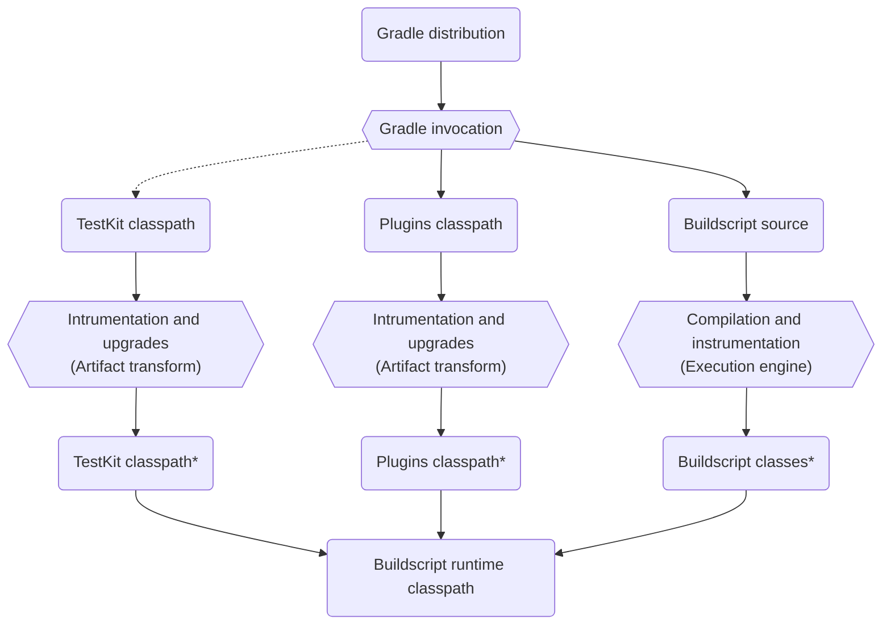
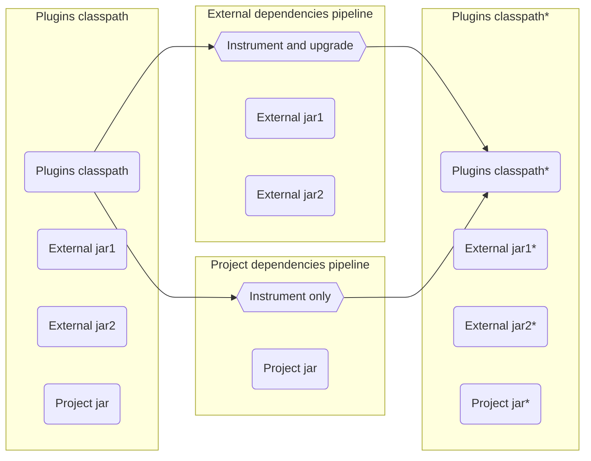
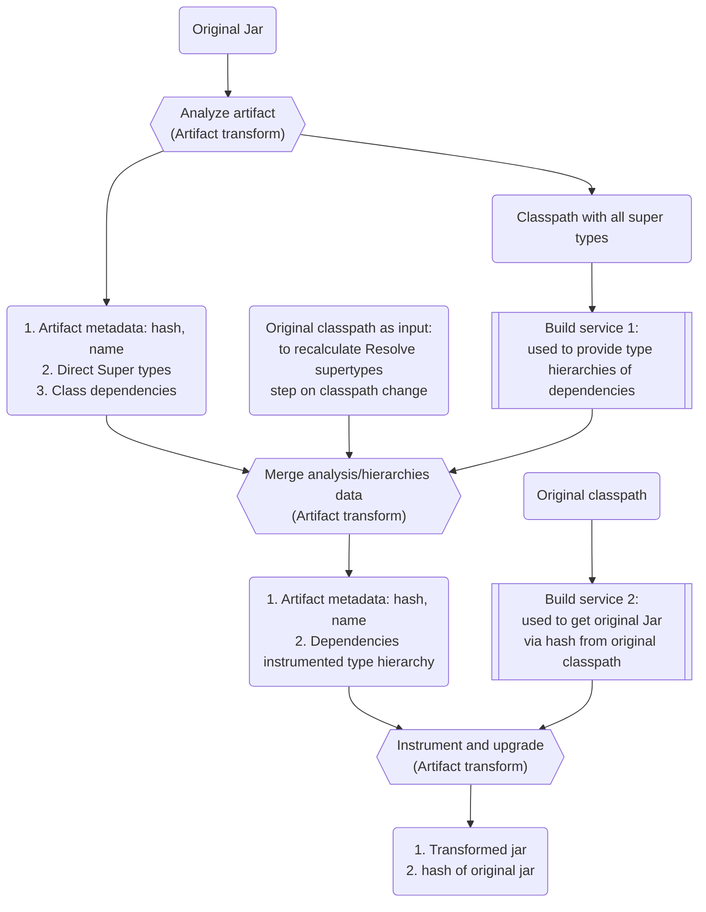
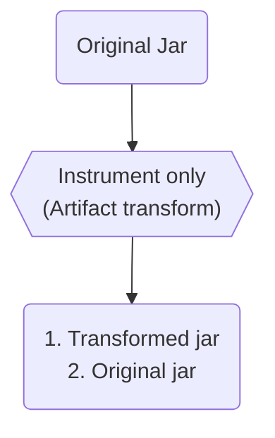
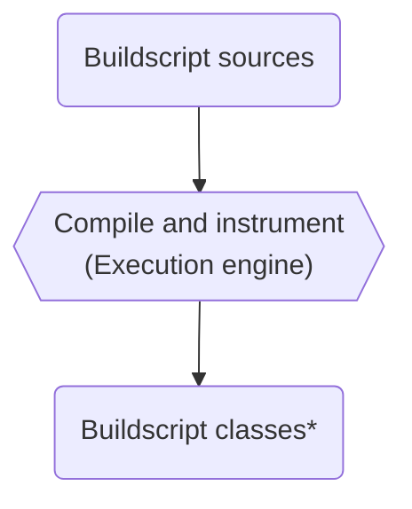
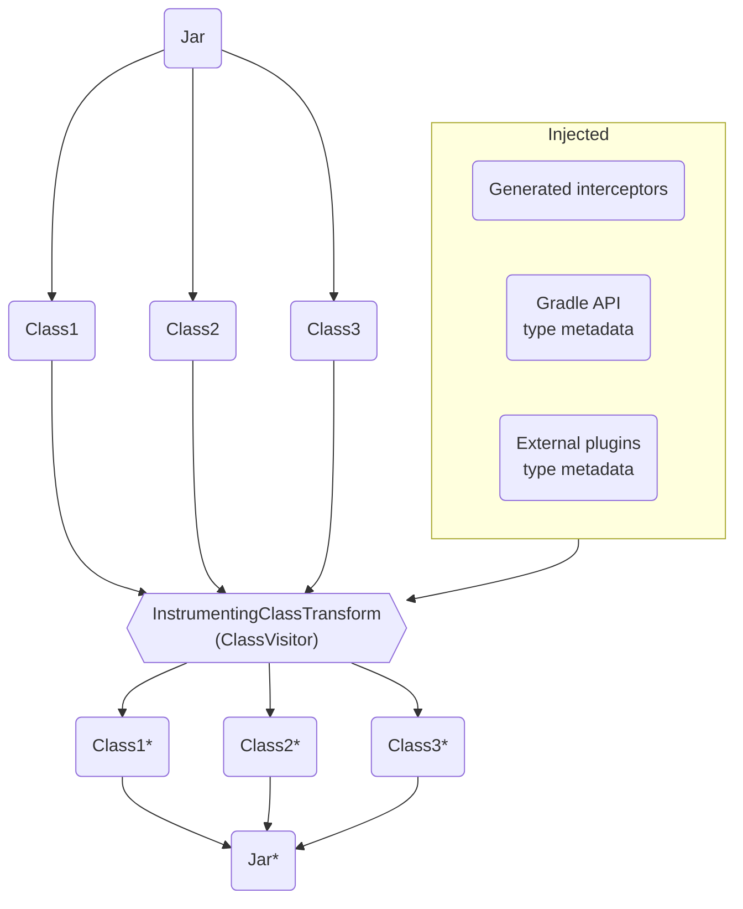

# Bytecode interception infrastructure: Instrumentation and bytecode upgrades


## Abstract

This README describes the current state of bytecode interception infrastructure, used for configuration cache instrumentation and bytecode upgrades for property migration.


## Naming

The naming is hard.
That is the case also for this infrastructure.
In next section we will use next terms:
1. We will use `bytecode instrumentation` when we talk about configuration cache bytecode instrumentation.
2. We will use `bytecode upgrades` when we talk about Property or API upgrades.
3. We will use `bytecode interception` when we talk about both bytecode instrumentation or bytecode upgrades.
4. We will use `transformation` when we talk about applying some interception to to jars or classes or classpath.

It is possible that in the code we use all these terms interchangeably, but we will try to be consistent in this document.


## Background

With the introduction of configuration cache we got a requirement to track user inputs for the configuration phase. 
Inputs could be environment variables, files, system properties and so on. 
These inputs are often read via an API that Gradle doesn’t control, e.g. Java API via `System.getenv()`.

So to track these inputs we had to find a way to track when they are accessed by intercepting API calls reading them. 
And that is why we started instrumenting bytecode.

Later, with a requirement to migrate Gradle core APIs to lazy properties, we were looking at how we could make old plugins compatible with new Gradle core APIs. 
We decided that upgrading old compiled bytecode would work well. 
And reusing configuration cache bytecode instrumentation infrastructure seemed like a good idea.

So configuration cache instrumentation and API upgrades are using the same infrastructure now, called bytecode interception infrastructure.


## Functional design

Let's look at how bytecode interception works on an example of upgrading a JavaBean property to a lazy one.
Configuration cache instrumentation works in the same way.

Imagine we have in Gradle core a task:
```java
abstract class JavaCompile {
    
    private String sourceCompatibility = null;
    
    @Input
    public String getSourceCompatibility() {
        return sourceCompatibility;
    }
    
    public void setSourceCompatibility(String sourceCompatibility) {
        this.sourceCompatibility = sourceCompatibility;
    }
} 
```
and we want to change it to:

```java
abstract class JavaCompile {
    @Input
    public Property<String> getSourceCompatibility();
} 
```

To make old plugins compatible we need to replace all the usages of old JavaCompile with the new one.

Let’s say it’s used in a plugin as:

```java
public void applyPlugin(Project project) {
     project.tasks.named("compileJava", JavaCompile.class, task -> {
         task.setSourceCompatibility("1.8");
     });
}
```

We will then replace all such usages with interception code:
```java
public void applyPlugin(Project project) {
     project.tasks.named("compileJava", JavaCompile.class, task -> {
	    JavaCompileInterceptorsDeclaration.intercept_setSourceCompatibility(task, "1.8");
     });
}
```

Where `JavaCompileInterceptorsDeclaration` is a class defined by a Gradle developer to replace the original logic, and the replacement is done by rewriting the bytecode of plugin jars and dependencies.

Due to that bytecode interception is split into two big parts:
1. Gradle distribution build time: Interceptor code generation and Gradle API type metadata collection
2. Gradle runtime: Actual bytecode replacement 

`JavaCompileInterceptorsDeclaration` is defined by Gradle developer and with help of annotation processor Gradle then generates bytecode replacements. 
The actual replacement happens when the user runs his Gradle build.

**_Note: Dynamic Groovy interception uses the same mechanism but replacements are a bit more complicated due to the dynamic nature of Groovy. 
And due to that build logic is also intercepted when code is run and not just on the bytecode level._**

Next sections will explain more in detail how we can define interceptors and how the code is then replaced.


### Gradle Distribution Build Time

At Gradle Distribution Build time we have two major parts:
1. We generate interceptors from the annotations declared in the source code 
2. We collect Gradle API type hierarchy

The first one is important for both configuration cache instrumentation and API upgrades while the second one is used just for API upgrades. 
Collecting the Gradle API type hierarchy is fully automatic, while declaring interceptors have to be done by Gradle developers. 



#### Declaring interceptors and generating interceptors

##### Annotation processor

Annotation processor is implemented as Java annotation processor in [platforms/core-runtime/internal-instrumentation-processor](./internal-instrumentation-processor) and its API (annotations) are defined in the [platforms/core-runtime/internal-instrumentation-api](./internal-instrumentation-api). 
This annotation processor transforms interceptor declarations defined by Gradle developers to interceptors that modify Jvm bytecode.

**Note:** Since this is a Java annotation processor all declarations have to be defined as Java classes, so interceptor declarations in Kotlin or Groovy are not supported.


##### Using the Annotation processor

Before you can define interceptors you have to add an annotation processor and instrumentation API to your project. 
You can do that manually by apply next plugin to your **build.gradle.kts**:
```kotlin
plugins {
    id("gradebuild.instrumented-project")
}
```

This will set up the annotation processor and all required compile time dependencies. 
See the definition of a plugin: [gradlebuild.instrumented-project.gradle.kts](../../build-logic/uber-plugins/src/main/kotlin/gradlebuild.instrumented-project.gradle.kts).


##### Manual Interceptor declaration

We can implement interceptor declaration manually as shown below. 
These declarations are then read by the annotation processor and a bytecode interceptor is generated.

```java
@SpecificJvmCallInterceptors( // <1>
 generatedClassName = JVM_BYTECODE_GENERATED_CLASS_NAME_FOR_CONFIG_CACHE, // <2>
 type = INSTRUMENTATION // <3>
)
@SpecificGroovyCallInterceptors(
 generatedClassName = GROOVY_INTERCEPTORS_GENERATED_CLASS_NAME_FOR_CONFIG_CACHE,
 type = INSTRUMENTATION
)
public class JavaCompileInterceptorsDeclaration {
    @InterceptCalls // <4>
    @InstanceMethod
    public static void /* <5> */ intercept_setSourceCompatibility(
        @Receiver JavaCompile javaCompile, // <6>
        String sourceCompatibility // <7>
    ) {
        javaCompile.getSourceCompatibility().set(sourceCompatibility); <8>
    }
}
```
1. **Declaration definition annotation** defines a class as interceptor declaration
2. **GeneratedClassName** that will be used to generate bytecode instrumentation, this should not collide between projects
3. **Type of interception**: Either BYTECODE_UPGRADE for property upgrades or INSTRUMENTATION for cc instrumentation: we want to use only instrumentation interceptors in some cases and that is why you need to define a type
4. **Annotations to define interception type**, like if this is an instance or static method, if we should intercept Groovy or just Java etc.
5. **Return type **of original call
6. **The receiver** of original call
7. **Parameters** of original call
8. **Logic** with call interception logic or logic that translates the new type to the old type

This JavaCompileInterceptorsDeclaration will then generate interceptors in **org.gradle.internal.classpath.generated** package.

For Java:
```java
public class InterceptorDeclaration_JvmBytecodeCallInterceptor 
       extends MethodVisitorScope implements JvmBytecodeCallInterceptor {

     // Skipped fields and constructor for brevity
    @Override
    public boolean visitMethodInsn(String className, int opcode, String owner, String name,
            String descriptor, boolean isInterface, Supplier<MethodNode> readMethodNode) {
        if (owner.equals("org/gradle/api/tasks/compile/JavaCompile")) {
            if (name.equals("setSourceCompatibility") 
                    && descriptor.equals("(Ljava/lang/String;)V") 
                    && opcode == Opcodes.INVOKESPECIAL) {
                 // Skip some bytecode for brevity
                _INVOKESTATIC("JavaCompileInterceptorsDeclaration", "intercept_setSourceCompatibility", "(Lorg/gradle/api/tasks/compile/JavaCompile;Ljava/lang/String;)V");
                return true;
            }
       }
    }
}
```

For dynamic Groovy:
```java
public static class SetSourceCompatibilityCallInterceptor extends CallInterceptor {
    public SetSourceCompatibilityCallInterceptor() {
        super(InterceptScope.methodsNamed("setSourceCompatibility"));
    }

    @Override
    public Object intercept(Invocation invocation, String consumer) throws Throwable {
        Object receiver = invocation.getReceiver();
        if (receiver instanceof JavaCompile) {
            File receiverTyped = (JavaCompile) receiver;
            if (invocation.getArgsCount() == 1) {
                return JavaCompileInterceptorsDeclaration.intercept_setSourceCompatibility(
                        receiverTyped, 
                        (String) invocation.getArgument(0)
                );
            }
        }
        return invocation.callOriginal();
    }
}
```


These two classes are then used when we replace bytecode for Java and when we intercept calls at runtime for dynamic Groovy.

For configuration cache instrumentation we use only manual interceptor declaration, while for property upgrades using manual interceptors should be an exception. 
Some examples for configuration cache instrumentation can be found in **org.gradle.internal.classpath.declarations** package, e.g. [FileInterceptorsDeclaration.java](../../subprojects/core/src/main/java/org/gradle/internal/classpath/declarations/FileInterceptorsDeclaration.java).


##### Property bytecode upgrades declaration

For the purpose of property bytecode upgrades we simplified the whole process and implemented another layer above manual interceptor declaration. 
For bytecode upgrades you can then use just [@ReplacesEagerProperty](./internal-instrumentation-api/src/main/java/org/gradle/internal/instrumentation/api/annotations/ReplacesEagerProperty.java#L29) annotation that does a lot of work for you.

With this annotation we can simplify interception of source compatibility by using just:
```java
abstract class JavaCompile {
    @Input
    @ReplacesEagerProperty
    public Property<String> getSourceCompatibility();
} 
```


That will automatically generate a class similar to the one we defined in [Manual Interceptor declaration](#manual-interceptor-declaration).


### Gradle runtime

When a user runs a Gradle build Gradle it uses transformed plugin jars. 
The whole transformation process normally happens on the first use of a build or when a plugin jar is added to the build script classpath.
We transform the jar and cache transformed jars for future use.

We transform plugins classpath, TestKit classpath and buildscript classes separately. 
Plugins classpath, TestKit classpath are transformed via Artifact transform, base logic is implemented in [BaseInstrumentingArtifactTransform.java](https://github.com/gradle/gradle/blob/master/subprojects/core/src/main/java/org/gradle/api/internal/initialization/transform/BaseInstrumentingArtifactTransform.java). 
Buildscript classes for Kotlin and Groovy are transformed via execution engine when they are compiled, base logic is in [BuildScriptCompileUnitOfWork.java](https://github.com/gradle/gradle/blob/master/subprojects/core/src/main/java/org/gradle/internal/scripts/BuildScriptCompileUnitOfWork.java). 
The execution engine handles all the caching.




#### Transformation of plugins classpath

The transformation of plugins classpath is done with Artifact transforms. 
The code that does all the transforms can be found in the [DefaultScriptClassPathResolver.java](https://github.com/gradle/gradle/blob/18d4dbb606a3be8a7c3f3d6120b1c2a5e7d64f53/subprojects/core/src/main/java/org/gradle/api/internal/initialization/DefaultScriptClassPathResolver.java#L75-L120). 
We have a separate pipeline for project dependencies and external dependencies as shown in the flowchart below. 

We have different pipelines since project dependencies are only instrumented, while external dependencies are instrumented and upgraded.




External dependencies are instrumented and upgraded in three steps:
1. We analyze the type hierarchy and class dependencies for every artifact
2. We merge analysis data and produce dependencies and its super types
3. We instrument and upgrade jars with interceptors

The flowchart below shows detailed view of the external dependencies pipeline:


The analysis of type hierarchy and class dependencies is important for API upgrades, since classes can extend one another. 
E.g. users can define MyJavaCompile extends JavaCompile, and to intercept MyJavaCompile we need to know the whole class hierarchy.

The project dependencies (e.g. buildSrc, included plugins) are only instrumented in one step:
1. We instrument jars with interceptors

See the flowchart below for project dependencies pipeline:


For project dependencies we don’t need any API upgrade since project dependencies are always compiled with the same Gradle version. 


#### Transformation of TestKit classpath overview

TestKit classpath gets injected via [DefaultInjectedClasspathPluginResolver.java](https://github.com/gradle/gradle/blob/18d4dbb606a3be8a7c3f3d6120b1c2a5e7d64f53/platforms/extensibility/plugin-use/src/main/java/org/gradle/plugin/use/resolve/service/internal/DefaultInjectedClasspathPluginResolver.java#L38). 
This classpath is separated from the plugins classpath defined in build script. 
But we reuse the same mechanism as described in [Transformation of plugins classpath](#transformation-of-plugins-classpath) by reusing [DefaultScriptClassPathResolver](https://github.com/gradle/gradle/blob/18d4dbb606a3be8a7c3f3d6120b1c2a5e7d64f53/subprojects/core/src/main/java/org/gradle/api/internal/initialization/DefaultScriptClassPathResolver.java#L75-L120).

The main difference here is, that all dependencies are files, so we cannot do any smart resolution, all files on the classpath are treated as third party dependencies.


#### Transformation of build scripts overview

Transformation of build scripts is relatively simple and happens in the same execution unit of work as compilation.



#### Closer look at transformation of an individual Jars or class directories

Transformation is done by modifying the bytecode of the plugin's jar or class directory. 
This is true for configuration cache instrumentation and for the API bytecode upgrades.

We transform every class of a jar with the ASM ClassVisitor. 
The main class with the class level instrumentation logic is [InstrumentingClassTransform.java](https://github.com/gradle/gradle/blob/master/subprojects/core/src/main/java/org/gradle/internal/classpath/transforms/InstrumentingClassTransform.java). 
This class then:
1. Discovers all interceptors via Java SPI by calling methods on [CallInterceptorRegistry.java](https://github.com/gradle/gradle/blob/903bd5ceebe212429a7c127704bf4779a7e1385d/subprojects/core/src/main/java/org/gradle/internal/classpath/intercept/CallInterceptorRegistry.java#L30)
2. Gets injected Gradle API type metadata and external plugins type metadata
3. Visit a class and modifies a bytecode using loaded interceptors

Interceptors are generated at Gradle build time and are packed into the distribution as described in [Gradle Distribution Build Time](#gradle-distribution-build-time).

For jar visiting we use different implementations of [ClasspathElementTransform](https://github.com/gradle/gradle/blob/master/subprojects/core/src/main/java/org/gradle/internal/classpath/transforms/ClasspathElementTransform.java) interface.

Illustration of Jar instrumentation is shown below.



#### Dynamic Groovy interception

Dynamic Groovy interception is a bit more complicated than Java interception, since types are resolved dynamically.
Due to that interception happens in two stages:
1. Bytecode transformation
2. Runtime interception

Bytecode transformation is done in the same way as for Java, but we intercept special call like `CallSiteArray.$createCallSiteArray` or `IndyInterface.bootstrap()`.
Additionally, to that we also transform `ScriptBytecodeAdapter`, see [GroovyDynamicDispatchInterceptors.java](../../subprojects/core/src/main/java/org/gradle/internal/classpath/declarations/GroovyDynamicDispatchInterceptors.java),
and all `doCall` methods, see [CallInterceptionClosureInstrumentingClassVisitor.java](../../subprojects/core/src/main/java/org/gradle/internal/classpath/CallInterceptionClosureInstrumentingClassVisitor.java) where we intercept code in closures.

These methods are then decorated and modified in a way that our generated dynamic Groovy interceptors are then correctly called for appropriate methods/properties at runtime.
Interceptor that are called at runtime then check for the correct type and based on that invoke decorated method or fallback to original.

Since we have to intercept many different methods for dynamic Groovy, implementation is much more complicated than interception for Java or Kotlin.

