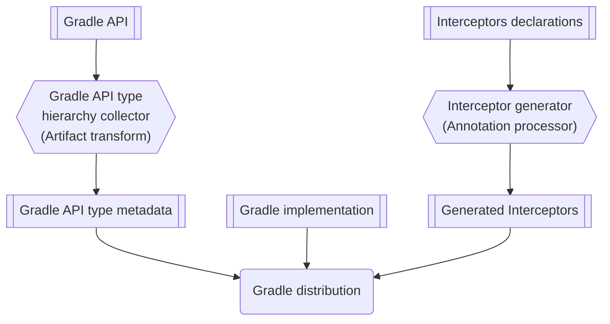
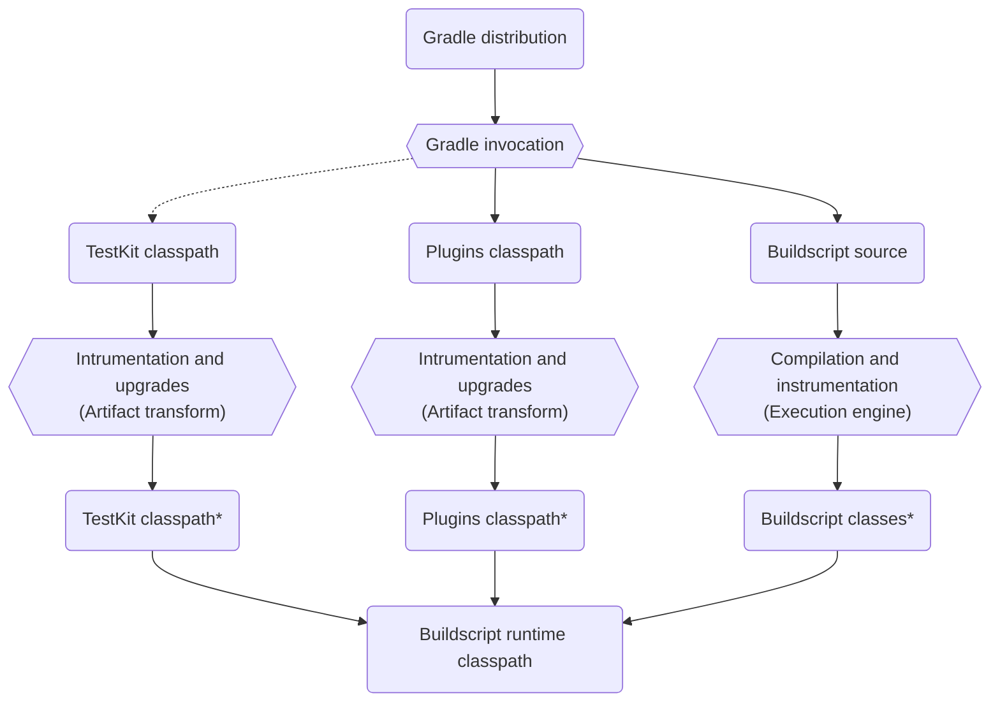
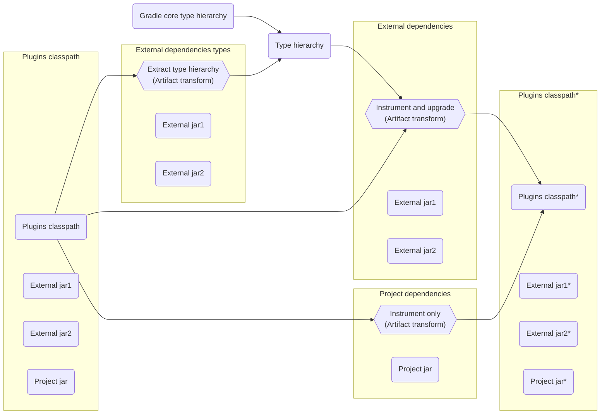
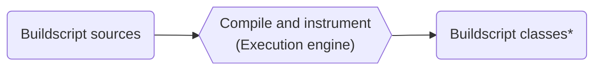
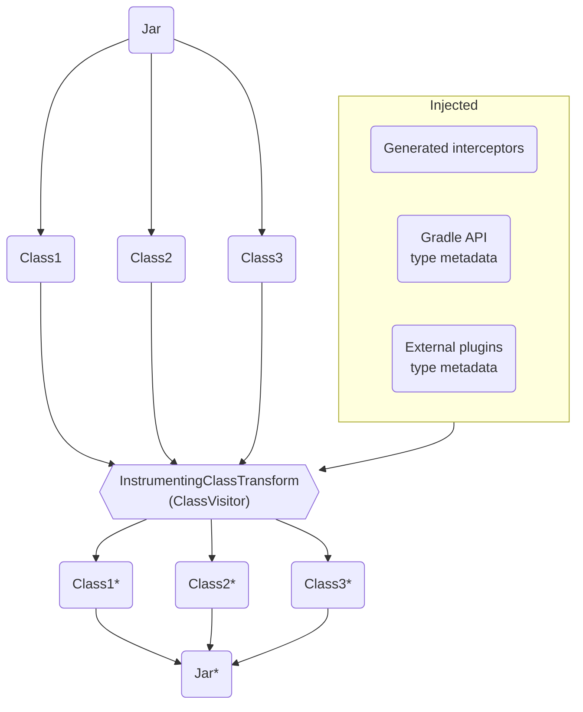

# Specification: Instrumentation and bytecode upgrades infrastructure


## Abstract

This document describes the instrumentation and bytecode infrastructure used for configuration cache instrumentation and byte code upgrades used for property migration.


## Background

With the introduction of configuration cache we got a requirement to track user inputs for the configuration phase. Inputs could be environment variables, files, system properties and so on. These inputs are often read via an API that Gradle doesn’t control, e.g. Java API via System.getenv().  \
\
So to track these inputs we had to find a way to track these usages. And that is why we started instrumenting bytecode.

\
With a requirement to migrate Gradle core APIs to lazy properties, we were looking at how we could make old plugins compatible with new Gradle core APIs. We decided that upgrading old compiled bytecode would work well. And configuration cache bytecode instrumentation seemed like a good tool to reuse.


## Why

This is important to provide bytecode compatibility of old plugins with the new Gradle version. This affects mostly Software developer persona, since old plugins won’t break their build but will keep working with new Gradle lazy property APIs.


## Functional design

Imagine we have in Gradle core a task:


```
abstract class JavaCompile {
    
    private String sourceCompatibility = null;
    
    @Input
    public String getSourceCompatibility() {
        return sourceCompatibility;
    }
    
    public void setSourceCompatibility(String sourceCompatibility) {
        this.sourceCompatibility = sourceCompatibility;
    }
} 
```


\
and we want to change it to:


```
abstract class JavaCompile {
    @Input
    public Property<String> getSourceCompatibility();
} 
```


To make old plugins compatible we need to replace all the usages of old JavaCompile with the new one.

Let’s say it’s used in a plugin as: \


```
fun applyPlugin(project: Project) {
     project.tasks.named("compileJava", JavaCompile.class, task -> {
	  task.setSourceCompatibility("1.8");
     });
}
```


We will then replace all such usages with bytecode instrumentation with:


```
fun applyPlugin(project: Project) {
     project.tasks.named("compileJava", JavaCompile.class, task -> {
	    JavaCompileInterceptorsDeclaration.intercept_setSourceCompatibility(task, "1.8");
     });
}
```


Where JavaCompileInterceptorsDeclaration is a class defined by Gradle developer to replace original logic and the replacement is done via bytecode instrumentation of plugin jars and dependencies.  \
\
Due to that Instrumentation and bytecode upgrades is split into two big parts:


1. Gradle distribution build time: Interceptor code generation and Gradle API type metadata collection
2. Gradle runtime: Actual bytecode instrumentation

JavaCompileInterceptorsDeclaration is defined by Gradle developer and with help of annotation processor Gradle then generates bytecode replacements. The actual replacement happens when the user runs his Gradle build.

**_Note: Groovy interception uses the same mechanism but replacements are a bit more complicated due to the dynamic nature of Groovy, and due to that build logic is also intercepted when code is run and not just on the bytecode level._**

Next sections will explain more in detail how we can define interceptors and how the code is then replaced.


### Gradle Distribution Build Time

At Gradle Distribution Build time we have two major parts:


1. Declaring interceptors and generating interceptors
2. Collecting Gradle API type hierarchy


The first one is important for both configuration cache instrumentation and API upgrades while the second one is used just for API upgrades. 
Collecting the Gradle API type hierarchy is fully automatic, while declaring interceptors have to be done by Gradle developers. 




#### Declaring interceptors and generating interceptors


##### Annotation processor

Annotation processor is implemented as Java annotation processor in [platforms/core-runtime/internal-instrumentation-processor](https://github.com/gradle/gradle/tree/master/platforms/core-runtime/internal-instrumentation-processor) and its API (annotations) are defined in the [platforms/core-runtime/internal-instrumentation-api](https://github.com/gradle/gradle/tree/master/platforms/core-runtime/internal-instrumentation-api). This annotation processor transforms interceptor declarations defined by Gradle developers to interceptors that modify Jvm bytecode.  \
\
Since this is a Java annotation processor all declarations have to be defined as Java classes, so interceptor declarations in Kotlin or Groovy are not supported.


##### Using the Annotation processor

Before you can define interceptors you have to add an annotation processor and instrumentation API to your project. You can do that manually by apply next plugin to your **build.gradle.kts**: \


```
plugins {
    id("gradebuild.instrumented-project")
}
```


This will set up the annotation processor and all required compile time dependencies. See the definition of a plugin: [gradlebuild.instrumented-project.gradle.kts](https://github.com/gradle/gradle/blob/master/build-logic/uber-plugins/src/main/kotlin/gradlebuild.instrumented-project.gradle.kts).


##### Manual Interceptor declaration

We can implement interceptor declaration manually as shown below. These declarations are then read by the annotation processor and a bytecode interceptor is generated. \


```
@SpecificJvmCallInterceptors( <1>
 generatedClassName = JVM_BYTECODE_GENERATED_CLASS_NAME_FOR_CONFIG_CACHE, <2>
 type = INSTRUMENTATION <3>
)
@SpecificGroovyCallInterceptors(
 generatedClassName = GROOVY_INTERCEPTORS_GENERATED_CLASS_NAME_FOR_CONFIG_CACHE,
 type = INSTRUMENTATION
)
public class JavaCompileInterceptorsDeclaration {
    @InterceptCalls <4>
    @InstanceMethod
    public static void <5> intercept_setSourceCompatibility(
        @Receiver JavaCompile javaCompile, <6>
        String sourceCompatibility <7>
    ) {
        javaCompile.getSourceCompatibility().set(sourceCompatibility); <8>
    }
}
```


1. **Declaration definition annotation** defines a class as interceptor declaration
2. **GeneratedClassName** that will be used to generate bytecode instrumentation, this should not collide between projects
3. **Type of interception**: Either BYTECODE_UPGRADE for property upgrades or INSTRUMENTATION for cc instrumentation: we want to use only instrumentation interceptors in some cases and that is why you need to define a type
4. **Annotations to define interception type**, like if this is an instance or static method, if we should intercept Groovy or just Java etc.
5. **Return type **of original call
6. **The receiver** of original call
7. **Parameters** of original call
8. **Logic** with call interception logic or logic that translates the new type to the old type

This JavaCompileInterceptorsDeclaration will then generate interceptors in **org.gradle.internal.classpath.generated** package. \
\
For Java:


```
public class InterceptorDeclaration_JvmBytecodeCallInterceptor 
       extends MethodVisitorScope implements JvmBytecodeCallInterceptor {

     // Skipped fields and constructor for brevity
    @Override
    public boolean visitMethodInsn(String className, int opcode, String owner, String name,
            String descriptor, boolean isInterface, Supplier<MethodNode> readMethodNode) {
        if (owner.equals("org/gradle/api/tasks/compile/JavaCompile")) {
            if (name.equals("setSourceCompatibility") 
                    && descriptor.equals("(Ljava/lang/String;)V") 
                    && opcode == Opcodes.INVOKESPECIAL) {
                 // Skip some bytecode for brevity
                _INVOKESTATIC("JavaCompileInterceptorsDeclaration", "intercept_setSourceCompatibility", "(Lorg/gradle/api/tasks/compile/JavaCompile;Ljava/lang/String;)V");
                return true;
            }
       }
    }
}
```


\
For Groovy:


```
public static class SetSourceCompatibilityCallInterceptor extends CallInterceptor {
    public SetSourceCompatibilityCallInterceptor() {
        super(InterceptScope.methodsNamed("setSourceCompatibility"));
    }

    @Override
    public Object doIntercept(Invocation invocation, String consumer) throws Throwable {
        Object receiver = invocation.getReceiver();
        if (receiver instanceof JavaCompile) {
            File receiverTyped = (JavaCompile) receiver;
            if (invocation.getArgsCount() == 1) {
                return JavaCompileInterceptorsDeclaration.intercept_setSourceCompatibility(
                        receiverTyped, 
                        (String) invocation.getArgument(0)
                );
            }
        }
        return invocation.callOriginal();
    }
}
```


These two classes are then used when we instrument bytecode for Java and when we intercept calls at runtime for Groovy.

\
For configuration cache instrumentation we use only manual interceptor declaration, while for property upgrades for using manual interceptors should be an exception. Some examples for configuration cache instrumentation can be found in **org.gradle.internal.classpath.declarations **package, e.g. [FileInterceptorsDeclaration.java](https://github.com/gradle/gradle/blob/master/subprojects/core/src/main/java/org/gradle/internal/classpath/declarations/FileInterceptorsDeclaration.java).


##### Property bytecode upgrade interceptor declaration

For the purpose of property bytecode upgrades we simplified the whole process and implemented another layer above manual interceptor declaration. For bytecode upgrades you can then use just [@UpgradedProperty](https://github.com/gradle/gradle/blob/035803bc59b32422be5ff958c64cddbd439bbf89/platforms/core-runtime/internal-instrumentation-api/src/main/java/org/gradle/internal/instrumentation/api/annotations/UpgradedProperty.java#L29) annotation that does a lot of work for you. \
\
With this property we can simplify instrumentation of source compatibility by using just: \


```
abstract class JavaCompile {
    @Input
    @UpgradedProperty
    public Property<String> getSourceCompatibility();
} 
```


And that will automatically generate a class similar to the one we defined in

<p id="gdcalert2" ><span style="color: red; font-weight: bold">>>>>>  gd2md-html alert: undefined internal link (link text: "Manual Interceptor declaration"). Did you generate a TOC with blue links? </span><br>(<a href="#">Back to top</a>)(<a href="#gdcalert3">Next alert</a>)<br><span style="color: red; font-weight: bold">>>>>> </span></p>

[Manual Interceptor declaration](#heading=h.4jnwrmz16x57).


##### Upgrade properties manual for Gradle developers

See also  to understand how the property upgrade process will work.


#### Collecting **Gradle core **classes hierarchy and** metadata**

TODO


### Gradle runtime

When a user runs a Gradle build Gradle uses instrumented plugin jars. The whole instrumentation normally happens on the use of a plugin jar, we transform the jar and cache instrumented jar for future use.

We instrument plugins classpath, TestKit classpath and buildscript classes separately. Plugins classpath, TestKit classpath are instrumented via Artifact transform, base logic is implemented in [BaseInstrumentingArtifactTransform.java](https://github.com/gradle/gradle/blob/master/subprojects/core/src/main/java/org/gradle/api/internal/initialization/transform/BaseInstrumentingArtifactTransform.java). Buildscripts for Kotlin and Groovy are instrumented via execution engine when they are compiled, base logic is in [BuildScriptCompileUnitOfWork.java](https://github.com/gradle/gradle/blob/master/subprojects/core/src/main/java/org/gradle/internal/scripts/BuildScriptCompileUnitOfWork.java). The execution engine handles all the caching.





#### Instrumentation of plugins classpath

The instrumentation of plugins classpath is done with Artifact transforms. 
The code that does all the transforms can be found in the [DefaultScriptClassPathResolver.java](https://github.com/gradle/gradle/blob/18d4dbb606a3be8a7c3f3d6120b1c2a5e7d64f53/subprojects/core/src/main/java/org/gradle/api/internal/initialization/DefaultScriptClassPathResolver.java#L75-L120). 
The schema below shows how runtime classpath is transformed to upgrade classpath via “Extract type hierarchy” and “Instrument + upgrade transform” and “Instrument only” transform. 
In this context “instrument” means instrument for configuration cache and “upgrade” means “API upgrade”.





Third party dependencies are instrumented and upgraded in two steps:


1. We extract type hierarchy
2. We instrument and upgrade jars with interceptors

The type hierarchy extraction is important for API upgrades, since classes can extend one another, e.g. users can define MyJavaCompile extends JavaCompile, and to intercept MyJavaCompile we need to know the whole class hierarchy.

The project dependencies (e.g. buildSrc, included plugins) are instrumented in one step:


1. We instrument jars with interceptors

For project dependencies we don’t need any API upgrade, that is why we only do configuration cache instrumentation. We also don’t need to do discovery of types etc.


#### Instrumentation of TestKit classpath overview

TestKit classpath gets injected via [DefaultInjectedClasspathPluginResolver.java](https://github.com/gradle/gradle/blob/18d4dbb606a3be8a7c3f3d6120b1c2a5e7d64f53/platforms/extensibility/plugin-use/src/main/java/org/gradle/plugin/use/resolve/service/internal/DefaultInjectedClasspathPluginResolver.java#L38). This classpath is separated from the plugins classpath defined in build script. But we reuse the same mechanism as described in

<p id="gdcalert5" ><span style="color: red; font-weight: bold">>>>>>  gd2md-html alert: undefined internal link (link text: "Instrumentation of plugins classpath"). Did you generate a TOC with blue links? </span><br>(<a href="#">Back to top</a>)(<a href="#gdcalert6">Next alert</a>)<br><span style="color: red; font-weight: bold">>>>>> </span></p>

[Instrumentation of plugins classpath](#heading=h.fh1tclvl03i6) by reusing [DefaultScriptClassPathResolver](https://github.com/gradle/gradle/blob/18d4dbb606a3be8a7c3f3d6120b1c2a5e7d64f53/subprojects/core/src/main/java/org/gradle/api/internal/initialization/DefaultScriptClassPathResolver.java#L75-L120).

The main difference here is, that all dependencies are files, so we cannot do any smart resolution, all files on the classpath are treated as third party dependencies.


#### Instrumentation of build scripts overview

Instrumentation of build scripts is relatively simple and happens in the same execution unit of work as compilation.



#### Closer look at instrumentation of an individual Jars or class directories

Instrumentation is done by modifying the bytecode of the plugin's jar or class directory. This is true for configuration cache instrumentation and for API bytecode upgrades.

We instrument every class of a jar with the ASM ClassVisitor. The main class with the class level instrumentation logic is [InstrumentingClassTransform.java](https://github.com/gradle/gradle/blob/master/subprojects/core/src/main/java/org/gradle/internal/classpath/transforms/InstrumentingClassTransform.java). This class then:


1. Discovers all interceptors via Java SPI by calling methods on [CallInterceptorRegistry.java](https://github.com/gradle/gradle/blob/903bd5ceebe212429a7c127704bf4779a7e1385d/subprojects/core/src/main/java/org/gradle/internal/classpath/intercept/CallInterceptorRegistry.java#L30)
2. Gets injected Gradle API type metadata and external plugins type metadata
3. Visit a class and modifies a bytecode using loaded interceptors

Interceptors are generated at Gradle build time and are packed into the distribution as described in

<p id="gdcalert7" ><span style="color: red; font-weight: bold">>>>>>  gd2md-html alert: undefined internal link (link text: "Gradle Distribution Build Time"). Did you generate a TOC with blue links? </span><br>(<a href="#">Back to top</a>)(<a href="#gdcalert8">Next alert</a>)<br><span style="color: red; font-weight: bold">>>>>> </span></p>

[Gradle Distribution Build Time](#heading=h.b1fyg1mvbk8r).

For jar visiting we use different implementations of [ClasspathElementTransform](https://github.com/gradle/gradle/blob/master/subprojects/core/src/main/java/org/gradle/internal/classpath/transforms/ClasspathElementTransform.java) interface.

Illustration of Jar instrumentation is shown below.




##### Jvm instrumentation details

TODO


##### Groovy instrumentation details

TODO


## Questions/problems


## Build Scans

_Do not remove this section if it’s not applicable, and explicitly note this instead. When unsure what can be discussed, check “Rules for discussing Develocity/Build Scans in public GBT specs” on our internal drive._

TODO


## Security implications

Since we discover bytecode interceptors via Java SPI, can malicious  plugins inject custom interceptors?


## Considered Alternatives

None


## Won’t Do

We had an idea that users could provide interceptors for API upgrades, that would be useful for platform plugins like Android and Kotlin Gradle plugin. But currently we don’t have anything planned to allow this.
