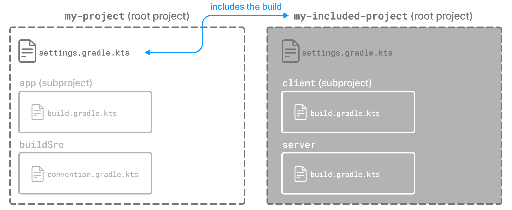

import {SampleScripts, GitHubButton, GroovyDocLink} from '#/components';

<div id="composite_builds" />

A composite build is a build that includes other builds.

<div id="composite_build_intro" />

A composite build is similar to a Gradle multi-project build, except that instead of including `subprojects`, entire `builds` are included.

<div id="defining_composite_builds" />

## Composite Build Layout

Composite builds allow you to:

* Combine builds that are usually developed independently, for instance, when trying out a bug fix in a library that your application uses.
* Decompose a large multi-project build into smaller, more isolated chunks that can be worked on independently or together as needed.

A build that is included in a composite build is referred to as an *included build*.



Included builds do not share any configuration with the composite build or the other included builds.
Each included build is configured and executed in isolation.

The following example demonstrates how two Gradle builds, normally developed separately, can be combined into a composite build:

```text title="Kotlin DSL"
my-composite
├── settings.gradle.kts
├── build.gradle.kts
├── my-app
│   ├── settings.gradle.kts
│   └── app
│       ├── build.gradle.kts
│       └── src/main/java/org/sample/my-app/Main.java
└── my-utils
    ├── settings.gradle.kts
    ├── number-utils
    │   ├── build.gradle.kts
    │   └── src/main/java/org/sample/numberutils/Numbers.java
    └── string-utils
        ├── build.gradle.kts
        └── src/main/java/org/sample/stringutils/Strings.java
```

```text title="Groovy DSL"
my-composite
├── settings.gradle
├── build.gradle
├── my-app
│   ├── settings.gradle
│   └── app
│       ├── build.gradle
│       └── src/main/java/org/sample/my-app/Main.java
└── my-utils
    ├── settings.gradle
    ├── number-utils
    │   ├── build.gradle
    │   └── src/main/java/org/sample/numberutils/Numbers.java
    └── string-utils
        ├── build.gradle
        └── src/main/java/org/sample/stringutils/Strings.java
```

The `my-utils` multi-project build produces two Java libraries, `number-utils` and `string-utils`.
The `my-app` build produces an executable using functions from those libraries.

The `my-app` build does not depend directly on `my-utils`.
Instead, it declares binary dependencies on the libraries produced by `my-utils`:

<GitHubButton sample="gradle-reference/structuring-builds/composite-builds/basic-app-deps" />

<SampleScripts sample_name="basic-app-deps" basename="build" subpath="my-app/app" />

<div id="command_line_composite" />

## Defining a Composite Build via `--include-build`

The `--include-build` command-line argument turns the executed build into a composite, substituting dependencies from the included build into the executed build.

For example, the output of `./gradlew run --include-build ../my-utils` run from `my-app`:

```
$ ./gradlew --include-build ../my-utils run
> Task :app:processResources NO-SOURCE
> Task :my-utils:string-utils:compileJava
> Task :my-utils:string-utils:processResources NO-SOURCE
> Task :my-utils:string-utils:classes
> Task :my-utils:string-utils:jar
> Task :my-utils:number-utils:compileJava
> Task :my-utils:number-utils:processResources NO-SOURCE
> Task :my-utils:number-utils:classes
> Task :my-utils:number-utils:jar
> Task :app:compileJava
> Task :app:classes

> Task :app:run
The answer is 42


BUILD SUCCESSFUL in 0s
6 actionable tasks: 6 executed
```

<div id="settings_defined_composite" />

## Defining a Composite Build via the Settings file

It's possible to make the above arrangement persistent by using <GroovyDocLink class="org.gradle.api.initialization.Settings" method="includeBuild(java.lang.Object)" /> to declare the included build in the `settings.gradle(.kts)` file.

The settings file can be used to add subprojects and included builds simultaneously.

Included builds are added by location:

<SampleScripts sample_name="basic-settings-inc" basename="settings" />

<div id="separate_composite" />

In the example, the settings.gradle(.kts) file combines otherwise separate builds:

<GitHubButton sample="gradle-reference/structuring-builds/composite-builds/basic-settings-full" />

<SampleScripts sample_name="basic-settings-full" basename="settings" />

To execute the `run` task in the `my-app` build from `my-composite`, run `./gradlew my-app:app:run`.

You can optionally define a `run` task in `my-composite` that depends on `my-app:app:run` so that you can execute `./gradlew run`:

<SampleScripts sample_name="basic-run" basename="build" />

<div id="included_plugin_builds" />

### Including Builds that define Gradle Plugins

A special case of included builds are builds that define Gradle plugins.

These builds should be included using the `includeBuild` statement inside the `pluginManagement {}` block of the settings file.

Using this mechanism, the included build may also contribute a settings plugin that can be applied in the settings file itself:

<GitHubButton sample="gradle-reference/structuring-builds/composite-builds/include-plugin-build" />

<SampleScripts sample_name="include-plugin-build" basename="settings" />

<div id="included_builds" />

## Restrictions on Included Builds

Most builds can be included in a composite, including other composite builds.
There are some restrictions.

In a regular build, Gradle ensures that each project has a unique _project path_.
It makes projects identifiable and addressable without conflicts.

In a composite build, Gradle adds additional qualification to each project from an included build to avoid project path conflicts.
The full path to identify a project in a composite build is called a _build-tree path_.
It consists of a _build path_ of an included build and a _project path_ of the project.

By default, build paths and project paths are derived from directory names and structure on disk.
Since included builds can be located anywhere on disk, their build path is determined by the name of the containing directory.
This can sometimes lead to conflicts.

To summarize, the included builds must fulfill these requirements:

* Each included build must have a unique build path.
* Each included build path must not conflict with any project path of the main build.

These conditions guarantee that each project can be uniquely identified even in a composite build.

If conflicts arise, the way to resolve them is by changing the _build name_ of an included build:

```kotlin title="settings.gradle.kts"
includeBuild("some-included-build") {
    name = "other-name"
}
```

:::note
When a composite build is included in another composite build, both builds have the same parent.
In other words, the nested composite build structure is flattened.
:::

<div id="interacting_with_composite_builds" />

## Interacting with a Composite Build

Interacting with a composite build is generally similar to a regular multi-project build.
Tasks can be executed, tests can be run, and builds can be imported into the IDE.

<div id="composite_build_executing_tasks" />

### Executing tasks

Tasks from an included build can be executed from the command-line or IDE in the same way as tasks from a regular multi-project build.
Executing a task will result in task dependencies being executed, as well as those tasks required to build dependency artifacts from other included builds.

You can call a task in an included build using a fully qualified path, for example, `:included-build-name:project-name:taskName`.
Project and task names can be [abbreviated](/gradle-reference/runtime-and-configuration/command-line-interface/#sec:name_abbreviation).

```
$ ./gradlew :included-build:subproject-a:compileJava
> Task :included-build:subproject-a:compileJava

$ ./gradlew :i-b:sA:cJ
> Task :included-build:subproject-a:compileJava
```

To [exclude a task from the command line](/gradle-reference/runtime-and-configuration/command-line-interface/#sec:excluding_tasks_from_the_command_line), you need to provide the fully qualified path to the task.

:::note
Included build tasks are automatically executed to generate required dependency artifacts, or the [including build can declare a dependency on a task from an included build](#included_build_task_dependencies).
:::

<div id="composite_build_ide_integration" />

### Importing into the IDE

One of the most useful features of composite builds is IDE integration.

Importing a composite build permits sources from separate Gradle builds to be easily developed together.
For every included build, each subproject is included as an IntelliJ IDEA Module or Eclipse Project.
Source dependencies are configured, providing cross-build navigation and refactoring.

<div id="included_build_declaring_substitutions" />

## Declaring dependencies substituted by an Included Build

By default, Gradle will configure each included build to determine the dependencies it can provide.
The algorithm for doing this is simple.
Gradle will inspect the group and name for the projects in the included build and substitute project dependencies for any external dependency matching `${project.group}:${project.name}`.

:::note
By default, substitutions are not registered for the _main_ build.

To make the (sub)projects of the main build addressable by `${project.group}:${project.name}`, you can tell Gradle to treat the main build like an included build by self-including it: `includeBuild(".")`.
:::

There are cases when the default substitutions determined by Gradle are insufficient or must be corrected for a particular composite.
For these cases, explicitly declaring the substitutions for an included build is possible.

For example, a single-project build called `anonymous-library`, produces a Java utility library but does not declare a value for the group attribute:

<GitHubButton sample="gradle-reference/structuring-builds/composite-builds/declared-substitution-lib" />

<SampleScripts sample_name="declared-substitution-lib" basename="build" />

When this build is included in a composite, it will attempt to substitute for the dependency module `undefined:anonymous-library` (`undefined` being the default value for `project.group`, and `anonymous-library` being the root project name).
Clearly, this isn't useful in a composite build.

To use the unpublished library in a composite build, you can explicitly declare the substitutions that it provides:

<SampleScripts sample_name="declared-substitution-settings" basename="settings" />

With this configuration, the `my-app` composite build will substitute any dependency on `org.sample:number-utils` with a dependency on the root project of `anonymous-library`.

<div id="deactivate_included_build_substitutions" />

### Deactivate included build substitutions for a configuration

If you need to [resolve](/gradle-reference/dependency-management/declaring-dependencies-4/creating-dependency-configurations/#sec:resolvable-consumable-configs) a published version of a module that is also available as part of an included build, you can deactivate the included build substitution rules on the <GroovyDocLink class="org.gradle.api.artifacts.ResolutionStrategy" /> of the Configuration that is resolved.
This is necessary because the rules are globally applied in the build, and Gradle does not consider published versions during resolution by default.

For example, we create a separate `publishedRuntimeClasspath` configuration that gets resolved to the published versions of modules that also exist in one of the local builds.
This is done by deactivating global dependency substitution rules:

<GitHubButton sample="gradle-reference/structuring-builds/composite-builds/deactivate-global-substitution" />

<SampleScripts sample_name="deactivate-global-substitution" basename="build" />

A use-case would be to compare published and locally built JAR files.

<div id="included_build_substitution_requirements" />

### Cases where included build substitutions must be declared

Many builds will function automatically as an included build, without declared substitutions.
Here are some common cases where declared substitutions are required:

* When the `archivesBaseName` property is used to set the name of the published artifact.
* When a configuration other than `default` is published.
* When the `MavenPom.addFilter()` is used to publish artifacts that don't match the project name.
* When the `maven-publish` or `ivy-publish` plugins are used for publishing and the publication coordinates don't match `${project.group}:${project.name}`.

<div id="included_build_substitution_limitations" />

### Cases where composite build substitutions won't work

Some builds won't function correctly when included in a composite, even when dependency substitutions are explicitly declared.
This limitation is because a substituted project dependency will always point to the `default` configuration of the target project.
Any time the artifacts and dependencies specified for the default configuration of a project don't match what is published to a repository, the composite build may exhibit different behavior.

Here are some cases where the published module metadata may be different from the project default configuration:

* When a configuration other than `default` is published.
* When the `maven-publish` or `ivy-publish` plugins are used.
* When the `POM` or `ivy.xml` file is tweaked as part of publication.

Builds using these features function incorrectly when included in a composite build.

<div id="included_build_task_dependencies" />

## Depending on Tasks in an Included Build

While included builds are isolated from one another and cannot declare direct dependencies, a composite build can declare task dependencies on its included builds.
The included builds are accessed using <GroovyDocLink class="org.gradle.api.invocation.Gradle" method="getIncludedBuilds()" /> or <GroovyDocLink class="org.gradle.api.invocation.Gradle" method="includedBuild(java.lang.String)" />, and a task reference is obtained via the <GroovyDocLink class="org.gradle.api.initialization.IncludedBuild" method="task(java.lang.String)" /> method.

Using these APIs, it is possible to declare a dependency on a task in a particular included build:

<GitHubButton sample="gradle-reference/structuring-builds/composite-builds/basic-run" />

<SampleScripts sample_name="basic-run" basename="build" />

Or you can declare a dependency on tasks with a certain path in some or all of the included builds:

<GitHubButton sample="gradle-reference/structuring-builds/composite-builds/hierarchical-multirepo" />

<SampleScripts sample_name="hierarchical-multirepo" basename="build" />

<div id="current_limitations_and_future_work" />

## Limitations of Composite Builds

Limitations of the current implementation include:

* No support for included builds with publications that don't mirror the project default configuration.
  See [Cases where composite builds won't work](#included_build_substitution_limitations).
* Multiple composite builds may conflict when run in parallel if more than one includes the same build.
  Gradle does not share the project lock of a shared composite build between Gradle invocations to prevent concurrent execution.
