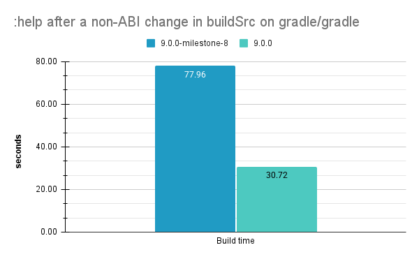

<meta property="og:image" content="https://gradle.org/images/releases/gradle-default.png" />
<meta property="og:type"  content="article" />
<meta property="og:title" content="Gradle @version@ Release Notes" />
<meta property="og:site_name" content="Gradle Release Notes">
<meta property="og:description" content="We are excited to announce Gradle @version@.">
<meta name="twitter:card" content="summary_large_image">
<meta name="twitter:site" content="@gradle">
<meta name="twitter:creator" content="@gradle">
<meta name="twitter:title" content="Gradle @version@ Release Notes">
<meta name="twitter:description" content="We are excited to announce Gradle @version@.">
<meta name="twitter:image" content="https://gradle.org/images/releases/gradle-default.png">

We are excited to announce Gradle @version@ (released [@releaseDate@](https://gradle.org/releases/)).

This release features [1](), [2](), ... [n](), and more.

Gradle 9.0 has many bug fixes and other general improvements. As a major version, this release also has changes to deprecated APIs and behavior. Consult the [Gradle 8.x upgrade guide](userguide/upgrading_version_8.html) for guidance on removed APIs and behavior.

<!-- 
Include only their name, impactful features should be called out separately below.
 [Some person](https://github.com/some-person)

 THIS LIST SHOULD BE ALPHABETIZED BY [PERSON NAME] - the docs:updateContributorsInReleaseNotes task will enforce this ordering, which is case-insensitive.
-->

We would like to thank the following community members for their contributions to this release of Gradle:

[Victor Merkulov](https://github.com/urdak)

Be sure to check out the [public roadmap](https://blog.gradle.org/roadmap-announcement) for insight into what's planned for future releases.

## Upgrade instructions

Switch your build to use Gradle @version@ by updating the [wrapper](userguide/gradle_wrapper.html) in your project:

```
./gradlew wrapper --gradle-version=@version@ && ./gradlew wrapper
```

See the [Gradle 8.x upgrade guide](userguide/upgrading_version_8.html#changes_@baseVersion@) to learn about deprecations, breaking changes, and other considerations when upgrading to Gradle @version@.

For Java, Groovy, Kotlin, and Android compatibility, see the [full compatibility notes](userguide/compatibility.html).   

## New features and usability improvements

### Kotlin build script compilation avoidance

With this release, the mechanism for detecting ABI (Application Binary Interface) changes in [Kotlin DSL](userguide/kotlin_dsl.html) (`.kts`) build scripts has been significantly improved. 
Gradle now relies on the Kotlin distribution’s own ABI fingerprinting instead of its previous internal mechanism.

The biggest advantage of the new mechanism is the ability to work in the presence of inline functions, something that Gradle wasn't handling efficiently until now.
This results in substantial performance gains depending on your build and the changes made to the build logic.

For example, in the `gradle/gradle` project, non-ABI changes to build logic now result in up to a 60% reduction in configuration time by avoiding unnecessary script recompilation.



### Kotlin 2 TO DO

### Groovy 4 TO DO

### SemVer TO DO

<a name="config-cache"></a>
### Configuration Cache improvements

Gradle's [Configuration Cache](userguide/configuration_cache.html) improves build performance by caching the result of the configuration phase.
Gradle uses the Configuration Cache to reload a saved configuration when nothing that affects the build configuration has changed.

#### CC TO DO

Check out the link:https://blog.gradle.org/road-to-configuration-cache[blog post] to learn more.

<a name="build-authoring"></a>
### Build authoring improvements

Gradle provides rich APIs for plugin authors and build engineers to develop custom build logic.

#### Gradle API now uses JSpecify Nullability Annotations

Since Gradle 5.0 we've been using annotations from the dormant and unfinished JSR-305 to make the nullness of type usages explicit for the Gradle API.
Starting with Gradle 9.0, the Gradle API is annotated using JSpecify instead.

For more details and potential breakages, see the dedicated [upgrading guide section](userguide/upgrading_version_8.html).

## Promoted features

Promoted features are features that were incubating in previous versions of Gradle but are now supported and subject to backward compatibility.
See the User Manual section on the "[Feature Lifecycle](userguide/feature_lifecycle.html)" for more information.

The following are the features that have been promoted in this Gradle release.

### Problems API TO DO

<!--
### Example promoted
-->

## Fixed issues

<!--
This section will be populated automatically
-->

## Known issues

Known issues are problems that were discovered post-release that are directly related to changes made in this release.

<!--
This section will be populated automatically
-->

## External contributions

We love getting contributions from the Gradle community. For information on contributing, please see [gradle.org/contribute](https://gradle.org/contribute).

## Reporting problems

If you find a problem with this release, please file a bug on [GitHub Issues](https://github.com/gradle/gradle/issues) adhering to our issue guidelines.
If you're not sure if you're encountering a bug, please use the [forum](https://discuss.gradle.org/c/help-discuss).

We hope you will build happiness with Gradle, and we look forward to your feedback via [Twitter](https://twitter.com/gradle) or on [GitHub](https://github.com/gradle).
