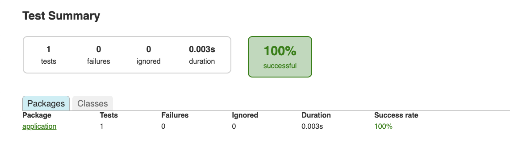
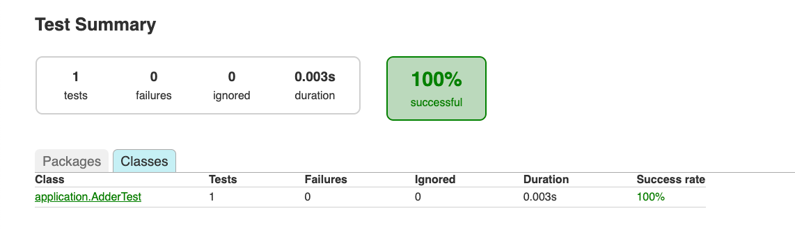
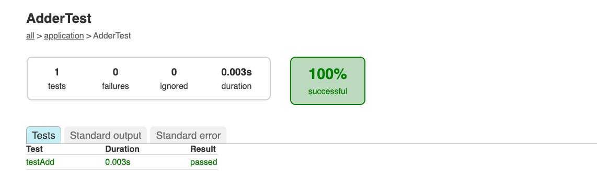
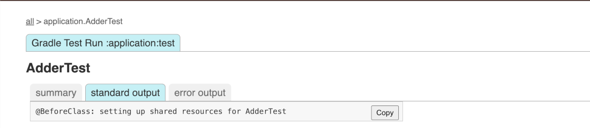
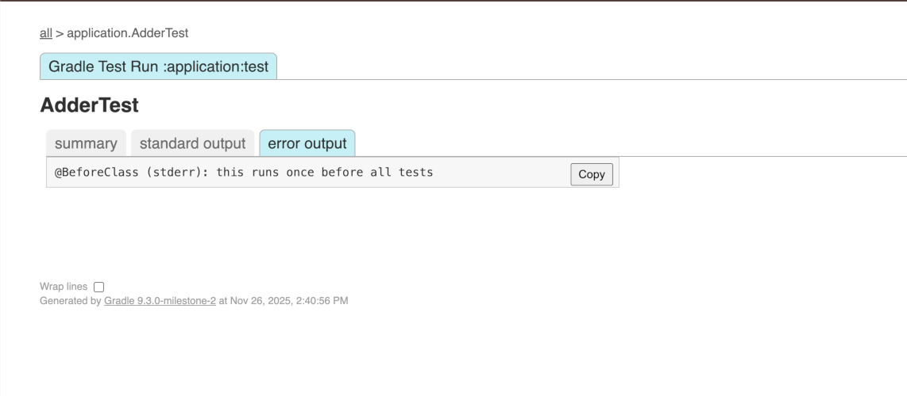
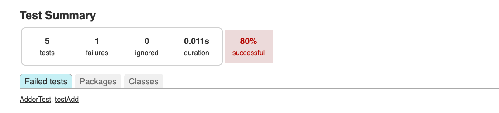
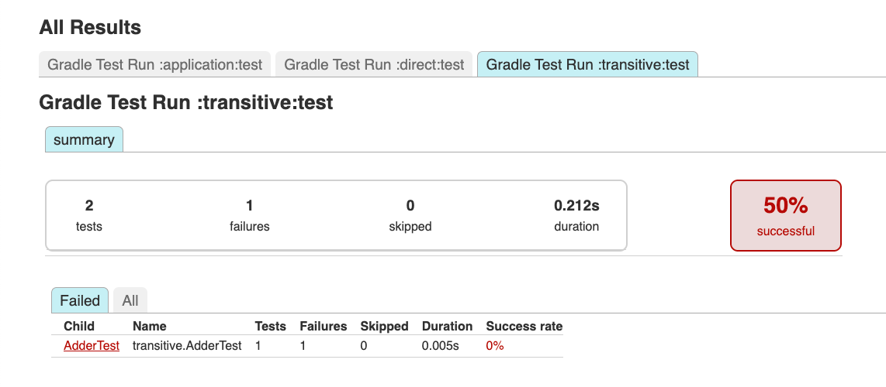

<meta property="og:image" content="https://gradle.org/images/releases/gradle-default.png" />
<meta property="og:type"  content="article" />
<meta property="og:title" content="Gradle @version@ Release Notes" />
<meta property="og:site_name" content="Gradle Release Notes">
<meta property="og:description" content="We are excited to announce Gradle @version@.">
<meta name="twitter:card" content="summary_large_image">
<meta name="twitter:site" content="@gradle">
<meta name="twitter:creator" content="@gradle">
<meta name="twitter:title" content="Gradle @version@ Release Notes">
<meta name="twitter:description" content="We are excited to announce Gradle @version@.">
<meta name="twitter:image" content="https://gradle.org/images/releases/gradle-default.png">

We are excited to announce Gradle @version@ (released [@releaseDate@](https://gradle.org/releases/)).

This release brings [error and warning reporting improvements](#error-and-warning-reporting-improvements), with Problems API reports now rendered in the console when using `--warning-mode=all` and clearer explanations for some exit codes.

It also adds [test reporting improvements](#test-reporting-improvements), including an improved HTML test report for nested, parameterized, and suite-based tests, with better aggregate reporting.

Finally, [build authoring enhancements](#build-authoring-improvements) include a new method on `AttributeContainer` and a new streaming API in TestKit for efficiently reading build output.

We would like to thank the following community members for their contributions to this release of Gradle:
[Adam](https://github.com/adam-enko),
[Adam](https://github.com/aSemy),
[Aharnish Solanki](https://github.com/Ahar28),
[Andrzej Zabost](https://github.com/azabost),
[Björn Kautler](https://github.com/Vampire),
[Boris Petrov](https://github.com/boris-petrov),
[Jendrik Johannes](https://github.com/jjohannes),
[Kamil Krzywanski](https://github.com/kamilkrzywanski),
[KANAKALA SAI KIRAN](https://github.com/saikirankanakala),
[Megmeehey](https://github.com/Megmeehey),
[NurmukhametovAlexey](https://github.com/NurmukhametovAlexey),
[Philip Wedemann](https://github.com/hfhbd),
[Piotr Kubowicz](https://github.com/pkubowicz),
[Samay Kumar](https://github.com/samayk27),
[Shin Minjun](https://github.com/minjun011026),
[Stefan Oehme](https://github.com/oehme),
[Vincent Potuček](https://github.com/Pankraz76),
[Yongshun Ye](https://github.com/ShreckYe).

Be sure to check out the [public roadmap](https://roadmap.gradle.org) for insight into what's planned for future releases.

## Upgrade instructions

Switch your build to use Gradle @version@ by updating the [wrapper](userguide/gradle_wrapper.html) in your project:

```text
./gradlew wrapper --gradle-version=@version@ && ./gradlew wrapper
```

See the [Gradle 9.x upgrade guide](userguide/upgrading_version_9.html#changes_@baseVersion@) to learn about deprecations, breaking changes, and other considerations when upgrading to Gradle @version@.

For Java, Groovy, Kotlin, and Android compatibility, see the [full compatibility notes](userguide/compatibility.html).   

## New features and usability improvements

### Error and warning reporting improvements

Gradle provides a rich set of [error and warning messages](userguide/logging.html) to help you understand and resolve problems in your build.

#### Simple console rendering for Problem Reports

The [Problems API](userguide/reporting_problems.html) provides structured feedback on build issues, helping developers and tools like IDEs identify and resolve warnings, errors, or deprecations during configuration or runtime.

Previously, a limitation was that the problem report was linked to in the console output, but the problems themselves were not displayed:

```bash
$ ./gradlew :test --warning-mode=all

> Configure project :
[Incubating] Problems report is available at: file:///Users/user/test-report-aggregation-sample/build/reports/problems/problems-report.html
```

In this release, we've taken a first step toward full console integration.
Relevant problems in the report are now rendered in the console output when you use `--warning-mode=all`:

```bash
$ ./gradlew :test --warning-mode=all

> Configure project :
Build file '/Users/lkassovic/Downloads/test-report-aggregation-sample/build.gradle': line 16
The Wrapper.getAvailableDistributionTypes method has been deprecated...
        at build_5teuix0v7qf7ou93kgnmvnicp.run(/Users/user/test-report-aggregation-sample/build.gradle:16)
        (Run with --stacktrace to get the full stack trace of this deprecation warning.)
[Incubating] Problems report is available at: file:///Users/user/test-report-aggregation-sample/build/reports/problems/problems-report.html
```

#### Clearer explanation for worker process exit codes

Gradle now provides a short explanation when a [worker process](userguide/gradle_daemon.html#understanding_daemon) exits with a code that typically indicates it was killed by the operating system.

Previously, you would see:

```bash
> Process 'Gradle Worker Daemon 87' finished with non-zero exit value 137
```

Now, Gradle adds a helpful hint:

```bash
> Process 'Gradle Worker Daemon 87' finished with non-zero exit value 137 
(this value may indicate that the process was terminated with the SIGKILL 
signal, which is often caused by the system running out of memory)
```

This makes it easier to understand failures caused by conditions such as running out of memory.

### Test reporting improvements

Gradle provides a [rich set of features and abstractions](userguide/java_testing.html) for testing JVM code, along with test reports to display results.

#### Test results reporting

The [HTML test report](userguide/java_testing.html#test_reporting) generated by the `test` task, [`TestReport`](javadoc/org/gradle/api/tasks/testing/TestReport.html), and other [`AbstractTestTask`](javadoc/org/gradle/api/tasks/testing/AbstractTestTask.html) usages now presents test results in a clearer structure that reflects how tests are defined:





This results from Gradle adopting the incubating [`TestEventReporter`](javadoc/org/gradle/api/tasks/testing/TestEventReporter.html) API internally.

In the following sections, "Suite" refers specifically to the suite features of JUnit 4, JUnit Jupiter, and TestNG. "Container" refers to a general grouping of tests, such as a class.

##### Nested test changes

For JUnit 4 and JUnit Jupiter, nested test classes are now shown nested under their enclosing class in the HTML Test Report.

For example, if you had an `OuterClass` with an `InnerClass` nested inside it, it would previously be shown as:

```text
+ OuterClass$InnerClass
|-- someTestMethodInInnerClass
```

It will now be reported in the HTML Test Report as:

```text
+ OuterClass
|-+ InnerClass (or OuterClass$InnerClass for JUnit 4)
  |-- someTestMethodInInnerClass
```

With multiple inner classes:

```text
+ OuterClass
|-+ InnerClass1 (or OuterClass$InnerClass1 for JUnit 4)
  |-- someTestMethodInInnerClass1
  + InnerClass2 (or OuterClass$InnerClass2 for JUnit 4)
  |-- someTestMethodInInnerClass2
```

The XML report remains the same, nested classes are still written as `TEST-OuterClass$InnerClass.xml`.

##### Parameterized test changes

Parameterized tests now create a suite that contains all the parameterized test cases for a given method.

For example, if you had a class `TestClass` with two parameterized `paramTest1/2` methods, it would previously be shown as:

```text
+ TestClass
|-- paramTest1[0]
|-- paramTest1[1]
|-- paramTest1[2]
|-- paramTest2[a]
|-- paramTest2[b]
|-- paramTest2[c]
```

It will now be reported in the HTML Test Report as:

```text
+ TestClass
|-+ paramTest1
  |-- paramTest1[0]
  |-- paramTest1[1]
  |-- paramTest1[2]
|-+ paramTest2
  |-- paramTest2[a]
  |-- paramTest2[b]
  |-- paramTest2[c]
```

##### Suite changes

Suites now contain the classes they run, rather than those classes being shown as siblings.

For example, if you had a suite `AllTests` that ran `TestClass1` and `TestClass2`, it would previously be shown as:

```text
+ AllTests
+ TestClass1
|-- someTestMethodInClass1
+ TestClass2
|-- someTestMethodInClass2
```

It will now be reported in the HTML Test Report as:

```text
+ AllTests
|-+ TestClass1
  |-- someTestMethodInClass1
|-+ TestClass2
  |-- someTestMethodInClass2
```

In the XML report, only the class report is emitted (`TEST-SomeTestClass.xml`).

##### Package suite changes

Packages are no longer represented as containers in the HTML report.

For example, if you had classes org.example.FirstTest and org.example.SecondTest, it would previously be shown as:

```text
+ org.example
  |-- FirstTest
  |-- SecondTest
```

It will now be reported in the HTML Test Report as:

```text
+ org.example.FirstTest
+ org.example.SecondTest
```

There are two main reasons for this change:

1. With support for non-class-based testing, Gradle cannot reliably determine if a container corresponds to a class, so synthesizing a package container can be misleading.
2. This behavior now aligns more closely with how testing frameworks and IDEs group tests.

##### Test standard output/error changes

Standard output and standard error (collectively, "output") are no longer combined from individual tests to the container/class level.
Instead, the output stays attached to the individual test that produced it:



This makes it easier to locate output that is relevant to a specific test.



`@Before` and `@After` class output is now associated with the correct class in JUnit 4, JUnit Jupiter, and TestNG (starting with TestNG 6.9.13.3).
`@Before`  and `@After` suite or container output is now associated with the correct suite or container for JUnit 4 (starting with JUnit 4.13), JUnit Jupiter, and TestNG (starting with TestNG 6.19.13.3):



#### Aggregate report changes

The [Test Report Aggregation Plugin](userguide/test_report_aggregation_plugin.html) provides tasks and configurations used to aggregate the results of multiple [Test](javadoc/org/gradle/api/tasks/testing/Test.html) task invocations into a single HTML report.   
This report, which can also be generated manually with [`TestReport`](javadoc/org/gradle/api/tasks/testing/TestReport.html), now supports overlapping test structures.

For example, when a suite with the same name exists in multiple subprojects:

* `application` subproject has an `AdderTest`
* `direct` subproject has an `AdderTest` and a `MultiplierTest`
* `transitive` subproject has an `AdderTest` (which fails) and a `PowerizeTest`

Previously, the report looked like this when a failure occurred:



Now, each individual report source is represented as a separate tab.
To see the tests from a specific source, select its corresponding tab:



### Build authoring improvements

Gradle provides [rich APIs](userguide/getting_started_dev.html) for plugin authors and build engineers to develop custom build logic.

#### New `AttributeContainer.named()` method

An [`AttributeContainer`](javadoc/org/gradle/api/attributes/AttributeContainer.html) stores attributes that Gradle uses to pick the right variant of a dependency during [resolution](userguide/graph_resolution.html#sec:variant-selection).  
This release introduces a new convenience method on [`AttributeContainer`](javadoc/org/gradle/api/attributes/AttributeContainer.html) called [`named()`](javadoc/org/gradle/api/attributes/AttributeContainer.html#named\(java.lang.Class,java.lang.String)).  
This method can create attribute values directly from the container without requiring a separate [`ObjectFactory`](javadoc/org/gradle/api/model/ObjectFactory.html) instance.

This method makes attribute assignment more concise while preserving the same semantics as creating a named value via [`ObjectFactory`](userguide/service_injection.html#objectfactory):

```kotlin
configurations.resolvable("foo") {
    attributes {
        // Before: 
        attribute(Usage.USAGE_ATTRIBUTE, objects.named("red"))
        
        // After:
        attribute(Usage.USAGE_ATTRIBUTE, named("red"))
    }
}
```

#### Stream TestKit output

In Gradle’s [TestKit](userguide/test_kit.html), [`BuildResult`](javadoc/org/gradle/testkit/runner/BuildResult.html) is the object that represents the outcome of a test build you ran with [GradleRunner](javadoc/org/gradle/testkit/runner/GradleRunner.html).  
[`BuildResult`](javadoc/org/gradle/testkit/runner/BuildResult.html) now offers a new method for accessing the build console output efficiently, especially for builds that produce a large volume of logs.

[`BuildResult.getOutput()`](javadoc/org/gradle/testkit/runner/BuildResult.html#getOutput\(\)) returns a `String` with the full build console output.   
This can use large amounts of memory for builds with extensive logs.

A new [`BuildResult.getOutputReader()`](javadoc/org/gradle/testkit/runner/BuildResult.html#getOutputReader\(\)) method is available, returning a `BufferedReader` for streaming the build output incrementally. This can help reduce memory pressure in TestKit tests.

Ensure you close the `BufferedReader` after use.   
We recommend the standard Java try-with-resources pattern for this:

```java
void testProject() {
    BuildResult buildResult = GradleRunner.create()
        .withProjectDir(File("test-project"))
        .withArguments(":build", "--info")
        .build();

    try (BufferedReader outputReader = buildResult.getOutputReader()) {
        List<String> logLines = outputReader.lines()
            .filter(line -> line.contains("example build message"))
            .collect(Collectors.toList());
        // do something with the log lines...
    }
}
```

## Promoted features

Promoted features are features that were incubating in previous versions of Gradle but are now supported and subject to backward compatibility.
See the User Manual section on the "[Feature Lifecycle](userguide/feature_lifecycle.html)" for more information.

The following are the features that have been promoted in this Gradle release.

* [`useFileSystemPermissions()`](javadoc/org/gradle/api/tasks/bundling/AbstractArchiveTask.html#useFileSystemPermissions()) in `AbstractArchiveTask`

## Documentation and training

### User Manual

The [Plugin Development](userguide/init_scripts.html) section has been updated with clearer explanations and coded examples of init scripts and init plugins, including when to use each.

### Best Practices

The following best practices have been added in this Gradle release:

* [Use Convention Plugins for Common Build Logic](userguide/best_practices_structuring_builds.html#use_convention_plugins)
* [Validate Gradle wrapper JAR checksum](userguide/best_practices_security.html#validate_wrapper_checksum)

### Training

The following course is now available:

* [Introduction to Gradle for Build Engineers](https://dpeuniversity.gradle.com/app/courses/03256bfb-c0b8-4402-9af0-377e90dab72e)

The following learning path is now available:

* [Introduction to Gradle](https://dpeuniversity.gradle.com/app/learning_paths/1a2955ed-499e-45e3-af54-9babd8427972)

## Fixed issues

<!--
This section will be populated automatically
-->

## Known issues

Known issues are problems that were discovered post-release that are directly related to changes made in this release.

<!--
This section will be populated automatically
-->

## External contributions

We love getting contributions from the Gradle community. For information on contributing, please see [gradle.org/contribute](https://gradle.org/contribute).

## Reporting problems

If you find a problem with this release, please file a bug on [GitHub Issues](https://github.com/gradle/gradle/issues) adhering to our issue guidelines.
If you're not sure if you're encountering a bug, please use the [forum](https://discuss.gradle.org/c/help-discuss).

We hope you will build happiness with Gradle, and we look forward to your feedback via [Twitter](https://twitter.com/gradle) or on [GitHub](https://github.com/gradle).
