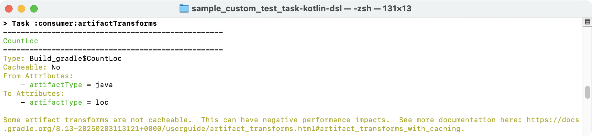
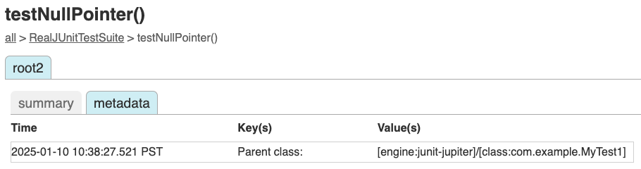

<meta property="og:image" content="https://gradle.org/images/releases/gradle-@version@.png" />
<meta property="og:type"  content="article" />
<meta property="og:title" content="Gradle @version@ Release Notes" />
<meta property="og:site_name" content="Gradle Release Notes">
<meta property="og:description" content="TO DO">
<meta name="twitter:card" content="summary_large_image">
<meta name="twitter:site" content="@gradle">
<meta name="twitter:creator" content="@gradle">
<meta name="twitter:title" content="Gradle @version@ Release Notes">
<meta name="twitter:description" content="TO DO">
<meta name="twitter:image" content="https://gradle.org/images/releases/gradle-@version@.png">

We are excited to announce Gradle @version@ (released [@releaseDate@](https://gradle.org/releases/)).

This release features [1](), [2](), ... [n](), and more.

<!--
Include only their name, impactful features should be called out separately below.
 [Some person](https://github.com/some-person)

 THIS LIST SHOULD BE ALPHABETIZED BY [PERSON NAME] - the docs:updateContributorsInReleaseNotes task will enforce this ordering, which is case-insensitive.
-->

We would like to thank the following community members for their contributions to this release of Gradle:
[Adam](https://github.com/adam-enko),
[Ahmad Al-Masry](https://github.com/AhmadMasry),
[Aurimas](https://github.com/liutikas),
[Jorge Matamoros](https://github.com/YungOkra),
[Madalin Valceleanu](https://github.com/vmadalin),
[Roberto Perez Alcolea](https://github.com/rpalcolea),
[Róbert Papp](https://github.com/TWiStErRob),
[Semyon Gaschenko](https://github.com/gasches),
[Stefan M.](https://github.com/StefMa),
[Steven Schoen](https://github.com/DSteve595),
[tg-freigmbh](https://github.com/tg-freigmbh),
[TheGoesen](https://github.com/TheGoesen),
[Zongle Wang](https://github.com/Goooler)

Be sure to check out the [public roadmap](https://roadmap.gradle.org/) for insight into what's planned for future releases.

## Upgrade instructions

Switch your build to use Gradle @version@ by updating the [Wrapper](userguide/gradle_wrapper.html) in your project:

```
./gradlew wrapper --gradle-version=@version@ && ./gradlew wrapper
```

See the [Gradle 8.x upgrade guide](userguide/upgrading_version_8.html#changes_@baseVersion@) to learn about deprecations, breaking changes, and other considerations when upgrading to Gradle @version@.

For Java, Groovy, Kotlin, and Android compatibility, see the [full compatibility notes](userguide/compatibility.html).

## New features and usability improvements

<a name="build-authoring"></a>
### Build authoring improvements

Gradle provides [rich APIs](userguide/getting_started_dev.html) for plugin authors and build engineers to develop custom build logic.

#### ProjectLayout API improvement

The [`ProjectLayout`](org/gradle/api/file/ProjectLayout.html) class provides access to directories and files within a project.

Starting with this version of Gradle, it can also access the settings directory (the location of the `settings.gradle(.kts)` file).
While the settings directory is not specific to any project, some use cases require resolving file paths relative to it.

Previously, accessing the settings directory required using `rootProject.layout.projectDirectory`.
This approach involved accessing the `rootProject` object, which is discouraged, and then manually resolving paths to the settings directory.

The new capability addresses a common scenario: resolving files shared across all projects in a build, such as linting configurations or `version.txt` files in the root folder.

Refer to [`ProjectLayout.getSettingsDirectory()`](org/gradle/api/file/ProjectLayout.html#getSettingsDirectory()) for additional details.

#### New Artifact Transforms report task

A new `artifactTransforms` report is available by default, providing information about all the registered [Artifact Transforms](userguide/artifact_transforms.html) in a project.

This report helps build authors identify the transforms registered by build scripts and plugins in their projects. 
Viewing the list of registered transforms is particularly useful for debugging [ambiguous transform failures](userguide/variant_model.html#sec:transform-ambiguity).



The report includes the following details:

- The fully qualified type name of the action implementing the transform
- Whether the transform is cacheable
- The complete set of input attributes and their values used to select the transform
- The complete set of output attributes and their values produced by the transform

For more information, refer to the [ArtifactTransformsReportTask](dsl/org.gradle.api.tasks.diagnostics.ArtifactTransformsReportTask.html) DSL reference.

#### TestEventReporting API improvements

Gradle provides an [HTML test report](userguide/java_testing.html#test_reporting) to help you understand and resolve test failures.
This report is automatically generated when using the `test` task with supported test frameworks, such as `JUnit`.

Plugin authors and platform providers can now leverage the [Test Event Reporting APIs](javadoc/org/gradle/api/tasks/testing/TestReport.html) to capture test events and generate reports for tests executed outside Gradle's built-in testing infrastructure:

```java
public abstract class CustomTest extends DefaultTask {

    @Inject
    public abstract ProjectLayout getLayout();

    @Inject
    protected abstract TestEventReporterFactory getTestEventReporterFactory();

    @TaskAction
    void runTests() {
        try (TestEventReporter test = getTestEventReporterFactory().createTestEventReporter(
                "custom-test",
                getLayout().getBuildDirectory().dir("test-results/custom-test").get(),
                getLayout().getBuildDirectory().dir("reports/tests/custom-test").get()
        )) {
            // Start the test
            test.started(Instant.now());

            // Execute custom test...

            // Report test outcome
            if (testFailureCount > 0) {
                test.failed(Instant.now());
            } else {
                test.succeeded(Instant.now());
            }
        }
    }
}
```

This integration allows custom test frameworks to generate rich HTML test reports consistent with Gradle's built-in reporting format, enhancing visibility and usability.

You can find additional details and sample code in [Test Reporting API](userguide/test_reporting_api.html).

##### Metadata support

Custom tests can include metadata to provide supplementary information about test execution.

The metadata is displayed in the HTML test report for better visibility:

```java
test.metadata(Instant.now(),"Parent class:", String.valueOf(result.getTestIdentifier().getParentId().get()));
```



##### Nesting support

Hierarchical nesting is supported to logically group test suites and individual tests.
This ensures detailed and structured reporting, with rich metadata scoped to each level:

```java
try (GroupTestEventReporter outer = root.reportTestGroup("OuterNestingSuite")) {
    outer.started(Instant.now());
        try (GroupTestEventReporter inner = root.reportTestGroup("InnerNestingSuite")) {
            inner.started(Instant.now());
            try (TestEventReporter test = inner.reportTest("nestedTest", "nestedTest()")) {
                test.started(Instant.now());
                test.succeeded(Instant.now());
            }
            inner.succeeded(Instant.now());
    }
    outer.succeeded(Instant.now());
}
```

Nested events are reflected in the HTML test reports, providing clear traceability.

#### Scala version can be declared explicitly

Starting in this version of Gradle, when applying the [scala-base or scala](userguide/scala_plugin.html) plugins, you can now explicitly declare the Scala version on the `scala` extension.
This allows Gradle to automatically resolve the required Scala toolchain dependencies, eliminating the need for the user to declare them manually.
It also removes the need to infer the Scala version from the production runtime classpath, which was error-prone.

Previously, you had to declare a `scala-library` dependency, like this:

```kotlin
plugins {
    id("scala")
}

repositories {
    mavenCentral()
}

dependencies {
    implementation("org.scala-lang:scala-library:2.13.12")
    // OR
    implementation("org.scala-lang:scala3-library_3:3.6.3")
}
```

Now, you can explicitly set the Scala version in the `scala` extension, and the `scala-library` dependency is no longer required:
```kotlin
plugins {
    id("scala")
}

repositories {
    mavenCentral()
}

scala {
    scalaVersion = "2.13.12"
    // OR 
    scalaVersion = "3.6.3"
}
```

#### Distribution base plugin introduced

Gradle now includes a `distribution-base` plugin, which mirrors the functionality of the [Distribution Plugin](userguide/distribution_plugin.html) but does not add a default distribution.
The existing `distribution` plugin now acts as a wrapper for the `distribution-base` plugin, adding a default `main` distribution.

The `distribution-base` plugin is particularly useful for plugin developers who want the capabilities of the Distribution Plugin without a `main` distribution.

```kotlin
plugins {
    id("distribution-base")
}

distributions {
    create("custom") {
        distributionBaseName = "customName"
        contents {
            from("src/customLocation")
        }
    }
}

assert(distributions.findByName("main") == null)
```

<a name="error-warning"></a>
### Error and warning reporting improvements

Gradle provides a rich set of [error and warning messages](userguide/logging.html) to help you understand and resolve problems in your build.

#### Corrected deprecation warnings that enable the full stack trace flag

The instructions printed under a deprecation warning now correctly indicate how to enable full stack traces for deprecation warnings.

The console properly prints out:

```text
Run with -Dorg.gradle.deprecation.trace=true to print the full stack trace for this deprecation warning.
```

Previously, the console printed the incorrect suggestion:

```text
Run with --stacktrace to get the full stack trace of this deprecation warning.
```

## Promoted features

Promoted features are features that were incubating in previous versions of Gradle but are now supported and subject to backward compatibility.
See the User Manual section on the "[Feature Lifecycle](userguide/feature_lifecycle.html)" for more information.

The following are the features that have been promoted in this Gradle release.

### Promoted features in Tooling API

The [Tooling API](userguide/tooling_api.html) is an interface that allows external tools, such as IDEs, to interact with and control Gradle builds.

The API to asynchronously send data to the client, which includes the [`BuildActionExecuter.setStreamedValueListener(StreamedValueListener)`](javadoc/org/gradle/tooling/BuildActionExecuter.html) method, the [`StreamedValueListener`](javadoc/org/gradle/tooling/StreamedValueListener.html) type, and the [`BuildController.send(Object)`](javadoc/org/gradle/tooling/BuildController.html) method has been promoted to stable.

### Strongly-typed `dependencies` block API

The [strongly-typed `dependencies` block API](userguide/implementing_gradle_plugins_binary.html#custom_dependencies_blocks) introduced in Gradle 7.6 is now partially stable. 
Version catalog dependencies remain under review for potential changes.

This API enables plugin authors to create custom DSL-like `dependencies` blocks, similar to the top-level `dependencies` block in a build script.

## Fixed issues

<!--
This section will be populated automatically
-->

## Known issues

Known issues are problems that were discovered post-release that are directly related to changes made in this release.

<!--
This section will be populated automatically
-->

## External contributions

We love getting contributions from the Gradle community. For information on contributing, please see [gradle.org/contribute](https://gradle.org/contribute).

## Reporting problems

If you find a problem with this release, please file a bug on [GitHub Issues](https://github.com/gradle/gradle/issues) adhering to our issue guidelines.
If you're not sure you're encountering a bug, please use the [forum](https://discuss.gradle.org/c/help-discuss).

We hope you will build happiness with Gradle, and we look forward to your feedback via [Twitter](https://twitter.com/gradle) or on [GitHub](https://github.com/gradle).
