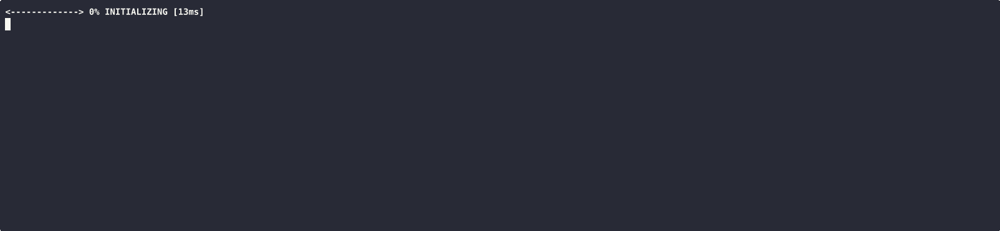
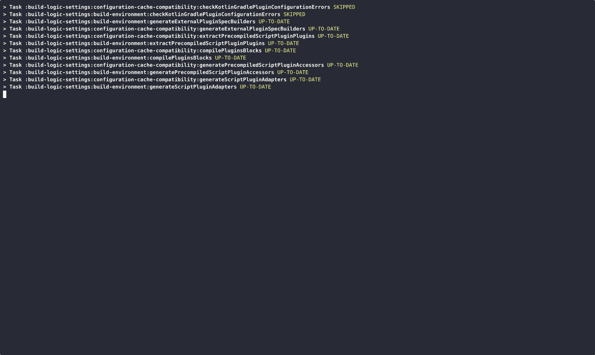

<meta property="og:image" content="https://gradle.org/images/releases/gradle-default.png" />
<meta property="og:type"  content="article" />
<meta property="og:title" content="Gradle @version@ Release Notes" />
<meta property="og:site_name" content="Gradle Release Notes">
<meta property="og:description" content="We are excited to announce Gradle @version@.">
<meta name="twitter:card" content="summary_large_image">
<meta name="twitter:site" content="@gradle">
<meta name="twitter:creator" content="@gradle">
<meta name="twitter:title" content="Gradle @version@ Release Notes">
<meta name="twitter:description" content="We are excited to announce Gradle @version@.">
<meta name="twitter:image" content="https://gradle.org/images/releases/gradle-default.png">

We are excited to announce Gradle @version@ (released [@releaseDate@](https://gradle.org/releases/)).

This release features [1](), [2](), ... [n](), and more.

<!--
Include only their name, impactful features should be called out separately below.
 [Some person](https://github.com/some-person)

 THIS LIST SHOULD BE ALPHABETIZED BY [PERSON NAME] - the docs:updateContributorsInReleaseNotes task will enforce this ordering, which is case-insensitive.
-->

We would like to thank the following community members for their contributions to this release of Gradle:

Be sure to check out the [public roadmap](https://roadmap.gradle.org) for insight into what's planned for future releases.

## Upgrade instructions

Switch your build to use Gradle @version@ by updating the [wrapper](userguide/gradle_wrapper.html) in your project:

```text
./gradlew wrapper --gradle-version=@version@ && ./gradlew wrapper
```

See the [Gradle 9.x upgrade guide](userguide/upgrading_version_9.html#changes_@baseVersion@) to learn about deprecations, breaking changes, and other considerations when upgrading to Gradle @version@.

For Java, Groovy, Kotlin, and Android compatibility, see the [full compatibility notes](userguide/compatibility.html).

## New features and usability improvements

<!-- Do not add breaking changes or deprecations here! Add them to the upgrade guide instead. -->

<!--

================== TEMPLATE ==============================

<a name="FILL-IN-KEY-AREA"></a>
### FILL-IN-KEY-AREA improvements

<<<FILL IN CONTEXT FOR KEY AREA>>>
Example:
> The [configuration cache](userguide/configuration_cache.html) improves build performance by caching the result of
> the configuration phase. Using the configuration cache, Gradle can skip the configuration phase entirely when
> nothing that affects the build configuration has changed.

#### FILL-IN-FEATURE
> HIGHLIGHT the use case or existing problem the feature solves
> EXPLAIN how the new release addresses that problem or use case
> PROVIDE a screenshot or snippet illustrating the new feature, if applicable
> LINK to the full documentation for more details

To embed videos, use the macros below.
You can extract the URL from YouTube by clicking the "Share" button.
For Wistia, contact Gradle's Video Team.
@youtube(Summary,6aRM8lAYyUA?si=qeXDSX8_8hpVmH01)@
@wistia(Summary,a5izazvgit)@

================== END TEMPLATE ==========================


==========================================================
ADD RELEASE FEATURES BELOW
vvvvvvvvvvvvvvvvvvvvvvvvvvvvvvvvvvvvvvvvvvvvvvvvvvvvvvvvvv -->


<a name="ear-plugin"></a>
### Ear Plugin

It is now possible to generate valid deployment descriptors for Jakarta EE 11
by specifying the corresponding version in the `deploymentDescriptor` instead of having to use a custom descriptor file.

```kotlin
tasks.ear {
    deploymentDescriptor {  // custom entries for application.xml:
        version = "11"
    }
}
```

<a name="cli"></a>
### CLI improvements

#### Off-screen lines reported in rich console

This release adds a status line to the `rich` console that reports the number of in-progress events not currently visible on screen.

```console
> (2 lines not showing)
```

This occurs when there are more ongoing events than the console has lines available to display them.



#### Plain console with colors

This release adds a new value for the `--console` command line option called `colored`, which enables color output for the console while omitting rich features such as progress bars.



<a name="build-authoring"></a>
### Build authoring improvements

#### Introduce `AttributeContainer#addAllLater`

This release introduces a new API on `AttributeContainer` allowing all attributes from one attribute container to be lazily added to another.

Consider the following example demonstrating the new API's behavior:

```kotlin
val color = Attribute.of("color", String::class.java)
val shape = Attribute.of("shape", String::class.java)

val foo = configurations.create("foo").attributes
foo.attribute(color, "green")

val bar = configurations.create("bar").attributes
bar.attribute(color, "red")
bar.attribute(shape, "square")
assert(bar.getAttribute(color) == "red")    // `color` is originally red

bar.addAllLater(foo)
assert(bar.getAttribute(color) == "green")  // `color` gets overwritten
assert(bar.getAttribute(shape) == "square") // `shape` does not

foo.attribute(color, "purple")
bar.getAttribute(color) == "purple"         // addAllLater is lazy

bar.attribute(color, "orange")
assert(bar.getAttribute(color) == "orange") // `color` gets overwritten again
assert(bar.getAttribute(shape) == "square") // `shape` remains the same
```

#### Accessors for `compileOnly` plugin dependencies in precompiled Kotlin scripts

Previously, it was not possible to use a plugin coming from a `compileOnly` dependency in a [precompiled Kotlin script](userguide/implementing_gradle_plugins_precompiled.html).
Now it is supported, and [​type-safe accessors​]​(​userguide/kotlin_dsl.html#type-safe-accessors​) for plugins from such dependencies are available in the precompiled Kotlin scripts.

As an example, the following `buildSrc/build.gradle.kts` build script declares a `compileOnly` dependency to a third party plugin:
```kotlin
plugins {
    `kotlin-dsl`
}
dependencies {
    compileOnly("com.android.tools.build:gradle:x.y.z")
}
```
And a convention precompiled Kotlin script in `buildSrc/src/main/kotlin/my-convention-plugin.gradle.kts` applies it, and can now use type-safe accessors to configure the third party plugin:
```kotlin
plugins {
    id("com.android.application")
}
android {
    // The accessor to the `android` extension registered by the Android plugin is available
}
```

#### Introduce `Gradle#getBuildPath`

This release introduces a new API on the [Gradle](javadoc/org/gradle/api/invocation/Gradle.html) type that returns the path of the build represented by the `Gradle` instance, relative to the root of the build tree.
For the root build, this will return `:`.
For included builds, this will return the path of the included build relative to the root build.

This is the same path returned by `BuildIdentifier#getBuildPath`, but it is now available directly on the `Gradle` instance.
This enables build authors to obtain the path of a build, similar to how they can already obtain the path of a project.

The following example demonstrates how to determine the path of the build which owns a given project:

```kotlin
val project: Project = getProjectInstance()
val buildPath: String = project.gradle.buildPath
```

#### Build initialization now uses the `kotlin-test` dependency for Kotlin projects
In previous versions of Gradle, the [`init` task](userguide/build_init_plugin.html) generated build scripts with the `org.jetbrains.kotlin:kotlin-test-junit5` dependency for kotlin projects.
The `init` task now generates build scripts with the `org.jetbrains.kotlin:kotlin-test` dependency instead.
The appropriate test framework variant will be inferred automatically based on the test runner configured.
For more information, refer to the [Kotlin Gradle Configuration documentation](https://kotlinlang.org/docs/gradle-configure-project.html#set-dependencies-on-test-libraries) or
the `[kotlin-test](https://kotlinlang.org/api/core/kotlin-test/)` api documentation.

### Configuration improvements

#### Simpler target package configuration for Antlr 4
The AntlrTask class now supports explicitly setting the target package for generated code when using Antlr 4.
Previously, setting the "-package" argument also required setting the output directory in order to generate classes into the proper package-specific directory structure.
This release introduces a `packageName` property that allows you to set the target package without needing to also set the output directory properly.
Setting this property will set the "-package" argument for the Antlr tool, and will also set the generated class directory to match the package.

Explicitly setting the "-package" argument is now deprecated, and will become an error in Gradle 10.

This option is not available for versions before Antlr 4 and will result in an error if this property is set.

```kotlin
tasks.named("generateGrammarSource").configure {
    // Set the target package for generated code
    packageName = "com.example.generated"
}
```

#### Antlr generated sources are automatically tracked
In previous versions of Gradle, the Antlr-generated sources were added to a java source set for compilation, but if the generated sources directory was changed, this change was not reflected in the source set.
This required manually updating the source set to include the new generated sources directory any time it was changed.
In this release, the generated sources directory is automatically tracked and updates the source set accordingly.
A task dependency is also created between the source generation task and the source set, ensuring that tasks that consume the source set as an input will automatically create a task dependency on the source generation task.

#### Specify the Repository in MavenPublication.distributionManagement

For a Maven publication, it is now possible to specify the repository used for distribution in the published POM file.

For example, to specify the GitHub Packages repository in the POM file, use this code:
```kotlin
plugins {
  id("maven-publish")
}

publications.withType<MavenPublication>().configureEach {
  pom {
    distributionManagement {
      repository {
        id = "github"
        name = "GitHub OWNER Apache Maven Packages"
        url = "https://maven.pkg.github.com/OWNER/REPOSITORY"
      }
    }
  }
}
```

### Error and warning reporting improvements

#### Improved error message for Version Constraint Conflicts

In previous versions of Gradle when a version constraint conflict occurred the error message was extremely verbose and included extraneous information.
It also was formatted in a way that was difficult to comprehend, especially when constraints involved in the conflict were added by transitive dependencies.

```
> Could not resolve org:foo:3.2.
  Required by:
      root project 'test'
   > Cannot find a version of 'org:foo' that satisfies the version constraints:
        Dependency path: 'root project :' (conf) --> 'org:bar:2.0' (runtime) --> 'org:foo:3.1'
        Constraint path: 'root project :' (conf) --> 'org:platform:1.1' (platform) --> 'org:foo:{strictly 3.1.1; reject 3.1 & 3.2}'
        Constraint path: 'root project :' (conf) --> 'org:foo:3.2'
        Constraint path: 'root project :' (conf) --> 'org:baz:3.0' (runtime) --> 'org:foo:3.3'
        Constraint path: 'root project :' (conf) --> 'org:other:3.0' (runtime) --> 'org:foo:3.3'
```

The new message focuses attention on the conflicting versions required by the constraints involved in the conflict.

```
> Could not resolve org:foo.
  Required by:
      root project 'mec0k'
   > Component is the target of multiple version constraints with conflicting requirements:
     3.1.1 - directly in 'org:platform:1.1' (platform)
     3.2
     3.3 - transitively via 'org:baz:3.0' (runtime) (1 other path to this version)
```

This makes it clearer by:
- Immediately stating that there is a conflict in version constraints for a component, and not merely a failure to _find_ a suitable candidate in the searched repositories when resolving dependencies
- Clearly showing each constrained version involved in the conflict
- Showing where the conflicting constraints are declared (either the project doing resolution, its direct dependencies, its transitive dependencies, or dependency locking) _without_ showing the complete dependency paths, which can be long and hard to read and are available in the dependency insight report
- Showing how many paths to each constraint exist in the dependency graph, but only printing the first one, which is usually sufficient to understand the conflict

It also avoids showing non-strict dependency declarations, like the first line in the old version, which are irrelevant to understanding the conflict.

A suggestion message at the end of the build will also provide the exact syntax for running `dependencyInsight` on the failing configuration, to further investigate it by viewing comprehensive dependency resolution information.

<!-- ^^^^^^^^^^^^^^^^^^^^^^^^^^^^^^^^^^^^^^^^^^^^^^^^^^^^^
ADD RELEASE FEATURES ABOVE
==========================================================

-->

### Task graph diagnostic

A new task dependency graph is available to visualize the dependencies between tasks without executing them.
You can enable it using the `--task-graph` option on the command line. For example:
```
./gradlew root r2 --task-graph
```
This prints a visual representation of the task graph for the specified tasks:
```
Tasks graph for: root r2
+--- :root (org.gradle.api.DefaultTask)
|    \--- :middle (org.gradle.api.DefaultTask)
|         +--- :leaf1 (org.gradle.api.DefaultTask)
|         \--- :leaf2 (org.gradle.api.DefaultTask, disabled)
\--- :root2 (org.gradle.api.DefaultTask)
    +--- :leaf1 (*)
    |--- other build task :included:fromIncluded (org.gradle.api.DefaultTask)
    \--- :leaf4 (org.gradle.api.DefaultTask, finalizer)
         \--- :leaf3 (org.gradle.api.DefaultTask)

(*) - details omitted (listed previously)
```

This feature provides a quick overview of the task graph, helping users understand the dependencies between tasks without running them.
You can iterate by diving into a subgraph by adjusting an invocation.

This feature is incubating and may change in future releases.
#### Fixed `--dry-run` behavior in composite builds

Gradle now correctly respects `--dry-run` in composite builds, ensuring that tasks are not executed during the execution phase of included builds.

Note that tasks from some included builds may still be executed during configuration time, as part of their configuration logic.

This restores expected behavior and makes `--dry-run` safer for previewing task execution plans across composite builds.

### Project report updated

The [Project Report](userguide/project_report_plugin.html) has been updated to show projects' physical locations in the file system, as well as their logical build paths.

```
------------------------------------------------------------
Root project 'avoidEmptyProjects-do'
------------------------------------------------------------

Location: /usr/jsmith/projects/avoidEmptyProjects-do
Description: Example project to demonstrate Gradle's project hierarchy and locations

Project hierarchy:

Root project 'avoidEmptyProjects-do'
+--- Project ':app'
\--- Project ':my-web-module'

Project locations:

project ':app' - /app
project ':my-web-module' - /subs/web/my-web-module

To see a list of the tasks of a project, run gradle <project-path>:tasks
For example, try running gradle :app:tasks
```

This will help authors better understand the structure of hierarchical builds that use non-standard project directories.

<a name="config-cache"></a>
### Configuration cache improvements

Gradle's [configuration cache](userguide/configuration_cache.html) improves build performance by caching the result of the configuration phase. Gradle uses the configuration cache to skip the configuration phase entirely when nothing that affects the build configuration has changed.

#### Encryption honors the JVM's default keystore type

Previously, Gradle always used the PKCS12 keystore type for its encryption keystore (currently used only by the Configuration Cache), regardless of the JVM's default.
Starting with this release, Gradle will honor the JVM’s default keystore type, provided it supports storing symmetric keys.
If the default keystore type is a known format that only supports asymmetric keys, Gradle will fall back to `PKCS12`.

<!-- ^^^^^^^^^^^^^^^^^^^^^^^^^^^^^^^^^^^^^^^^^^^^^^^^^^^^^
ADD RELEASE FEATURES ABOVE
==========================================================

-->

## Promoted features

Promoted features are features that were incubating in previous versions of Gradle but are now supported and subject to backward compatibility.
See the User Manual section on the "[Feature Lifecycle](userguide/feature_lifecycle.html)" for more information.

The following are the features that have been promoted in this Gradle release.

* [`getDependencyFactory()`](javadoc/org/gradle/api/Project.html) in `Project`

## Fixed issues

<!--
This section will be populated automatically
-->

## Known issues

Known issues are problems that were discovered post-release that are directly related to changes made in this release.

<!--
This section will be populated automatically
-->

## External contributions

We love getting contributions from the Gradle community. For information on contributing, please see [gradle.org/contribute](https://gradle.org/contribute).

## Reporting problems

If you find a problem with this release, please file a bug on [GitHub Issues](https://github.com/gradle/gradle/issues) adhering to our issue guidelines.
If you're not sure if you're encountering a bug, please use the [forum](https://discuss.gradle.org/c/help-discuss).

We hope you will build happiness with Gradle, and we look forward to your feedback via [Twitter](https://twitter.com/gradle) or on [GitHub](https://github.com/gradle).
