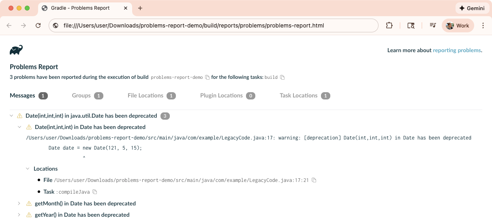

<meta property="og:image" content="https://gradle.org/assets/images/releases/gradle-default.png" />
<meta property="og:type"  content="article" />
<meta property="og:title" content="Gradle @version@ Release Notes" />
<meta property="og:site_name" content="Gradle Release Notes">
<meta property="og:description" content="We are excited to announce Gradle @version@.">
<meta name="twitter:card" content="summary_large_image">
<meta name="twitter:site" content="@gradle">
<meta name="twitter:creator" content="@gradle">
<meta name="twitter:title" content="Gradle @version@ Release Notes">
<meta name="twitter:description" content="We are excited to announce Gradle @version@.">
<meta name="twitter:image" content="https://gradle.org/assets/images/releases/gradle-default.png">

We are excited to announce Gradle @version@ (released [@releaseDate@](https://gradle.org/releases/)).

Gradle now supports [Java 26](#support-for-java-26).

This release significantly improves [test reporting and execution](#test-reporting-and-execution) by introducing support for non-class-based tests, enabling direct execution of Cucumber features and custom test engines, and capturing richer test metadata directly into HTML reports.

There are notable [command-line interface and problem reporting](#cli-logging-and-problem-reporting) refinements, including high-resolution progress bars with native terminal integration, a more intuitive Problems HTML report, and expanded output formats for the PMD plugin.

This version also enhances [build authoring](#build-authoring) with simplified APIs, improves [Configuration Cache](#configuration-cache) debugging with clearer attribution for closures and lambdas, and adds [security improvements](#security-and-infrastructure), including Bearer token authentication for the Gradle Wrapper and automatic cleanup of daemon logs. 
We've refined [plugin authoring](#core-plugin-and-plugin-authoring) by adding default plugin IDs and stricter validation for published plugins.

Finally, [tooling integration](#tooling-and-ide-integration) improvements provide new Tooling API models plus granular control over Tooling API parallelism.

We would like to thank the following community members for their contributions to this release of Gradle:
[akankshaa-00](https://github.com/akankshaa-00),
[Attila Kelemen](https://github.com/kelemen),
[Björn Kautler](https://github.com/Vampire),
[dblood](https://github.com/dblood),
[Dennis Rieks](https://github.com/drieks),
[duvvuvenkataramana](https://github.com/duvvuvenkataramana),
[John Burns](https://github.com/wakingrufus),
[Julian](https://github.com/Julianw03),
[kevinstembridge](https://github.com/kevinstembridge),
[Niels Doucet](https://github.com/NielsDoucet),
[Philip Wedemann](https://github.com/hfhbd),
[ploober](https://github.com/ploober),
[Richard Hernandez](https://github.com/rhernandez35),
[Roberto Perez Alcolea](https://github.com/rpalcolea),
[Sebastian Lövdahl](https://github.com/slovdahl),
[stephan2405](https://github.com/stephan2405),
[Stephane Landelle](https://github.com/slandelle),
[Ujwal Suresh Vanjare](https://github.com/usv240),
[Victor Merkulov](https://github.com/urdak),
[Vincent Potuček](https://github.com/Pankraz76),
[Vladimir Sitnikov](https://github.com/vlsi).

Be sure to check out the [public roadmap](https://roadmap.gradle.org) for insight into what's planned for future releases.

## Upgrade instructions

Switch your build to use Gradle @version@ by updating the [wrapper](userguide/gradle_wrapper.html) in your project:

```text
./gradlew wrapper --gradle-version=@version@ && ./gradlew wrapper
```

See the [Gradle 9.x upgrade guide](userguide/upgrading_version_9.html#changes_@baseVersion@) to learn about deprecations, breaking changes, and other considerations when upgrading to Gradle @version@.

For Java, Groovy, Kotlin, and Android compatibility, see the [full compatibility notes](userguide/compatibility.html).

## New features and usability improvements

### Support for Java 26

With this release, Gradle supports [Java 26](https://openjdk.org/projects/jdk/26/).
This means you can now use Java 26 for the [daemon](userguide/gradle_daemon.html) in addition to [toolchains](userguide/toolchains.html).
Third-party tool compatibility with Java 26 may still be limited.

See the [compatibility documentation](userguide/compatibility.html#java_runtime) for more details.

### Test reporting and execution

Gradle provides a [set of features and abstractions](userguide/java_testing.html) for testing JVM code, along with test reports to display results.

#### Non-class-based testing

When testing using [JUnit Platform](https://junit.org/), Gradle can now discover and execute tests that are not defined in classes.

JUnit Platform [`TestEngine`s](https://docs.junit.org/current/advanced-topics/engines.html) can discover and execute tests in arbitrary formats, extending testing beyond the confines of JVM classes.
In this release, tests can be defined in any format supported by the configured `TestEngine`.
Gradle no longer requires a test class to be present to “unlock” test execution.

For example, this library project structure doesn't use typical class-based testing, but instead uses XML test definitions understood by a custom `TestEngine`:

```text
my-lib/
├── src/
│   ├── main/
│   │   └── java/
│   └── test/
│       └── definitions/
│           ├── some-tests.xml
│           ├── some-other-tests.xml
│           └── sub/
│               └── even-more-tests.xml
└── build.gradle.kts
```

```kotlin
testing.suites.named("test", JvmTestSuite::class) {
    useJUnitJupiter()

    dependencies {
        implementation("...") // Library containing custom TestEngine
    }

    targets.all {
        testTask.configure {
            testDefinitionDirs.from("src/test/definitions") // Conventional non-class-based test definitions location
        }
    }
}
```

This feature works both with and without using [JvmTestSuites](userguide/jvm_test_suite_plugin.html).

We recommend storing non-class test definitions in the conventional location `src/<TEST_TASK_NAME>/definitions` to keep builds using this feature structured similarly; however, any location can be used.

For more information, see the section on [Non-Class-Based Testing](userguide/java_testing.html#sec:non-class-based-testing) in the User Manual.

##### Improved Cucumber support

`TestEngine`s such as [Cucumber](https://cucumber.io/) previously required workarounds when testing with Gradle, such as creating an empty `@Suite` class, or using a JUnit extension like `@RunWith(Cucumber.class)` to satisfy Gradle's class-based test discovery requirement.

These non-class-based tests can now be run directly without workarounds:

```kotlin
testing.suites.named("test", JvmTestSuite::class) {
    useJUnitJupiter()

    dependencies {
        implementation("io.cucumber:cucumber-java:7.15.0")
        runtimeOnly("io.cucumber:cucumber-junit-platform-engine:7.15.0")
    }

    targets.all {
        testTask.configure {
            testDefinitionDirs.from("src/test/resources")  // Conventional Cucumber *.feature files location
        }
    }
}

```

#### Additional test data capture

During test execution, JUnit Platform tests can emit additional data such as file attachments or arbitrary key–value pairs using the [TestReporter API](https://docs.junit.org/current/api/org.junit.jupiter.api/org/junit/jupiter/api/TestReporter.html).

This data can include metadata about the tests or their environment, or files used or generated during testing, such as screenshots.

For example:

```java
@Test
void someTestMethod(TestReporter testReporter) {
    testReporter.publishEntry("myKey", "myValue");
    testReporter.publishFile("screenshot1.svg", MediaType.create("image", "svg+xml"), file -> {});
    // Test logic continues...
}
```

Gradle now captures this metadata and integrates it directly into both the HTML test report and the [XML test results](userguide/java_testing.html#test_reporting).

When a test publishes data, the HTML report now features two additional tabs alongside the standard `stdout` and `stderr`:

- **Data**: Displays custom key–value entries.
- **Attachments**: Provides links to any published file attachments.

To ensure compatibility with CI/CD pipelines, this data is represented in the XML output as follows:

- `ReportEntry` values are mapped to `<properties/>`.
- `FileEntry` values are formatted as `[[ATTACHMENT|/path/to/file]]`, following established conventions used by Jenkins, Azure Pipelines, and GitLab.

This capture mechanism is comprehensive; it supports both class-based and non-class-based tests and includes data published during test construction as well as setup and teardown phases.

This is especially useful for capturing failure screenshots in UI tests.
For file attachments, some known media types, such as images and videos, are rendered directly in the HTML reports.  Other file types are presented as links.
This can make it easier to diagnose issues without reproducing them locally:


#### Test metadata logging

Test data capture events, as detailed in the previous section, can be observed by Gradle through a new [listener](userguide/build_lifecycle.html#buildlistener_api) dedicated to test metadata events during execution, allowing for more sophisticated tracking of test behavior.

Similar to the existing [`TestOutputListener`](javadoc/org/gradle/api/tasks/testing/TestOutputListener.html), you can now register a [`TestMetadataListener`](javadoc/org/gradle/api/tasks/testing/TestMetadataListener.html) to receive structured metadata events emitted by the test framework.
This is done via the new [`Test#addTestMetadataListener(TestMetadataListener)`](dsl/org.gradle.api.tasks.testing.Test.html#addTestMetadataListener(TestMetadataListener)) method:

```kotlin
class LoggingListener(val logger: Logger) : TestMetadataListener {
    override fun onMetadata(descriptor: TestDescriptor , event: TestMetadataEvent) {
        logger.lifecycle("Got metadata event: " + event.toString())
    }
}

tasks.named<Test>("test").configure {
    addTestMetadataListener(LoggingListener())
}
```

This addition enables fuller support for advanced JUnit Platform features.
It allows tests to communicate structured information back to the build process, providing a cleaner and more reliable alternative to parsing standard output or error streams.
For example, you can use the listener to automatically copy the failure screenshots (from the previous section) to a dedicated CI artifacts directory, upload them to cloud storage for team access, or compress and archive them with timestamp-based naming.

### CLI, logging, and problem reporting

Gradle provides an intuitive [command-line interface](userguide/command_line_interface.html), detailed [logs](userguide/logging.html), and a structured [problems report](userguide/reporting_problems.html#sec:generated_html_report) that helps developers quickly identify and resolve build issues.

#### Enhanced terminal progress bars

Gradle’s [command-line interface](userguide/command_line_interface.html) has been updated with progress bars that offer enhanced compatibility for modern terminals:

- **Ligature-Safe Rendering:** Progress bars no longer interfere with ligature fonts, ensuring a clean visual experience.
- **Unicode Support:** High-resolution Unicode characters are now used for rendering whenever the terminal supports them.
- **Native Terminal Integration:** Added support for OSC 9;4 escape sequences. This allows native progress bar display in terminals like [Ghostty](https://ghostty.org/) and [iTerm2 >3.6.6](https://iterm2.com/).

The progress bars are displayed on terminals that support them:


#### Problems HTML report refinements

The incubating [Problems HTML report](userguide/reporting_problems.html#sec:generated_html_report) has been refined to provide a more intuitive and efficient user experience.

To help you find relevant information faster, the report's structure and readability have been optimized:

- **Clearer Summaries:** The summary clearly displays the number of problems that lack a specific location or were skipped for performance reasons.
- **Smart Hierarchy:** Each tab loads with collapsed trees for a cleaner initial view, while specific location and solution nodes are expanded by default to reduce the number of clicks needed to see actionable data.
- **Logical Sorting:** All entries are sorted alphabetically and by location.
- **Improved Formatting:** Problem details use a monospaced font, ensuring that multi-line messages and stack traces maintain their intended alignment.
- **Reduced Noise:** Duplicate information has been removed across the report, and the overall file size has been reduced for faster loading.



You can now influence whether a link to the report is printed at the end of a build via the `org.gradle.warning.mode` property.
If set to `none`, the report is still generated in the background, but the link is omitted from the build output to keep your console clean.

#### Support for CSV, Code Climate, and SARIF reports in the PMD plugin

The [PMD plugin](userguide/pmd_plugin.html), which performs quality checks on your Java source files, has expanded its reporting capabilities.

In addition to standard XML and HTML, the plugin now supports generating reports in CSV, Code Climate, and SARIF formats.
This allows for easier ingestion of PMD results by static analysis platforms and CI/CD security dashboards.

These formats are not enabled by default.
To use them, configure the specific `Pmd` task (such as `pmdMain`) rather than the general `pmd` extension:

```kotlin
// Note that report configuration must be done on the `Pmd` task (here `pmdMain`), not the `pmd` extension.
tasks.pmdMain {
    reports {
        csv.required = true
        // Optional, defaults to "<project dir>/build/reports/pmd/main.csv"
        csv.outputLocation = layout.buildDirectory.file("reports/my-custom-pmd-report.csv")

        codeClimate.required = true
        // Optional, defaults to "<project dir>/build/reports/pmd/main.codeclimate.json"
        codeClimate.outputLocation = layout.buildDirectory.file("reports/my-custom-codeclimate-pmd-report.json")

        sarif.required = true
        // Optional, defaults to "<project dir>/build/reports/pmd/main.sarif.json"
        sarif.outputLocation = layout.buildDirectory.file("reports/my-custom-sarif-pmd-report.json")
    }
}
```

For more information on configuring static analysis, see the [PMD plugin documentation](userguide/pmd_plugin.html#sec:pmd_configuration).

### Security and infrastructure

Gradle provides robust [security features and underlying infrastructure](userguide/security.html) to ensure that builds are secure, reproducible, and easy to maintain.

#### Bearer token authentication for wrapper download

The [Gradle Wrapper](userguide/gradle_wrapper.html) now supports Bearer token authentication for downloading Gradle distributions from authenticated backends.
This provides a modern, secure alternative to Basic authentication (username and password), which was the only method supported in previous versions:

* **Authentication Priority:** Bearer tokens can be specified via system properties and take precedence over Basic authentication if both are configured.
* **Per-Host Configuration:** To prevent credential leakage, both Basic and Bearer authentication can now be configured on a per-host basis. This ensures your credentials are only sent to the specific hosts you authorize, rather than being broadcast globally.

While these authentication methods are supported over both HTTP and HTTPS, using a secure HTTPS backend is strongly preferred.

For more details on setup, see the [Wrapper documentation](userguide/gradle_wrapper.html#sec:authenticated_download).

#### Daemon logging improvements

The [Gradle Daemon](userguide/gradle_daemon.html) is a long-lived, persistent process that runs in the background and hosts Gradle’s execution engine.
It dramatically reduces build times using caching, runtime optimizations, and eliminating JVM startup overhead.

Gradle Daemon logs older than 14 days are now automatically cleaned up when the daemon shuts down, eliminating the need for manual cleanup.

See the [Daemon documentation](userguide/gradle_daemon.html#sec:daemon_log_cleanup) for more details.

### Build authoring

Gradle provides [rich APIs](userguide/getting_started_dev.html) for build engineers and plugin authors, enabling the creation of custom, reusable build logic and better maintainability.

#### `Configuration.extendsFrom` accepts `Provider`s

It is now possible to pass a `Provider<Configuration>` directly when calling [`extendsFrom()`](javadoc/org/gradle/api/artifacts/Configuration.html#extendsFrom(org.gradle.api.artifacts.Configuration...)) on a [`Configuration`](javadoc/org/gradle/api/artifacts/Configuration.html)).

By accepting a `Provider`, Gradle can now establish the relationship without requiring the parent to be realized immediately:

```kotlin
configurations {
    // dependencyScope creates a Provider<Configuration>
    val parent = dependencyScope("parent")
    val child = resolvable("child") {
        // No .get() required; the relationship is established lazily
        extendsFrom(parent) // previously required 'parent.get()' 
    }
}
```

### Configuration Cache

Gradle provides a [Configuration Cache](userguide/configuration_cache.html) that improves build time by caching the result of the configuration phase and reusing it for subsequent builds.

#### Clearer attribution for closures and lambdas

Identifying the source of [Configuration Cache violations](userguide/configuration_cache_debugging.html) can be challenging when a task contains multiple lambdas or closures.
Common examples include task actions like `doFirst`/`doLast`, or task predicates such as `onlyIf`, `upToDateWhen`, and `cacheIf`/`doNotCacheIf`.

Previously, if one of these closures captured an unsupported type (such as a reference to the enclosing script), the [problem report](userguide/configuration_cache_debugging.html#config_cache:troubleshooting) was often ambiguous:

```kotlin
fun myFalse() = false

fun noOp() { } 

tasks.register("myTask") {
    outputs.cacheIf { myFalse() }
    outputs.doNotCacheIf("reason") { myFalse() }
    outputs.upToDateWhen { myFalse() }
    onlyIf { myFalse() }
    doLast { noOp() }
}
```    

In earlier versions, the report would reference a cryptic generated class name, leaving you to guess which specific block was the culprit:


Starting with this release, the [Configuration Cache report](userguide/configuration_cache_debugging.html#config_cache:troubleshooting) now explicitly identifies the type of action or spec associated with each lambda.
This provides the necessary context to pinpoint and fix the violation immediately:


### Core plugin and plugin authoring

Gradle provides a comprehensive plugin system, including built-in [Core Plugins](userguide/plugin_reference.html) for standard tasks and powerful APIs for creating custom plugins.

#### Default plugin IDs

This release reduces the boilerplate required for plugin authors when using the [`java-gradle-plugin` plugin](userguide/java_gradle_plugin.html#sec:gradle_plugin_dev_usage) by introducing a sensible default for plugin IDs.

Previously, you had to explicitly provide a string for both the registration name and the `id` property.
Now, the plugin ID is automatically set to the registration name by default:

```kotlin
gradlePlugin {
    plugins {
        register("my.plugin-id") {
            // id is automatically inferred as "my.plugin-id"
            implementationClass = "my.PluginClass"
        }
    }
}
```

This change makes your build scripts cleaner and less repetitive, especially in projects that define multiple plugins.
If you still need a custom ID that differs from the registration name, the `id` property remains available for manual overrides.

For more details, check out the [Java Gradle Plugin documentation](userguide/java_gradle_plugin.html).

#### Stricter validation for published plugins

To ensure high quality and compatibility across the [plugin ecosystem](userguide/plugins.html), Gradle now automatically enables [stricter validation](userguide/preparing_to_publish.html#validating) for projects that use the `com.gradle.plugin-publish`, `ivy-publish`, or `maven-publish` plugins.

This validation catches common issues, such as missing task input annotations or improper property definitions, before a plugin is distributed.

To avoid breaking your internal builds, this automatic enforcement does not apply to local plugins (e.g., those in `buildSrc` or included builds).

While only enabled by default for publishing, we recommend opting into stricter validation for all plugin projects to ensure they are robust and future-proof.
You can enable it manually in your build script:

```kotlin
tasks.validatePlugins {
    enableStricterValidation = true
}
```

### Tooling and IDE integration

Gradle provides [Tooling APIs](userguide/third_party_integration.html) that facilitate deep integration with modern IDEs and CI/CD pipelines.

#### New property for Tooling API parallelism control

Gradle now provides granular control over how [Tooling API](userguide/tooling_api.html) clients interact with your build in parallel using a new `org.gradle.tooling.parallel` [property](userguide/build_environment.html#sec:gradle_configuration_properties).

Previously, parallelism for Tooling API actions was tied directly to the `org.gradle.parallel` property.
This meant that if you wanted to enable parallel task execution, you were forced to also enable parallel IDE actions, and vice versa.

The new property decouples these two behaviors.
This is particularly relevant for the IDE Sync scenarios, where IDEs can take advantage of the parallelism to improve performance (independently of your task execution strategy):

```text
# gradle.properties

// Controls parallelism for Tooling API clients (e.g., IDE Sync)
org.gradle.tooling.parallel=true

// Controls parallelism for task execution (e.g., build/test)
org.gradle.parallel=false
```

When `org.gradle.tooling.parallel` is not specified, it defaults to the value of `org.gradle.parallel`, preserving existing behavior and performance characteristics.
For more information, see the [Tooling API parallelism configuration](userguide/performance.html#sec:configure_tooling_api_actions_parallelism) section of the user guide.

#### Tooling integration improvements

This release adds a few enhancements to the built-in [Tooling API](userguide/tooling_api.html) models:

- **Instant Version Info:** Clients can now access the exact output of `gradle --version` without starting a daemon, via the new [`BuildEnvironment.getVersionInfo()`](javadoc/org/gradle/tooling/model/build/BuildEnvironment.html#getVersionInfo()) property.
- **Built-in Help Model:** A new [`Help`](javadoc/org/gradle/tooling/model/build/Help.html) model exposes the output of the `gradle --help` command-line build invocation.

The following example demonstrates how to retrieve version and help information using a [`ProjectConnection`](javadoc/org/gradle/tooling/ProjectConnection.html):

```java
import org.gradle.tooling.GradleConnector;
import org.gradle.tooling.ProjectConnection;
import org.gradle.tooling.model.build.BuildEnvironment;
import org.gradle.tooling.model.build.Help;

import java.io.File;

void main() {
    var projectDir = new File("/path/to/project");
    try (var conn = GradleConnector.newConnector().forProjectDirectory(projectDir).connect()) {
        System.out.println("--version:\n + " + conn.getModel(BuildEnvironment.class).getVersionInfo());
        System.out.println("--help:\n" + conn.getModel(Help.class).getRenderedText());
    }
}
```

## Promoted features

Promoted features are features that were incubating in previous versions of Gradle but are now supported and subject to backward compatibility.
See the User Manual section on the "[Feature Lifecycle](userguide/feature_lifecycle.html)" for more information.

The following are the features that have been promoted in this Gradle release.

* [`getSettingsDirectory()`](javadoc/org/gradle/api/file/ProjectLayout.html#getSettingsDirectory()) in `ProjectLayout`

### Task graph is now stable

The [task graph](userguide/command_line_interface.html#sec:command_line_execution_options), introduced as an incubating feature in Gradle 9.1.0, is now stable.
It is no longer marked as experimental.

## Documentation and training

### Documentation

#### User Manual

A brand-new section of the User Manual has been started, called [Securing Your Gradle Builds](userguide/security.html).

#### Best Practices

The following best practices have been added in this Gradle release:
- [Prefer the -bin Gradle Distribution](userguide/best_practices_performance.html#prefer_bin_distribution)

### Training

The following course is now available:
- [Authoring Gradle Plugins](https://dpeuniversity.gradle.com/app/courses/7603d9fb-620d-4d60-8e79-ee94433dc2b1)

## Fixed issues

## Known issues

Known issues are problems that were discovered post-release that are directly related to changes made in this release.

## External contributions

We love getting contributions from the Gradle community. For information on contributing, please see [gradle.org/contribute](https://gradle.org/contribute).

## Reporting problems

If you find a problem with this release, please file a bug on [GitHub Issues](https://github.com/gradle/gradle/issues) adhering to our issue guidelines.
If you're not sure if you're encountering a bug, please use the [forum](https://discuss.gradle.org/c/help-discuss).

We hope you will build happiness with Gradle, and we look forward to your feedback via [Twitter](https://twitter.com/gradle) or on [GitHub](https://github.com/gradle).
