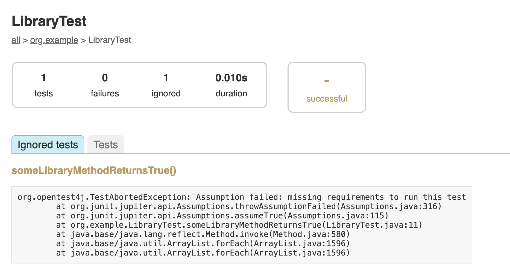

<meta property="og:image" content="https://gradle.org/images/releases/gradle-default.png" />
<meta property="og:type"  content="article" />
<meta property="og:title" content="Gradle @version@ Release Notes" />
<meta property="og:site_name" content="Gradle Release Notes">
<meta property="og:description" content="Gradle @version@ adds support for Java 24, Native Image toolchains, improved skipped test reporting, lazy dependency configuration for better performance, richer diagnostics via the Problems API, and a new integrity check mode for the configuration cache.">
<meta name="twitter:card" content="summary_large_image">
<meta name="twitter:site" content="@gradle">
<meta name="twitter:creator" content="@gradle">
<meta name="twitter:title" content="Gradle @version@ Release Notes">
<meta name="twitter:description" content="Gradle @version@ adds support for Java 24, Native Image toolchains, improved skipped test reporting, lazy dependency configuration for better performance, richer diagnostics via the Problems API, and a new integrity check mode for the configuration cache.">
<meta name="twitter:image" content="https://gradle.org/images/releases/gradle-default.png">

Gradle @version@ is the first patch release for Gradle 8.14 (released [@releaseDate@](https://gradle.org/releases/)).

It fixes the following issues:

* TODO

We recommend users upgrade to @version@ instead of 8.14.

***

Gradle now supports [Java 24](#java-24).

This release adds support for selecting [GraalVM Native Image toolchains](#toolchains), and includes [enhancements to the test report](#junit) when tests are skipped, for example, because of assumptions.

Gradle @version@ introduces [lazy dependency configuration initialization](#configurations-are-initialized-lazily) to improve configuration performance and memory usage. The [Problems API](#expanded-support-for-arbitrary-data-in-the-problems-api) is expanded to support arbitrary structured data, making it easier for IDEs to consume rich diagnostics through the Tooling API.

Additionally, the [configuration cache](#configuration-cache) includes a new integrity check mode for improved debugging.

<!-- 
Include only their name, impactful features should be called out separately below.
 [Some person](https://github.com/some-person)

 THIS LIST SHOULD BE ALPHABETIZED BY [PERSON NAME] - the docs:updateContributorsInReleaseNotes task will enforce this ordering, which is case-insensitive.
-->

We would like to thank the following community members for their contributions to this release of Gradle:
[Aurimas](https://github.com/liutikas),
[Ben Bader](https://github.com/benjamin-bader),
[Björn Kautler](https://github.com/Vampire),
[chandre92](https://github.com/chandre92),
[Daniel Hammer](https://github.com/dlehammer),
[Danish Nawab](https://github.com/danishnawab),
[Florian Dreier](https://github.com/DreierF),
[Ivy Chen](https://github.com/Mengmeiivy),
[Jendrik Johannes](https://github.com/jjohannes),
[jimmy1995-gu](https://github.com/jimmy1995-gu),
[Madalin Valceleanu](https://github.com/vmadalin),
[Na Minhyeok](https://github.com/NaMinhyeok).

Be sure to check out the [public roadmap](https://roadmap.gradle.org) for insight into what's planned for future releases.

## Upgrade instructions

Switch your build to use Gradle @version@ by updating the [Wrapper](userguide/gradle_wrapper.html) in your project:

```text
./gradlew wrapper --gradle-version=@version@ && ./gradlew wrapper
```

See the [Gradle 8.x upgrade guide](userguide/upgrading_version_8.html#changes_@baseVersion@) to learn about deprecations, breaking changes, and other considerations when upgrading to Gradle @version@.

For Java, Groovy, Kotlin, and Android compatibility, see the [full compatibility notes](userguide/compatibility.html).   

## New features and usability improvements

<a name="java-24"></a>
### Support for Java 24

With this release, Gradle supports [Java 24](https://openjdk.org/projects/jdk/24/). This means you can now use Java 24 for the [daemon](userguide/gradle_daemon.html) in addition to [toolchains](userguide/toolchains.html).

Third-party tool compatibility with Java 24 may still be limited. If you're using the [Tooling API](userguide/tooling_api.html), you’ll need to enable native access at startup due to its use of JNI. See [JEP 472](https://openjdk.org/jeps/472) for details.

See [the compatibility documentation](userguide/compatibility.html#java_runtime) for more details.

<a name="toolchains"></a>
### GraalVM Native Image selection for toolchains

Gradle's [toolchain support](userguide/toolchains.html) allows provisioning and selection of specific JDK versions for building projects—compiling code, running tests, and even running Gradle itself.

With this release, toolchain selection has been expanded to support [GraalVM Native Image](https://www.graalvm.org/reference-manual/native-image/) capability:

```kotlin
java {
    toolchain {
        languageVersion = JavaLanguageVersion.of(21)
        nativeImageCapable = true
    }
}
```

This allows Gradle to select only JDKs that support Native Image when resolving a toolchain.
See the [toolchain documentation](userguide/toolchains.html#sec:native_graalvm_image) for more details.

Note: Native Image capability selection is also supported for the [daemon toolchain](userguide/gradle_daemon.html#sec:native_image).

<a name="junit"></a>
### Skipped tests now report assumption violations

When a test is skipped due to an assumption violation, Gradle now includes the reason in both the HTML and JUnit XML reports. This applies to JUnit 4, JUnit Platform, and TestNG.
For example, JUnit Platform provides an [Assumptions API](https://junit.org/junit5/docs/5.0.0/api/org/junit/jupiter/api/Assumptions.html) to conditionally skip tests:

```java
package org.example;

import org.junit.jupiter.api.Test;
import static org.junit.jupiter.api.Assumptions.*;

class LibraryTest {
    @Test 
    void someLibraryMethodReturnsTrue() {
        assumeTrue(canExecute(), "missing requirements to run this test");
        // Code for the rest of the test
    }   
}
```

If the assumeTrue check fails, the reason ("missing requirements to run this test") is now visible in the XML and HTML test report:



This feature was contributed by [Ivy Chen](https://github.com/Mengmeiivy) with [Aurimas Liutikas](https://github.com/liutikas).

<a name="build-authoring"></a>
### Build authoring improvements

Gradle provides [rich APIs](userguide/getting_started_dev.html) for plugin authors and build engineers to develop custom build logic.

#### Configurations are initialized lazily

Just like [tasks](userguide/lazy_configuration.html), [dependency configurations](userguide/declaring_configurations.html) are now realized only when necessary.

Starting with this release, applying the `base` plugin—either directly or via another plugin such as the Java or Kotlin plugin—no longer realizes all configurations declared with `register` or the incubating role-based factory methods (like `configurations.resolvable(...)`).

This change can lead to reduced configuration time and lower memory usage in some builds.

To take advantage of this improvement, make sure to use the `register` method over `create` when declaring configurations:

```kotlin
configurations {
    // Eager: this configuration is realized immediately
    create("myEagerConfiguration")

    // Lazy: this configuration is only realized when needed
    register("myLazyConfiguration")
}
```

#### Expanded support for arbitrary data in the Problems API

Gradle 8.13 introduced support for [additional data](javadoc/org/gradle/tooling/events/problems/CustomAdditionalData.html) in the [Problems API](userguide/reporting_problems.html), allowing users to attach extra context to reported problems—albeit with some limitations.

This release removes these limitations. You can now include _any_ arbitrary data in problem reports.

This enhancement is especially valuable for IDE implementors managing both the plugin and its integration via the [Tooling API](userguide/tooling_api.html), where conveying rich, structured diagnostics is critical.

For example, a custom worker task can report a problem and attach detailed additional data—including primitive fields, lists, and composed objects:

```java
public abstract class ProblemWorkerTask implements WorkAction<ProblemsWorkerTaskParameter> {

    // Use the Problems interface to report problems
    @Inject
    public abstract Problems getProblems();

    // Use the ObjectFactory to create instances of classes for composition
    @Inject
    public abstract ObjectFactory getObjectFactory();

    @Override
    public void execute() {
        ProblemId problemId = ProblemId.create("type", "label", ProblemGroup.create("generic", "Generic"));
        getProblems().getReporter().report(problemId, problem -> problem
            .additionalData(SomeData.class, dataInstance -> {
                // Provider API properties can be used as arbitrary data
                dataInstance.getSome().set("some");
                // Getters and setters can be used as arbitrary data
                dataInstance.setName("someData");
                // Collections can be used as arbitrary data
                dataInstance.setNames(Collections.singletonList("someMoreData"));
                
                SomeOtherData compositionDataInstance = getObjectFactory().newInstance(SomeOtherData.class);
                compositionDataInstance.setOtherName("otherName");
                
                // Composition can be used as arbitrary data
                dataInstance.setOtherData(compositionDataInstance);
            })
        );
    }
}
```

The data attached to the problem is modeled with plain interfaces that use Gradle types where applicable:

```java
import org.gradle.api.problems.AdditionalData;
import org.gradle.api.provider.Property;
import java.util.List;

public interface SomeData extends AdditionalData {
    Property<String> getSome();

    String getName();
    void setName(String name);

    List<String> getNames();
    void setNames(List<String> names);

    SomeOtherData getOtherData();
    void setOtherData(SomeOtherData otherData);
}

public interface SomeOtherData {
    String getOtherName();
    void setOtherName(String name);
}
```


With this enhancement, the Problems API becomes a more powerful diagnostic tool—capable of carrying rich, structured, and typed context through the build, IDE, and Tooling API layers.

#### Receiving additional data via the Tooling API

The new [`CustomAdditionalData.get()`](/javadoc/org/gradle/tooling/events/problems/CustomAdditionalData.html#get(java.lang.Class)) method in the Tooling API (TAPI) allows consumers to retrieve additional data associated with build problems (or other events) reported during a Gradle build.

Previously, consumers of the Tooling API could only access a fixed set of predefined fields when inspecting problems or build events. With this new method, Gradle can serialize rich, structured data during the build and expose it to the Tooling API as a type-safe view interface.

On the receiving side, you can access this data like so:

```java
void someMethod(List<Problem> problems) {
    SomeDataView view = problems.get(0).getAdditionalData().get(SomeDataView.class);
    
    System.out.println(view.getName());
    System.out.println(view.getNames().get(0));
    System.out.println(view.getOtherData().getOtherName());
}
```

These view interfaces mirror the structure of the data produced by the build logic:

```java
interface SomeOtherDataView {
    String getOtherName();
}

interface SomeDataView {
    String getSome();

    String getName();

    List<String> getNames();

    SomeOtherDataView getOtherData();
}
```

These types provide a safe and structured way to consume custom data in IDEs or other TAPI-based tools, without relying on brittle parsing or assumptions about internal data formats.

<a name="configuration-cache"></a>
### Configuration cache improvements

The [configuration cache](userguide/configuration_cache.html) improves build time by caching the result of the configuration phase and reusing it for subsequent builds.
This feature can significantly improve build performance.

#### Integrity Check mode

To help diagnose obscure configuration cache loading errors, you can now enable stricter [integrity checks](userguide/configuration_cache.html#config_cache:integrity_check) using the `org.gradle.configuration-cache.integrity-check` property.

This mode provides more detailed error messages to pinpoint the exact part of your build that failed to serialize correctly.

For example, instead of seeing a cryptic error like:

```text
Index 4 out of bounds for length 3
```

You might now see:

```text
Configuration cache state could not be cached: field `user` of task `:greet` of type `GreetTask`: The value cannot be decoded properly with 'JavaObjectSerializationCodec'. It may have been written incorrectly or its data is corrupted.
```

Note: Enabling integrity checks increases the size of the configuration cache and slows down cache reads/writes.
Use it only for troubleshooting—not in regular builds.

## Fixed issues

<!--
This section will be populated automatically
-->

## Known issues

Known issues are problems that were discovered post-release that are directly related to changes made in this release.

<!--
This section will be populated automatically
-->

## External contributions

We love getting contributions from the Gradle community. For information on contributing, please see [gradle.org/contribute](https://gradle.org/contribute).

## Reporting problems

If you find a problem with this release, please file a bug on [GitHub Issues](https://github.com/gradle/gradle/issues) adhering to our issue guidelines.
If you're not sure if you're encountering a bug, please use the [forum](https://discuss.gradle.org/c/help-discuss).

We hope you will build happiness with Gradle, and we look forward to your feedback via [Twitter](https://twitter.com/gradle) or on [GitHub](https://github.com/gradle).
