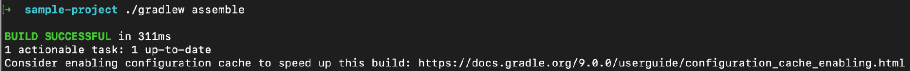

<meta property="og:image" content="https://gradle.org/whats-new/gradle-9/opengraph.png" />
<meta property="og:type"  content="article" />
<meta property="og:title" content="Gradle @version@ Release Notes" />
<meta property="og:site_name" content="Gradle Release Notes">
<meta property="og:description" content="We are excited to announce Gradle @version@.">
<meta name="twitter:card" content="summary_large_image">
<meta name="twitter:site" content="@gradle">
<meta name="twitter:creator" content="@gradle">
<meta name="twitter:title" content="Gradle @version@ Release Notes">
<meta name="twitter:description" content="We are excited to announce major Gradle @version@.">
<meta name="twitter:image" content="https://gradle.org/whats-new/gradle-9/opengraph.png">

The Gradle team is excited to announce Gradle @version@, a new major release (released [@releaseDate@](https://gradle.org/releases/)).
For an overview of the changes between Gradle 8.0 and @version@, along with demos and videos, see [What’s New in Gradle 9](https://gradle.org/whats-new/gradle-9/).

This release makes [Configuration Cache](#config-cache) the preferred execution mode and introduces several enhancements to improve its behavior.

Gradle @version@ uses [Kotlin 2](#kotlin-2) and [Groovy 4](#groovy-4), and adopts [Semantic Versioning](#sem-ver) (SemVer) with version numbers in the format `MAJOR.MINOR.PATCH`.

It also introduces several improvements for [build authors](#build-authoring), including much better Kotlin DSL script compilation avoidance, updates to the Gradle API, reproducible archive outputs, and a new dependency graph root type that allows detached configurations to resolve project dependencies.

Gradle @version@ includes numerous bug fixes and general improvements.
As a major release, it also introduces changes to deprecated APIs and behaviors.
For details on what has been removed or updated, refer to the [Gradle 8.x upgrade guide](userguide/upgrading_version_8.html).

We would like to thank the following community members for their contributions to this release of Gradle:
[Aaron Matthis](https://github.com/rapus95),
[Adam E](https://github.com/adam-enko),
[Adam S](https://github.com/aSemy),
[Björn Kautler](https://github.com/Vampire),
[Daniel Lacasse](https://github.com/lacasseio),
[Eng Zer Jun](https://github.com/Juneezee),
[EunHyunsu](https://github.com/ehs208),
[FlorianMichael](https://github.com/FlorianMichael),
[Francisco Prieto](https://github.com/priettt),
[Gaëtan Muller](https://github.com/MGaetan89),
[Jake Wharton](https://github.com/JakeWharton),
[Kengo TODA](https://github.com/KengoTODA),
[Kent Kaseda](https://github.com/kaseken),
[Madalin Valceleanu](https://github.com/vmadalin),
[Marc Philipp](https://github.com/marcphilipp),
[Mark S. Lewis](https://github.com/bestbeforetoday),
[Matthew Haughton](https://github.com/3flex),
[Mycroft Wong](https://github.com/MycroftWong),
[Na Minhyeok](https://github.com/NaMinhyeok),
[Nelson Osacky](https://github.com/runningcode),
[Olivier "Oli" Dagenais](https://github.com/olivierdagenais),
[ploober](https://github.com/ploober),
[Radai Rosenblatt](https://github.com/radai-rosenblatt),
[Róbert Papp](https://github.com/TWiStErRob),
[Sebastian Schuberth](https://github.com/sschuberth),
[Victor Merkulov](https://github.com/urdak).

Be sure to check out the [public roadmap](https://blog.gradle.org/roadmap-announcement) for insight into what's planned for future releases.

## Upgrade instructions

Switch your build to use Gradle @version@ by updating the [wrapper](userguide/gradle_wrapper.html) in your project:

```
./gradlew wrapper --gradle-version=@version@ && ./gradlew wrapper
```

See the [Gradle 8.x upgrade guide](userguide/upgrading_version_8.html#changes_@baseVersion@) to learn about deprecations, breaking changes, and other considerations when upgrading to Gradle @version@.

For Java, Groovy, Kotlin, and Android compatibility, see the [full compatibility notes](userguide/compatibility.html).   

## New features and usability improvements

<a name="config-cache"></a>
### Configuration Cache improvements

Gradle's [Configuration Cache](userguide/configuration_cache.html) improves build performance by caching and reusing the result of the configuration phase.

#### Configuration Cache as the preferred execution mode

The Configuration Cache is the preferred mode of execution.
While not yet required, Gradle encourages adoption by prompting users and gradually phasing out incompatible APIs to prepare for a future where it becomes the only supported mode.

#### Prompt to enable Configuration Cache

If your build has no known Configuration Cache incompatibilities but doesn't yet have the [Configuration Cache enabled](userguide/configuration_cache_enabling.html#config_cache:usage:enable), Gradle will suggest enabling it at the end of the build:



Some issues can only be detected when the Configuration Cache is active, so additional refinements may still be needed to fully [adopt](userguide/configuration_cache_enabling.html#config_cache:adoption) it.

If you're not ready to invest time in this yet, you can suppress the suggestion by explicitly disabling the feature in your `gradle.properties` file:

```
org.gradle.configuration-cache=false
```

#### Graceful fallback from Configuration Cache mode

Gradle falls back to non-Configuration Cache mode automatically when encountering unsupported features, instead of failing the build.

This includes:

- [Core plugins](userguide/configuration_cache.html#config_cache:plugins:core) with limited support (such as Maven Publish and Ivy Publish)
- Unsupported or incompatible IDE plugins (such as Eclipse and IDEA)
- Features not yet supported (such as [Source Dependencies](userguide/configuration_cache.html#config_cache:not_yet_implemented:source_dependencies))

After running a build, the reason for the fallback can be found in the [Configuration Cache report](userguide/reporting_problems.html#reporting_problems).

#### Other notable Configuration Cache updates

Additional updates for the [Configuration Cache](userguide/configuration_cache.html) include:

- Tasks marked as incompatible prevent cache hits in [warning mode](userguide/configuration_cache_debugging.html#enable_warning_mode), ensuring correctness. Warning mode should only be used during migration or troubleshooting. [Marking tasks as incompatible](userguide/configuration_cache_debugging.html#config_cache:task_opt_out) remains a recommended strategy for gradual adoption.
- Task execution will abort immediately when a Configuration Cache problem is encountered, avoiding undefined behavior and ensuring affected tasks are neither marked up-to-date nor cached.
- The [Configuration Cache report](userguide/configuration_cache_debugging.html#config_cache:troubleshooting) includes more detailed errors, such as serialization issues, unsafe concurrent access, and Groovy DSL closures capturing script state.

<a name="jvm-17"></a>
### Gradle requires Java Virtual Machine (JVM) version 17 or higher to run

Gradle requires a Java Virtual Machine (JVM) version [17 or higher](userguide/upgrading_major_version_9.html#jvm-17) to start the Gradle daemon.

If you need to build with older JVM versions, you can specify a separate JDK toolchain in the build definition by using [toolchains](userguide/toolchains.html).  
Gradle still supports compiling, testing and running other JVM-based tools with Java 8 and higher.

See the [Compatibility Matrix](userguide/compatibility.html) for more information.

<a name="kotlin-2"></a>
### Update to Kotlin 2

Gradle embeds the latest stable release of [Kotlin 2.2.x](userguide/compatibility.html#kotlin) runtime and uses [Kotlin language version 2.2](userguide/compatibility.html#kotlin).
This marks a shift from Gradle 8.x, which embedded Kotlin 2.0 starting in 8.11 but continued to use Kotlin language version 1.8 for compatibility.

For a comprehensive overview of what’s new, see the [Kotlin 2.2.0](https://kotlinlang.org/docs/whatsnew22.html), [Kotlin 2.1.0](https://kotlinlang.org/docs/whatsnew21.html) and [Kotlin 2.0.0](https://kotlinlang.org/docs/whatsnew20.html) release notes.

Gradle uses Kotlin for build logic, which includes:

- Build scripts written in the Kotlin DSL (`.gradle.kts` files)
- Plugins

As a result, some behavior has changed, most notably the new K2 compiler and [nullability annotations on APIs](#jspecify).
If you're upgrading, review the [Gradle 9.0.0 upgrade guide](userguide/upgrading_major_version_9.html#kotlin-2) for migration details.

<a name="groovy-4"></a>
### Update to Groovy 4

Gradle embeds the latest stable release of [Groovy 4.0](userguide/compatibility.html#groovy), a major upgrade from the Groovy 3.0 version used in Gradle 7 and 8.

This update introduces a range of new features and improvements to the Groovy language.
For a comprehensive overview of what’s new, see the [Groovy 4.0 release notes](https://groovy-lang.org/releasenotes/groovy-4.0.html) for full details.

Gradle uses Groovy for build logic, which includes:
Build scripts written in the Groovy DSL (`.gradle` files)
Ant integration
Plugins

Some behavior has changed between Groovy 3.0 and 4.0. If you're upgrading, review the [Gradle 9.0.0 upgrade guide](userguide/upgrading_major_version_9.html#groovy-4) for migration details.

<a name="sem-ver"></a>
### Semantic Versioning for Gradle releases

Starting with Gradle 9, all Gradle releases follow the [Semantic Versioning (SemVer)](https://semver.org/spec/v2.0.0.html) specification.

Version numbers are expressed as `MAJOR.MINOR.PATCH`, whereas previous minor releases omitted the patch segment (e.g., `8.5` instead of `8.5.0`).

This change only applies to new releases and does not retroactively affect older versions or backports.
Additionally, internal code and features marked with `@Incubating` are not considered part of the public API and may [change in minor releases](userguide/feature_lifecycle.html#sec:incubating_state).

<a name="build-authoring"></a>
### Build authoring improvements

Gradle provides rich APIs for plugin authors and build engineers to develop custom build logic.

<a name="compilation-avoidance"></a>
#### Kotlin build script compilation avoidance

Gradle speeds up feedback loops when editing build logic by avoiding unnecessary recompilation of [Kotlin DSL](userguide/kotlin_dsl.html) (`.kts`) build scripts.
This reduces build times and improves developer productivity.

The improvement comes from significantly better detection of ABI (Application Binary Interface) changes, made possible by using Kotlin’s built-in ABI fingerprinting instead of Gradle’s previous internal mechanism.
This brings major performance benefits, especially in builds that use inline functions, which were not handled efficiently before.

For example, in the [Gradle build](https://github.com/gradle/gradle) itself, non-ABI changes to build logic result in up to a 60% reduction in configuration time by avoiding unnecessary script recompilation.


<a name="jspecify"></a>
#### Gradle API uses JSpecify Nullability annotations

Since Gradle 5.0 we've been using annotations from [JSR-305](https://jcp.org/en/jsr/detail?id=305) to make the nullness of type usages explicit for the Gradle API.
Starting with Gradle 9, the Gradle API is annotated using [JSpecify](https://jspecify.dev/) instead.

Kotlin 2.1, when combined with JSpecify annotations in the Gradle API, introduces stricter nullability handling.
For more details and potential breakages, see the dedicated [upgrading guide section](userguide/upgrading_major_version_9.html#jspecify).

<a name="sem-ver-wrapper"></a>
#### Support for major and minor version specification in Gradle Wrapper

Gradle supports specifying only a major or minor version when configuring the [wrapper](userguide/gradle_wrapper.html).

For example, the following resolves to the latest `9.x.y` release:

```
./gradlew wrapper --gradle-version=9
```

While the following resolves to the latest `9.1.x` release:

```
./gradlew wrapper --gradle-version=9.1
```

This feature requires Gradle 9.0.0 or later.
Earlier versions don’t follow full semantic versioning and may misinterpret partial versions (e.g., `8.12` might refer to `8.12` (because it's an exact version) and `8.12.1` (semantically the latest version for `8.12`).

Gradle’s [version information endpoint](https://services.gradle.org/versions/) has been extended to support this behavior. For instance, [https://services.gradle.org/versions/9](https://services.gradle.org/versions/9) lists all versions of Gradle with major version 9.

#### Archive tasks produce reproducible archives by default

Archive tasks such as `Jar`, `Ear`, `War`, `Zip`, `Tar`, and `AbstractArchiveTask` produce [reproducible archives by default](userguide/working_with_files.html#sec:reproducible_archives).
This means that generated archives have reproducible file order and preconfigured file timestamps and permissions.
As a result archives generated from the same inputs will be identical byte-for-byte.

This change may affect builds that rely on non-deterministic archive characteristics like file order, file system timestamps, or file system permissions, or file executable bit.

For more information, see the [upgrading guide section](userguide/upgrading_major_version_9.html#reproducible_archives_by_default).

#### Detached configurations can resolve dependencies on their own project

[Detached configurations](javadoc/org/gradle/api/artifacts/ConfigurationContainer.html#detachedConfiguration(org.gradle.api.artifacts.Dependency...)) are able to resolve dependencies that reference their own project.

To do this, Gradle introduces a new subtype of [`ComponentIdentifier`](javadoc/org/gradle/api/artifacts/component/ComponentIdentifier.html) called [`RootComponentIdentifier`](javadoc/org/gradle/api/artifacts/component/RootComponentIdentifier.html), which represents the root node of a [resolved dependency graph](userguide/graph_resolution.html#dependency_graph).

When a configuration is resolved, it is first transformed into a synthetic variant. This variant is owned by a synthetic root component, which is identified using `RootComponentIdentifier`. The root component itself exists only to own the root variant.

Dependency graphs resolved from detached configurations and `buildscript` configurations will have a component identified by a `RootComponentIdentifier` at the root of their graph. This lets Gradle differentiate between a detached configuration and the project it lives in.

[Resolved project configurations](userguide/declaring_configurations.html) will continue to have their root component live within the project's component and identified by a [`ProjectComponentIdentifier`](javadoc/org/gradle/api/artifacts/component/ProjectComponentIdentifier.html). In future Gradle versions, all configurations, including those declared inside projects (non-detached), will be owned by a synthetic root component identified by a `RootComponentIdentifier`.

#### `JAVA_HOME` environment variable used for toolchain auto-detection

Gradle's [toolchain support](userguide/toolchains.html) allows provisioning and selection of specific JDK versions for building projects—compiling code, running tests, and even running Gradle itself.

This release adds support for using the `JAVA_HOME` environment variable as a source for [toolchain auto-detection](userguide/toolchains.html#sec:auto_detection).
This change improves consistency between toolchains detected from the command line and those detected by IDEs, which previously did not consider `JAVA_HOME`.

<a name="documentation"></a>
### Documentation improvements

#### Gradle Best Practices

In partnership with JetBrains and Google, we've launched a new [Gradle Best Practices guide](userguide/best_practices.html) to help you avoid common pitfalls and write more maintainable, performant builds.
These recommendations consolidate community knowledge and Gradle team insights into a single, growing resource.
The current version covers best practices in dependency declarations, build structure, task authoring, and more.

For more information, check out the [Gradle Best Practices](https://blog.gradle.org/gradle-best-practices) blog post.

## Promoted features

Promoted features are features that were incubating in previous versions of Gradle but are now supported and subject to backward compatibility.
See the User Manual section on the "[Feature Lifecycle](userguide/feature_lifecycle.html)" for more information.

The following are the features that have been promoted in this Gradle release.

### Promoted features in the Kotlin DSL

The following operator functions in [`DependencyHandlerScope`](kotlin-dsl/gradle/org.gradle.kotlin.dsl/-dependency-handler-scope/index.html) are considered stable:
* `NamedDomainObjectProvider<Configuration>.invoke(dependencyNotation: Any): Dependency?`
* `NamedDomainObjectProvider<Configuration>.invoke(dependencyNotation: String, dependencyConfiguration: ExternalModuleDependency.() -> Unit): ExternalModuleDependency`
* `NamedDomainObjectProvider<Configuration>.invoke(group: String, name: String, version: String?, configuration: String?, classifier: String?, ext: String?): ExternalModuleDependency`
* `NamedDomainObjectProvider<Configuration>.invoke(group: String, name: String, version: String?, configuration: String?, classifier: String?, ext: String?, dependencyConfiguration: ExternalModuleDependency.() -> Unit): ExternalModuleDependency`
* `<T : Any> Configuration.invoke(dependency: Provider<T>, dependencyConfiguration: ExternalModuleDependency.() -> Unit)`
* `<T : Any> Configuration.invoke(dependency: ProviderConvertible<T>, dependencyConfiguration: ExternalModuleDependency.() -> Unit)`
* `<T : Any> NamedDomainObjectProvider<Configuration>.invoke(dependency: Provider<T>)`
* `<T : Any> NamedDomainObjectProvider<Configuration>.invoke(dependency: ProviderConvertible<T>)`
* `<T : Any> NamedDomainObjectProvider<Configuration>.invoke(dependency: Provider<T>, dependencyConfiguration: ExternalModuleDependency.() -> Unit)`
* `<T : Any> NamedDomainObjectProvider<Configuration>.invoke(dependency: ProviderConvertible<T>, dependencyConfiguration: ExternalModuleDependency.() -> Unit)`
* `<T : Any> String.invoke(dependency: Provider<T>, dependencyConfiguration: ExternalModuleDependency.() -> Unit)`
* `<T : Any> String.invoke(dependency: ProviderConvertible<T>, dependencyConfiguration: ExternalModuleDependency.() -> Unit)`
* `<T : ModuleDependency> NamedDomainObjectProvider<Configuration>.invoke(dependency: T, dependencyConfiguration: T.() -> Unit): T`

The following operator functions in [`DependencyConstraintHandlerScope`](kotlin-dsl/gradle/org.gradle.kotlin.dsl/-dependency-constraint-handler-scope/index.html) are considered stable:
* `NamedDomainObjectProvider<Configuration>.invoke(dependencyConstraintNotation: Any): DependencyConstraint`
* `NamedDomainObjectProvider<Configuration>.invoke(dependencyConstraintNotation: String, configuration: DependencyConstraint.() -> Unit): DependencyConstraint`

The following top-level functions in [`DependencyHandlerExtensions`](kotlin-dsl/gradle/org.gradle.api.artifacts.dsl/-dependency-handler/index.html) are considered stable:
* `DependencyHandler.create(dependencyNotation: String, dependencyConfiguration: ExternalModuleDependency.() -> Unit): ExternalModuleDependency`

The following top-level functions in [`KotlinDependencyExtensions`](kotlin-dsl/gradle/org.gradle.api.artifacts.dsl/-dependency-handler/index.html) are considered stable:
* `PluginDependenciesSpec.embeddedKotlin(module: String): PluginDependencySpec`

The following functions are considered stable:
* `GroovyBuilderScope.hasProperty(name: String): Boolean`

## Fixed issues

<!--
This section will be populated automatically
-->

## Known issues

Known issues are problems that were discovered post-release that are directly related to changes made in this release.

<!--
This section will be populated automatically
-->

## External contributions

We love getting contributions from the Gradle community. For information on contributing, please see [gradle.org/contribute](https://gradle.org/contribute).

## Reporting problems

If you find a problem with this release, please file a bug on [GitHub Issues](https://github.com/gradle/gradle/issues) adhering to our issue guidelines.
If you're not sure if you're encountering a bug, please use the [forum](https://discuss.gradle.org/c/help-discuss).

We hope you will build happiness with Gradle, and we look forward to your feedback via [Twitter](https://twitter.com/gradle) or on [GitHub](https://github.com/gradle).
