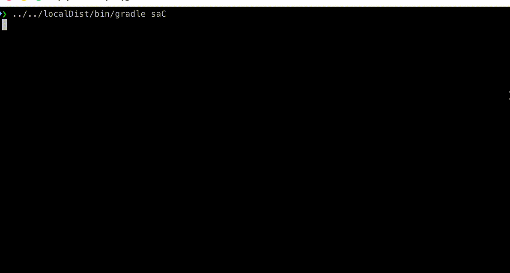
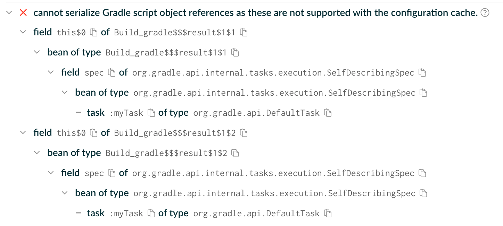
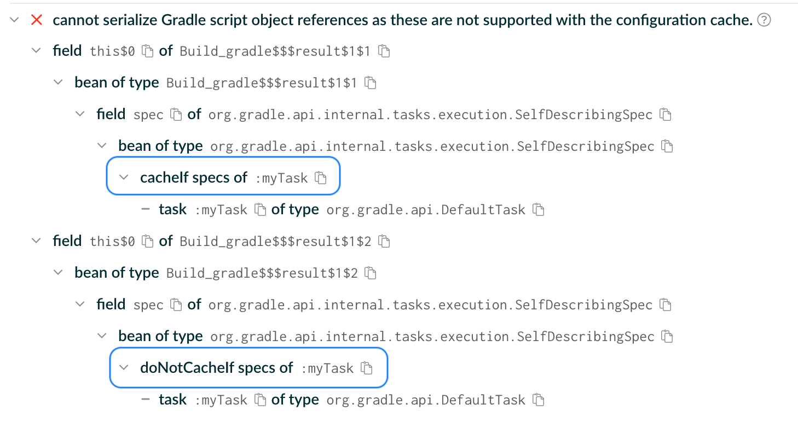

<meta property="og:image" content="https://gradle.org/images/releases/gradle-default.png" />
<meta property="og:type"  content="article" />
<meta property="og:title" content="Gradle @version@ Release Notes" />
<meta property="og:site_name" content="Gradle Release Notes">
<meta property="og:description" content="We are excited to announce Gradle @version@.">
<meta name="twitter:card" content="summary_large_image">
<meta name="twitter:site" content="@gradle">
<meta name="twitter:creator" content="@gradle">
<meta name="twitter:title" content="Gradle @version@ Release Notes">
<meta name="twitter:description" content="We are excited to announce Gradle @version@.">
<meta name="twitter:image" content="https://gradle.org/images/releases/gradle-default.png">

We are excited to announce Gradle @version@ (released [@releaseDate@](https://gradle.org/releases/)).

This release features [1](), [2](), ... [n](), and more.

<!--
Include only their name, impactful features should be called out separately below.
 [Some person](https://github.com/some-person)

 THIS LIST SHOULD BE ALPHABETIZED BY [PERSON NAME] - the docs:updateContributorsInReleaseNotes task will enforce this ordering, which is case-insensitive.
-->

We would like to thank the following community members for their contributions to this release of Gradle:
[Ujwal Suresh Vanjare](https://github.com/usv240).

Be sure to check out the [public roadmap](https://roadmap.gradle.org) for insight into what's planned for future releases.

## Upgrade instructions

Switch your build to use Gradle @version@ by updating the [wrapper](userguide/gradle_wrapper.html) in your project:

```text
./gradlew wrapper --gradle-version=@version@ && ./gradlew wrapper
```

See the [Gradle 9.x upgrade guide](userguide/upgrading_version_9.html#changes_@baseVersion@) to learn about deprecations, breaking changes, and other considerations when upgrading to Gradle @version@.

For Java, Groovy, Kotlin, and Android compatibility, see the [full compatibility notes](userguide/compatibility.html).

## New features and usability improvements

<!-- Do not add breaking changes or deprecations here! Add them to the upgrade guide instead. -->

### Bearer Token Authentication for Wrapper Download

When downloading Gradle distributions from an HTTPS backend (or even from an HTTP one, but the secure version is preferred), the Wrapper now also supports Bearer token authentication.
This is in addition to Basic authentication (username and password), which was the only supported method in previous versions.

Bearer tokens can be specified via system properties and take precedence over Basic authentication, if both configured.

Both Basic authentication and Bearer token authentication can now be configured on a per-host basis, which is the recommended approach for avoiding leaking credentials to unintended hosts.

See the [Wrapper documentation](userguide/gradle_wrapper.html#sec:authenticated_download) for further details.  

### Enhanced terminal progress bars

Gradle's progress bars are now more compatible with modern terminal environments:
Unicode characters are now used to render the progress bar where supported.
* Ligature-Safe Rendering: Progress bars no longer interfere with ligature fonts, ensuring a clean visual experience.
* Unicode Support: High-resolution Unicode characters are now used for rendering whenever the terminal supports them.
* Native Terminal Integration: Added support for OSC 9;4 escape sequences. This allows native progress bar display in terminals like [Ghostty](https://ghostty.org/) and [iTerm2 >3.6.6](https://iterm2.com/).
OSC 9;4 progress bar codes are now supported.
This allows the progress bars to be displayed correctly on terminals that support them.



### Problems HTML report refinements

The incubating Problems HTML report has been refined to provide a more useful user experience.

The summary clearly display the number of problems without location or skipped for performance reasons.
Each tab starts with collapsed trees to show a clear view of the root nodes on load.
Locations and solutions nodes are expanded by default, reducing the number of clicks necessary to see useful information.
Everything is sorted alphabetically and by location.
Problem details are displayed with a monospaced font to preserve the alignment of multi-line messages.
Duplicate information is reduced across the board for a better readability.
The size of the report file is reduced.

Printing a link to the report at the end of the build can now be influenced via the `org.gradle.warning.mode` Gradle property.
If the mode is set to `none`, the report is still generated but a link is omitted from the build output.

### Test Metadata Logging

Gradle now allows listening for test metadata events during test execution.
In the exact same manner as [`TestOutputListener`](javadoc/org/gradle/api/tasks/testing/TestOutputListener.html), a [`TestMetadataListener`](javadoc/org/gradle/api/tasks/testing/TestMetadataListener.html) can be registered to receive metadata events emitted by the test framework during via the new [`Test#addTestMetadataListener(TestMetadataListener)`](dsl/org.gradle.api.tasks.testing.Test.html#addTestMetadataListener(TestMetadataListener)) method.

```kotlin
class LoggingListener(val logger: Logger) : TestMetadataListener {
    override fun onMetadata(descriptor: TestDescriptor , event: TestMetadataEvent) {
        logger.lifecycle("Got metadata event: " + event.toString())
    }
}

tasks.named<Test>("test").configure {
    addTestMetadataListener(LoggingListener())
}
```

This addition enables support for additional JUnit Platform features, and allows tests to communicate additional information back to the process running the tests in a more structured manner than just logging to the standard output or error streams.

### Daemon logging improvements

Daemon logs older than 14 days are now automatically cleaned up when the daemon shuts down, eliminating the need for manual cleanup.

See the [daemon documentation](userguide/gradle_daemon.html#sec:daemon_log_cleanup) for more details.

### POM exclusion importing

When using the [Build Init Plugin](userguide/build_init_plugin.html#sec:pom_maven_conversion) to generate a Gradle build from an existing Maven project, Gradle now imports `<exclusion>` elements from the Maven POM and translates them into Gradle dependency exclusions.

```xml
<dependencies>
    <dependency>
        <groupId>sample.Project</groupId>
        <artifactId>Project</artifactId>
        <version>1.0</version>
        <exclusions>
            <exclusion>
                <groupId>excluded.group</groupId>
                <artifactId>excluded-artifact</artifactId>
            </exclusion>
        </exclusions>
    </dependency>
</dependencies>
```

Due to differences in how Maven and Gradle handle dependency exclusions, some exclusions may not translate perfectly.

The generated exclusions will be marked with a comment noting they require manual verification:

```kotlin
dependencies {
    implementation("some.group:some-artifact:1.0") {
        // TODO: This exclude was sourced from a POM exclusion and is NOT exactly equivalent
        exclude(group = "excluded.group", module = "excluded-artifact")
    }
}
```

### `Configuration.extendsFrom` accepts `Provider`s 

Previously, calling `extendsFrom()` on a `Configuration` required the specified parent configuration to be a realized `Configuration` object.  
It is now possible to specify a `Provider<Configuration>` instead, which does not require that a registered configuration be realized before specifying it as a parent configuration.

```kotlin
configurations {
    val parent = dependencyScope("parent")
    val child = resolvable("child") {
        extendsFrom(parent) // previously required 'parent.get()'
    }
```

### Support for CSV, Code Climate, and SARIF reports in the PMD plugin
The [PMD plugin](userguide/pmd_plugin.html) now supports generating reports in CSV, Code Climate, and SARIF formats in addition to the existing XML and HTML formats.

They are not enabled by default, but can be configured as follows:
```kotlin
// Note that report configuration must be done on the `Pmd` task (here `pmdMain`), not the `pmd` extension.
tasks.pmdMain {
    reports {
        csv.required = true
        // Optional, defaults to "<project dir>/build/reports/pmd/main.csv"
        csv.outputLocation = layout.buildDirectory.file("reports/my-custom-pmd-report.csv")
        
        codeClimate.required = true
        // Optional, defaults to "<project dir>/build/reports/pmd/main.codeclimate.json"
        codeClimate.outputLocation = layout.buildDirectory.file("reports/my-custom-codeclimate-pmd-report.json")
        
        sarif.required = true
        // Optional, defaults to "<project dir>/build/reports/pmd/main.sarif.json"
        sarif.outputLocation = layout.buildDirectory.file("reports/my-custom-sarif-pmd-report.json")
    }
}
```

## Plugin development

### Stricter validation for published plugins

For plugin builds that apply any of the `com.gradle.plugin-publish`, `ivy-publish`, or `maven-publish` plugins, Gradle now automatically enables stricter validation of plugin code.

In order not to break your builds, this does not apply to local plugins (in `buildSrc` or included builds containing build logic).
However, we encourage you to always enable stricter validation:

```kotlin
tasks.validatePlugins {
    enableStricterValidation = true
}
```

### Simpler plugin registration

Plugin builds that use the `java-gradle-plugin` can now register each plugin with less ceremony.
The plugin ID is now set to the registration's name by default:

```kotlin
gradlePlugin {
    plugins {
        register("my.plugin-id") {
            implementationClass = "my.PluginClass"
        }
    }
}
```

See the [Java Gradle Plugin](userguide/java_gradle_plugin.html#sec:gradle_plugin_dev_usage) plugin documentation for more information.

## Tooling integration improvements

This release adds a few enhancements to the built-in Tooling API models:
- Clients can now access the exact output of `gradle --version` without starting a daemon, via the new [`BuildEnvironment.getVersionInfo()`](javadoc/org/gradle/tooling/model/build/BuildEnvironment.html#getVersionInfo()) property.
- A new [`Help`](javadoc/org/gradle/tooling/model/build/Help.html) model exposes the output of the `gradle --help` command-line build invocation.

For example:

```java
import org.gradle.tooling.GradleConnector;
import org.gradle.tooling.ProjectConnection;
import org.gradle.tooling.model.build.BuildEnvironment;
import org.gradle.tooling.model.build.Help;

import java.io.File;

void main() {
    var projectDir = new File("/path/to/project");
    try (var conn = GradleConnector.newConnector().forProjectDirectory(projectDir).connect()) {
        System.out.println("--version:\n + " + conn.getModel(BuildEnvironment.class).getVersionInfo());
        System.out.println("--help:\n" + conn.getModel(Help.class).getRenderedText());
    }
}
```

### New property for Tooling API parallelism control

A new Gradle property `org.gradle.tooling.parallel` allows explicitly controlling whether Tooling API clients can run actions against the build in parallel.
This is particularly relevant for the IDE Sync scenarios, where IDEs can take advantage of the parallelism to improve performance.

```properties
# gradle.properties
org.gradle.tooling.parallel=true
```

Historically, this was only controlled by the `org.gradle.parallel` property, which is often used to get parallel task execution.
However, previously it was not possible to enable or disable one without affecting the other.

<!--

================== TEMPLATE ==============================

### FILL-IN-KEY-AREA improvements

<<<FILL IN CONTEXT FOR KEY AREA>>>
Example:
> The [configuration cache](userguide/configuration_cache.html) improves build performance by caching the result of
> the configuration phase. Using the configuration cache, Gradle can skip the configuration phase entirely when
> nothing that affects the build configuration has changed.

#### FILL-IN-FEATURE
> HIGHLIGHT the use case or existing problem the feature solves
> EXPLAIN how the new release addresses that problem or use case
> PROVIDE a screenshot or snippet illustrating the new feature, if applicable
> LINK to the full documentation for more details

To embed videos, use the macros below.
You can extract the URL from YouTube by clicking the "Share" button.
For Wistia, contact Gradle's Video Team.
@youtube(Summary,6aRM8lAYyUA?si=qeXDSX8_8hpVmH01)@
@wistia(Summary,a5izazvgit)@

================== END TEMPLATE ==========================


==========================================================
ADD RELEASE FEATURES BELOW
vvvvvvvvvvvvvvvvvvvvvvvvvvvvvvvvvvvvvvvvvvvvvvvvvvvvvvvvvv -->

### Support for Java 26

With this release, Gradle supports [Java 26](https://openjdk.org/projects/jdk/26/).
This means you can now use Java 26 for the [daemon](userguide/gradle_daemon.html) in addition to [toolchains](userguide/toolchains.html).
Third-party tool compatibility with Java 26 may still be limited.

See [the compatibility documentation](userguide/compatibility.html#java_runtime) for more details.


### Non-Class Based Testing

When testing using [JUnit Platform](https://junit.org/), Gradle can now discover and execute tests that are not defined in classes.

JUnit Platform [`TestEngine`](https://docs.junit.org/current/user-guide/#test-engines)s are capable of discovering and executing tests defined in arbitrary formats, extending testing beyond the confines of JVM classes.
However, Gradle's [`Test`](dsl/org.gradle.api.tasks.testing.Test.html) task requires test classes to be present; otherwise execution fails with a message:

```text
There are test sources present and no filters are applied, but the test task did not discover any tests to execute.
```

In this release, tests can be defined in whatever format is understood by the configured `TestEngine`.
Gradle no longer requires a test class be present to “unlock” test execution.

For example, this library project structure doesn't use typical class-based testing, but instead uses XML test definitions understood by a custom `TestEngine`:

```text
my-lib/
├── src/
│   ├── main/
│   │   └── test/
│   └── test/
│       └── definitions/
│           ├── some-tests.xml
│           ├── some-other-tests.xml
│           └── sub/
│               └── even-more-tests.xml
└── build.gradle.kts
```

```kotlin
testing.suites.named("test", JvmTestSuite::class) {
    useJUnitJupiter()

	dependencies {
	    implementation("...") // Library containing custom TestEngine
	}

    targets.all {
        testTask.configure {
            testDefinitionDirs.from("src/test/definitions") // Conventional non-class-based test definitions location
        }
    }
}
```

This feature works both with and without using [JvmTestSuites](userguide/jvm_test_suite_plugin.htm).

We recommend storing non-class test definitions in the conventional location `src/<TEST_TASK_NAME>/definitions` to keep builds using this feature structured similarly; however, any location can be used.

For more information, see the section on [Non-Class-Based Testing](userguide/java_testing.html) in the User Manual.

#### Improved Cucumber support

`TestEngine`s such as [Cucumber](https://cucumber.io/) previously required workarounds when testing with Gradle, such as creating an empty `@Suite` class, or using a JUnit extension like `@RunWith(Cucumber.class)` to satisfy Gradle's class-based test discovery requirement.

These non-class-based tests can now be run directly without workarounds:

```kotlin
    testing.suites.named("test", JvmTestSuite::class) {
        useJUnitJupiter()

        dependencies {
            implementation("io.cucumber:cucumber-java:7.15.0")
            runtimeOnly("io.cucumber:cucumber-junit-platform-engine:7.15.0")
        }

        targets.all {
            testTask.configure {
                testDefinitionDirs.from("src/test/resources")  // Conventional Cucumber *.feature files location
            }
        }
    }
```

### Additional test data capture

During test execution, JUnit Platform tests can emit additional data such as file attachments or arbitrary key–value pairs using the [TestReporter API](https://docs.junit.org/current/user-guide/#writing-tests-dependency-injection).

For example:

```java
    @Test
    void someTestMethod(TestReporter testReporter) {
        testReporter.publishEntry("myKey", "myValue");
        testReporter.publishFile("test1.txt", MediaType.TEXT_PLAIN_UTF_8, file -> Files.write(file, List.of("Test 1")));
        // Test logic continues...
    }
```

Gradle now captures this additional data and includes it in both the [HTML test report and the XML test results](userguide/java_testing.html#test_reporting).

In the HTML test report, when such data is published during a test, two new tabs are shown alongside `stdout` and `stderr`:

- Data – for key–value entries
- Attachments – for file attachments

In the JUnit XML report, the data is represented as:

- `ReportEntry` values as `<properties/>`
- `FileEntry` values as `[[ATTACHMENT|/path/to/file]]`, following conventions used by Jenkins, Azure Pipelines, and GitLab

This information is captured for both class-based and non-class-based tests, and includes data published during test construction as well as setup/teardown phases.

<a id="config-cache"></a>
## Configuration Cache improvements

The [Configuration Cache](userguide/configuration_cache.html) improves build time by caching the result of the configuration phase and reusing it for subsequent builds. This feature can significantly improve build performance.

### Clearer Attribution for Closures and Lambdas

Identifying the source of configuration cache violations can be challenging when a task contains multiple lambdas or closures.
Common examples include task actions like `doFirst`/`doLast`, or task predicates such as `onlyIf`, `upToDateWhen`, and `cacheIf`/`doNotCacheIf`. 
Previously, if one of these closures captured an unsupported type (such as a reference to the enclosing script), the [problem report](userguide/reporting_problems.html#sec:generated_html_report) was often ambiguous:

```kotlin
fun myFalse() = false

fun noOp() { } 

tasks.register("myTask") {
    outputs.cacheIf { myFalse() }
    outputs.doNotCacheIf("reason") { myFalse() }
    outputs.upToDateWhen { myFalse() }
    onlyIf { myFalse() }
    doLast { noOp() }
}
```    

In earlier versions, the report would reference a cryptic generated class name, leaving you to guess which specific block was the culprit:



Starting with this release, the [Configuration Cache report](userguide/configuration_cache_debugging.html#config_cache:troubleshooting) now explicitly identifies the type of action or spec associated with each lambda. 
This provides the necessary context to pinpoint and fix the violation immediately:



<!-- ^^^^^^^^^^^^^^^^^^^^^^^^^^^^^^^^^^^^^^^^^^^^^^^^^^^^^
ADD RELEASE FEATURES ABOVE
==========================================================

-->

## Promoted features

Promoted features are features that were incubating in previous versions of Gradle but are now supported and subject to backward compatibility.
See the User Manual section on the "[Feature Lifecycle](userguide/feature_lifecycle.html)" for more information.

The following are the features that have been promoted in this Gradle release.

* [`getSettingsDirectory()`](javadoc/org/gradle/api/file/ProjectLayout.html#getSettingsDirectory()) in `ProjectLayout`
<!--
### Example promoted
-->

### Task graph is now stable

The [task graph](userguide/command_line_interface.html#sec:command_line_execution_options), introduced as an incubating feature in Gradle 9.1.0, is now stable.
It's no longer marked as experimental.

## Fixed issues

<!--
This section will be populated automatically
-->

## Known issues

Known issues are problems that were discovered post-release that are directly related to changes made in this release.

<!--
This section will be populated automatically
-->

## External contributions

We love getting contributions from the Gradle community. For information on contributing, please see [gradle.org/contribute](https://gradle.org/contribute).

## Reporting problems

If you find a problem with this release, please file a bug on [GitHub Issues](https://github.com/gradle/gradle/issues) adhering to our issue guidelines.
If you're not sure if you're encountering a bug, please use the [forum](https://discuss.gradle.org/c/help-discuss).

We hope you will build happiness with Gradle, and we look forward to your feedback via [Twitter](https://twitter.com/gradle) or on [GitHub](https://github.com/gradle).
