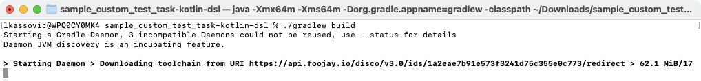
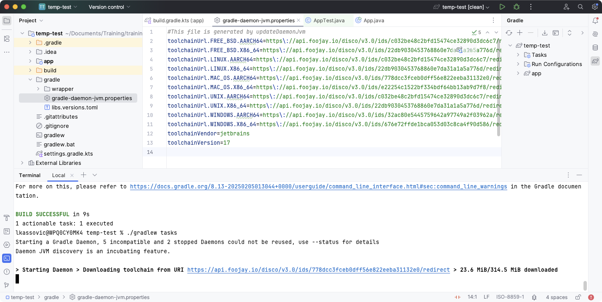

<meta property="og:image" content="https://gradle.org/images/releases/gradle-@version@.png" />
<meta property="og:type"  content="article" />
<meta property="og:title" content="Gradle @version@ Release Notes" />
<meta property="og:site_name" content="Gradle Release Notes">
<meta property="og:description" content="Gradle @version@: Daemon JVM auto-provisioning. Enhanced developer experience. Improvements for build authors and plugin developers.">
<meta name="twitter:card" content="summary_large_image">
<meta name="twitter:site" content="@gradle">
<meta name="twitter:creator" content="@gradle">
<meta name="twitter:title" content="Gradle @version@ Release Notes">
<meta name="twitter:description" content="Gradle @version@: Daemon JVM auto-provisioning. Enhanced developer experience. Improvements for build authors and plugin developers.">
<meta name="twitter:image" content="https://gradle.org/images/releases/gradle-@version@.png">

We are excited to announce Gradle @version@ (released [@releaseDate@](https://gradle.org/releases/)).

This release introduces [Daemon JVM auto-provisioning](#toolchain), which automatically downloads the JVM required by the Gradle Daemon to run.

Gradle @version@ also adds explicit [Scala version configuration](#scala) and JUnit XML timestamps with [millisecond precision](#junit).

For [build authors and plugin developers](#build-authoring), this release adds improved access to the settings directory in build scripts, a new artifact transform report, custom test report generation, and the new `distribution-base` plugin.

We would like to thank the following community members for their contributions to this release of Gradle:
[Adam](https://github.com/adam-enko),
[Adam](https://github.com/aSemy),
[Ahmad Al-Masry](https://github.com/AhmadMasry),
[Ahmed Ehab](https://github.com/ahmedehabb),
[Aurimas](https://github.com/liutikas),
[Baptiste Decroix](https://github.com/bdecroix-spiria),
[Björn Kautler](https://github.com/Vampire),
[Borewit](https://github.com/Borewit),
[Jorge Matamoros](https://github.com/YungOkra),
[Lei Zhu](https://github.com/Korov),
[Madalin Valceleanu](https://github.com/vmadalin),
[Mohammed Thavaf](https://github.com/mthavaf),
[Patrick Brückner](https://github.com/madmuffin1),
[Philip Wedemann](https://github.com/hfhbd),
[Roberto Perez Alcolea](https://github.com/rpalcolea),
[Róbert Papp](https://github.com/TWiStErRob),
[Semyon Gaschenko](https://github.com/gasches),
[Shi Chen](https://github.com/CsCherrYY),
[Stefan M.](https://github.com/StefMa),
[Steven Schoen](https://github.com/DSteve595),
[tg-freigmbh](https://github.com/tg-freigmbh),
[TheGoesen](https://github.com/TheGoesen),
[Tony Robalik](https://github.com/autonomousapps),
[Zongle Wang](https://github.com/Goooler).

Be sure to check out the [public roadmap](https://roadmap.gradle.org/) for insight into what's planned for future releases.

## Upgrade instructions

Switch your build to use Gradle @version@ by updating the [wrapper](userguide/gradle_wrapper.html) in your project:

```
./gradlew wrapper --gradle-version=@version@ && ./gradlew wrapper
```

See the [Gradle 8.x upgrade guide](userguide/upgrading_version_8.html#changes_@baseVersion@) to learn about deprecations, breaking changes, and other considerations when upgrading to Gradle @version@.

For Java, Groovy, Kotlin, and Android compatibility, see the [full compatibility notes](userguide/compatibility.html).

## New features and usability improvements

<a name="toolchain"></a>
### Toolchain support

Gradle's [toolchain support](userguide/toolchains.html#sec:provisioning) allows provisioning and selection of JDK versions required for building projects (compiling code, running tests, etc) and running Gradle itself.

#### Daemon toolchain auto-provisioning

Since Gradle 8.8, users can specify a different JVM for building their project than the one used to run Gradle by configuring the [Daemon JVM criteria](userguide/gradle_daemon.html#sec:daemon_jvm_criteria).  
Gradle first attempts to locate a compatible Java toolchain from installed versions—this process is known as [Daemon JVM auto-detection](userguide/gradle_daemon.html#sec:detect_provision).

With the introduction of [Daemon JVM auto-provisioning](userguide/gradle_daemon.html#sec:detect_provision), Gradle can now also download a matching Java toolchain when none is found locally.

Running the `updateDaemonJvm` task generates the `gradle/gradle-daemon-jvm.properties` file, which now includes download URLs for the required JDKs:

```text
toolchainUrl.LINUX.AARCH64=https\://server.com/jdk
toolchainUrl.LINUX.X86_64=https\://server.com/jdk
...
toolchainVendor=adoptium
toolchainVersion=17
```

If no installed JDK matches the specified version or vendor, Gradle automatically downloads the required version:



IntelliJ IDEA support is available starting from version [2025.1 EAP](https://blog.jetbrains.com/idea/2025/01/intellij-idea-2025-1-eap/) or later and includes the configurable values in the Settings menu:



To enable auto-provisioning, the latest version of the `foojay` plugin (or a custom implementation) is required:

```kotlin
plugins {
    // Apply the foojay-resolver plugin to allow automatic download of JDKs
    id("org.gradle.toolchains.foojay-resolver-convention") version "0.9.0"
}
```

Once the plugin is applied, running the [`updateDaemonJvm` task](userguide/gradle_daemon.html#sec:daemon_jvm_criteria):

```text
./gradlew updateDaemonJvm --jvm-version=17 --jvm-vendor=adoptium
```

Populates `gradle/gradle-daemon-jvm.properties` with the JDK download information:

```text
toolchainUrl.LINUX.AARCH64=https\://api.foojay.io/disco/v3.0/ids/ff8d269e2495c538cfa04b4b52d22286/redirect
toolchainUrl.LINUX.X86_64=https\://api.foojay.io/disco/v3.0/ids/4dfe7aab2abf71db71537e9dca36c154/redirect
...
toolchainVendor=adoptium
toolchainVersion=17
```

The resolved platforms and URLs are customizable.
For more details, see the [Daemon JVM criteria documentation](userguide/gradle_daemon.html#sec:daemon_jvm_criteria).

<a name="scala"></a>
### Explicit Scala version declaration in the `scala` extension

The [Scala plugin](userguide/scala_plugin.html) provides support for compiling, testing, and packaging Scala projects.

Starting in this version of Gradle, when applying the `scala-base` or `scala` plugins, you can now explicitly declare the Scala version on the `scala` extension.
This allows Gradle to automatically resolve the required Scala toolchain dependencies, eliminating the need for the user to declare them manually.
It also removes the need to infer the Scala version from the production runtime classpath, which was error-prone.

Now, you can explicitly set the Scala version in the `scala` extension, and the `scala-library` dependency is no longer required:

```kotlin
plugins {
    id("scala")
}

repositories {
    mavenCentral()
}

scala {
    scalaVersion = "2.13.12"
    // OR 
    scalaVersion = "3.6.3"
}
```

Previously, you had to declare a `scala-library` dependency, like this:

```kotlin
plugins {
    id("scala")
}

repositories {
    mavenCentral()
}

dependencies {
    implementation("org.scala-lang:scala-library:2.13.12")
    // OR
    implementation("org.scala-lang:scala3-library_3:3.6.3")
}
```

For more details on using the Scala plugin, see the [documentation](userguide/scala_plugin.html#sec:scala_version).

<a name="junit"></a>
### Additional precision in JUnit XML timestamps
Gradle provides built-in support for running JUnit tests and generating detailed reports.
The [JUnit XML report](userguide/java_testing.html#test_reporting) generated by the `test` task now includes millisecond precision in test event timestamps:

```xml
<testsuite name="ExampleTest" tests="1" failures="0" errors="0" timestamp="2024-02-03T12:34:56.789" time="1.234">
    <testcase name="testExample" classname="com.example.ExampleTest" time="1.234">
    </testcase>
</testsuite>
```

This change improves accuracy when analyzing test execution times, particularly in environments where precise timing is critical.

For more details on JUnit test reporting in Gradle, see [Testing in JVM Projects](userguide/java_testing.html).

<a name="build-authoring"></a>
### Build authoring improvements

Gradle provides [rich APIs](userguide/getting_started_dev.html) for plugin authors and build engineers to develop custom build logic.

#### `ProjectLayout` API improvement

The [`ProjectLayout`](javadoc/org/gradle/api/file/ProjectLayout.html) class provides access to directories and files within a project.
Starting with this version of Gradle, it can also access the settings directory (the location of the `settings.gradle(.kts)` file).

While the settings directory is not specific to any project, some use cases require resolving file paths relative to it:

```kotlin
val versionFile = layout.settingsDirectory.file("version.txt")
```

Previously, accessing the settings directory required using `rootProject.layout.projectDirectory`.
This approach involved accessing the `rootProject` object, which is discouraged, and then manually resolving paths to the settings directory:

```kotlin
val versionFile = rootProject.layout.projectDirectory.file("version.text")
```

The new capability addresses a common scenario: resolving files shared across all projects in a build, such as linting configurations or `version.txt` files in the root folder.

Refer to [`ProjectLayout.getSettingsDirectory()`](javadoc/org/gradle/api/file/ProjectLayout.html#getSettingsDirectory()) for additional details.

#### New `artifactTransforms` report task

[Artifact Transforms](userguide/artifact_transforms.html) modify or transform the artifacts of dependencies during the dependency resolution process.

A new `artifactTransforms` task is available, providing information about all the registered [Artifact Transforms](userguide/artifact_transforms.html) in a project.

The report produced by the task helps build authors identify the transforms registered by build scripts and plugins in their projects.
Viewing the list of registered transforms is particularly useful for debugging [ambiguous transform failures](userguide/variant_model.html#sec:transform-ambiguity).


The report includes the following details:

- The fully qualified type name of the action implementing the transform
- Whether the transform is cacheable
- The complete set of input attributes and their values used to select the transform
- The complete set of output attributes and their values produced by the transform

For more information, refer to the [ArtifactTransformsReportTask](dsl/org.gradle.api.tasks.diagnostics.ArtifactTransformsReportTask.html) DSL reference.

#### `TestEventReporting` API improvements

Gradle provides an [HTML test report](userguide/java_testing.html#test_reporting) to help you understand and resolve test failures.
This report is automatically generated when using the `test` task with supported test frameworks, such as `JUnit`.

Plugin authors and platform providers can now leverage the [Test Event Reporting APIs](javadoc/org/gradle/api/tasks/testing/TestReport.html) to capture test events and generate reports for tests executed outside Gradle's built-in testing infrastructure:

```java
public abstract class CustomTest extends DefaultTask {

    @Inject
    protected abstract ProjectLayout getLayout();
    
    @Inject
    protected abstract TestEventReporterFactory getTestEventReporterFactory();

    @TaskAction
    void runTests() {
        try (TestEventReporter test = getTestEventReporterFactory().createTestEventReporter(
                "custom-test",
                getLayout().getBuildDirectory().dir("test-results/custom-test").get(),
                getLayout().getBuildDirectory().dir("reports/tests/custom-test").get()
        )) {
            // Start the test
            test.started(Instant.now());

            // Execute custom test...
            
            // Report test outcome
            if (testFailureCount > 0) {
                test.failed(Instant.now());
            } else {
                test.succeeded(Instant.now());
            }
        }
    }
}
```

This integration allows custom test frameworks to generate rich HTML test reports consistent with Gradle's built-in reporting format, enhancing visibility and usability.

You can find additional details and sample code in [Test Reporting API](userguide/test_reporting_api.html).

The following sections highlight two key features of this API.

##### Metadata support

Custom tests can include metadata to provide supplementary information about test execution.

The metadata is displayed in the HTML test report for better visibility:

```java
test.metadata(Instant.now(),"Parent class:", String.valueOf(result.getTestIdentifier().getParentId().get()));
```


##### Nesting support

Hierarchical nesting is supported to logically group test suites and individual tests.
This ensures detailed and structured reporting, with rich metadata scoped to each level:

```java
try (GroupTestEventReporter outer = root.reportTestGroup("OuterNestingSuite")) {
    outer.started(Instant.now());
        try (GroupTestEventReporter inner = root.reportTestGroup("InnerNestingSuite")) {
            inner.started(Instant.now());
            try (TestEventReporter test = inner.reportTest("nestedTest", "nestedTest()")) {
                test.started(Instant.now());
                test.succeeded(Instant.now());
            }
            inner.succeeded(Instant.now());
    }
    outer.succeeded(Instant.now());
}
```

Nested events are reflected in the HTML test reports, providing clear traceability.

#### New `distribution-base` plugin for custom distributions

The [Distribution Plugin](userguide/distribution_plugin.html) simplifies the packaging and distribution of project binaries, scripts, and other resources.
It creates a distributable archive (ZIP or TAR) containing specified project outputs and provides tasks for assembling and installing the distribution.

Gradle now includes a `distribution-base` plugin, which mirrors the functionality of the Distribution Plugin but does not add a default distribution.
Instead, the existing `distribution` plugin acts as a wrapper for the `distribution-base` plugin, adding a default `main` distribution.

The `distribution-base` plugin is particularly useful for plugin developers who want the capabilities of the Distribution Plugin without a `main` distribution:

```kotlin
plugins {
    id("distribution-base")
}

distributions {
    create("custom") {
        distributionBaseName = "customName"
        contents {
            from("src/customLocation")
        }
    }
}
```
For more details, see the [Distribution Plugin documentation](userguide/distribution_plugin.html#sec:distribution_base).

## Promoted features

Promoted features are features that were incubating in previous versions of Gradle but are now supported and subject to backward compatibility.
See the User Manual section on the "[Feature Lifecycle](userguide/feature_lifecycle.html)" for more information.

The following are the features that have been promoted in this Gradle release.

### Promoted features in Tooling API

The [Tooling API](userguide/tooling_api.html) is an interface that allows external tools, such as IDEs, to interact with and control Gradle builds.

The API to asynchronously send data to the client, which includes the [`BuildActionExecuter.setStreamedValueListener(StreamedValueListener)`](javadoc/org/gradle/tooling/BuildActionExecuter.html) method, the [`StreamedValueListener`](javadoc/org/gradle/tooling/StreamedValueListener.html) type, and the [`BuildController.send(Object)`](javadoc/org/gradle/tooling/BuildController.html) method has been promoted to stable.

### Strongly-typed `dependencies` block API

The [strongly-typed `dependencies` block API](userguide/implementing_gradle_plugins_binary.html#custom_dependencies_blocks) introduced in Gradle 7.6 is now partially stable.
Version catalog dependencies remain under review for potential changes.

The [`Dependencies` API](javadoc/org/gradle/api/artifacts/dsl/Dependencies.html) enables plugin authors to create custom DSL-like `dependencies` blocks, similar to the top-level `dependencies` block in a build script.

## Fixed issues

<!--
This section will be populated automatically
-->

## Known issues

Known issues are problems that were discovered post-release that are directly related to changes made in this release.

<!--
This section will be populated automatically
-->

## External contributions

We love getting contributions from the Gradle community. For information on contributing, please see [gradle.org/contribute](https://gradle.org/contribute).

## Reporting problems

If you find a problem with this release, please file a bug on [GitHub Issues](https://github.com/gradle/gradle/issues) adhering to our issue guidelines.
If you're not sure you're encountering a bug, please use the [forum](https://discuss.gradle.org/c/help-discuss).

We hope you will build happiness with Gradle, and we look forward to your feedback via [Twitter](https://twitter.com/gradle) or on [GitHub](https://github.com/gradle).
