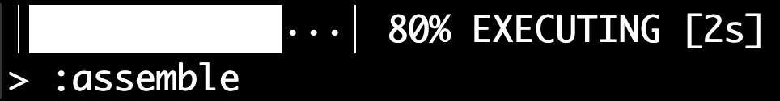
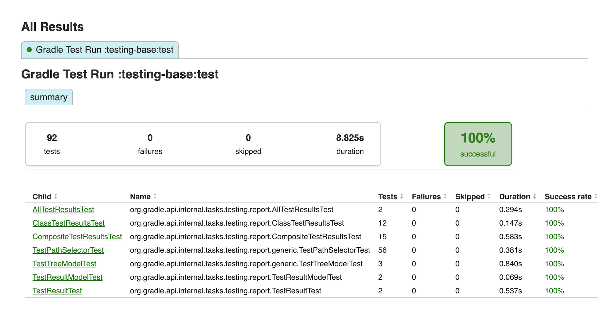
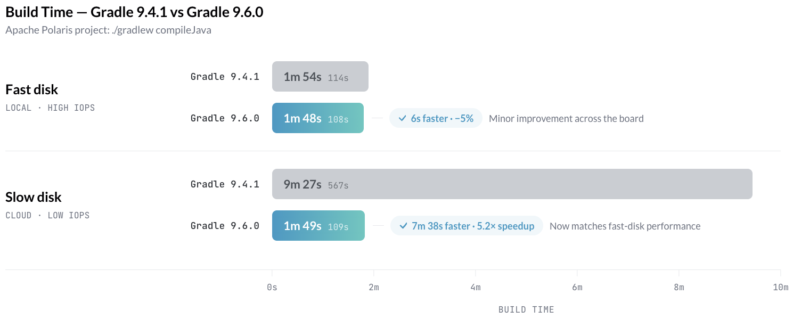

<meta property="og:image" content="https://gradle.org/assets/images/releases/gradle-default.png" />
<meta property="og:type"  content="article" />
<meta property="og:title" content="Gradle @version@ Release Notes" />
<meta property="og:site_name" content="Gradle Release Notes">
<meta property="og:description" content="We are excited to announce Gradle @version@.">
<meta name="twitter:card" content="summary_large_image">
<meta name="twitter:site" content="@gradle">
<meta name="twitter:creator" content="@gradle">
<meta name="twitter:title" content="Gradle @version@ Release Notes">
<meta name="twitter:description" content="We are excited to announce Gradle @version@.">
<meta name="twitter:image" content="https://gradle.org/assets/images/releases/gradle-default.png">

We are excited to announce Gradle @version@ (released [@releaseDate@](https://gradle.org/releases/)).

This release improves [Configuration Cache](#configuration-cache-improvements) hit rates by precisely tracking project properties supplied through system properties and environment variables.

The [CLI, logging, and problem reporting](#cli-logging-and-problem-reporting) gains a `--non-interactive` option to disable interactive prompts when running Gradle in automated environments, support for the `NO_COLOR` environment variable to suppress color output, and sortable columns in HTML test reports.

[Build authoring](#build-authoring-improvements) includes an important deprecation: implicit property and method lookup through the project hierarchy now emits a warning and will be removed in Gradle 10. A new `NO_IMPLICIT_LOOKUP_IN_PROJECT_HIERARCHY` feature preview lets you adopt the Gradle 10 behavior early once related deprecations are addressed.

[Plugin authors](#core-plugin-and-plugin-authoring-enhancements) get clearer validation errors when the `@Optional` annotation is misused on task properties.

Finally, [security and infrastructure](#security-and-infrastructure) improvements reduce IO load from Gradle's file-based journals, delivering significant performance gains on low-IOPS storage typical of cloud CI runners.

We would like to thank the following community members for their contributions to this release of Gradle:
[Aharnish Solanki](https://github.com/Ahar28),
[Benedikt Johannes](https://github.com/benediktjohannes),
[Devendra Reddy Pennabadi](https://github.com/devareddy05),
[Dmytro Rodionov](https://github.com/smplio),
[Dreeam](https://github.com/Dreeam-qwq),
[Elías Hernández Rodríguez](https://github.com/EliasHdzR),
[Eng Zer Jun](https://github.com/Juneezee),
[FinlayRJW](https://github.com/FinlayRJW),
[Kamal Kansal](https://github.com/kamalkansal27),
[Marcono1234](https://github.com/Marcono1234),
[Nelson Osacky](https://github.com/runningcode),
[Philip Wedemann](https://github.com/hfhbd),
[Ravi](https://github.com/rkdfx),
[Roberto Perez Alcolea](https://github.com/rpalcolea),
[Ryan Schmitt](https://github.com/rschmitt),
[Sebastian Schuberth](https://github.com/sschuberth),
[seunghun.ham](https://github.com/seung-hun-h),
[sk-reddy17](https://github.com/sk-reddy17),
[Suvrat Acharya](https://github.com/Suvrat1629),
[Vedant Madane](https://github.com/VedantMadane).

Be sure to check out the [public roadmap](https://roadmap.gradle.org) for insight into what's planned for future releases.

## Upgrade instructions

Switch your build to use Gradle @version@ by updating the [wrapper](userguide/gradle_wrapper.html) in your project:

```text
./gradlew :wrapper --gradle-version=@version@ && ./gradlew :wrapper
```

See the [Gradle 9.x upgrade guide](userguide/upgrading_version_9.html#changes_@baseVersion@) to learn about deprecations, breaking changes, and other considerations when upgrading to Gradle @version@.

For Java, Groovy, Kotlin, and Android compatibility, see the [full compatibility notes](userguide/compatibility.html).   

## New features and usability improvements

### Configuration Cache improvements
Gradle provides a [Configuration Cache](userguide/configuration_cache.html) that improves build time by caching the result of the configuration phase and reusing it for subsequent builds.

#### Improved hit rates for project properties set via system properties and environment variables

[Project properties](userguide/build_environment.html#sec:project_properties) can be supplied not only on the command line with `-P` or in `gradle.properties` files, but also through `org.gradle.project.<name>` system properties and `ORG_GRADLE_PROJECT_<name>` environment variables.

Previously, changing any such system property or environment variable invalidated the [Configuration Cache](userguide/configuration_cache.html), even if the affected project property was never used during the configuration phase.

Consider the following Kotlin DSL example:

```kotlin
tasks.register("printValue") {
    val value = providers.gradleProperty("value").orElse("N/A")
    doLast {
        println("value: ${value.get()}")
    }
}
```

Previous versions of Gradle were unable to reuse the cache entry when re-running with a different value passed via a system property or environment variable:

```shell
$ ./gradlew --configuration-cache printValue -Dorg.gradle.project.value=1

Calculating task graph as configuration cache cannot be reused because the set of system properties prefixed by 'org.gradle.project.' has changed: 'org.gradle.project.value' was added.

> Task :printValue
value: 1

...
Configuration cache entry stored.
```

In this release, Gradle detects that the `value` property is never read during the configuration phase and reuses the existing cache entry, regardless of how the property was supplied:

```shell
$ ./gradlew --configuration-cache printValue -Dorg.gradle.project.value=2

Reusing configuration cache.

> Task :printValue
value: 2

...
Configuration cache entry reused.
```

The same precise tracking now also applies to `ORG_GRADLE_PROJECT_*` environment variables, bringing parity with the improvements introduced for `-P` properties in Gradle 9.1.0 and for `gradle.properties` files in Gradle 9.4.0.
The existing cache entry is reused even when the property is supplied through an environment variable:

```shell
$ ORG_GRADLE_PROJECT_value=3 ./gradlew --configuration-cache printValue
Reusing configuration cache.
> Task :printValue
value: 3
...
Configuration cache entry reused.
```

For builds that pass many project properties on the command line or via environment variables, particularly in CI, this change will significantly improve cache hit rates.

See the [Reading System Properties and Environment Variables](userguide/configuration_cache_requirements.html#config_cache:requirements:reading_sys_props_and_env_vars) section in the Gradle User Manual for more information.

### CLI, logging, and problem reporting
Gradle provides an intuitive [command-line interface](userguide/command_line_interface.html), detailed [logs](userguide/logging.html), and a structured [problems report](userguide/reporting_problems.html#sec:generated_html_report) that helps developers quickly identify and resolve build issues.

#### Non-interactive mode
Gradle now supports a `--non-interactive` [command-line](userguide/command_line_interface.html) option to disable all interactive console prompting.
This is useful for running Gradle in automated environments such as CI pipelines, scripts, and AI agents where no user input is available.

See the [Non-interactive mode](userguide/command_line_interface.html#sec:non_interactive) section in the Gradle User Manual for more information.

#### NO_COLOR support
Gradle now honors the `NO_COLOR` environment variable following the [no-color.org](https://no-color.org/) convention.
When `NO_COLOR` is set and non-empty, Gradle suppresses color output while preserving other styling (bold, underline) and rich features (progress bars, animations).



See the [Environment variables](userguide/build_environment.html#sec:gradle_environment_variables) section in the Gradle User Manual for more information.

#### Sortable columns in HTML test reports
The [HTML test report](userguide/java_testing.html#test_reporting) generated by the [`Test`](javadoc/org/gradle/api/tasks/testing/Test.html) task now supports sorting by clicking column headers.

Clicking a column header sorts rows by that column.
A second click reverses the direction, and a third click restores the original order.

Numeric columns (Tests, Failures, Skipped, Duration) default to descending on first click so the most interesting values surface first.
Success rate defaults to ascending so flaky or broken classes appear at the top.



This makes it easier to identify problematic test classes in large projects without manually scanning through the report.

See the [Test reporting](userguide/java_testing.html#test_reporting) section in the Gradle User Manual for more information.

### Build authoring improvements
Gradle provides [rich APIs](userguide/getting_started_dev.html) for build engineers and plugin authors, enabling the creation of custom, reusable build logic and better maintainability.

#### Deprecation of implicit property and method lookup in the project hierarchy
In Gradle's [Groovy DSL](userguide/groovy_build_script_primer.html), when a child project's build script references a property or method that isn't defined locally, the resolution mechanism walks up the project hierarchy looking for a match.
For example:

```groovy
// build.gradle (root project)
ext.foo = "hello"
```

```groovy
// child/build.gradle
println(foo) // Resolved through hierarchy — now deprecated
```

This implicit inheritance creates hidden coupling between projects and makes builds harder to reason about (a typo silently resolves to an ancestor's definition instead of failing).

Starting in Gradle 9.6.0, both implicit references and explicit APIs (`findProperty()`, `property()`, `hasProperty()`) emit a deprecation warning when they resolve through the hierarchy.
This behavior will be removed in Gradle 10.

See the [upgrade guide](userguide/upgrading_version_9.html#deprecated_implicit_project_hierarchy_lookup) for migration paths, including `gradle.properties`, convention plugins, and explicit references.

##### Opt into Gradle 10 behavior by disabling project hierarchy lookup
Gradle 9.6.0 [deprecates implicit lookup of properties and methods through the project hierarchy](userguide/upgrading_version_9.html#deprecated_implicit_project_hierarchy_lookup); this behavior will be removed in Gradle 10.

Once you have addressed all related deprecations, enable the new `NO_IMPLICIT_LOOKUP_IN_PROJECT_HIERARCHY` feature preview to adopt the Gradle 10 behavior early.

This prevents new accidental implicit lookups in the project hierarchy:

```groovy
// settings.gradle
enableFeaturePreview("NO_IMPLICIT_LOOKUP_IN_PROJECT_HIERARCHY")
```

#### Groovy DSL type coercions for lazy properties
Gradle's [lazy property](userguide/lazy_configuration.html) types (`Property<T>`, `ListProperty<T>`, `SetProperty<T>`) previously required exact type matches when assigning values in the [Groovy DSL](userguide/groovy_build_script_primer.html).
This meant that common idioms that worked with eager properties would fail with `IllegalArgumentException` when a plugin author migrated to lazy properties.

Gradle now automatically coerces values in the following cases:

**String to File**: A `String` assigned to a `Property<File>`, `RegularFileProperty`, or `DirectoryProperty` is resolved relative to the project directory:

```groovy
task.workingDir = '../my-build'
```

**Single value to collection**: A single `T` or `T[]` assigned to a `ListProperty<T>` or `SetProperty<T>` is wrapped into a one-element collection:

```groovy
task.filter.includePatterns = 'Foo'
task.filter.includePatterns = ['Foo', 'Bar'] as String[]
```

These coercions bring the Groovy DSL experience for lazy properties closer to what users expect from eager properties, making it easier for plugin authors to migrate to the [lazy configuration](userguide/lazy_configuration.html) API without breaking their users' build scripts.

### Core plugin and plugin authoring enhancements
Gradle provides a comprehensive plugin system, including built-in [Core Plugins](userguide/plugin_reference.html) for standard tasks and powerful APIs for creating custom plugins.

#### Improved validation errors for `@Optional` annotation misuse
The [`validatePlugins`](userguide/java_gradle_plugin.html#sec:plugin_validation) task now produces more specific error messages when the `@Optional` annotation is used incorrectly on task properties.

If a property is annotated with only `@Optional` and no input or output annotation, Gradle explains that `@Optional` is a modifier annotation with no effect on its own:

```text
Type 'MyTask' property 'badProperty' is missing an input or output annotation.

Reason: @Optional is a modifier annotation and has no effect without an input or output annotation.

Possible solutions:
  1. Add an input or output annotation.
  2. Replace @Optional with @Internal for ignoring this property.
```

Similarly, combining `@Internal` with `@Optional` now produces a dedicated error explaining that `@Optional` is redundant on properties excluded from up-to-date checks:

```text
Type 'MyTask' property 'badProperty' annotated with @Internal should not be also annotated with @Optional.

Reason: @Internal properties are excluded from up-to-date checks; @Optional is redundant and not allowed here.
```

See the [Validating plugins](userguide/java_gradle_plugin.html#sec:plugin_validation) section in the Gradle User Manual for more information.

### Security and infrastructure
Gradle provides robust [security features and underlying infrastructure](userguide/security.html) to ensure that builds are secure, reproducible, and easy to maintain.

#### Performance improvements in cloud runners
Gradle uses several file-based journals to track operations.

Through community feedback and our own analysis, we confirmed that the implementation used in Gradle was generating a high volume of I/O operations.
On storage with limited IOPS, typical in cloud environments using network-attached block storage such as AWS EBS, this led to I/O throttling and significant slowdowns during disk-heavy operations.

With this release, the implementation has been improved, resulting in significant performance gains on low IOPS storage and minor improvements across the board:



## Promoted features

Promoted features are features that were incubating in previous versions of Gradle but are now supported and subject to backward compatibility.
See the User Manual section on the "[Feature Lifecycle](userguide/feature_lifecycle.html)" for more information.

The following are the features that have been promoted in this Gradle release.

* [`getNetworkTimeout()`](javadoc/org/gradle/api/tasks/wrapper/Wrapper.html#getNetworkTimeout()) in `Wrapper`

## Fixed issues

## Known issues

Known issues are problems that were discovered post-release that are directly related to changes made in this release.

## External contributions

We love getting contributions from the Gradle community. For information on contributing, please see [gradle.org/contribute](https://gradle.org/contribute).

## Reporting problems

If you find a problem with this release, please file a bug on [GitHub Issues](https://github.com/gradle/gradle/issues) adhering to our issue guidelines.
If you're not sure if you're encountering a bug, please use the [forum](https://discuss.gradle.org/c/help-discuss).

We hope you will build happiness with Gradle, and we look forward to your feedback via [Twitter](https://twitter.com/gradle) or on [GitHub](https://github.com/gradle).
