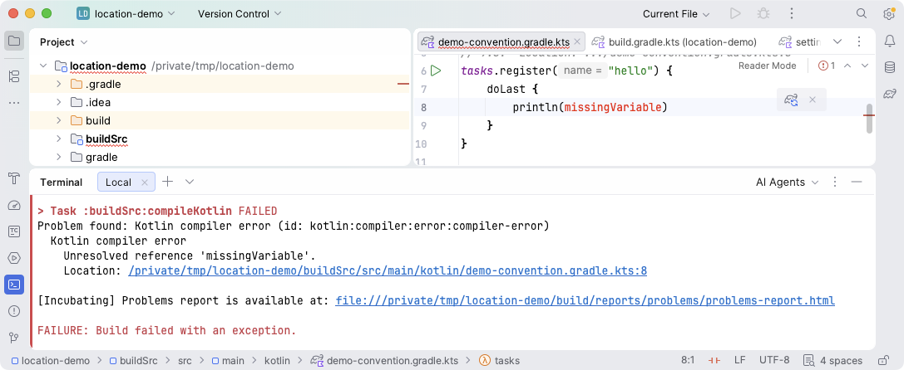

<meta property="og:image" content="https://gradle.org/assets/images/releases/gradle-default.png" />
<meta property="og:type"  content="article" />
<meta property="og:title" content="Gradle @version@ Release Notes" />
<meta property="og:site_name" content="Gradle Release Notes">
<meta property="og:description" content="We are excited to announce Gradle @version@.">
<meta name="twitter:card" content="summary_large_image">
<meta name="twitter:site" content="@gradle">
<meta name="twitter:creator" content="@gradle">
<meta name="twitter:title" content="Gradle @version@ Release Notes">
<meta name="twitter:description" content="We are excited to announce Gradle @version@.">
<meta name="twitter:image" content="https://gradle.org/assets/images/releases/gradle-default.png">

We are excited to announce Gradle @version@ (released [@releaseDate@](https://gradle.org/releases/)).

In this release, [Java 27](#support-for-java-27) is supported for both the Gradle daemon and Java toolchains.

Gradle can now [reuse Maven's mirror settings](#reusing-mirror-settings-from-maven), so teams with an internal repository mirror configure it once instead of in both build tools.

[Build authoring](#build-authoring-improvements) gets less verbose, with Gradle's built-in services for working with files, objects, and processes now available directly in scripts and task actions, and copy destinations configurable lazily.

For plugin authors, verifying compatibility with the [Configuration Cache](#configuration-cache-improvements) is easier and more reliable. The [Maven Publish Plugin](#core-plugin-and-plugin-authoring-enhancements) now takes part in up-to-date checks, so it no longer regenerates a POM that has not changed.

[Build failures](#cli-logging-and-problem-reporting) are easier to read and navigate, and more of Gradle's diagnostics are now available to tooling. This release also includes [performance improvements](#performance-improvements) for Windows.

We would like to thank the following community members for their contributions to this release of Gradle:
[Aman Gautam](https://github.com/Gautam-aman),
[Björn Kautler](https://github.com/Vampire),
[Eng Zer Jun](https://github.com/Juneezee),
[Hashim Khan](https://github.com/Hashim1999164),
[Julian Krannich](https://github.com/jkrannich),
[KBS](https://github.com/youdie006),
[Labh R Jethe](https://github.com/itsCodeTide),
[Mark Dodgson](https://github.com/doddi),
[Maxim](https://github.com/kroune),
[monkey](https://github.com/Develop-KIM),
[nataphon-ktsystems](https://github.com/nataphon-ktsystems),
[Paul King](https://github.com/paulk-asert),
[Qiu Tian](https://github.com/qiu-tiandev),
[rg_sandesh](https://github.com/sandeshgorde),
[Roberto Perez Alcolea](https://github.com/rpalcolea),
[Sean](https://github.com/seanxuu),
[Zongle Wang](https://github.com/Goooler).

Be sure to check out the [public roadmap](https://roadmap.gradle.org) for insight into what's planned for future releases.

## Upgrade instructions

Switch your build to use Gradle @version@ by updating the [wrapper](userguide/gradle_wrapper.html) in your project:

```text
./gradlew :wrapper --gradle-version=@version@ && ./gradlew :wrapper
```

See the [Gradle 9.x upgrade guide](userguide/upgrading_version_9.html#changes_@baseVersion@) to learn about deprecations, breaking changes, and other considerations when upgrading to Gradle @version@.

For Java, Groovy, Kotlin, and Android compatibility, see the [full compatibility notes](userguide/compatibility.html).

## New features and usability improvements

### Support for Java 27

With this release, Gradle supports [Java 27](https://openjdk.org/projects/jdk/27/).

You can now run the [Gradle daemon](userguide/gradle_daemon.html) on Java 27, in addition to using Java 27 via [toolchains](userguide/toolchains.html):

```kotlin
java {
    toolchain {
        languageVersion = JavaLanguageVersion.of(27)
    }
}
```

Some third-party tools (for example, PMD) do not yet support Java 27.

See [the compatibility documentation](userguide/compatibility.html#java_runtime) for more details.

### Reusing mirror settings from Maven

In organizations that use both Maven and Gradle build tools with an internal repository mirror, Gradle @version@ supports reusing Maven's [mirror repository settings](https://maven.apache.org/guides/mini/guide-mirror-settings.html) with a simple flag.

By default, this is disabled, but you can enable it with `org.gradle.mirror.maven.settings=true` in `gradle.properties`.

When applying the mirror configuration, Gradle will replace a repository's URL if it matches any configured mirrors. This applies to all HTTP/HTTPS Maven repositories, including build script repositories like `gradlePluginPortal()`, repositories declared in settings, and repositories declared in projects. Ivy repositories, Maven local, flat directory repositories, and Maven repositories served over S3 or GCS do not support mirroring.

See the [Centralizing Repositories](userguide/centralizing_repositories.html) section in the Gradle User Manual for more details.

### CLI, logging, and problem reporting

Gradle provides an intuitive [command-line interface](userguide/command_line_interface.html), detailed [logs](userguide/logging.html), and a structured [problems report](userguide/reporting_problems.html#sec:generated_html_report) that helps developers quickly identify and resolve build issues.

#### Easier to read problem reports

Three improvements make [problem reports](userguide/reporting_problems.html#sec:generated_html_report) easier to scan and act on.

Printed problem locations (`demo-convention.gradle.kts:8`) are now clickable in terminals that support hyperlinks, so you can jump straight to the source line in most modern IDEs and editors. Problems in the CLI failure output now appear in the order they occurred, which preserves the causal sequence when you scroll through a failing build. The copy button in the HTML report also stays visible while you scroll long stack traces, so capturing a full trace no longer means hunting for the button.



#### Broader coverage from the Problems API

Consumers of the [Problems API](userguide/reporting_problems.html) now receive data from more parts of Gradle.

Dependency management failures are reported through the API with [RFC 9457](https://www.rfc-editor.org/rfc/rfc9457) details. Unresolved dependencies and configuration conflicts now surface as structured problems, and the RFC 9457 format has been extended to make field naming more consistent across problem types.

Configuration Cache warn-mode messages are also reported through the API, matching how Configuration Cache errors are already surfaced.

Problems raised from threads without a current build operation are now captured rather than dropped. This closes a gap where asynchronous work could silently lose its diagnostics.

### Build authoring improvements

Gradle provides [rich APIs](userguide/getting_started_dev.html) for build engineers and plugin authors, enabling the creation of custom, reusable build logic and better maintainability.

#### Look up Gradle services from scripts and task actions

Build, settings, and init scripts, as well as task actions, can now [look up commonly used Gradle services](userguide/service_injection.html#looking_up_services) directly, without declaring an `@Inject` point or going through the `objects.newInstance(...)` ceremony:

```kotlin
tasks.register("cleanReports") {
    val fs = service<FileSystemOperations>()
    doLast {
        fs.delete { delete("build/reports") }
    }
}
```

Use `service(Class)` in the Groovy DSL or `service<Type>()` in the Kotlin DSL. It is compatible with the Configuration Cache and Isolated Projects.

Available services by scope:

| Service                                                                         | Available in       |
|---------------------------------------------------------------------------------|--------------------|
| `ObjectFactory`, `ProviderFactory`, `FileSystemOperations`, `ArchiveOperations` | Every scope        |
| `ProjectLayout`                                                                 | Projects and tasks |
| `BuildLayout`                                                                   | Settings           |
| `ExecOperations`                                                                | Task actions       |

See the [Looking up services in scripts](userguide/service_injection.html#looking_up_services) section in the Gradle User Manual for more details.

#### Lazy destination directory for `Copy` and `Sync`

The [`Copy`](dsl/org.gradle.api.tasks.Copy.html) and [`Sync`](dsl/org.gradle.api.tasks.Sync.html) tasks only exposed the destination as `destinationDir`, a plain `File` property, so a destination derived from a provider had to be resolved eagerly at [configuration time](userguide/build_lifecycle.html). Both tasks now expose a `destinationDirectory` [`DirectoryProperty`](javadoc/org/gradle/api/file/DirectoryProperty.html):

```kotlin
tasks.register<Copy>("copyFiles") {
    from("src")
    destinationDirectory = layout.buildDirectory.dir("out")
}
```

The property is the single source of truth for the destination. Assigning it is equivalent to calling `into(...)`, and it reflects whatever was configured through `into(...)` or `destinationDir`.

`into(...)` now wires a `Provider` destination into `destinationDirectory` instead of resolving its value, so provider-based destinations stay lazy; all other notations (`String`, `File`, `Closure`, `Callable`, ...) keep their existing lazy resolution. Since `destinationDirectory` is a task output property, other tasks can consume it directly and pick up the task dependency.

The new property is [incubating](userguide/feature_lifecycle.html#feature_preview). `destinationDir` continues to work and will be deprecated once `destinationDirectory` is promoted.

See [`Copy.destinationDirectory`](dsl/org.gradle.api.tasks.Copy.html#org.gradle.api.tasks.Copy:destinationDirectory) and [`Sync.destinationDirectory`](dsl/org.gradle.api.tasks.Sync.html#org.gradle.api.tasks.Sync:destinationDirectory) in the DSL Reference for more details.

#### Groovydoc supports modern Java sources and Groovy 6 output options

The [`Groovydoc`](dsl/org.gradle.api.tasks.javadoc.Groovydoc.html) task now exposes configuration options that had previously only been available through the Groovy CLI, Ant task, or Maven plugin, closing a long-standing gap in Gradle's Groovydoc support.

**Java source parsing level:** Groovydoc uses JavaParser to read Java sources mixed into Groovy projects. When the parser's assumed language level is older than the sources, modern constructs — switch expressions, sealed classes, records, and similar — fail to parse, and the affected classes are silently omitted from the generated documentation. The new `javaVersion` property forwards the language level to Groovydoc so those sources parse cleanly:

```kotlin
tasks.groovydoc {
    javaVersion = JavaLanguageVersion.of(21)
}
```

This option requires Groovy 4.0.27 or later and is silently ignored on earlier Groovy versions.

**Groovy 6.0.0 documentation options:** For projects using Groovy 6.0.0 or later, several new properties are now available on the `Groovydoc` task to control the generated output:

| Property                | Purpose                                                              |
|-------------------------|----------------------------------------------------------------------|
| `showInternal`          | Include members annotated with `groovy.transform.Internal` (GEP-17). |
| `noIndex`               | Suppress the alphabetical index page.                                |
| `noDeprecatedList`      | Suppress the deprecated-list page.                                   |
| `noHelp`                | Suppress the help page.                                              |
| `syntaxHighlighter`     | Select the client-side syntax highlighter (`"prism"` or `"none"`).   |
| `theme`                 | Lock the palette (`"auto"`, `"light"`, or `"dark"`).                 |
| `preLanguage`           | Default language id applied to unclassified `<pre>` code blocks.     |
| `additionalStylesheets` | Extra stylesheets copied alongside the default.                      |

All of these are silently ignored on earlier Groovy versions, so they are safe to configure in builds that may be run against multiple Groovy releases.

All new properties are [incubating](userguide/feature_lifecycle.html#feature_preview).

See the [`Groovydoc`](dsl/org.gradle.api.tasks.javadoc.Groovydoc.html) task in the DSL Reference for the full list of configuration options.

### Configuration Cache improvements

Gradle provides a [Configuration Cache](userguide/configuration_cache.html) that improves build time by caching the results of the configuration phase and reusing them in subsequent builds.

#### TestKit API for asserting the Configuration Cache outcome

Plugin authors testing Configuration Cache compatibility with [TestKit](userguide/test_kit.html) previously had to parse console output to tell whether a cache entry was stored, reused, or discarded, an approach that broke whenever the wording of the console messages changed.

The [`BuildResult`](javadoc/org/gradle/testkit/runner/BuildResult.html) now exposes the outcome directly, making it easier and more reliable to test Configuration Cache compatibility:

```groovy
def result = GradleRunner.create()
    .withProjectDir(projectDir)
    .withArguments("myTask", "--configuration-cache")
    .build()

assert result.configurationCacheOutcome == ConfigurationCacheOutcome.STORED
```

See [`ConfigurationCacheOutcome`](javadoc/org/gradle/testkit/runner/ConfigurationCacheOutcome.html) for the possible outcomes.

The outcome is also available to any Tooling API client through a new [`CONFIGURATION_CACHE`](javadoc/org/gradle/tooling/events/OperationType.html#CONFIGURATION_CACHE) progress event type.

See the [Testing with the Configuration Cache](userguide/test_kit.html#sub:test-kit-configuration-cache) section in the Gradle User Manual for more details.

### Core plugin and plugin authoring enhancements

Gradle provides a comprehensive plugin system, including built-in [Core Plugins](userguide/plugin_reference.html) for standard tasks and powerful APIs for creating custom plugins.

#### Up-to-date checks for POM generation in Maven publishing

The [`GenerateMavenPom`](javadoc/org/gradle/api/publish/maven/tasks/GenerateMavenPom.html) task was previously marked as untracked, so it executed on every build regardless of whether the underlying POM had changed.

The task now declares each part of its source POM as a task input, so it participates in up-to-date checks:

```text
$ ./gradlew generatePomFileForMavenPublication
> Task :generatePomFileForMavenPublication UP-TO-DATE

BUILD SUCCESSFUL
```

When a `withXml` action is registered, task input tracking remains disabled, as `withXml` actions do not yet support snapshotting, so the task continues to run on every build. To restore up-to-date behavior, move the customization into the DSL properties on [`MavenPom`](javadoc/org/gradle/api/publish/maven/MavenPom.html) where possible.

See the [Generate POM task](userguide/publishing_maven.html#publishing_maven:generate-pom) section in the Gradle User Manual for more details.

### Performance improvements

Gradle continues to reduce build times and memory usage across the daemon, configuration, and execution phases.

#### Improved performance on Windows machines with slow system clocks

Builds on affected Windows machines are up to 45% faster in this release.

Gradle reads the system clock frequently while a build runs, to capture execution traces, progress events, and log messages. On most machines, this is inexpensive, but on some Windows systems, particularly virtualized ones, reading the clock is much slower, and the cost accumulates over the many readings taken during a single build.

Gradle now detects a slow system clock at startup and switches to a faster time source for the rest of the build. No configuration is required, and builds on machines with a normal system clock are unaffected.

## Promoted features

Promoted features are features that were incubating in previous versions of Gradle but are now supported and subject to backward compatibility.
See the User Manual section on the "[Feature Lifecycle](userguide/feature_lifecycle.html)" for more information.

The following are the features that have been promoted in this Gradle release.

<!--
### Example promoted
-->

## Documentation and training

### Documentation

The User Manual reference pages for the core plugins have been entirely rewritten for consistency and depth. The [Core Plugin Reference index](userguide/plugin_reference.html) has also been reorganized and now lists previously missing core plugins.

Two new entries have been added to the [Best Practices](userguide/best_practices.html) collection:

- Obtain Loggers via `Logging.getLogger(Class)` outside of Tasks — where and how to acquire a logger in build logic.
- Favor collection property types over a `Property` holding a collection — the case for `ListProperty` and `SetProperty` over `Property<List<...>>`.

## Fixed issues

<!--
This section will be populated automatically
-->

## Known issues

Known issues are problems that were discovered post-release that are directly related to changes made in this release.

<!--
This section will be populated automatically
-->

## External contributions

We love getting contributions from the Gradle community. For information on contributing, please see [gradle.org/contribute](https://gradle.org/contribute).

## Reporting problems

If you find a problem with this release, please file a bug on [GitHub Issues](https://github.com/gradle/gradle/issues) adhering to our issue guidelines.
If you're not sure if you're encountering a bug, please use the [forum](https://discuss.gradle.org/c/help-discuss).

We hope you will build happiness with Gradle, and we look forward to your feedback via [Twitter](https://twitter.com/gradle) or on [GitHub](https://github.com/gradle).
