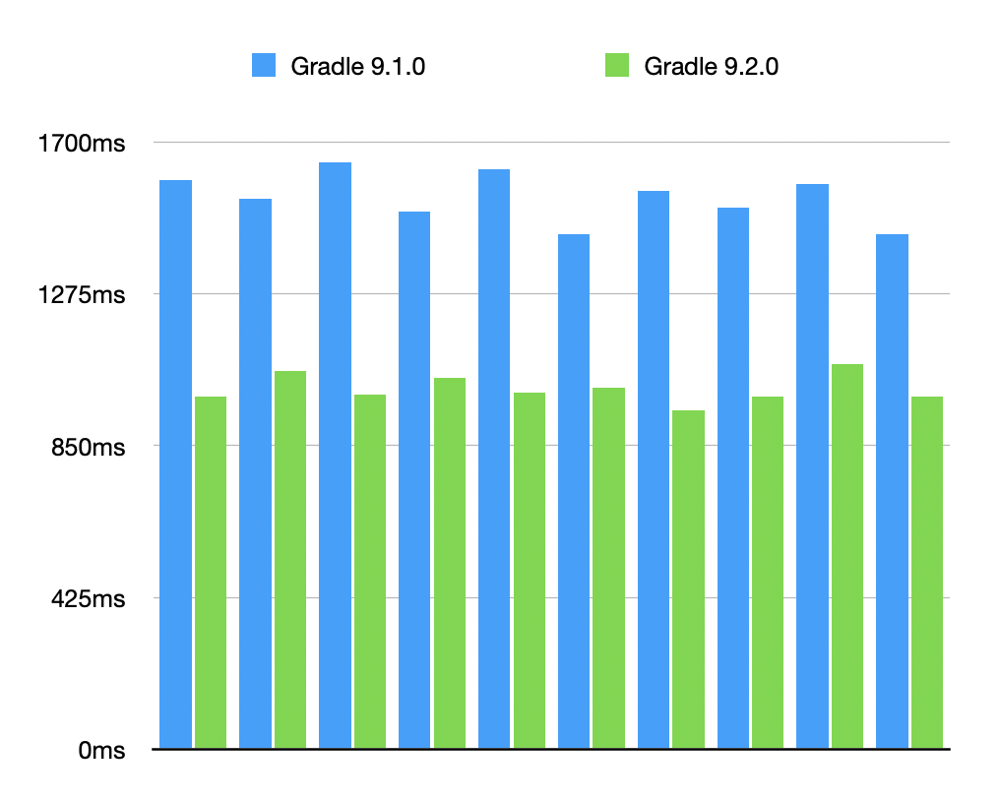
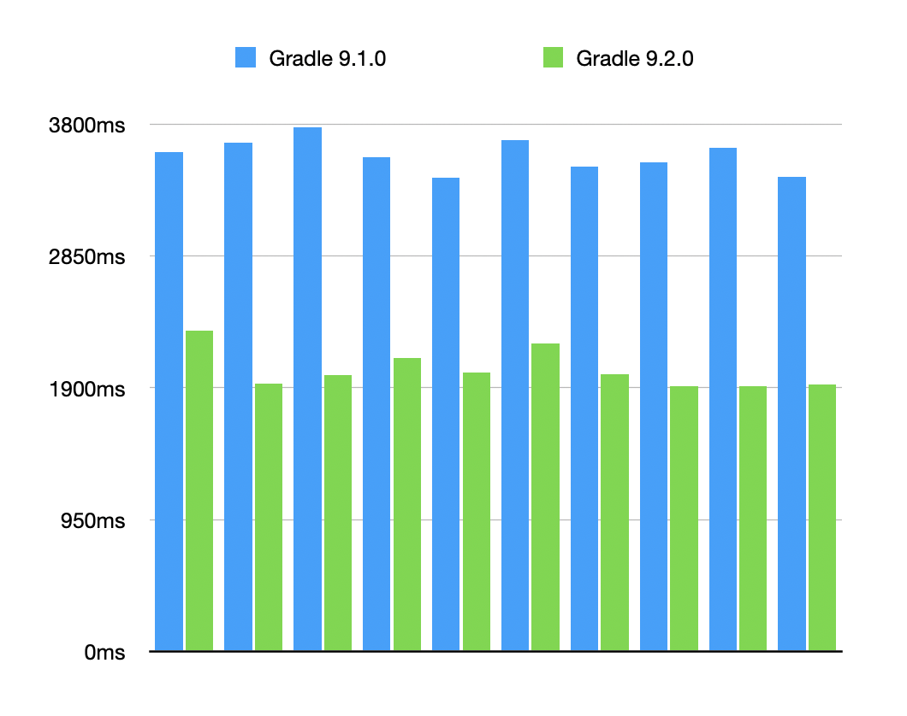
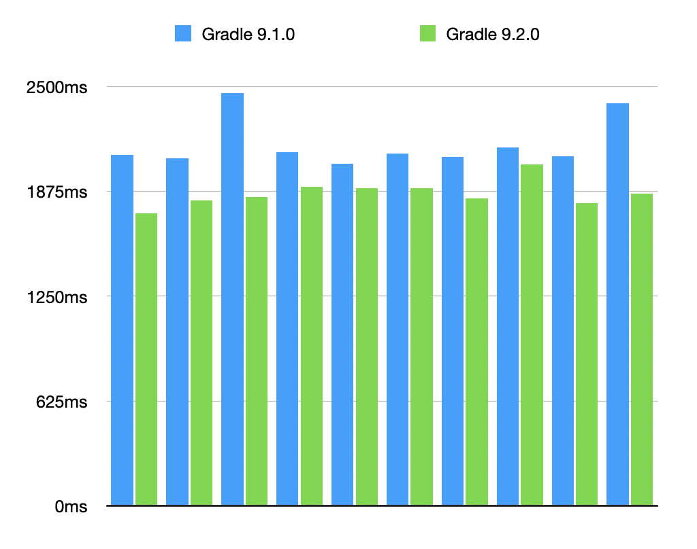

<meta property="og:image" content="https://gradle.org/images/releases/gradle-default.png" />
<meta property="og:type"  content="article" />
<meta property="og:title" content="Gradle @version@ Release Notes" />
<meta property="og:site_name" content="Gradle Release Notes">
<meta property="og:description" content="We are excited to announce Gradle @version@.">
<meta name="twitter:card" content="summary_large_image">
<meta name="twitter:site" content="@gradle">
<meta name="twitter:creator" content="@gradle">
<meta name="twitter:title" content="Gradle @version@ Release Notes">
<meta name="twitter:description" content="We are excited to announce Gradle @version@.">
<meta name="twitter:image" content="https://gradle.org/images/releases/gradle-default.png">

We are excited to announce Gradle @version@ (released [@releaseDate@](https://gradle.org/releases/)).

This release introduces support for [running Gradle on Windows ARM (ARM64) devices](#windows-on-arm-support), making it easier to build on ARM-based systems.

It also [improves the publishing API](#publishing-improvements) with new ways to define and publish custom software components.

Additionally, there are [error and warning reporting improvements](#error-and-warning-reporting-improvements), including better suggestions when dependency verification fails, and [new task grouping for Antlr](#antlr-task-grouping-improvements).

The [Daemon toolchain feature has been promoted](#daemon-toolchain-is-now-stable) to stable.

We would like to thank the following community members for their contributions to this release of Gradle:
[Adam](https://github.com/aSemy),
[Björn Kautler](https://github.com/Vampire),
[hasunzo](https://github.com/hasunzo),
[HYEON](https://github.com/iohyeon),
[Hyunjoon Park](https://github.com/academey),
[HYUNJUN SON](https://github.com/guswns1659),
[Jendrik Johannes](https://github.com/jjohannes),
[Kirill Gavrilov](https://github.com/gavvvr),
[Madalin Valceleanu](https://github.com/vmadalin),
[Martin Bonnin](https://github.com/martinbonnin),
[Matthew Haughton](https://github.com/3flex),
[Mikhail Polivakha](https://github.com/mipo256),
[Na Minhyeok](https://github.com/NaMinhyeok),
[Philip Wedemann](https://github.com/hfhbd),
[Philipp Schneider](https://github.com/p-schneider),
[Róbert Papp](https://github.com/TWiStErRob),
[Simon Marquis](https://github.com/SimonMarquis),
[TheGoesen](https://github.com/TheGoesen),
[Vincent Potucek](https://github.com/Pankraz76),
[Xin Wang](https://github.com/scaventz).

Be sure to check out the [public roadmap](https://roadmap.gradle.org) for insight into what's planned for future releases.

## Upgrade instructions

Switch your build to use Gradle @version@ by updating the [wrapper](userguide/gradle_wrapper.html) in your project:

```text
./gradlew wrapper --gradle-version=@version@ && ./gradlew wrapper
```

See the [Gradle 9.x upgrade guide](userguide/upgrading_version_9.html#changes_@baseVersion@) to learn about deprecations, breaking changes, and other considerations when upgrading to Gradle @version@.

For Java, Groovy, Kotlin, and Android compatibility, see the [full compatibility notes](userguide/compatibility.html).   

## New features and usability improvements

### Windows on ARM support

Gradle now supports running builds on [Windows on ARM (ARM64/AArch64) devices](userguide/compatibility.html#target_platforms).

This makes it possible to run Gradle on Windows virtual machines hosted on ARM-based systems.

**NOTE:** Due to compatibility issues on Windows AArch64, the rich console is not available. Both the default behavior and `--console=rich` fall back to plain console output.

Limitations are listed in [Known issues](userguide/compatibility.html#known_issues)

### Performance Improvements

#### Shorter time to first task execution

Gradle 9.2.0 is more efficient at building its internal work graph.
This means tasks, like running a test, for example, will start executing sooner compared to previous Gradle versions.


The effect is more apparent when there's a Configuration Cache hit since (re)building the work graph is a very significant part of the work leading to task execution.


The observed improvement will vary depending on the size, complexity and inputs associated with the work graph.
Our experiments have shown up to *40% shorter times to first task execution in large builds* with thousands of modules and complex dependency graphs.


Here are the numbers for different scenarios we have measured, with charts comparing 10 `--dry-run` executions against Gradle 9.1.0:
- *34%* on the `gradle/gradle` build running `codeQuality`, a work graph with 10868 tasks across 217 projects
    
- *42%* on a synthetic large Java build running `compileJava`, a work graph with 8190 tasks across 8190 projects
    
- *11%* on a synthetic Android build running `assembleDebug`, a work graph with 21499 tasks across 526 projects
    

#### Lower memory usage

Due to optimized data structures, Gradle 9.2.0 uses less memory compared to Gradle 9.1.0. In our experiments, the improvements vary from 7% to 12% less memory required for the same workloads.

### Publishing improvements

Gradle provides APIs for plugin authors and build engineers to define and customize the software [components](userguide/glossary.html#sub:terminology_component) their project produces when [publishing](userguide/publishing_customization.html) them.

#### New `PublishingExtension.getSoftwareComponentFactory()` method

Gradle now exposes the [`SoftwareComponentFactory`](javadoc/org/gradle/api/component/SoftwareComponentFactory.html) service directly through the `publishing` extension.
This makes it easier to create and publish [custom components](userguide/publishing_customization.html#sec:publishing-custom-components).

In most builds, a publishable component is already available.
For example, the Java plugins automatically provide a `java` component.
But if you’re authoring a plugin and want to publish something custom without depending on the Java plugins, this new method provides a straightforward way to do so:

```kotlin
plugins {
    id("maven-publish")
}

val consumableConfiguration: Configuration = getAConfiguration()

publishing {
    val myCustomComponent = softwareComponentFactory.adhoc("myCustomComponent")
    myCustomComponent.addVariantsFromConfiguration(consumableConfiguration) {}

    publications {
        create<MavenPublication>("maven") {
            from(myCustomComponent)
        }
    }
}
```

#### New provider-based methods for publishing configurations

Two new methods have been added to [`AdhocComponentWithVariants`](javadoc/org/gradle/api/component/AdhocComponentWithVariants.html) that accept providers of [consumable configurations](userguide/declaring_configurations.html#sec:resolvable-consumable-configs):

- [`void addVariantsFromConfiguration(Provider<ConsumableConfiguration>, Action<? super ConfigurationVariantDetails>)`](javadoc/org/gradle/api/component/AdhocComponentWithVariants.html#addVariantsFromConfiguration(org.gradle.api.provider.Provider,org.gradle.api.Action))
- [`void withVariantsFromConfiguration(Provider<ConsumableConfiguration>, Action<? super ConfigurationVariantDetails>)`](javadoc/org/gradle/api/component/AdhocComponentWithVariants.html#withVariantsFromConfiguration(org.gradle.api.provider.Provider,org.gradle.api.Action))

These complement the existing overloads that require an already realized configuration.

By accepting providers, configurations can now stay lazy and are only realized when needed for publishing:

```kotlin
plugins {
    id("base")
    id("maven-publish")
}

group = "org.example"
version = "1.0"

val myTask = tasks.register<Jar>("myTask")
val variantDependencies = configurations.dependencyScope("variantDependencies")
val myNewVariant: NamedDomainObjectProvider<ConsumableConfiguration> = configurations.consumable("myNewVariant") {
    extendsFrom(variantDependencies.get())
    outgoing {
        artifact(myTask)
    }
    attributes {
        attribute(Category.CATEGORY_ATTRIBUTE, objects.named<Category>("foo"))
    }
}

publishing {
    val component = softwareComponentFactory.adhoc("component")
    // New overload accepts a provider instead of a realized configuration
    component.addVariantsFromConfiguration(myNewVariant) {}

    repositories {
        maven {
            url = uri("<your repo url>")
        }
    }
    publications {
        create<MavenPublication>("myPublication") {
            from(component)
        }
    }
}
```

With this approach, `myNewVariant` is only realized if the `myPublication` publication is actually published.

### Error and warning reporting improvements

Gradle provides a rich set of [error and warning messages](userguide/logging.html) to help you understand and resolve problems in your build.

#### Improved suggestion when dependency verification fails

Gradle’s [dependency verification](userguide/dependency_verification.html) helps you mitigate security risks by ensuring downloaded artifacts match expected checksums or are signed with trusted keys.

When you disable key servers in `gradle/verification-metadata.xml` using `<key-servers enabled="false"/>` and a verification failure occurs due to missing keys, Gradle now adds the `--export-keys` parameter to suggested commands:


### Antlr task grouping improvements

[Antlr-related tasks](userguide/antlr_plugin.html) such as `generateGrammarSource` and `generateTestGrammarSource` are now grouped under `Antlr` in Gradle’s task listings.

Previously, these tasks appeared in the default `Other tasks` group, which only shows when running `./gradlew tasks --all`.  
By assigning them to the `Antlr` group, they are easier to discover:

```bash
$ ./gradlew tasks

Antlr tasks
-----------
plugin:generateGrammarSource - Processes the main Antlr grammars.
plugin:generateTestGrammarSource - Processes the test Antlr grammars.
```

## Promoted features

Promoted features are features that were incubating in previous versions of Gradle but are now supported and subject to backward compatibility.
See the User Manual section on the "[Feature Lifecycle](userguide/feature_lifecycle.html)" for more information.

The following are the features that have been promoted in this Gradle release.

### Daemon toolchain is now stable

The [Daemon toolchain](userguide/gradle_daemon.html#sec:daemon_jvm_criteria), introduced as an incubating feature in Gradle 8.8, has been improved and is now stable.
It no longer prints an incubation warning when used.

## Fixed issues

<!--
This section will be populated automatically
-->

## Known issues

Known issues are problems that were discovered post-release that are directly related to changes made in this release.

<!--
This section will be populated automatically
-->

## External contributions

We love getting contributions from the Gradle community. For information on contributing, please see [gradle.org/contribute](https://gradle.org/contribute).

## Reporting problems

If you find a problem with this release, please file a bug on [GitHub Issues](https://github.com/gradle/gradle/issues) adhering to our issue guidelines.
If you're not sure if you're encountering a bug, please use the [forum](https://discuss.gradle.org/c/help-discuss).

We hope you will build happiness with Gradle, and we look forward to your feedback via [Twitter](https://twitter.com/gradle) or on [GitHub](https://github.com/gradle).
