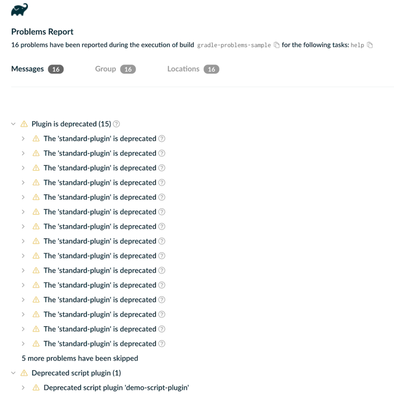

// Copyright (C) 2024 Gradle, Inc.
//
// Licensed under the Creative Commons Attribution-Noncommercial-ShareAlike 4.0 International License.;
// you may not use this file except in compliance with the License.
// You may obtain a copy of the License at
//
//      https://creativecommons.org/licenses/by-nc-sa/4.0/
//
// Unless required by applicable law or agreed to in writing, software
// distributed under the License is distributed on an "AS IS" BASIS,
// WITHOUT WARRANTIES OR CONDITIONS OF ANY KIND, either express or implied.
// See the License for the specific language governing permissions and
// limitations under the License.

[[sec:reporting_problems]]
== Reporting problems

Plugins can report problems through Gradle's problems-reporting APIs.
The APIs report rich, structured information about problems happening during the build.
This information can be used by different user interfaces such as Gradle's console output, Build Scans, or IDEs to communicate problems to the user in the most appropriate way.

The following example shows an issue reported from a plugin:

====
include::sample[dir="snippets/developingPlugins/problemReporting/kotlin/buildSrc/src/main/java/org/myorg",files="ProblemReportingPlugin.java[tags=snippet]"]
====

<1> The `Problem` service is injected into the plugin.
<2> A problem reporter, is created for the plugin. While the namespace is up to the plugin author, it is recommended that the plugin ID be used.
<3> A problem is reported. This problem is recoverable so that the build will continue.

For a full example, see our link:../samples/sample_problems_api_usage.html[end-to-end sample].

=== Problem building

When reporting a problem, a wide variety of information can be provided.
The link:{javaDocPath}/org/gradle/api/problems/ProblemSpec.html[ProblemSpec] describes all the information that can be provided.

=== Reporting problems

When it comes to reporting problems, we support two different modes:

- link:{javadocPath}/org/gradle/api/problems/ProblemReporter.html#reporting-org.gradle.api.Action-[Reporting] a problem is used for reporting problems that are recoverable, and the build should continue.
- link:{javadocPath}/org/gradle/api/problems/ProblemReporter.html#throwing-org.gradle.api.Action-[Throwing] a problem is used for reporting problems that are not recoverable, and the build should fail.

For more details, see the link:{javaDocPath}/org/gradle/api/problems/ProblemReporter.html[ProblemReporter] documentation.

=== Problem summarization

When reporting issues, Gradle ensures that the reports are concise and free of unnecessary redundancy.
Specifically, it prevents reporting the same problem repeatedly once a certain threshold is reached.

- During the build, the _first_ few instances of a problem are reported as a link:{javaDocPath}/org/gradle/tooling/events/problems/Problem.html[Problem], providing all information available for that problem.
- At the end of the build, subsequent occurrences of the same problem are grouped and summarized as a link:{javaDocPath}/org/gradle/tooling/events/problems/ProblemSummary.html[ProblemSummary].
This summary is delivered as with a link:{javaDocPath}/org/gradle/tooling/events/problems/ProblemSummariesEvent.html[ProblemSummariesEvent], which provides the total count of occurrences.

=== Build failures

The standard approach for indicating a build failure is to throw an exception.
link:{javaDocPath}/org/gradle/api/problems/ProblemReporter.html#throwing(org.gradle.api.Action)[ProblemReporter] provides enhanced support for this by allowing exceptions to be thrown with associated problem reports.

include::sample[dir="samples/templates/problems-api-usage/reporters/standard-plugin/src/main/java/reporters",files="FailingTask.java[tags=problems-api-fail-the-build]"]

This ensures that build failures are clearly linked to the underlying issues and that these problems are properly communicated to various clients.
When a build failure is reported using the Problems API, all clients (Tooling API, CLI, Build Scans, etc.)  will have access to the association.

==== Command-line interface

The CLI build failure output will include detailed information about the problem.
Error messages and descriptions are sourced directly from the problem report.
If the problem report includes a solution or recommended actions, these will be displayed in place of generic resolutions.

```
FAILURE: Build failed with an exception.

* What went wrong:
Execution failed for task ':sample-project:myFailingTask'.
> Message from runtime exception
    This happened because ProblemReporter.throwing() was called
      This is a demonstration of how to add
      detailed information to a build failure

* Try:
> Remove the Problems.throwing() method call from the task action
> Run with --scan to get full insights.

BUILD FAILED in 0ms
```

==== Tooling API clients

Tooling API clients can access detailed problem reports associated with build failures via the `Failure` object on the root build operation.
To receive these reports, the clients must register a progress listener for the `OperationType.ROOT` operation type.
The progress listener callback should then check if the operation result is of type `FailureResult`, and then it can access the associated problems via `Failure.getProblems()`.

In addition, there's a more convenient way to access the failure details.
If clients configure the project connection with `LongRunningOperation.withFailureDetails()`, the Tooling API implicitly subscribes to the `ROOT` operation type and provides failure details via the `GradleConnectionException.getFailures()` method.

[[sec:generated_html_report]]
=== Generated HTML report

The output of the problems generated by the Problems API is also provided as a rich HTML report generated at the end of the build.
This report serves as a central location for users to review problems that occurred during a build.

Plugin authors can use the Problems API to log events specific to their plugins, adding to the Gradle-generated ones.

The report is not generated if no issues have been reported.
Also, if you do not want to generate this report, you can disable it with the `--no-problems-report` flag.
The console output provides a link to this report, as shown below:

[source,text]
----
[Incubating] Problem report is available at: <project-dir>/build/reports/problems/problems-report.html

BUILD SUCCESSFUL in 1s
----

The rendered report link directs you to a detailed HTML view of the problems:


