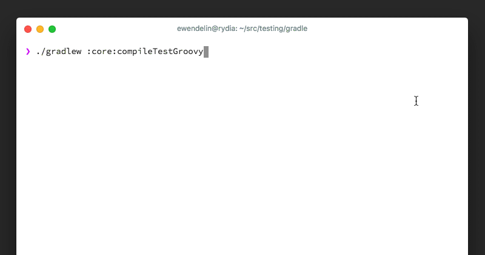
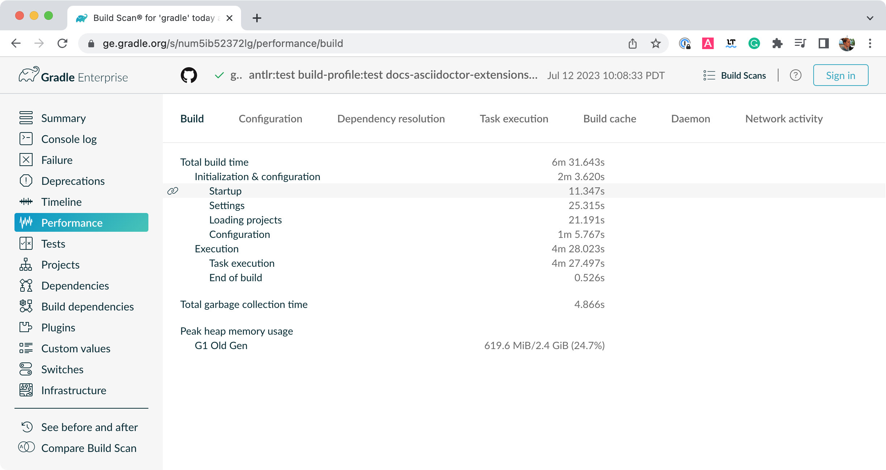
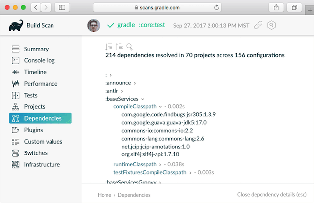

// Copyright 2017 the original author or authors.
//
// Licensed under the Apache License, Version 2.0 (the "License");
// you may not use this file except in compliance with the License.
// You may obtain a copy of the License at
//
//      http://www.apache.org/licenses/LICENSE-2.0
//
// Unless required by applicable law or agreed to in writing, software
// distributed under the License is distributed on an "AS IS" BASIS,
// WITHOUT WARRANTIES OR CONDITIONS OF ANY KIND, either express or implied.
// See the License for the specific language governing permissions and
// limitations under the License.

[[command_line_interface]]
== Command-Line Interface

[.lead]
The command-line interface is one of the primary methods of interacting with Gradle. The following serves as a reference of executing and customizing Gradle use of a command-line or when writing scripts or configuring continuous integration.

Use of the <<gradle_wrapper, Gradle Wrapper>> is highly encouraged. You should substitute `./gradlew` or `gradlew.bat` for `gradle` in all following examples when using the Wrapper.

Executing Gradle on the command-line conforms to the following structure. Options are allowed before and after task names.
----
gradle taskName [--options]
----

Options that accept values can be specified with or without `=` between the option and argument. The following are equivalent.
----
--console=plain
--console plain
----

Options that enable behavior have long-form options with inverses specified with `--no-`. The following are opposites.
----
--build-cache
--no-build-cache
----

Many long-form options, have short option equivalents. The following are equivalent:
----
--help
-h
----

Many command-line flags can be specified in `gradle.properties` to avoid needing to be typed. See the <<sec:gradle_properties_and_system_properties, configuring build environment guide>> for details.

The following sections describe use of the Gradle command-line interface, grouped roughly by user goal.

[[sec:command_line_executing_tasks]]
=== Executing Tasks

You can run a task and all of its dependencies
----
❯ gradle myTask
----

You can learn about what projects and tasks are available in the <<sec:command_line_project_reporting, project reporting section>>.

==== Executing tasks in multi-project builds
In a <<intro_multi_project_builds, multi-project build>>, subproject tasks can be executed with ":" separating subproject name and task name. The following are equivalent _when run from the root project_.

----
❯ gradle :mySubproject:taskName
❯ gradle mySubproject:taskName
----

You can also run a task for all subprojects using the task name only. For example, this will run the "test" task for all subprojects when invoked from the root project directory.

----
❯ gradle test
----

When invoking Gradle from within a subproject, the project name should be omitted:

----
❯ cd mySubproject
❯ gradle taskName
----

==== Executing multiple tasks
You can also specify multiple tasks. For example, the following will execute the `compile` and `test` tasks in the order that they are listed on the command-line and will also execute the dependencies for each task.

----
❯ gradle compile test
----

[[sec:excluding_tasks_from_the_command_line]]
==== Excluding tasks from execution
You can exclude a task from being executed using the `-x` or `--exclude-task` command-line option and providing the name of the task to exclude.

++++
<figure>
    <title>Example Task Graph</title>
    <imageobject>
        <imagedata fileref="img/commandLineTutorialTasks.png"/>
    </imageobject>
</figure>
++++

++++
<sample id="excludeTask" dir="userguide/tutorial/excludeTasks" title="Excluding tasks">
    <output args="dist --exclude-task test"/>
</sample>
++++

You can see that the `test` task is not executed, even though it is a dependency of the `dist` task. The `test` task's dependencies such as `compileTest` are not executed either. Those dependencies of `test` that are required by another task, such as `compile`, are still executed.

[[sec:rerun_tasks]]
==== Forcing Tasks To Execute

You can force Gradle to execute all tasks ignoring up-to-date checks using the `--rerun-tasks` option:

----
❯ gradle test --rerun-tasks
----

This will force `test` and _all_ task dependencies of `test` to execute. It's a little like running `gradle clean test`, but without the build's generated output being deleted.

[[sec:continue_build_on_failure]]
==== Continuing the Build When a Failure Occurs

By default, Gradle will abort execution and fail the build as soon as any task fails. This allows the build to complete sooner, but hides other failures that would have occurred. In order to discover as many failures as possible in a single build execution, you can use the `--continue` option.

----
❯ gradle test --continue
----

When executed with `--continue`, Gradle will execute _every_ task to be executed where all of the dependencies for that task completed without failure, instead of stopping as soon as the first failure is encountered. Each of the encountered failures will be reported at the end of the build.

If a task fails, any subsequent tasks that were depending on it will not be executed. For example, tests will not run if there is a compilation failure in the code under test; because the test task will depend on the compilation task (either directly or indirectly).

==== Running Tests

Many Gradle plugins like the <<java_plugin, Java plugin>> hook tests to be executed when the `test` task is invoked.

----
❯ gradle test
----

If you're using the JUnit and TestNG test frameworks, you can run a subset of tests with the `--tests` option and supplying one or more filters.

----
❯ gradle test --tests "com.mypackage.foo.*"
❯ gradle test --tests "*MyTest.myTestMethod"
❯ gradle someTestTask --tests \*UiTest someOtherTestTask --tests \*WebTest\*ui
----

Learn more about Java test filtering in the <<test_filtering, Java plugin documentation>>.

This is something you can combine with <<continuous_build, continuous build>> using `--continuous` (or `-t`, for short) to re-execute a subset of tests on every change.

----
❯ gradle test --continuous --tests "com.mypackage.foo.*"
----

[[sec:selecting_build]]
==== Selecting which build to execute

When you run the `gradle` command, it looks for a build file in the current directory. You can use the `-b` option to select another build file. Example:

++++
<sample id="selectProjectUsingBuildFile" dir="userguide/tutorial/selectProject" title="Selecting the project using a build file">
    <sourcefile file="subdir/myproject.gradle"/>
    <output args="-q -b subdir/myproject.gradle hello"/>
</sample>
++++

Alternatively, you can use the `-p` option to specify the project directory to use. For multi-project builds you should use `-p` option instead of `-b` option.

++++
<sample id="selectProjectUsingProjectDir" dir="userguide/tutorial/selectProject" title="Selecting the project using project directory">
    <output args="-q -p subdir hello"/>
</sample>
++++

[[sec:command_line_completion]]
=== Command-Line Completion

Gradle provides bash and zsh tab completion support for tasks, options, and Gradle properties through https://github.com/gradle/gradle-completion[gradle-completion], installed separately.

++++
<figure>
    <title>Gradle Completion</title>
    <imageobject>
        <imagedata fileref="img/gradle-completion-4.0.gif"/>
    </imageobject>
</figure>
++++

[[sec:command_line_logging]]
=== Logging Options

==== Setting Log Level
You can customize the verbosity of Gradle logging with the following options, ordered from least verbose to most verbose. Learn more in the <<logging, logging documentation>>.

`-Dorg.gradle.logging.level=(quiet warn lifecycle info debug)`::
Set logging level via Gradle properties.

`-q`, `--quiet`::
Log errors only.

`-w`, `--warn`::
Set log level to warn.

`-i`, `--info`::
Set log level to info.

`-d`, `--debug`::
Log in debug mode (includes normal stacktrace).

Lifecycle is the default log level.

==== Customizing Log Format
You can control the use of rich output (colors and font variants) by specifying the "console" mode in the following ways:

`-Dorg.gradle.console=(auto plain rich verbose)`::
Specify console mode via Gradle properties. Different modes described immediately below.

`--console=(auto plain rich verbose)`::
Specifies which type of console output to generate.
+
Set to `plain` to generate plain text only. This option disables all color and other rich output in the console output.
+
Set to `auto` (the default) to enable color and other rich output in the console output when the build process is attached to a console, or to generate plain text only when not attached to a console.
+
Set to `rich` to enable color and other rich output in the console output, regardless of whether the build process is not attached to a console. When not attached to a console, the build output will use ANSI control characters to generate the rich output.
+
Set to `verbose` to enable color and other rich output like the `rich`, but output task names and outcomes at the lifecycle log level, as is done by default in Gradle 3.5 and earlier.

==== Rich Console

Gradle's rich console displays extra information while builds are running.

Features:

 * Logs above grouped by task that generated them
 * Progress bar and timer visually describe overall status
 * Parallel work-in-progress lines below describe what is happening now

=== Execution Options
The following options affect how builds are executed, by changing what is built or how dependencies are resolved.

`-a`, `--no-rebuild` (deprecated)::
Do not rebuild project dependencies.

`--include-build`::
Run the build as a composite, including the specified build. See <<composite_builds, Composite Builds>>.

`--offline`::
Specifies that the build should operate without accessing network resources. Learn more about <<cache_command_line_options,options to override dependency caching>>.

`--refresh-dependencies`::
Refresh the state of dependencies. Learn more about how to use this in the dependency management docs.<<cache_command_line_options, dependency management docs>>.

`--dry-run`::
Run Gradle with all task actions disabled. Use this to show which task would have executed.

[[sec:command_line_bootstrapping_projects]]
=== Bootstrapping New Projects

==== Creating new Gradle builds
Use the built-in `gradle init` task to create a new Gradle builds, with new or existing projects.

----
❯ gradle init
----

Most of the time you'll want to specify a project type. Available types include `basic` (default), `java-library`, `java-application`, and more. See <<build_init_plugin, init plugin documentation>> for details.

----
❯ gradle init --type java-library
----

==== Standardize and provision Gradle
The built-in `gradle wrapper` task generates a script, `gradlew`, that invokes a declared version of Gradle, downloading it beforehand if necessary.

----
❯ gradle wrapper --gradle-version=4.4
----

You can also specify `--distribution-type=(bin|all)`, `--gradle-distribution-url`, `--gradle-distribution-sha256-sum` in addition to `--gradle-version`. Full details on how to use these options are documented in the <<gradle_wrapper,Gradle wrapper section>>.

[[sec:command_line_debugging]]
=== Debugging Options

`-?`, `-h`, `--help`::
Shows a help message with all available CLI options.

`-v`, `--version`::
Prints Gradle, Groovy, Ant, JVM, and operating system version information.

`-S`, `--full-stacktrace`::
Print out the full (very verbose) stacktrace for any exceptions. See also <<sec:command_line_logging, logging options>>.

`-s`, `--stacktrace`::
Print out the stacktrace also for user exceptions (e.g. compile error).  See also <<sec:command_line_logging, logging options>>.

`--scan`::
Create a https://gradle.com/build-scans[build scan] with fine-grained information about all aspects of your Gradle build.

`-Dorg.gradle.debug=true`::
Debug Gradle client (non-Daemon) process.

`-Dorg.gradle.daemon.debug=true`::
Debug <<gradle_daemon, Gradle Daemon>> process.

[[sec:command_line_performance]]
=== Performance Options
Try these options when optimizing build performance. Learn more about https://guides.gradle.org/performance/[improving performance of Gradle builds here].

Many of these options can be specified in `gradle.properties` so command-line flags are not necessary. See the <<sec:gradle_properties_and_system_properties, configuring build environment guide>>.

`--build-cache`, `--no-build-cache`::
Toggles the <<build_cache, Gradle build cache>>. Gradle will try to reuse outputs from previous builds. _Default is off_.

`--configure-on-demand`, `--no-configure-on-demand`::
Toggles <<configuration_on_demand, Configure-on-demand>>. Only relevant projects are configured in this build run. _Default is off_.

`--max-workers`::
Sets maximum number of workers that Gradle may use. _Default is number of processors_.

`--parallel`, `--no-parallel`::
Build projects in parallel. For limitations of this option please see <<sec:parallel_execution>>. _Default is off_.

`--profile`::
Generates a high-level performance report in the `$buildDir/reports/profile` directory. `--scan` is preferred.

`--scan`::
Generate a build scan with detailed performance diagnostics.

==== Gradle Daemon
You can manage the <<gradle_daemon,Gradle Daemon>> through the following command line options.

`--daemon`, `--no-daemon`::
Use the <<gradle_daemon, Gradle Daemon>> to run the build. Starts the daemon if not running or existing daemon busy. _Default is on_.

`--foreground`::
Starts the Gradle Daemon in a foreground process.

`--status` (Standalone command)::
Run `gradle --status` to list running and recently stopped Gradle daemons. Only displays daemons of the same Gradle version.

`--stop` (Standalone command)::
Run `gradle --stop` to stop all Gradle Daemons of the same version.

`-Dorg.gradle.daemon.idletimeout=(number of milliseconds)`::
Gradle Daemon will stop itself after this number of milliseconds of idle time. _Default is 10800000_ (3 hours).

=== Environment Options
You can customize many aspects about where build scripts, settings, caches, and so on through the options below. Learn more about customizing your <<build_environment, build environment>>.

`-b`, `--build-file`::
Specifies the build file. For example: `gradle --build-file=foo.gradle`

`-c`, `--settings-file`::
Specifies the settings file. For example: `gradle --settings-file=somewhere/else/settings.gradle`

`-g`, `--gradle-user-home`::
Specifies the Gradle user home directory. The default is the `.gradle` directory in the user's home directory.

`-p`, `--project-dir`::
Specifies the start directory for Gradle. Defaults to current directory. See <<sec:selecting_build>>.

`--project-cache-dir`::
Specifies the project-specific cache directory. Default value is `.gradle` in the root project directory.

`-u`, `--no-search-upward` (deprecated)::
Don't search in parent directories for a `settings.gradle` file.

`-D`, `--system-prop`::
Sets a system property of the JVM, for example `-Dmyprop=myvalue`. See <<sec:gradle_properties_and_system_properties>>.

`-I`, `--init-script`::
Specifies an initialization script. See <<init_scripts>>.

`-P`, `--project-prop`::
Sets a project property of the root project, for example `-Pmyprop=myvalue`. See <<sec:gradle_properties_and_system_properties>>.

`-Dorg.gradle.jvmargs`::
Set JVM arguments.

`-Dorg.gradle.java.home`::
Set JDK home dir.

[[sec:cli_system_properties]]
==== System Properties
The following system properties are available for the `gradle` command.

NOTE: Command-line options take precedence over system properties.

`gradle.user.home`::
Specifies the Gradle user home directory.

The <<sec:gradle_configuration_properties>> contains specific information about Gradle configuration available via system properties.

[[sec:cli_environment_variables]]
==== Environment Variables
The following environment variables are available for the `gradle` command.

NOTE: Command-line options and system properties take precedence over environment variables.

`GRADLE_OPTS`::
Specifies command-line arguments to use to start the JVM. This can be useful for setting the system properties to use for running Gradle. For example `GRADLE_OPTS="-Dorg.gradle.caching=true"`.

`GRADLE_USER_HOME`::
Specifies the Gradle user home directory (which defaults to “`USER_HOME/.gradle`” if not set).

`JAVA_HOME`::
Specifies the JDK installation directory to use.

[[sec:command_line_project_reporting]]
=== Project Reporting

Gradle provides several built-in tasks which show particular details of your build. This can be useful for understanding the structure and dependencies of your build, and for debugging problems.

You can get basic help about available reporting options using `gradle help`.

==== Listing projects

Running `gradle projects` gives you a list of the sub-projects of the selected project, displayed in a hierarchy.

----
❯ gradle projects
----

You also get a project report within build scans. Learn more about https://guides.gradle.org/creating-build-scans/[creating build scans].

==== Listing tasks

Running `gradle tasks` gives you a list of the main tasks of the selected project. This report shows the default tasks for the project, if any, and a description for each task.

----
❯ gradle tasks
----

By default, this report shows only those tasks which have been assigned to a task group. You can obtain more information in the task listing using the `--all` option.

----
❯ gradle tasks --all
----

[[sec:show_task_details]]
==== Show task usage details

Running `gradle help --task someTask` gives you detailed information about a specific task.

++++
<sample id="taskHelp" dir="userguide/tutorial/projectReports" title="Obtaining detailed help for tasks">
    <output args="-q help --task libs"/>
</sample>
++++

This information includes the full task path, the task type, possible command line options and the description of the given task.

==== Reporting dependencies

Build scans give a full, visual report of what project and binary dependencies exist on which configurations, transitive dependencies, and dependency version selection.

----
❯ gradle myTask --scan
----

This will give you a link to a web-based report, where you can find dependency information like this.

==== Listing project dependencies

Running `gradle dependencies` gives you a list of the dependencies of the selected project, broken down by configuration. For each configuration, the direct and transitive dependencies of that configuration are shown in a tree. Below is an example of this report:

----
❯ gradle dependencies
----

Running `gradle buildEnvironment` visualises the buildscript dependencies of the selected project, similarly to how `gradle dependencies` visualizes the dependencies of the software being built.

----
❯ gradle buildEnvironment
----

Running `gradle dependencyInsight` gives you an insight into a particular dependency (or dependencies) that match specified input.

----
❯ gradle dependencyInsight
----

Since a dependency report can get large, it can be useful to restrict the report to a particular configuration. This is achieved with the optional `--configuration` parameter:

++++
<sample id="dependencyListReportFiltered" dir="userguide/tutorial/projectReports" title="Filtering dependency report by configuration">
    <output args="-q api:dependencies --configuration testCompile"/>
</sample>
++++

[[sec:listing_properties]]
==== Listing project properties

Running `gradle properties` gives you a list of the properties of the selected project.

++++
<sample id="propertyListReport" dir="userguide/tutorial/projectReports" title="Information about properties">
    <output args="-q api:properties" ignoreExtraLines="true"/>
</sample>
++++

==== Software Model reports

You can get a hierarchical view of elements for <<software_model,software model>> projects (deprecated) using the `model` task:

----
❯ gradle model
----

Learn more about <<model-report,the model report>> in the software model documentation.
