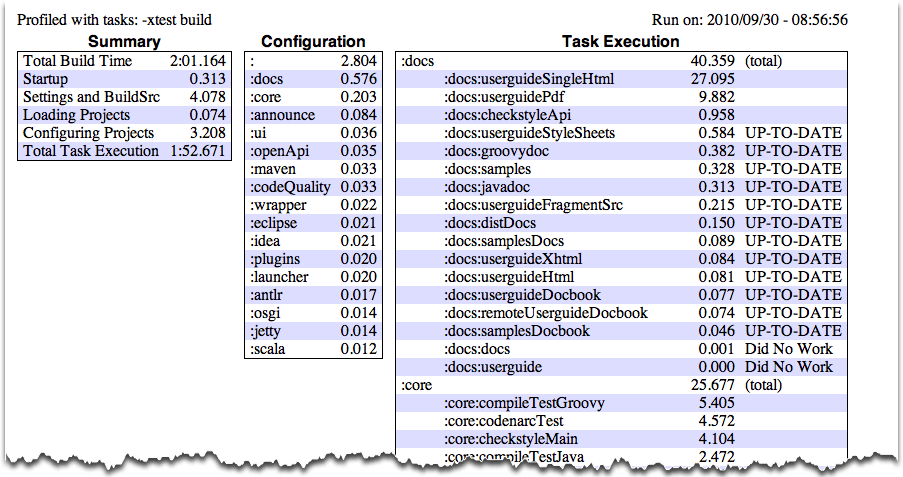

// Copyright 2017 the original author or authors.
//
// Licensed under the Apache License, Version 2.0 (the "License");
// you may not use this file except in compliance with the License.
// You may obtain a copy of the License at
//
//      http://www.apache.org/licenses/LICENSE-2.0
//
// Unless required by applicable law or agreed to in writing, software
// distributed under the License is distributed on an "AS IS" BASIS,
// WITHOUT WARRANTIES OR CONDITIONS OF ANY KIND, either express or implied.
// See the License for the specific language governing permissions and
// limitations under the License.

[[tutorial_gradle_command_line]]
== Using the Gradle Command-Line

This chapter introduces the basics of the Gradle command-line. You run a build using the `gradle` command, which you have already seen in action in previous chapters.

[[sec:executing_multiple_tasks]]
=== Executing multiple tasks

You can execute multiple tasks in a single build by listing each of the tasks on the command-line. For example, the command `gradle compile test` will execute the `compile` and `test` tasks. Gradle will execute the tasks in the order that they are listed on the command-line, and will also execute the dependencies for each task. Each task is executed once only, regardless of how it came to be included in the build: whether it was specified on the command-line, or as a dependency of another task, or both. Let's look at an example.

Below four tasks are defined. Both `dist` and `test` depend on the `compile` task. Running `gradle dist test` for this build script results in the `compile` task being executed only once.

++++
<figure>
            <title>Task dependencies</title>
            <imageobject>
                <imagedata fileref="img/commandLineTutorialTasks.png"/>
            </imageobject>
        </figure>
++++

++++
<sample id="multipleTasksFromCommandLine" dir="userguide/tutorial/excludeTasks" title="Executing multiple tasks">
            <sourcefile file="build.gradle"/>
            <output args="dist test"/>
        </sample>
++++

Each task is executed only once, so `gradle test test` is exactly the same as `gradle test`.

[[sec:excluding_tasks_from_the_command_line]]
=== Excluding tasks

You can exclude a task from being executed using the `-x` command-line option and providing the name of the task to exclude. Let's try this with the sample build file above.

++++
<sample id="excludeTask" dir="userguide/tutorial/excludeTasks" title="Excluding tasks">
            <output args="dist -x test"/>
        </sample>
++++

You can see from the output of this example, that the `test` task is not executed, even though it is a dependency of the `dist` task. You will also notice that the `test` task's dependencies, such as `compileTest` are not executed either. Those dependencies of `test` that are required by another task, such as `compile`, are still executed.

[[sec:continue_build_on_failure]]
=== Continuing the build when a failure occurs

By default, Gradle will abort execution and fail the build as soon as any task fails. This allows the build to complete sooner, but hides other failures that would have occurred. In order to discover as many failures as possible in a single build execution, you can use the `--continue` option.

When executed with `--continue`, Gradle will execute _every_ task to be executed where all of the dependencies for that task completed without failure, instead of stopping as soon as the first failure is encountered. Each of the encountered failures will be reported at the end of the build.

If a task fails, any subsequent tasks that were depending on it will not be executed, as it is not safe to do so. For example, tests will not run if there is a compilation failure in the code under test; because the test task will depend on the compilation task (either directly or indirectly).

[[sec:task_name_abbreviation]]
=== Task name abbreviation

When you specify tasks on the command-line, you don't have to provide the full name of the task. You only need to provide enough of the task name to uniquely identify the task. For example, in the sample build above, you can execute task `dist` by running `gradle d`:

++++
<sample id="abbreviateTaskName" dir="userguide/tutorial/excludeTasks" title="Abbreviated task name">
            <output args="di"/>
        </sample>
++++

You can also abbreviate each word in a camel case task name. For example, you can execute task `compileTest` by running `gradle compTest` or even `gradle cT`

++++
<sample id="abbreviateCamelCaseTaskName" dir="userguide/tutorial/excludeTasks" title="Abbreviated camel case task name">
            <output args="cT"/>
        </sample>
++++

You can also use these abbreviations with the `-x` command-line option.

[[sec:selecting_build]]
=== Selecting which build to execute

When you run the `gradle` command, it looks for a build file in the current directory. You can use the `-b` option to select another build file. If you use `-b` option then `settings.gradle` file is not used. Example:

++++
<sample id="selectProjectUsingBuildFile" dir="userguide/tutorial/selectProject" title="Selecting the project using a build file">
            <sourcefile file="subdir/myproject.gradle"/>
            <output args="-q -b subdir/myproject.gradle hello"/>
        </sample>
++++

Alternatively, you can use the `-p` option to specify the project directory to use. For multi-project builds you should use `-p` option instead of `-b` option.

++++
<sample id="selectProjectUsingProjectDir" dir="userguide/tutorial/selectProject" title="Selecting the project using project directory">
            <output args="-q -p subdir hello"/>
        </sample>
++++

[[sec:rerun_tasks]]
=== Forcing tasks to execute

Many tasks, particularly those provided by Gradle itself, support <<sec:up_to_date_checks,incremental builds>>. Such tasks can determine whether they need to run or not based on whether their inputs or outputs have changed since the last time they ran. You can easily identify tasks that take part in incremental build when Gradle displays the text `UP-TO-DATE` next to their name during a build run.

You may on occasion want to force Gradle to run all the tasks, ignoring any up-to-date checks. If that's the case, simply use the `--rerun-tasks` option. Here's the output when running a task both without and with `--rerun-tasks`:

++++
<sample id="rerunTasks" dir="userguide/tutorial/rerun" title="Forcing tasks to run">
            <test args="doIt"/>
            <output args="doIt" ignoreExtraLines="y" outputFile="noRerunTasks.out"/>
            <output args="--rerun-tasks doIt" ignoreExtraLines="y"/>
        </sample>
++++

Note that this will force _all_ required tasks to execute, not just the ones you specify on the command line. It's a little like running a `clean`, but without the build's generated output being deleted.

[[sec:obtaining_information_about_your_build]]
=== Obtaining information about your build

Gradle provides several built-in tasks which show particular details of your build. This can be useful for understanding the structure and dependencies of your build, and for debugging problems.

In addition to the built-in tasks shown below, you can also use the <<project_reports_plugin,project report plugin>> to add tasks to your project which will generate these reports.

[[sec:listing_projects]]
==== Listing projects

Running `gradle projects` gives you a list of the sub-projects of the selected project, displayed in a hierarchy. Here is an example:

++++
<sample id="projectListReport" dir="userguide/tutorial/projectReports" title="Obtaining information about projects">
                <output args="-q projects"/>
            </sample>
++++

The report shows the description of each project, if specified. You can provide a description for a project by setting the `description` property:

++++
<sample id="projectListReport" dir="userguide/tutorial/projectReports" title="Providing a description for a project">
                <sourcefile file="build.gradle" snippet="project-description"/>
            </sample>
++++

[[sec:listing_tasks]]
==== Listing tasks

Running `gradle tasks` gives you a list of the main tasks of the selected project. This report shows the default tasks for the project, if any, and a description for each task. Below is an example of this report:

++++
<sample id="taskListReport" dir="userguide/tutorial/projectReports" title="Obtaining information about tasks">
                <output args="-q tasks"/>
            </sample>
++++

By default, this report shows only those tasks which have been assigned to a task group, so-called _visible_ tasks. You can do this by setting the `group` property for the task. You can also set the `description` property, to provide a description to be included in the report.

++++
<sample id="taskListReport" dir="userguide/tutorial/projectReports" title="Changing the content of the task report">
                <sourcefile file="build.gradle" snippet="add-task-to-report"/>
            </sample>
++++

You can obtain more information in the task listing using the `--all` option. With this option, the task report lists all tasks in the project, including tasks which have not been assigned to a task group, so-called _hidden_ tasks. Here is an example:

++++
<sample id="taskListAllReport" dir="userguide/tutorial/projectReports" title="Obtaining more information about tasks">
                <output args="-q tasks --all"/>
            </sample>
++++

[[sec:show_task_details]]
==== Show task usage details

Running `gradle help --task someTask` gives you detailed information about a specific task or multiple tasks matching the given task name in your multi-project build. Below is an example of this detailed information:

++++
<sample id="taskHelp" dir="userguide/tutorial/projectReports" title="Obtaining detailed help for tasks">
                <output args="-q help --task libs"/>
            </sample>
++++

This information includes the full task path, the task type, possible command line options and the description of the given task.

[[sec:listing_dependencies]]
==== Listing project dependencies

Running `gradle dependencies` gives you a list of the dependencies of the selected project, broken down by configuration. For each configuration, the direct and transitive dependencies of that configuration are shown in a tree. Below is an example of this report:

++++
<sample id="dependencyListReport" dir="userguide/tutorial/projectReports" title="Obtaining information about dependencies">
                <output args="-q dependencies api:dependencies webapp:dependencies"/>
            </sample>
++++

Since a dependency report can get large, it can be useful to restrict the report to a particular configuration. This is achieved with the optional `--configuration` parameter:

++++
<sample id="dependencyListReportFiltered" dir="userguide/tutorial/projectReports" title="Filtering dependency report by configuration">
                <output args="-q api:dependencies --configuration testCompile"/>
            </sample>
++++

[[sec:listing_buildscript_dependencies]]
==== Listing project buildscript dependencies

Running `gradle buildEnvironment` visualises the buildscript dependencies of the selected project, similarly to how `gradle dependencies` visualises the dependencies of the software being built.

[[sec:dependency_insight]]
==== Getting the insight into a particular dependency

Running `gradle dependencyInsight` gives you an insight into a particular dependency (or dependencies) that match specified input. Below is an example of this report:

++++
<sample id="dependencyInsightReport" dir="userguide/tutorial/projectReports" title="Getting the insight into a particular dependency">
                <output args="-q webapp:dependencyInsight --dependency groovy --configuration compile"/>
            </sample>
++++

This task is extremely useful for investigating the dependency resolution, finding out where certain dependencies are coming from and why certain versions are selected. For more information please see the api:org.gradle.api.tasks.diagnostics.DependencyInsightReportTask[] class in the API documentation.

The built-in dependencyInsight task is a part of the 'Help' tasks group. The task needs to be configured with the dependency and the configuration. The report looks for the dependencies that match the specified dependency spec in the specified configuration. If Java related plugins are applied, the dependencyInsight task is pre-configured with the 'compile' configuration because typically it's the compile dependencies we are interested in. You should specify the dependency you are interested in via the command line '--dependency' option. If you don't like the defaults you may select the configuration via the '--configuration' option. For more information see the api:org.gradle.api.tasks.diagnostics.DependencyInsightReportTask[] class in the API documentation.

[[sec:listing_properties]]
==== Listing project properties

Running `gradle properties` gives you a list of the properties of the selected project. This is a snippet from the output:

++++
<sample id="propertyListReport" dir="userguide/tutorial/projectReports" title="Information about properties">
                <output args="-q api:properties" ignoreExtraLines="true"/>
            </sample>
++++

[[sec:profiling_build]]
==== Profiling a build

The `--profile` command line option will record some useful timing information while your build is running and write a report to the `build/reports/profile` directory. The report will be named using the time when the build was run.

This report lists summary times and details for both the configuration phase and task execution. The times for configuration and task execution are sorted with the most expensive operations first. The task execution results also indicate if any tasks were skipped (and the reason) or if tasks that were not skipped did no work.

Builds which utilize a buildSrc directory will generate a second profile report for buildSrc in the `buildSrc/build` directory.

[[sec:dry_run]]
=== Dry Run

Sometimes you are interested in which tasks are executed in which order for a given set of tasks specified on the command line, but you don't want the tasks to be executed. You can use the `-m` option for this. For example, if you run “`gradle -m clean compile`”, you'll see all the tasks that would be executed as part of the `clean` and `compile` tasks. This is complementary to the `tasks` task, which shows you the tasks which are available for execution.

[[sec:cli_tutorial_summary]]
=== Summary

In this chapter, you have seen some of the things you can do with Gradle from the command-line. You can find out more about the `gradle` command in <<gradle_command_line>>.
