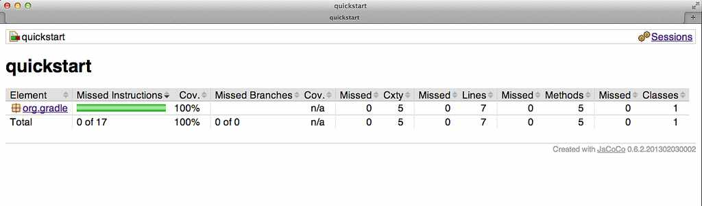

// Copyright 2017 the original author or authors.
//
// Licensed under the Apache License, Version 2.0 (the "License");
// you may not use this file except in compliance with the License.
// You may obtain a copy of the License at
//
//      http://www.apache.org/licenses/LICENSE-2.0
//
// Unless required by applicable law or agreed to in writing, software
// distributed under the License is distributed on an "AS IS" BASIS,
// WITHOUT WARRANTIES OR CONDITIONS OF ANY KIND, either express or implied.
// See the License for the specific language governing permissions and
// limitations under the License.

[[jacoco_plugin]]
== The JaCoCo Plugin

[NOTE]
====

The JaCoCo plugin is currently <<feature_lifecycle,incubating>>. Please be aware that the DSL and other configuration may change in later Gradle versions.

====

The JaCoCo plugin provides code coverage metrics for Java code via integration with http://www.eclemma.org/jacoco/[JaCoCo].

[[sec:jacoco_getting_started]]
=== Getting Started

To get started, apply the JaCoCo plugin to the project you want to calculate code coverage for.

++++
<sample id="applyJacoco" dir="testing/jacoco/quickstart" title="Applying the JaCoCo plugin">
            <sourcefile file="build.gradle" snippet="apply-plugin"/>
        </sample>
++++

If the Java plugin is also applied to your project, a new task named `jacocoTestReport` is created that depends on the `test` task. The report is available at `__$buildDir__/reports/jacoco/test`. By default, a HTML report is generated.

[[sec:configuring_the_jacoco_plugin]]
=== Configuring the JaCoCo Plugin

The JaCoCo plugin adds a project extension named `jacoco` of type api:org.gradle.testing.jacoco.plugins.JacocoPluginExtension[], which allows configuring defaults for JaCoCo usage in your build.

++++
<sample id="configJacoco" dir="testing/jacoco/quickstart" title="Configuring JaCoCo plugin settings">
            <sourcefile file="build.gradle" snippet="jacoco-configuration"/>
        </sample>
++++

.Gradle defaults for JaCoCo properties
[cols="a,a", options="header"]
|===
| Property
| Gradle default

| reportsDir
| `__$buildDir__/reports/jacoco`
|===

[[sec:jacoco_report_configuration]]
=== JaCoCo Report configuration

The api:org.gradle.testing.jacoco.tasks.JacocoReport[] task can be used to generate code coverage reports in different formats. It implements the standard Gradle type api:org.gradle.api.reporting.Reporting[] and exposes a report container of type api:org.gradle.testing.jacoco.tasks.JacocoReportsContainer[].

++++
<sample id="configJacocoReport" dir="testing/jacoco/quickstart" title="Configuring test task">
            <sourcefile file="build.gradle" snippet="report-configuration"/>
        </sample>
++++

[[sec:jacoco_report_violation_rules]]
=== Enforcing code coverage metrics

[NOTE]
====

This feature requires the use of JaCoCo version 0.6.3 or higher.

====

The api:org.gradle.testing.jacoco.tasks.JacocoCoverageVerification[] task can be used to verify if code coverage metrics are met based on configured rules. Its API exposes the method api:org.gradle.testing.jacoco.tasks.JacocoCoverageVerification#violationRules(org.gradle.api.Action)[] which is used as main entry point for configuring rules. Invoking any of those methods returns an instance of api:org.gradle.testing.jacoco.tasks.rules.JacocoViolationRulesContainer[] providing extensive configuration options. The build fails if any of the configured rules are not met. JaCoCo only reports the first violated rule.

Code coverage requirements can be specified for a project as a whole, for individual files, and for particular JaCoCo-specific types of coverage, e.g., lines covered or branches covered. The following example describes the syntax.

++++
<sample id="configViolationRules" dir="testing/jacoco/quickstart" includeLocation="true" title="Configuring violation rules">
            <sourcefile file="build.gradle" snippet="violation-rules-configuration"/>
        </sample>
++++

The api:org.gradle.testing.jacoco.tasks.JacocoCoverageVerification[] task is not a task dependency of the `check` task provided by the Java plugin. There is a good reason for it. The task is currently not incremental as it doesn't declare any outputs. Any violation of the declared rules would automatically result in a failed build when executing the `check` task. This behavior might not be desirable for all users. Future versions of Gradle might change the behavior.

[[sec:jacoco_specific_task_configuration]]
=== JaCoCo specific task configuration

The JaCoCo plugin adds a api:org.gradle.testing.jacoco.plugins.JacocoTaskExtension[] extension to all tasks of type api:org.gradle.api.tasks.testing.Test[]. This extension allows the configuration of the JaCoCo specific properties of the test task.

++++
<sample id="jacocotesttast" dir="testing/jacoco/quickstart" title="Configuring test task">
            <sourcefile file="build.gradle" snippet="testtask-configuration"/>
        </sample>
++++

[NOTE]
====
Using the configuration `append = true` (the default) causes the JaCoCo agent to append to a shared output file that may be left over from a different test execution.
If `append = true`, Gradle disables caching for the Test task since it cannot guarantee the same results each time.
====

.Default values of the JaCoCo Task extension
[cols="a,a", options="header"]
|===
| Property
| Gradle default

| enabled
| true

| destPath
| `__$buildDir__/jacoco`

| append
| true

| includes
| [] +

| excludes
| [] +

| excludeClassLoaders
| [] +

| includeNoLocationClasses
| false

| sessionId
| `auto-generated`

| dumpOnExit
| `true`

| output
| `Output.FILE`

| address
| `-`

| port
| `-`

| classDumpPath
| `-`

| jmx
| `false`
|===

While all tasks of type api:org.gradle.api.tasks.testing.Test[] are automatically enhanced to provide coverage information when the `java` plugin has been applied, any task that implements api:org.gradle.process.JavaForkOptions[] can be enhanced by the JaCoCo plugin. That is, any task that forks Java processes can be used to generate coverage information.

For example you can configure your build to generate code coverage using the `application` plugin.

++++
<sample id="jacoco-application-setup" dir="testing/jacoco/application" includeLocation="true" title="Using application plugin to generate code coverage data">
            <sourcefile file="build.gradle" snippet="application-configuration"/>
        </sample>
++++

++++
<sample id="jacoco-application-output" dir="testing/jacoco/application" title="Coverage reports generated by applicationCodeCoverageReport">
            <layout after="run applicationCodeCoverageReport">
                build/jacoco/run.exec
                build/reports/jacoco/applicationCodeCoverageReport/html/index.html
            </layout>
        </sample>
++++

[[sec:jacoco_tasks]]
=== Tasks

For projects that also apply the Java Plugin, The JaCoCo plugin automatically adds the following tasks:

.JaCoCo plugin - tasks
[cols="a,a,a,a", options="header"]
|===
| Task name
| Depends on
| Type
| Description

| `jacocoTestReport`
| -
| api:org.gradle.testing.jacoco.tasks.JacocoReport[]
| Generates code coverage report for the test task.

| `jacocoTestCoverageVerification`
| -
| api:org.gradle.testing.jacoco.tasks.JacocoCoverageVerification[]
| Verifies code coverage metrics based on specified rules for the test task.
|===

[[sec:jacoco_dependency_management]]
=== Dependency management

The JaCoCo plugin adds the following dependency configurations:

.JaCoCo plugin - dependency configurations
[cols="a,a", options="header"]
|===
| Name
| Meaning

| `jacocoAnt`
| The JaCoCo Ant library used for running the `JacocoReport`, `JacocoMerge` and `JacocoCoverageVerification` tasks.

| `jacocoAgent`
| The JaCoCo agent library used for instrumenting the code under test.
|===
